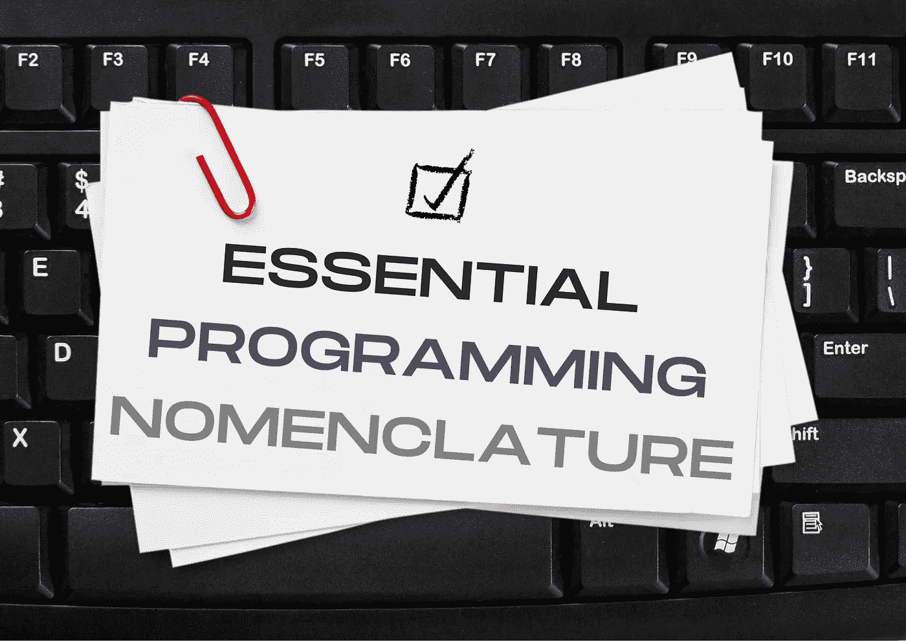
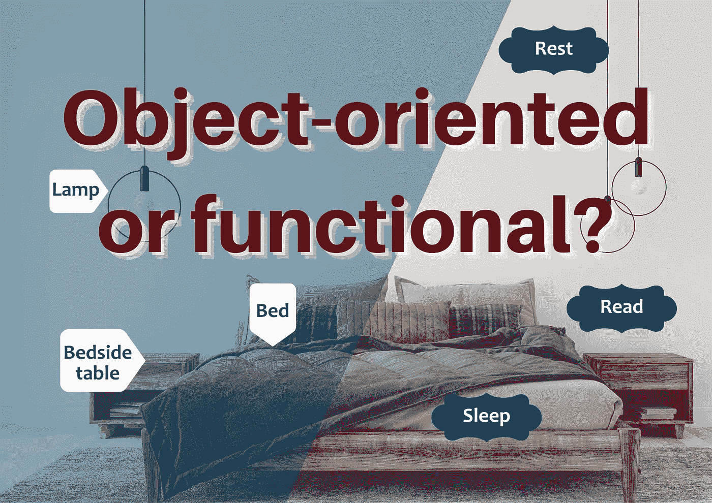
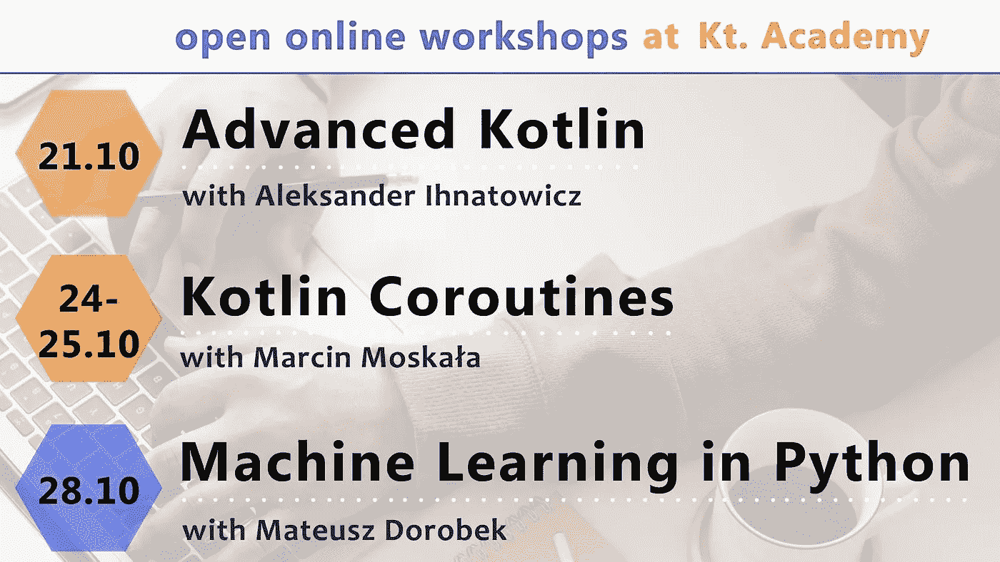

# 阅读和学习:功能性 Kotlin 文章&应用安全&相机应用&编程术语& OOP vs FP &开放式研讨会🔋

> 原文：<https://blog.kotlin-academy.com/read-and-learn-functional-kotlin-articles-application-security-camera-apps-programming-5398f87c5028?source=collection_archive---------2----------------------->

欢迎回来，程序员们！🙂

我们希望你度过了一个愉快的假期并得到了休息。🌞
电池已充电？🔋
完美，那么让我们给你推荐一些好的内容来阅读，并鼓励你加入我们的[专题开放工作坊](https://kt.academy/workshop)！

💡💡💡💡💡💡💡💡💡💡💡💡💡💡💡💡💡💡💡💡💡💡💡💡💡💡💡💡💡💡💡💡

下面是今天新闻简报内容的简要列表:

**2 Functional Kotlin 文章**作者**Marcin moska a:**
👉[功能引用](https://kt.academy/article/fk-function-references)
👉[λ表达式](https://kt.academy/article/fk-lambda-expressions)

文章是从**功能 Kotlin** 书中摘录的部分。你可以在这里找到这本书的早期版本[。📖](https://leanpub.com/kotlin_functional)

**安卓**文章由 **Ngenge 学长:**👉[开始使用 CameraX 在 Android 上构建相机应用](/getting-started-with-camerax-in-building-camera-apps-on-android-ec5416a66c9)

**应用安全**文章由 **Shikha Barve** 和 **Swamini Kulkarni:**
撰写👉[了解应用安全的主要类型、主要趋势和未来](/know-what-are-major-types-major-trends-and-the-future-of-application-security-d764eb218e4c)

✳所有的作者都向我们的[媒体](https://blog.kotlin-academy.com/)提交了他们的文章。🙌我们总是很乐意帮助你并推广有价值的内容。
不要犹豫，伸出手来！📝

**通用编程文章**作者**Marcin moskaa**:
👉[基本编程术语](https://kt.academy/article/programming-nomenclature)
👉[面向对象还是函数式？看世界的两种方式](https://kt.academy/article/oop-vs-fp)

❗ **3 个开放工场** ❗
👉[科特林花冠开放工场](https://kt.academy/workshop/coroutines/form/public/coroutinesOct2022/register)👉[Python 开放工作坊中的机器学习](https://kt.academy/workshop/machineLearningPython/form/public/machineLearningPythonOct2022/register)
👉[高级科特林开放式车间](https://kt.academy/workshop/kotlinAdvanced/form/public/advancedKotlinOct2022/register)

尽情享受吧！🙃

我们如何引用 Kotlin 中的函数来替换 lambda 表达式？从由 **Marcin Moskala** 撰写的文章中了解所有函数，包括构造函数、获取函数、扩展函数等等。
**功能引用👇**

[Function references](https://kt.academy/article/fk-function-references)
You can find the early access to the book below 👇
[[Early Access] Functional… by Marcin Moskała [PDF/iPad/Kindle] (leanpub.com)](https://leanpub.com/kotlin_functional)

让我们学习如何使用 lambda 表达式，它们有什么特殊支持，以及它们会产生什么陷阱。
**λ表达式👇**

[Lambda expressions](https://kt.academy/article/fk-lambda-expressions)
🔻 You can find the Early Access to the book below 👇
[[Early Access] Functional… by Marcin Moskała [PDF/iPad/Kindle] (leanpub.com)](https://leanpub.com/kotlin_functional)

对于 Android 开发人员来说，在 Android 上开发一个使用 Instagram 或 Snapchat 等相机功能的应用程序一直是一个麻烦，部分原因是设备制造商众多，设备制造商范围广泛。看了[恩根格学长](https://ngengesenior.medium.com/)T21 写的文章。
**CameraX 在 Android 上构建相机应用入门👇**

[Getting Started with CameraX in building Camera Apps on Android](/getting-started-with-camerax-in-building-camera-apps-on-android-ec5416a66c9)

今天，web 应用程序和 API 已经成为人们之间交流的主要来源。应用程序安全性的主要类型、趋势以及它们的未来如何？
在**[Shikha Barve](https://medium.com/@shikha.barve)**撰写的文章中了解更多👇
**了解应用安全的主要类型、主要趋势和未来******

****

[Know What Are Major Types, Major Trends, and The Future of Application Security](/know-what-are-major-types-major-trends-and-the-future-of-application-security-d764eb218e4c)**** 

****在你开始在由**Marcin moska a**撰写的出版物中撰写关于编程的文档、书籍或文章之前，先找出你需要了解的内容👇
**基本编程术语******

****

[Essential programming nomenclature](https://kt.academy/article/programming-nomenclature)**** 

****OOP 和 FP 范例之间的差异深深植根于我们看待世界的方式。在 Marcin Moskala 撰写的文章中对这两种方法的哲学进行了简单介绍。
**面向对象还是函数式？看世界的两种方式👇******

****

[Object-oriented or functional? Two ways to see the world](https://kt.academy/article/oop-vs-fp)**** ********

****十月充满了开放的研讨会。😍
**Kotlin 协同程序，高级 Kotlin，还是 Python 中的机器学习？**🤔
选择最适合您的一款，立即注册。
👉 [Kotlin Coroutines 开放式车间](https://kt.academy/workshop/coroutines/form/public/coroutinesOct2022/register)
👉[Python 开放工作坊中的机器学习](https://kt.academy/workshop/machineLearningPython/form/public/machineLearningPythonOct2022/register)
👉[高级科特林开放式车间](https://kt.academy/workshop/kotlinAdvanced/form/public/advancedKotlinOct2022/register)****

****更多信息很快！****

****👩‍💼👨‍💼👩‍💼👨‍💼👩‍💼👨‍🏭👨‍💼👩‍💼👨‍💼👩‍🏭👨‍💼👩‍💼👨‍💼👩‍💼👨‍💼👩‍💼👨‍💼👩‍💼👨‍💼👨‍🏭👩‍💼👩‍🏭👨‍💼👩‍💼👨‍🏭👨‍💼👩‍💼****

****这就是我们今天的全部内容🙂****

****如果你有什么想告诉我们的，请回复这封邮件让我们知道！💌****

****敬请期待！👌
Kt。学院团队****

****www: [kt.academy](https://kt.academy/)
博客:[blog.kotlin-academy.com](http://blog.kotlin-academy.com/)
Twitter EN:[@ ktdotsacademy](https://twitter.com/ktdotacademy)
Twitter PL:[@ ktdotsacademypl](https://twitter.com/ktdotacademyPL)
FB:[@ ktdotsacademy](https://www.facebook.com/KtDotAcademy)
LinkedIn:[@ Kt。学院](https://www.linkedin.com/company/kt-academy/)****

********