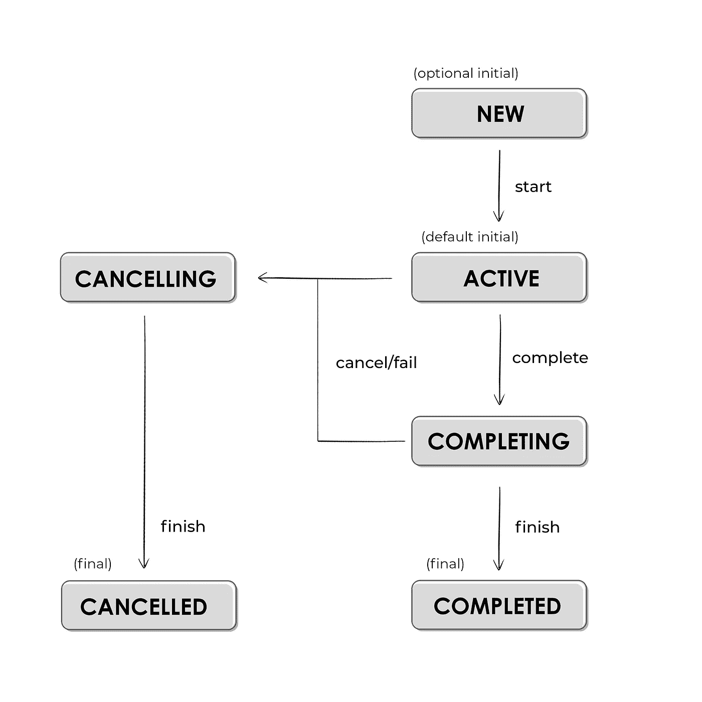
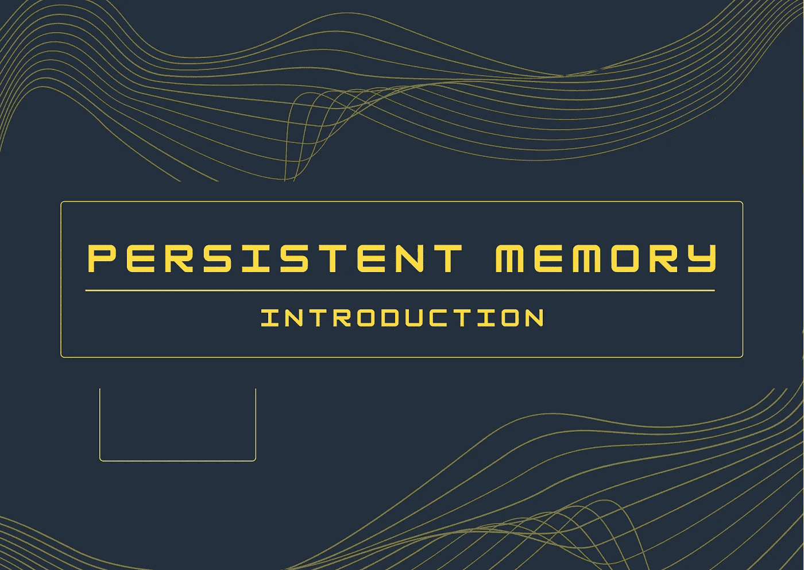
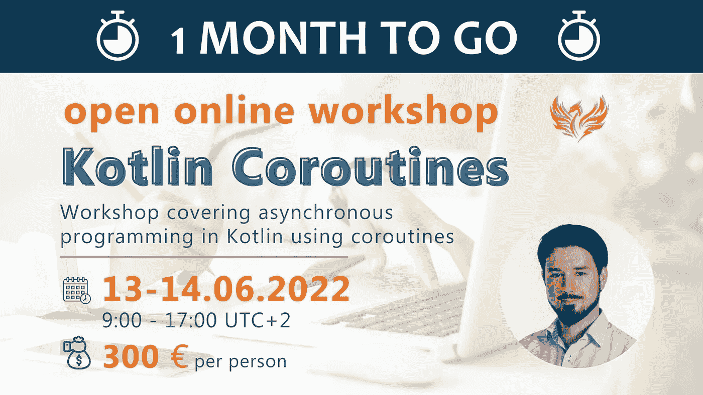

# 阅读和学习:招聘技术审查人员& 2 篇 Kotlin 协同程序文章& Android 艺术&持久存储&无代码&协同程序研讨会👌

> 原文：<https://blog.kotlin-academy.com/read-and-learn-technical-reviewers-wanted-2-kotlin-coroutines-articles-android-art-bdba8a2121dd?source=collection_archive---------1----------------------->

嗨，代码爱好者们！🌞

新书系列即将推出！📗📘📗
**马尔钦·莫斯卡兹拉**开始为开发人员写三本名为**科特林的书。
想投稿吗？🤔
更多信息:👇**

**🔎**招聘技术审核员**🔍
👉** [面向开发人员的 kot Lin——招聘技术审查人员！](/kotlin-for-developers-technical-reviewers-wanted-97ae6ed542b1)

👩‍💻👨‍💻👩‍💻👨‍💻👩‍💻👨‍💻👩‍💻👨‍💻👩‍💻👨‍💻👩‍💻👨‍💻👩‍💻👨‍💻👩‍💻👨‍💻👩‍💻👨‍💻👩‍💻

下面是今天新闻简报内容的简要列表:

**由**Marcin moska a**撰写的**kot Lin Coroutines 文章:
👉[在科特林县等待工作和孩子](https://kt.academy/article/cc-job)
👉[科特林协程调度员](https://kt.academy/article/cc-dispatchers)

文章是从**科特林协程**书的部分。你可以在这里找到整本书[。📖](https://leanpub.com/coroutines/)

**Android 的** Apps 文章由 **Kashif Mehmood:**
撰写👉[使用浪子和 Github 操作的风味 Android 应用的 CI/CD 管道](/ci-cd-pipeline-for-flavoured-android-apps-using-fastlane-and-github-actions-2362253a7f8)

✳ [卡希夫](https://kashif-mehmood-km.medium.com/)向我们的博客提交了一个故事。谢谢大家！💪记住，我们总是对新的作者和有价值的内容开放。
更多关于我们[媒体](https://blog.kotlin-academy.com/)的信息📝

**永久记忆**文章系列由**萨尔塔克·马基雅** 🧠
编写👉[永久记忆—简介](https://kt.academy/article/pmem-intro)👉[内存字典](https://kt.academy/article/pmem-in-memory-dictionary)👉[引入永久存储器](https://kt.academy/article/pmem-introducing-persistent-memory)

✳向我们提出了一个全新的话题。我们很高兴能帮助他在[我们的网站](https://kt.academy/article)上发表文章。
你愿意和我们分享你写的一些有趣的东西吗？
写信给 **kasia@kt.academy** 📧
更多文章即将发布！📝

生存还是毁灭？**代码还是无代码？**作者**马尔钦·莫斯卡亚**💭
👉[代码还是无代码？](https://kt.academy/article/code-or-no-code)

❗·科特林·卡罗廷❗公开工作坊[报名](https://kt.academy/workshop/coroutines/form/public/coroutinesJun2022/register)仍**开放！**

准备，稳住，开始！🙃

🔎我们正在为马尔钦·莫斯卡兹拉的新书寻找技术评论家:

第一册:面向开发人员的 Kotlin:要点

第二册:功能性科特林

第三册:高级科特林

更多信息:👇
[招聘技术审查人员—早期访问计划](/kotlin-for-developers-technical-reviewers-wanted-97ae6ed542b1)

填写表格，加入我们的团队！👇
[科特林书评(typeform.com)](https://marcinmoskala.typeform.com/to/ayFlXQBk)

截止日期:2022 年 5 月 30 日

这是所有作业的状态图(协程也是如此)。

你可以在文章**中找到整个主题，工作和孩子在科特林协同程序中等待👇**

[Job and children awaiting in Kotlin Coroutines](https://kt.academy/article/cc-job)
🔻 This is a chapter from the [Kotlin Coroutines](https://kt.academy/book/coroutines) book. You can find the whole book on [LeanPub](https://leanpub.com/coroutines/).

要了解我们应该在哪里使用 Kotlin 协同程序库中的每个**调度程序**,请阅读这篇更新的文章。
**科特林协调官** **👇**

🔻 This is a chapter from the [Kotlin Coroutines](https://kt.academy/book/coroutines) book. You can find the whole book on [LeanPub](https://leanpub.com/coroutines/).
[Kotlin Coroutines dispatchers](https://kt.academy/article/cc-dispatchers)

在本文中，我们将使用浪子来构建和共享 apk/aab 以 Firebase 应用程序分发，从而自动化这个乏味的工作流。我们既可以在本地使用浪子，也可以使用 Github 操作。读一读 **Kashif Mehmood 写的文章。**

**使用浪子和 Github 操作的风味 Android 应用的 CI/CD 渠道👇**

[CI/CD Pipeline for Flavoured Android Apps using Fastlane and Github Actions](/ci-cd-pipeline-for-flavoured-android-apps-using-fastlane-and-github-actions-2362253a7f8)

**永久内存**是一种非易失性存储器，可安装在标准 DIMM 插槽中。永久内存提供比 SSD 和 NVMe 更高的吞吐量，但比 DRAM 慢。使用永久内存，即使在意外断电、用户启动关机或系统崩溃的情况下系统断电，内存内容仍会保留。

想了解一下**永久记忆**吗？在 **Sarthak Makhija** 撰写的文章中，加入探索持久记忆和建立持久字典的旅程。

**永久记忆—简介👇**

[Persistent memory — Introduction](https://kt.academy/article/pmem-intro)

让我们通过建立一个内存字典来开始我们理解**持久记忆的旅程。** 🧠
阅读由 **Sarthak Makhija 撰写的持久记忆系列文章的第二部分。**

**内存词典👇**

[In-memory dictionary](https://kt.academy/article/pmem-in-memory-dictionary)

让我们学习一下**永久存储器**的基础知识，它的特点，它是如何工作的，以及**字节寻址能力**的美妙之处。

看第三篇 **Sarthak Makhija 写的文章。👇**

[Introducing persistent memory](https://kt.academy/article/pmem-introducing-persistent-memory)

**码和无码**各有什么强势的一面，为什么会不断的互相争斗？🥊

遵循**马尔钦·莫斯卡亚**给出的建议。

**代码还是无代码？👇**

[Code or No-code?](https://kt.academy/article/code-or-no-code)

你已经读过科特林的协同程序书了吗？🤔由**Marcin moska a**主持的**公开 Kotlin Coroutines 研讨会**只剩下一个月了。
📅2022 年 6 月 13 日至 14 日
⏲世界协调时+2 时 00 分至 17 时
💰每人 300 **€** 更多信息
👇
[Kt。学院](https://kt.academy/workshop/coroutines/form/public/coroutinesJun2022/register)

📚📚📚📚📚📚📚📚📚📚📚📚📚📚📚📚📚📚📚📚📚📚📚📚📚📚

阳光编码！🌞这就是今天我们的全部内容🙂

如果你有什么想告诉我们的，请回复这封邮件让我们知道！💌

敬请期待！👌
Kt。学院团队

www: [kt.academy](https://kt.academy/)
博客:[blog.kotlin-academy.com](http://blog.kotlin-academy.com/)
Twitter EN:[@ ktdotsacademy](https://twitter.com/ktdotacademy)
Twitter PL:[@ ktdotsacademypl](https://twitter.com/ktdotacademyPL)
FB:[@ ktdotsacademy](https://www.facebook.com/KtDotAcademy)
LinkedIn:[@ Kt。学院](https://www.linkedin.com/company/kt-academy/)

