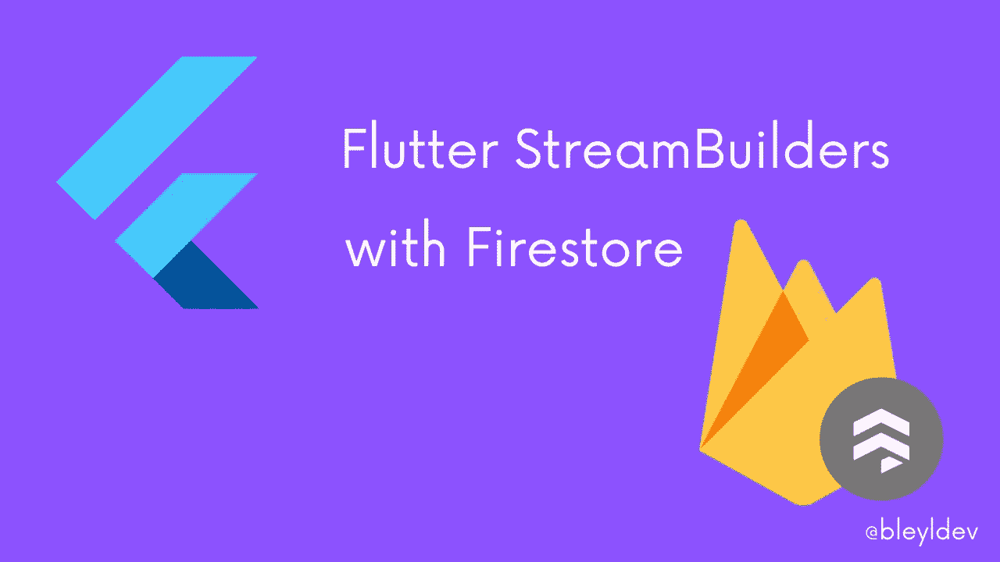

# 在 Flutter 中使用 StreamBuilder 从 Firestore 读取列表

> 原文：<https://medium.com/quick-code/reading-lists-from-firestore-using-streambuilder-in-flutter-eda590f461ed?source=collection_archive---------0----------------------->

几年前，当我开始学习 flutter 开发时，我必须学习的第一件事就是如何使用 StreamBuilders。StreamBuilders 允许应用程序显示异步数据或不断变化的数据。假设你有一个应用程序，用户可以在其中阅读和添加信息到一个列表中，比如一个社交媒体 feed。很可能你需要这些数据来加载…