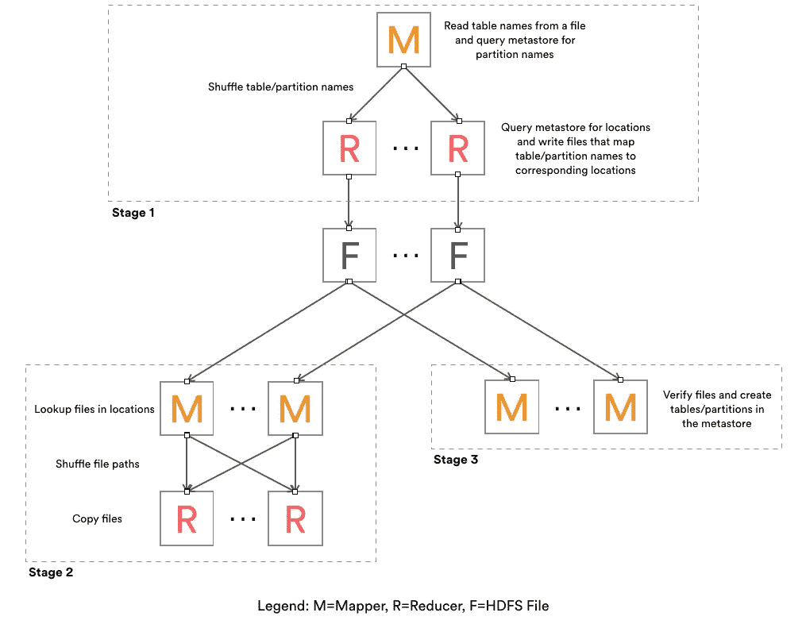

# ReAir:用于迁移和复制 Pb 级数据仓库的易用工具

> 原文：<https://medium.com/airbnb-engineering/reair-easy-to-use-tools-for-migrating-and-replicating-petabyte-scale-data-warehouses-5153f8a433da?source=collection_archive---------1----------------------->

由[杨](https://www.linkedin.com/in/paul-yang-b63156118) & [卢经纬](https://www.linkedin.com/in/jingwei-lu-5701222)

Airbnb 的数据基础设施是我们不断改进产品战略的重要组成部分。我们的 Hive 数据仓库从 2013 年年中的 350TB 呈指数级增长到 2015 年底的 11PB。随着公司的发展，对仓库可靠性的需求也在增长，我们试图将我们的仓库迁移到新的架构。我们发现，现有的迁移工具要么存在大型数据仓库的问题，要么有巨大的运营开销，因此我们开发了 [ReAir](https://github.com/airbnb/reair) ，以便在复制这种规模的数据时节省时间和精力。在这篇博文中，我们将详细介绍 ReAir 如何工作，以及如何使用它来轻松复制 Pb 级的数据仓库。

# 背景

最初，我们所有的数据都在一个 HDFS /蜂巢的仓库里。单一名称空间提供了一个简单的心理模型，易于管理。但是，将生产与临时工作负载混合在一起会对可靠性产生负面影响。因此，我们打算将我们的仓库一分为二——一个用于关键生产作业，另一个用于特殊查询。在进行这种拆分时，我们必须应对两个挑战——我们如何轻松地迁移这样一个大型仓库，以及在拆分后，我们如何保持数据集同步？我们已经创建了 ReAir 来应对这些挑战，并为社区开源了该工具。

> 在 github 上查看:[https://github.com/airbnb/reair](https://github.com/airbnb/reair)

ReAir 对于复制基于 Hive metastore 的数据仓库非常有用。我们使这些工具可扩展到数 Pb 大小的集群。对集群使用 ReAir 也很简单——它连接到 Hive metastore Thrift 服务，并使用 map-reduce 作业复制数据。因为这些是唯一的要求，所以 ReAir 可以跨各种不同的 Hive 和 Hadoop 版本工作，并且可以在很大程度上独立运行——只需要部署 Hadoop 和 Hive(增量复制需要+MySQL DB)。由于 ReAir 同时处理数据和元数据，所以一旦过程完成，表和分区就可以随时进行查询。

在没有 ReAir 的情况下，迁移仓库的典型解决方案包括启动 DistCp 和通过数据库操作手动管理元数据。这种方法劳动强度大且容易出错。一些错误会导致难以解决的不一致。此外，这个过程还存在复制不断变化的仓库目录的问题。其他复制解决方案需要特定的配置单元版本——如果从较旧的部署进行迁移，这一要求很难满足。

ReAir 包括 2 种不同的复制工具:批处理和增量。批处理复制工具允许您一次复制一个特定的表列表，这对于集群迁移来说非常理想。相反，增量复制工具允许您跟踪仓库中发生的变化，并在对象生成或修改时复制它们。增量模式非常适合在集群之间保持数据集同步，因为它在对象创建后几秒钟内就开始复制更改。关于这两种模式的更多信息将在以下章节中介绍。

# 批量复制

批处理复制模式通常用于复制整个数据仓库。复制的速度和吞吐量取决于减速器的数量和吞吐量，但在 Airbnb，我们已经能够在 24 小时内使用 500 个减速器复制 2.2PB。

开始批量复制过程很简单:用户运行一个 shell 命令，启动一系列 map-reduce (MR)作业。执行契约将实体(配置单元表和分区)从源仓库复制到目标仓库。当连续运行多次时，批处理复制过程可有效利用带宽—它会检测源和目标之间匹配的文件，并且只复制差异部分。同样，metastore 仅在需要时更新。这种幂等行为确保了该工具易于运行，而不会浪费工作。

批量复制面临几个挑战。其中一个重要的问题是，在生产数据仓库中，实体的大小是不一致的，但是复制延迟不应该取决于最大的实体。例如，普通表可以有不到 100 个分区，而最大的表可以有超过 100，000 个分区。为了控制延迟，有必要平均分配复制工作。

为了解决负载平衡问题，批处理复制作为一系列 MR 作业运行。批量复制中最昂贵的两个操作是文件复制和元数据更新，因此这些步骤通过一个随机阶段来分配。这三个作业生成要复制的文件列表，执行文件复制，最后执行元数据更新。这些作业中的每一个都将日志数据生成为 HDFS 上的文件，因此很容易检查作业完成后发生了什么。

在第一个 MR 作业中，从 HDFS 中读取实体标识符，并将其均匀地分配给 reducers。缩减器在实体上运行各种检查，并产生需要复制的从实体到 HDFS 目录的映射。第二个 MR 作业遍历第一个作业生成的目录列表，并在这些目录中创建一个文件列表。基于文件路径的散列，文件名被混洗到 reducers 中。一旦改组，减少执行拷贝。第三个 MR 作业处理配置单元 metastore 的提交逻辑。由于实体列表已经均匀分布在第一个 MR 作业中，因此第三个 MR 作业可以是仅映射的。

三阶段的 MR 计划可以很好地伸缩和平衡负载:用 100 万个实体复制 2.2PB 大约需要 24 小时。20 TB 发生变化后运行一次更新只需一个小时。在阶段 1 和阶段 3 中，我们观察到瓶颈是 Hive metastore MySQL 数据库，而在阶段 2 的文件副本中，瓶颈是可用的网络带宽。

对于我们的迁移，我们还必须编写一个定制的文件拷贝作业来处理我们的 HDFS 数据。虽然 DistCp 等工具很常用，但我们在测试中发现了几个问题:

1.  在有数百万个文件的目录或整个仓库上进行作业初始化很慢。
2.  错误率可能很高，我们想要自定义错误处理。
3.  缺少易于分析的日志记录。

为了解决这些问题，我们开发了一系列两位乔布斯先生来处理 HDFS 将军的副本。第一个作业使用启发式的、基于级别的目录遍历和多线程来构建拆分列表。一旦有了足够多的目录，映射器就遍历这些目录以生成用于复制的文件列表。文件名被混洗到 reducers 中，以确定是否需要复制。第二个 MR 作业读取要复制的文件列表，并通过 shuffle 分发复制工作。

# **增量复制**

有了两个集群，我们需要在两个集群之间共享数据。例如，每日日志数据在生产集群中聚合，但是临时用户也需要这些数据。上面提到的批量复制作业是一个很好的迁移工具，但是可能要花一个小时才能弄清楚我们这种规模的两个仓库之间的差异并执行更新。由于临时集群的用户希望数据在生产集群上一准备好就可以使用，所以构建一种更快的方法来放置新内容是有意义的。在开源软件中做了一些努力来处理这个问题，但是由于对 Hive 版本的依赖，复制 S3 支持的分区的需要，以及对遵循与批量复制相同逻辑的独立解决方案的渴望，我们开发了增量复制工具来保持我们的生产集群同步。

顾名思义，增量复制工具包括记录对实体的更改，并在更改发生时立即复制。为了记录源(即生产)集群上的变化，我们使用 Hive 中的 hooks 机制在查询成功时向 MySQL DB 写入一个条目。这样，我们可以跟踪生产集群中发生的所有变化。对于直接在 HDFS 上或通过 Spark 等系统进行的更改，可以进行元数据更新(例如，使用触摸命令)来触发复制。

一旦我们在数据库中记录了更改，我们就需要一种方法将这些更改复制到临时集群。这种执行是通过独立的 Java 服务实现的。该过程从更改日志中读取条目，然后将这些条目转换成一组操作。例如，在源集群上成功的 create table 查询将转化为目标集群上的“copy table”操作。Java 进程将使用进行适当的 metastore 调用，并启动 MR 作业来执行操作。

因为源集群上的更改在日志中是序列化的，所以在目标集群上以相同的顺序执行更改会很简单。然而，在实践中，这太慢了，因为复制单个表或分区可能需要几秒到几分钟的时间。相反，必须用多线程并行复制这些更改。为了促进并发性，根据并发性限制将动作安排到 DAG 中。通常，这些限制是由单个表上的多个操作引起的。例如，应该在复制分区之前创建表。通过并行执行操作，复制中的延迟保持在最小。

使用增量复制，可以快速可靠地复制变更。复制数据可用于保持两个仓库同步进行灾难恢复，如果一个集群停机，另一个可用于执行基本功能。与批量复制相比，增量复制在数据仓库较大，但更改的数据量相对较少的情况下效率更高。目前，在 Airbnb，生产集群上每天只有不到 2TB 的数据发生变化。因为这是数据仓库的一小部分，所以增量复制是有意义的。

通过使用批量复制和增量复制，我们能够快速迁移到双集群设置，实现了我们提高隔离和可靠性的目标。我们希望这些工具也能对社区有用！

链接到 GitHub:[https://github.com/airbnb/reair](https://github.com/airbnb/reair)

## 在 [airbnb.io](http://airbnb.io) 查看我们所有的开源项目，并在 Twitter 上关注我们:[@ Airbnb eng](https://twitter.com/AirbnbEng)+[@ Airbnb data](https://twitter.com/AirbnbData)