# Reaksi Pertama saat coba Vue js

> 原文：<https://medium.easyread.co/reaksi-pertama-saat-coba-vue-js-4c2c1fbbd75a?source=collection_archive---------0----------------------->


Vue js

Sampai beberapa waktu yang lalu saya gak ngerti kenapa javascript bisa jadi bahasa pemrograman no 1 paling banyak di gunakan di dunia. Padahal javascript itu kan setahu saya digunakan untuk membuat website lebih interaktif.

Googling-googling sampai kemudian baru nyadar ada banyak banget framework dan library keren yang dibuat dengan javascript.

(Singkatin aja ya javascript jadi js)

Ada react, angular, node js , react native , electron , keren-keren banget. Langsung mau di pelajari semua, greget banget haha.

Sampai kemudian bertemu dengan vue js. Pertama ketemu vue js ini , saat lagi sibuk ngulik laravel. Kebeteluan lagi garap project market place untuk warung-warung [war-mart.id](https://war-mart.id) , bingung banget pake framework apa ya untuk nanganin front end nya , sudah pernah buat POS app dengan jquery ribet nya ampun.

Dan kerennya lagi dalam laravel sudah termasuk di dalamnya vue js . jadi ketika install laravel , otomatis di dalamnya sudah terdapat vue js .

manfaat utama yang saya rasakan ketika menggunakan vue js , kita bisa lebih fokus kepada masalah logic bisnis aplikasi, ketimbang fokus untuk DOM manipulation, css manipulation dan sbg.

di artikel ini kita akan buat simple app kalkulator dengan laravel dan vue js.

oke pertama install laravel

```
composer create-project laravel/laravel --prefer-dist kalc-vue
```

masuk ke direktori nya, lalu jalankan command berikut :

```
npm install
```

untuk menjalankan command di atas memerlukan node js dan npm.

oke sejauh ini kita sudah berhasil menginstall laravel dan vue js di dalamnya .

lalu dimana letak kode vue js kita ? ada di direktori resources -> assets -> js

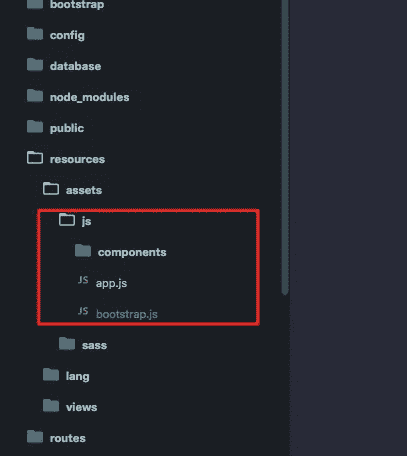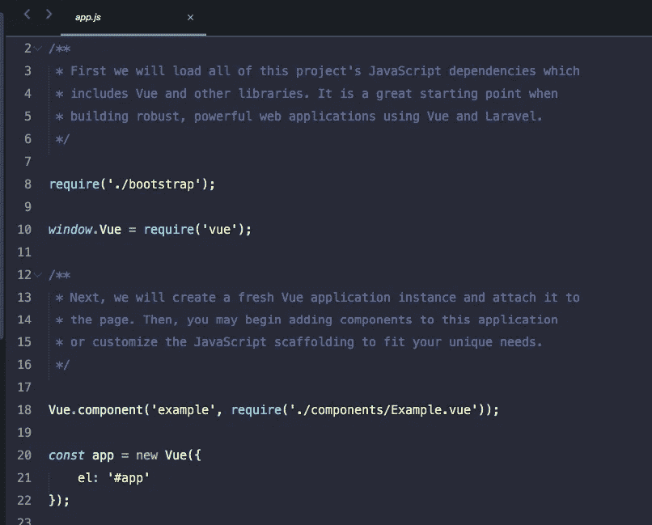

resource/asset/js/app.js

bagaimana menjalankan nya di laravel ?

untuk contoh , kita buat satu view yang akan menjalankan component example. apa itu component ? silahkan simak di bawah.

buat route nya di routes/web.php

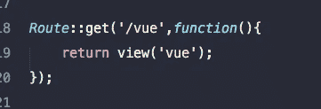

buat view nya di resources/views/ dengan nama vue.blade.php , lalu ketikkan kode berikut :

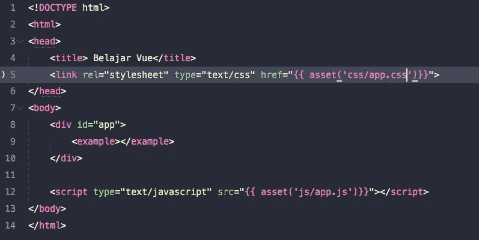

vue.blade.php

hasilnya kita jalankan di browser [http://localhost/kalc-vue/public/vue](http://localhost/kalc-vue/public/vue) :

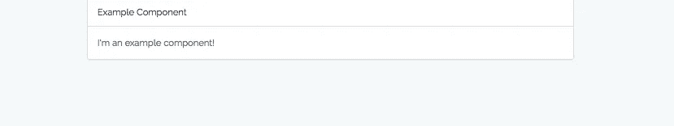

Example Component

jika kita perhatikan kode di atas terdapat tag <example>, itu bukan tag bawaannya html , itu adalah custom component fitur keren punya vue js.</example>

untuk membuat component, laravel sudah menyediakan satu folder bernama components di resources/assets/js/components . semua component yang kita buat di taruh di sana .

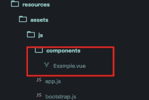

Component Directory

nah , component example itu ada di file Example.vue .

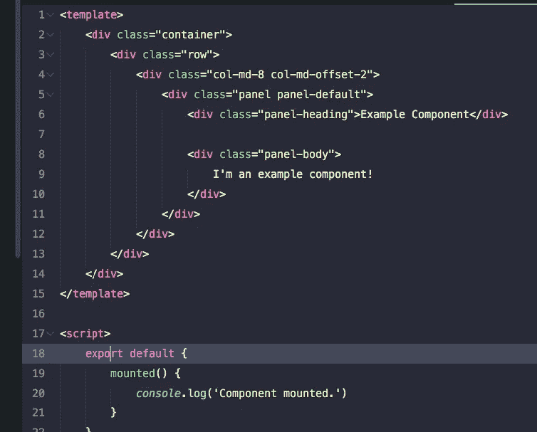

Example.vue

sekarang coba kita edit Example.vue

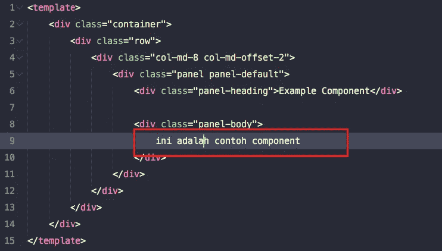

cek lagi hasilnya di browser dengan merefresh halamannya, hasilnya akan tetap sama seperti sebelum di edit.

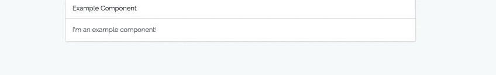

kenapa ya seperti itu? seharusnya kan ikut berubah. itu karena app.js yang ada di public/js/app.js dengan yang ada di resource/assets/js/app.js , tidak akan otomatis berubah jika kita melakukan edit di folder resources/assets/js

bagaimana cara nya supaya otomatis tersinkronisasi ? kita gunakan **watch.**

```
npm run watch 
```

jalankan command di atas di direktori laravel app kita dan jangan pernah di tutup selama masih melakukan editing di folder /resources/asset/js .

dengan menjalankan command di atas maka setiap edit yang terjadi di folder resources/assets/js akan tersinkronisasi dengan public/js/ .

kita lihat lagi hasilnya di browser maka seharusnya sudah berubah sesuai dengan edit yang dilakukan.


jika saat di refresh tidak berubah juga , silahkan coba force refresh agar file app.js nya di cache ulang oleh browser.

oke, cukup untuk contoh Example.vue nya , kita akan lanjut buat simple calculator .

pertama, buat dulu route nya di routes/web.php

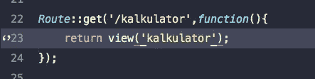

lalu kita buat view nya kalkulator.blade.php

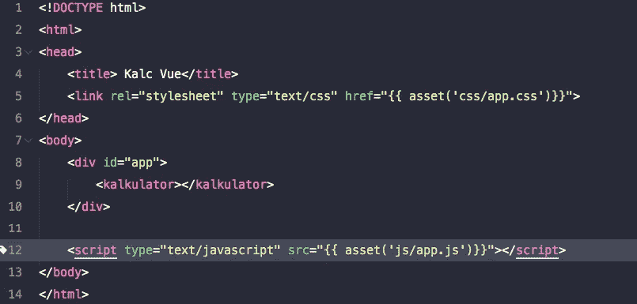

lalu kita buat component form kalkulator nya :

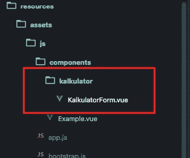

lalu isi dengan kode berikut :

```
<template>
 <div class="container"><form  class="text-center" style="margin-top: 20%">
   <h1 class="text-center">Kalc Vue App</h1>
   <input type="number" v-model.number="angka_1"> +
   <input type="number" v-model.number="angka_2">
  </form>
  <h2 class="text-center">{{ angka_1 + angka_2}}</h2>
 </div>
</template><script>
export default {
 data: function () {
  return {
   angka_1: 0,
   angka_2: 0
  }
 }
}
</script>
```

setelah component berhasil di buat, kita import ke vue lewat app.js , buka app.js lalu edit seperti dibawah ini :

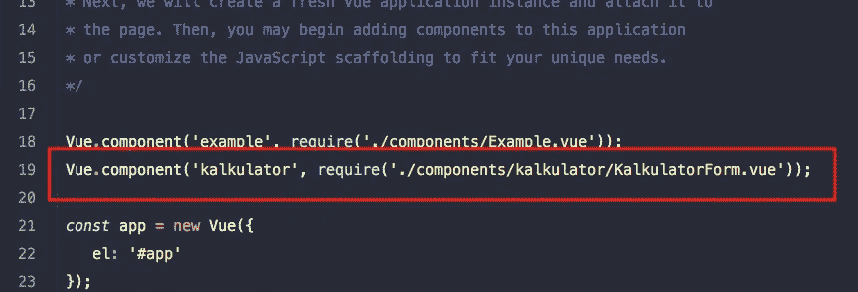

sampai tahap ini koding kita sudah selesai, cek hasilnya di browser [http://localhost/kalc-vue/public/kalkulator](http://localhost/kalc-vue/public/kalkulator)

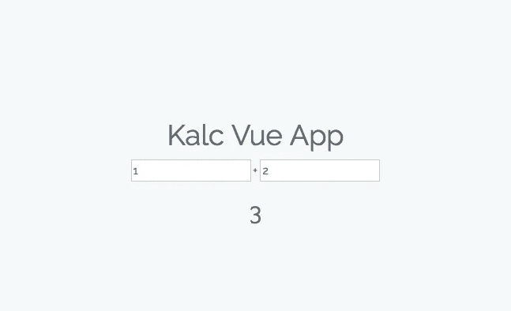

Kalc Vue App

coba ubah angka pertama dan angka kedua nya , maka hasilnya akan otomatis berubah , tanpa kita harus lakukan DOM manipulation secara manual dengan javascript. Keren Banget !

agar pemahaman fundamental vue js anda makin mantap, silahkan baca dokumentasi resmi vue js di [https://vuejs.org/](https://vuejs.org/) , dokumentasi nya sama kerennya dengan hasil kodingnya.

Mungkin cukup sampai sini pembahasan awal tentang vue js.

untuk tutorial selanjutnya saya akan buat tutorial bagaiman membuat crud laravel — vue , termasuk pagination , loading spinner, search data, selectize, swal(sweet alert) di vue js .

See You in the next tutorial .

Happy Coding :)

untuk source code lengkap silahkan kunjungi [github saya](https://github.com/haidarafif0809/kalc-vue) .

*Jika anda merasa artikel ini menarik dan bermanfaat, silahkan* ***berikan claps*** *👏 👏 sebanyak-sebanyaknya dan* ***bagikan*** *ke lingkaran pertemanan anda, agar mereka dapat membaca artikel ini. Dan jangan lupa* [***follow saya di medium***](https://medium.com/@haidarafifmaulana) *untuk terus dapatkan tulisan seperti ini setiap minggunya.*