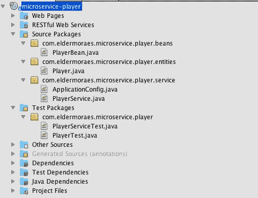

# 使用 Java EE 的真正微服务

> 原文：<https://medium.com/oracledevs/real-microservices-with-java-ee-c5ee72da603?source=collection_archive---------0----------------------->

微服务是当今软件行业最重要的术语之一。这并不奇怪，因为许多大公司、许多大项目都在使用这种方法。

但是 Java EE 呢？有没有可能使用 Java EE 来构建微服务，我指的是真正的微服务？当然是，我现在就给你看。

基本上，这个示例使用的场景是我们的应用程序具有:

1-有等级的玩家

2-玩家等级历史

就像一个游戏经理一样。让我们检查一下作为整体构建的应用程序，然后将其分解为一个微服务模型。

# 巨石柱

我们这里有一个用 Java EE 建造的整体建筑的例子。首先是我们的玩家实体(JPA):

然后是我们玩家排名历史的实体:

注意 Player 和 PlayerRankHistory 之间的关系:

@ManyToOne
私服玩家 Player；

当我们将其分解为微服务时，这一项将非常重要。

我们也有两个 beans 来为 Player 和 PlayerRankHistory 进行数据操作。它们将保存方法:save、remove、findByID 和 findAll。

首先是 PlayerBean:

然后是 PlayerRankHistoryBean:

最后，我们有了将与这些 beans 通信的端点。

player 服务:

和 PlayerRankService:

哦，是的…别忘了写测试！我们在这里只展示了端点测试，但是存储库已经编写了完整的测试(本文末尾的 URL)。

首先是玩家服务测试:

然后是 PlayerRankHistoryServiceTest:

这就对了，我们的巨石已经准备好被分解了。

# 微服务

首先，以前是一个项目，现在分成了两个。

当然，播放器项目只有与播放器部分相关的类。它们与原件几乎相同，因此我们不会在此展示它们，只展示项目结构如下:

对于 PlayerRank 项目，我们在类中做了一些改变。

正如我们之前所说的，玩家排名和玩家之间存在联系。由于我们在这个项目中不再有玩家，每个微服务都有自己的数据库(每个服务模式的数据库)，在这种情况下，我们将玩家关系替换为玩家 ID(称为“玩家”)。

现在由应用程序来管理 Player x PlayerRank，至于它的任何其他用例，如报告、搜索等。现在这种关系是合乎逻辑的，不再是物理的。

PlayerRank bean 没有任何变化，PlayerRank 端点也是如此。

嗯，仅仅把项目分成两部分是不够的。我们需要一些东西来使这些东西协同工作，尽管它们是相互分离的。

# API 网关

我们在这里使用的一种方法叫做 API Gateway。我们刚刚构建了一个网关来处理这两种微服务。

我们建立了一个玩家网关，它将保持你的客户端之间的通信——它可以是移动客户端、网络客户端、桌面客户端……无论你有什么客户端。网关将位于微服务和您的客户端之间的通信中间。

PlayerRank 网关使用了相同的方法:

这样，即使你的服务发生变化(当然，有一些限制)，你也可以保持与客户的合同不变。你可以改变网址，技术，商业规则等。

您需要为每个微服务在其网关上执行的大多数特定活动或管理。如果你创建另一个微服务，另一个应用，你可以通过这个网关与 API 进行通信。然后你有很大的灵活性给你的客户提供新的功能。

如您所见，将 Java EE 应用程序分解成微服务非常简单。实际上，这不仅仅是分解整个代码，有时你还需要对环境进行分解。

当然，我们在这方面还有很多需要改进的地方，比如配置、服务注册和发现等。但是这是一种方便的开始方式。

如果您想查看本示例的完整源代码:

 [## eldermoraes/javaee8oracledevs

### 在 GitHub 上创建一个帐户，为 eldermoraes/javaee8oracledevs 的开发做出贡献。

github.com](https://github.com/eldermoraes/javaee8oracledevs/tree/master/microservices) 

另请查看 Youtube 视频，其中解释了此示例: