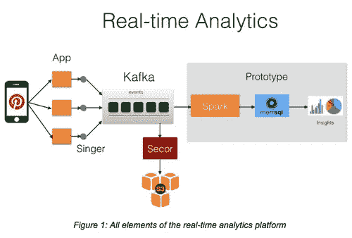
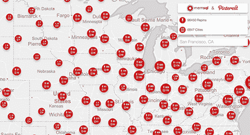

# Pinterest 的实时分析

> 原文：<https://medium.com/pinterest-engineering/real-time-analytics-at-pinterest-1ef11fdb1099?source=collection_archive---------0----------------------->

Krishna Gade | Pinterest 工程经理，数据

随着本周数千人聚集在湾区参加 [Strata + Hadoop World](http://strataconf.com/big-data-conference-ca-2015/public/content/home) ，我们希望分享数据驱动的决策是如何融入我们公司 DNA 的。最近，我们构建了一个实时数据管道，使用 Spark Streaming 将数据导入 [MemSQL，还构建了一个高度可扩展的基础设施，实时收集、存储和处理用户参与数据，同时解决挑战，帮助我们实现:](http://www.memsql.com/releases/memsql-and-pinterest-showcase-operationalizing-spark/)

*   更高性能的事件记录
*   可靠的日志传输和存储
*   更快地对实时数据执行查询

让我们深入了解一下。

## **更高性能的事件记录**

我们开发了一个名为 [Singer](http://www.slideshare.net/DiscoverPinterest/singer-pinterests-logging-infrastructure) 的高性能日志代理，它部署在我们所有的应用服务器上，用于收集事件日志并将它们发送到一个集中的存储库。应用程序将其事件日志写入本地磁盘，Singer 从本地磁盘收集并解析这些日志文件，然后将它们发送到中央日志存储库。Singer 使用至少一次交付语义构建，与 Kafka 配合良好，Kafka 充当我们的日志传输系统。

## **可靠的原木运输和储存**

[Apache Kafka](https://kafka.apache.org/) ，一个高吞吐量的消息总线，构成了我们的日志传输层。我们选择 Kafka 是因为它具有许多可取的特性，包括支持大容量事件流、可复制的持久性和至少一次交付的低延迟。一旦事件日志被发送到 Kafka，来自 Storm、Spark 和其他定制日志阅读器的各种消费者就可以实时处理这些事件。其中一个消费者是名为 [Secor](https://engineering.pinterest.com/post/84276775924/introducing-pinterest-secor) 的日志持久性服务，它可靠地将这些事件写入亚马逊 S3。 [Secor](https://github.com/pinterest/secor) 最初是为了保存我们的货币化渠道产生的日志而构建的，在这种情况下，0-数据丢失非常关键。它从 Kafka 读取事件日志，并将其写入 S3，克服了其脆弱的最终一致性模型。此后，我们的自助式大数据平台将数据从 S3 加载到许多不同的 Hadoop 集群中进行批处理。

## **Spark + MemSQL 集成**

虽然 Kafka 允许实时消费事件，但它不是一个供人类就实时数据提问的好界面。我们希望能够在实时事件到达时运行 SQL 查询。由于 [MemSQL](http://www.memsql.com/) 正是为此而构建的，我们构建了一个实时数据管道，使用 [Spark Streaming](https://spark.apache.org/streaming/) 将数据接收到 MemSQL 中。该管道正处于原型阶段，我们将继续与 MemSQL 团队合作生产它。

图 1 显示了我们到目前为止描述的实时分析平台的元素。几个月来，我们一直在制作《歌手->卡夫卡->塞科-> S3》系列电影。目前，我们正在通过构建一个原型来评估 Spark -> MemSQL 集成，在这个原型中，我们将 Pin 参与数据输入到 Kafka 主题中。Kafka 中的数据由 Spark 流作业消耗。

在这项工作中，每个 Pin 都被过滤，然后通过添加地理位置和 Pin 类别信息来丰富。然后使用 [MemSQL 的 spark 连接器](https://github.com/memsql/memsql-spark-connector)将丰富的数据持久化到 MemSQL，并提供查询服务。这个原型的目标是测试 MemSQL 是否能够让我们的分析师使用熟悉的 SQL 来探索实时数据并获得有趣的见解。

在我们继续评估 MemSQL 的同时，我们将于 2 月 19 日星期四在圣何塞会议中心与 MemSQL 团队一起在 [Strata + Hadoop World 2015](http://strataconf.com/big-data-conference-ca-2015/public/content/home) 上展示它的演示。请到 MemSQL 展位 1015 访问我们，了解更多详情。

## **使用 Spark & MemSQL** 构建的演示

*Krishna Gade 是数据团队的工程经理。*

*获取 Pinterest 工程新闻和更新，关注我们的工程*[*Pinterest*](https://www.pinterest.com/engineering/)*，* [*脸书*](https://www.facebook.com/pinterestengineering) *和* [*推特*](https://twitter.com/PinterestEng) *。有兴趣加入团队吗？查看我们的* [*招聘网站*](https://about.pinterest.com/en/careers/engineering-product) *。*