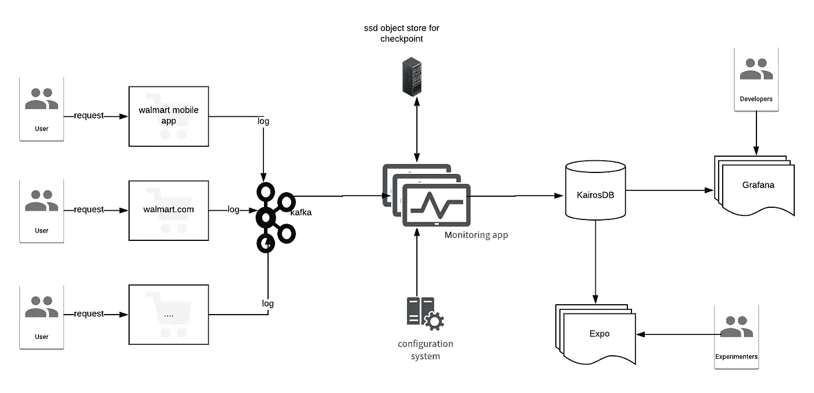

# 用于监控和报告的实时数据处理

> 原文：<https://medium.com/walmartglobaltech/real-time-data-processing-for-monitoring-and-reporting-a-practical-use-case-of-spark-structured-8e4f91f6f3a7?source=collection_archive---------3----------------------->

## spark 结构化流的实际使用案例


Photo credit: [geralt](https://pixabay.com/illustrations/particles-color-monitor-wave-1373684/)

在这篇文章中，我将探讨我们如何为沃尔玛的内部 AB 测试平台 ***Expo*** 设计和实现我们的新实时监控系统。该系统每天处理数十亿条记录，生成数百万个指标。这些指标有助于实验者监控他们的实验，以及它们如何影响沃尔玛网站或应用程序。

在我之前的[帖子](/walmartlabs/monitoring-and-alerting-for-a-b-testing-detecting-problems-in-real-time-4fe4f9b459b6)中，我举了一个关于 AB 测试如何工作的小例子。在推出每个新功能之前，我们会将新功能展示给一部分用户。根据 *Expo 给出的反馈，*我们要么向所有用户开放该功能，要么撤回新功能并保持网站原样。每个实验都有自己的目标。Expo 提供了很多指标，实验者可以决定哪一个对他们更重要。这可以包括点击率、收入或用户希望能够衡量的任何东西。

# 背景

我们在 WalmartLabs 开发的系统之一是 Expo，这是我们进行 A/B 测试的实验平台。Expo 管理 A/B 测试的设置和执行。有多个系统支持 Expo 来完成 A/B 测试，并帮助分析人员和实验人员得出结论。其中一个是报告系统，它每晚以批处理方式分析数据。另一个是一个持续运行的监控系统，以给出实验当前工作情况的实时快照。在本文中，我们将重点讨论监控系统。

## 一个虚拟场景来继续讨论！

现在，在这篇文章的其余部分，让我们假设一个简化的例子作为本文其余部分的参考。

比方说，我们需要将 walmart.com 首页上的蓝色按钮的颜色改为红色，我们希望看到这种变化会对电子商务中非常重要的指标`revenue per visit`或`conversion rate` 产生什么影响。为此，我们在 Expo 中创建了一个有两种变化的实验`<exp>`。在`<var1>`中，它是当前在生产中运行的控制版本，我们有一个蓝色按钮。在`<var2>`,颜色是红色，这是我们想要的特征，我们希望最终推向生产。现在，当用户访问主页时，如果他被分配到实验，他将在实验运行期间看到蓝色按钮(`<var1>`)或红色按钮(`<var2>`)。

在我们的示例中,`walmart.com`被称为租户，并具有`uswm`标识符。Expo 和 monitoring 支持其他租户，如沃尔玛移动应用程序或沃尔玛杂货。`home_page`和`item_page`是访问我们称之为`measurement point`的页面的两个传感器。

监控系统为每个实验生成许多不同的指标。度量由关键字定义，例如`uswm.visit.fm.<var1>.item_page.beta`。此指标显示符合实验条件并访问了项目页面的独特访问次数。命名中唯一可能模糊的部分是`fm`和`beta`部分。

`fm`是`factor matched`的缩写，表示只有当用户被分配到`<var1>`并接受治疗时，他才对指标值做出贡献。在我们的系统中，我们也称之为“合格”。在我们的例子中，主页上的按钮颜色变化就是处理。因此，如果 1)用户被分配到`<var1>` 2)他已经访问了主页 3)在访问主页(步骤 2)之后，在某个点他访问了项目页面，则用户将增加示例度量。

如果不满足三个顶级条件中的第二步，用户将只贡献`uswm.visit.***assigned***.<var1>.item_page.beta`指标。

`fm`标准可能非常复杂。例如，条件可能是用户在移动设备上访问网站，并在结账时选择了特定的支付类型。这些条件在实验配置中指定。

`beta`表示每个`sessionId`只能贡献一次指标。我们有其他没有测试版的指标显示，如果用户多次访问项目页面，将会多次增加指标值。

# 整体架构



Image 1: Components involved in the monitoring system

上图显示了我们的监控平台中使用的主要组件。通过这种设置，我们可以专注于瓶颈，并横向扩展每个部分，使其相互独立。在下面的小节中，我将描述每个部分是如何工作的。

## 卡夫卡

当用户点击页面或在页面内采取不同的操作时，会生成日志。这些日志或者是服务器日志，或者是 javascript 发出的信标。每个日志都有一个代表一个用户的 sessionId。并非所有的记录都对生成指标有用，所以我们将有用的日志转发到它们自己的主题。该作业连接到主题，一个接一个地挑选记录，并从中提取指标。

## 监控作业

作业的每个实例都是一个 Spark 结构化流应用程序，它在每一分钟触发，从 Kafka 读取数据，并将其放入 KairosDB。

为了防止失败，我们在不同的数据中心运行作业的两个镜像实例，并让它们独立地将结果写入我们的 KairosDB。每个作业按数据中心标记其指标。当发生故障时，系统能够通过更改标签的名称自动切换到其他数据中心指标，UI 将提供正确的数据。

## KairosDB

KairosDB 是我们流式作业的接收器。这是一个由 Cassandra 支持的时间序列数据库。它不仅保留我们的监控指标，还跟踪监控系统的健康状况。除了 Expo 指标，监控系统还填充内部健康指标，如消耗的内存大小、处理的记录数量等等。我们在 Grafana 中保留了这些指标的仪表板，以便能够更容易地调试问题。

KairosDB 能够基于不同的标签聚集数据。每个指标都标有不同的信息，如设备类型和登录状态。我们能够生成所有指标并将所有组合发送到 KairosDB，但是我们决定采用标记策略。它允许我们在系统的不同部分之间分配复杂性，而不是将它们都集成在一个位置，这使得计算上的扩展更加困难。UI 服务可以通过组合不同的标签来查询任意粒度/粗粒度的数据。

# 总体实施


Image 2: High-level view of what job does in each batch

如上所述，监控作业是用`scala`编写的 Spark 结构化流作业，运行在一个微小的批处理上。它包括两个有状态阶段:一个阶段用于会话化，另一个阶段使用会话化输出进行度量聚集。结构化流通过一些更高阶的方法，如`flatMapGroupsWithState`，使得有状态操作部分更容易实现。开发人员需要提供一个函数作为传递给`flatMapGroupsWithState`的参数，每当我们有一个键的数据时就会被触发，例如在会话化中是`sessionId`。该函数进行了抽象，并为开发人员更新当前状态提供了一些有用的参数。对于每个键，它提供该时间范围内与该键相关联的所有数据，并让开发人员能够访问以前的状态。开发人员唯一需要做的就是关注如何保持状态的核心问题，他需要为每个阶段发出什么度量标准以及如果事件无序如何纠正度量标准，以及如何在系统中将以前的状态与当前状态合并。会话化的关键字是 sessionId 字符串，度量聚集阶段的关键字是(metricName，minute bucket)元组。

## 会话化

在会话化部分，我们将每个会话的事件聚集在一个名为 session 的数据结构中。您可以将每个事件视为用户采取的一个操作。我们不需要保留全部数据，我们只需要一个信息摘要来生成指标。这个阶段的关键是 sessionId。会话是`scala`中的一个`case class`，它跟踪我们生成新指标和纠正错误指标所需的信息。

1.  `sessionId`:会话的 id
2.  `session property`:会话的数值属性，如会话上次有活动等。
3.  `markers`:记录重要事件的数据结构；例如记录用户第一次接触变化的时间。
4.  `counts`:跟踪会话动作的数据结构；例如，它知道用户在什么时间访问了主页多少次。

我们只用这四种数据结构生成所有中间指标。一些指标可以直接从像分配给变体的用户数量这样的标记中计算出来，而其他指标则需要通过制作`markers`和`counts`数据结构中数据的笛卡尔乘积来处理。

这个阶段的输出度量的一个例子可以是:

```
(uswm.visit.fm.123#desktop#in#dc1.home_page.beta.1525356180000,1)
```

如您所见，标记和分钟时段时间戳在指标名称中被序列化。这是一个会话的输出，该指标名称的值需要在所有会话中聚合。尽可能细化标签使我们有机会减少实时监控中的空间和时间复杂性，并将计算不同标签组合的值的责任交给 KairosDB。

因为我们填充了每个分钟时段的指标，所以我们需要访问每个发出的指标的信息。这就是我们将批处理时间附加到每个指标的原因。

## 处理无序事件

实时系统中另一个需要考虑的是后期数据或者乱序数据。例如，假设事件 1 和事件 2 分别发生在批处理时间 10 和 14，但是事件 2 由于其中一个 Kafka 代理失败而提前到达监控作业。如果我们不考虑这种无序事件，则此会话的因子匹配被认为发生在时间 14，而正确的值是 10，这给了我们一个错误的结果。要纠正错误的指标，我们需要计算在时间 10 和 14 之间发出了什么指标，并通过发出这些指标的负值来纠正它们。这解决了问题，但如果我们天真地这样做，并跟踪每个状态和无序事件，会使计算和空间非常低效。这个问题可以通过使用 spark 结构化流中引入的水印概念来解决。你可能会有兴趣在这里详细阅读。一般来说，它是一种跟踪当前事件时间并试图清除旧状态的机制，并忽略非常晚的事件。

## 度量聚集阶段

此阶段的输入是来自会话化阶段的所有指标。请记住，在会话化中，我们只跟踪属于每个会话的指标。在此阶段，我们在所有会话中汇总它们。这个阶段中有状态操作的关键是(指标名称，分钟时段)元组。基于此关键字，系统只是将所有会话中每个指标的总和相加。

Kairos 的最终指标如下:

```
{ metricName: ‘uswm.visit.fm.123.home_page.beta’, 
tags=[‘dc1’,’in’,’desktop’], 
timestamp=1525356180000, 
count=10000,ttl=’30 days’}
```

## 其他指标

Spark 有一个接口，允许开发人员访问关于流式查询状态的信息。我们使用接口`StreamingQueryListener`在 KairosDB 中填充关于监控作业的信息。这些指标基本上是用来监控监控系统的！

# 经验教训

我们在开发过程中学到了很多实验和挑战，我想分享一些重要的实验和挑战:

*   *测试和验证*:对于我们添加到系统中的每一个功能，我们都广泛地编写了多个单元和集成测试，并根据 HDFS 进行了验证，以确保一切正常。我们唯一不想被破坏的是这份工作的可信度。由于系统很复杂，添加新功能可能会引入错误，测试确实帮助我们保存了系统的完整性。
    在开发完每一个特性之后，我们还在一个非生产集群上运行了几天，以观察新特性对系统性能的影响。这让我们测试应用程序的边界和弱点，并让我们专注于真正的问题。
*   *拥抱函数式编程*:我们热爱沃尔马特实验室的函数式编程，为了这个特定的项目，我们有意拥抱它。以下是一些结果:
    -它使我们的开发更快
    -它降低了我们系统的复杂性，使代码更容易理解
    -对象的不变性使我们更容易调试代码
    -它将空指针异常减少到零。在生产中部署监控作业后，我们没有看到任何 NPE。
*   *原型是不确定性的关键*:如果你怀疑系统的功能性甚至非功能性方面，那么证明这个概念的最好方法就是抽象出用例并制作一个小型原型。认识到以下事实非常重要:在项目的最开始，在原型设计和设计上花费更多的时间，比最终实现不满足需求和服务级别协议更有可能让项目圆满结束。
*   *链条的强度取决于其最薄弱的环节*:当您设计多租户系统时，请确保设计中每个主要组件的可伸缩性，并确保在流量高峰时可以轻松地横向扩展。我们多次考虑我们的设计，并加班加点地冲洗它，以确保它能承受沃尔玛的高峰流量。

目前的监控工作支持沃尔玛的 8 个不同的租户，我们期待着更多的租户。这意味着这些租户的每一个请求，经过过滤后，都要经过这个系统。应用程序的当前正常输入速率是每秒 12 万到 2 万个条目，每分钟生成 1 到 3 百万个度量。