# 使用 Apache Flink 在 Pinterest 进行实时实验分析

> 原文：<https://medium.com/pinterest-engineering/real-time-experiment-analytics-at-pinterest-using-apache-flink-841c8df98dc2?source=collection_archive---------0----------------------->

*Parag Kesar &刘犇
软件工程师，数据工程*

在 Pinterest，我们每天运行数千个实验，并且主要依靠日常指标来评估性能。日常管道可能需要 10 多个小时来运行，有时会被延迟，这给验证实验的设置、触发的正确性以及实验的预期性能带来了一些不便。当代码中有 bug 时，这尤其是个问题，可能需要几天时间来捕捉，并对用户体验和顶线指标造成更大的损害。

作为解决方案，我们开发了一个接近实时的实验平台，用于更新实验指标，以帮助尽快发现这些问题。可能出现的问题包括:

1.  一项实验导致了显著的印象下降，需要尽快停止。
2.  一项实验的结果是，与对照组相比，搜索次数明显增加。

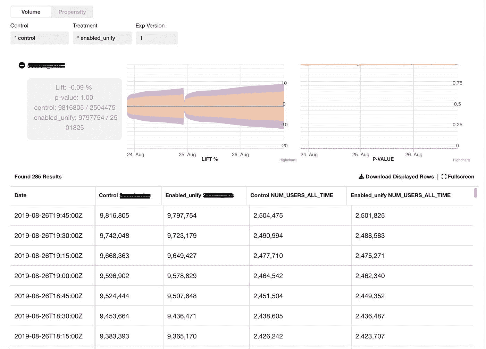

Fig 1 — Real-time experiment metrics with confidence intervals

上面的仪表板显示了针对所选事件的实验的对照组和治疗组的量(即，动作的数量)和倾向(即，唯一用户的数量)。在一项实验开始或扩大后的三天内，计数会被汇总。如果在三天后出现再次上升(对照组和治疗组的用户分配增加),计数将从零开始再累积三天。

然后，我们进行几项统计测试，以确保对照组和治疗组之间的结果和比较在统计上是有效的。由于指标是实时交付的，所以我们在每次连续接收到新记录时都进行这些测试。我们使用不同于传统的固定水平测试的方法，以便不会带来高的假阳性率。已经考虑了几种顺序测试方法，包括[赌徒的毁灭](https://www.evanmiller.org/sequential-ab-testing.html)、[贝叶斯 A/B 测试](https://www.evanmiller.org/bayesian-ab-testing.html)和[阿尔法支出法](https://newonlinecourses.science.psu.edu/stat509/node/81/)。出于数值稳定性的考虑，我们从 t-test + Bonferroni 校正(将我们的情况视为多重测试)开始，测试数量是为我们的初始实现预先确定的。

# 高级设计

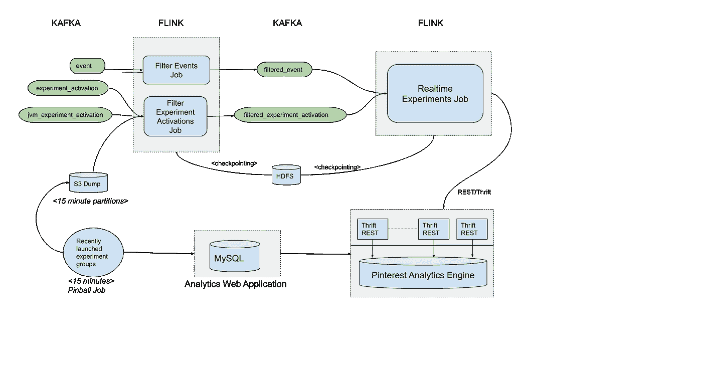

Fig 2 — A high level design of the rea-ltime experiments pipeline

实时实验管道由以下主要组件组成:

*   **最近增加的实验组作业** →每五分钟向 S3 位置发布一个 CSV 文件。CSV 是过去三天中用户分配增加的实验组的快照。该信息是通过查询托管实验元数据的内部分析应用程序的 MySQL 数据库获得的。
*   **过滤事件工作** →我们在 Pinterest 上分析数百个用户行为。该作业仅保留最关键的业务事件，这些事件被插入到“filtered _ events”Kafka 主题中。这些事件将不需要的字段剥离出来，所以 filtered_events 主题是相当轻量级的。作业在 Flink 处理时间内运行，其进度通过 Flink 每五秒钟对 HDFS 进行一次增量检查点操作来保存。
*   **过滤实验激活作业→** 每当用户被触发进入实验，就会创建一个激活记录。触发规则取决于实验逻辑，用户可能被触发参与实验数百次。我们只需要激活在过去三天内启动或增加组分配的实验。

为了过滤激活，该作业使用 Flink 的广播状态模式。由“最近过渡的实验组”作业发布的 CSV 每 10 秒检查一次更改，并发布到 KeyedBroadcastProcessFunction 的每个分区，该分区也消耗激活。

通过将广播的 CSV 与激活流相结合，KeyedBroadcastProcessFunction 会过滤掉那些在过去 3 天内没有增加的实验的激活记录。此外,“group-ramp-up-time”被添加到激活记录中，并被插入到“filtered _ experiment _ activations”Kafka 主题中。

# 实时实验聚合作业

在我们深入实时实验工作之前，有必要看看插入到中间卡夫卡主题中的对象。SimpleEvent 对象被插入到“过滤的事件”主题中，而 ExperimentActivationWithRampedUpTime 对象被插入到“过滤的实验激活”主题中。

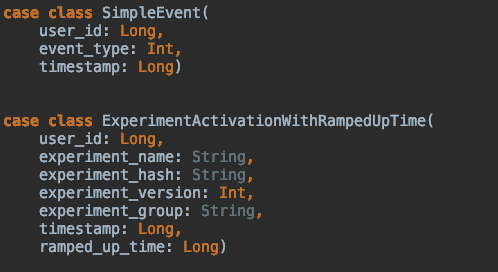

Fig 3 — Scala objects inserted into intermediate Kafka topics

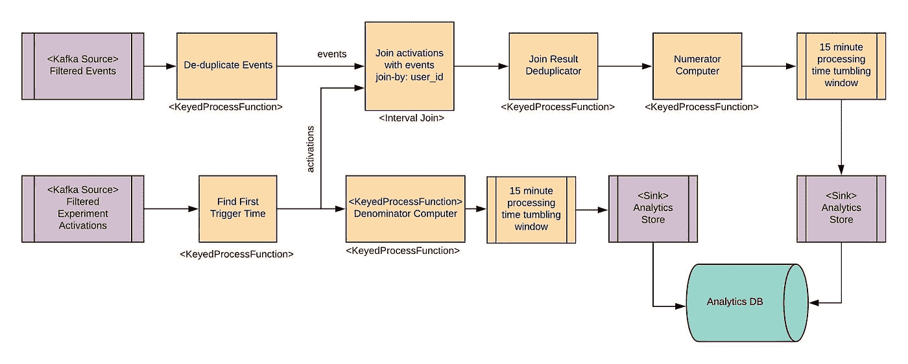

Fig 4 — Diagram of Real-time Experiment Aggregation Job

以上是实时聚合链接作业的高级概述。这里简要介绍了一些操作符，而一些操作符将在后面的章节中详细描述。源操作符从 Kafka 读取数据，而接收器使用 REST 接口写入我们的内部分析存储。

**重复删除事件** →这是作为一个由(event.user_id，event.event_type，event.timestamp)键控的 KeyedProcessFunction 实现的。其思想是，如果来自同一用户的同一事件类型的事件具有相同的时间戳，则它们是重复事件。第一个这样的事件被发送到下游，但也在状态中缓存五分钟。任何后续事件都将被丢弃。五分钟后，计时器运行并清除状态。假设所有重复的事件彼此都在这段时间内。

**找到第一个触发时间** →这是一个 Flink KeyedProcessFunction，关键字为(experiment_hash，experiment_group，user_id)。假设为用户接收的第一个实验激活记录也是具有第一触发时间的激活。接收到的第一个激活被向下游发送，并在实验开始后的三天内保存为状态*(我们对实验组开始后的三天计数进行汇总)。定时器在三天的斜坡时间后清除该状态。*

**15 分钟的处理时间滚动窗口** →当事件进入并向下游发送结果时，分子计算机和分母计算机都会汇总计数。这是数百万条记录，但我们不需要如此频繁地将结果发送到分析商店。我们通过在处理时间运行 15 分钟的 Flink 滚动窗口来更有效地实现这一点。在分子计算机的情况下，该窗口由(“实验 _ 散列”、“实验 _ 组”、“事件 _ 类型”、“时间戳”)键入。当窗口在 15 分钟后触发时，带有 max_users 的记录被获取并发送到分析存储接收器的下游。

# 将激活与事件相结合

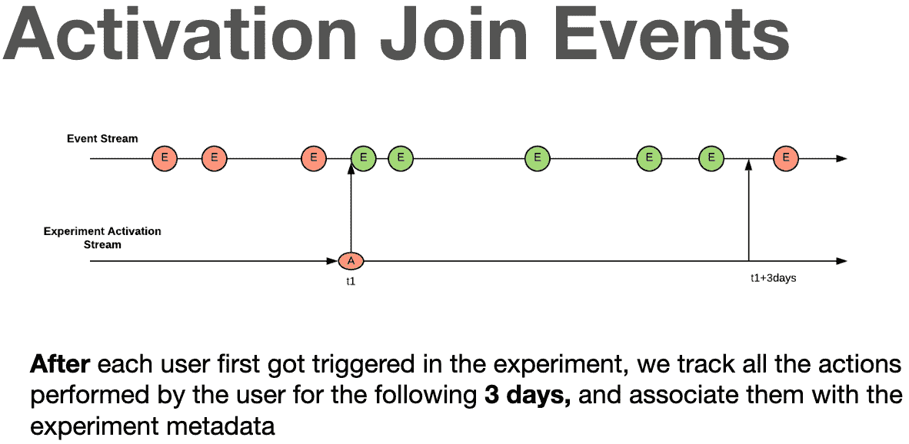

Fig 5 — Join activations stream with events stream by user-id

我们用 Flink 的 IntervalJoin 操作符实现流-流连接。IntervalJoin 缓冲接下来三天每个用户的单个激活记录，所有匹配的事件与来自激活记录的附加实验元数据一起向下游发送。

这种方法的局限性

1.  IntervalJoin 操作符对于我们的需求来说有点不灵活，因为间隔是固定的，不是动态的。因此，用户可能在启动后两天加入实验，但 IntervalJoin 仍将为用户运行三天(在我们停止聚合数据后两天)。
2.  事件和激活变得不同步:如果激活作业失败，激活流延迟，可能会有一些数据丢失，因为没有匹配激活事件仍将流动。这将导致计数不足。

我们研究了 Flink 的 IntervalJoin 源代码。它将三天的激活缓冲为“左缓冲”。但是，事件将被立即删除。目前，似乎没有办法通过配置来改变这种行为。我们正在研究使用 Flink 的协处理函数实现这种激活事件连接，这是一个更通用的流-流连接函数。我们可以将事件缓冲 X 分钟，这样即使激活流延迟了 X 分钟，管道也可以处理延迟而不会计数不足。这将帮助我们避免同一个用户的双重连接，并可以产生一个更动态的管道，该管道立即知道实验组的重新斜坡，并支持更动态的行为，如在组重新斜坡的情况下自动扩展聚合的覆盖范围。

# 连接结果去重器

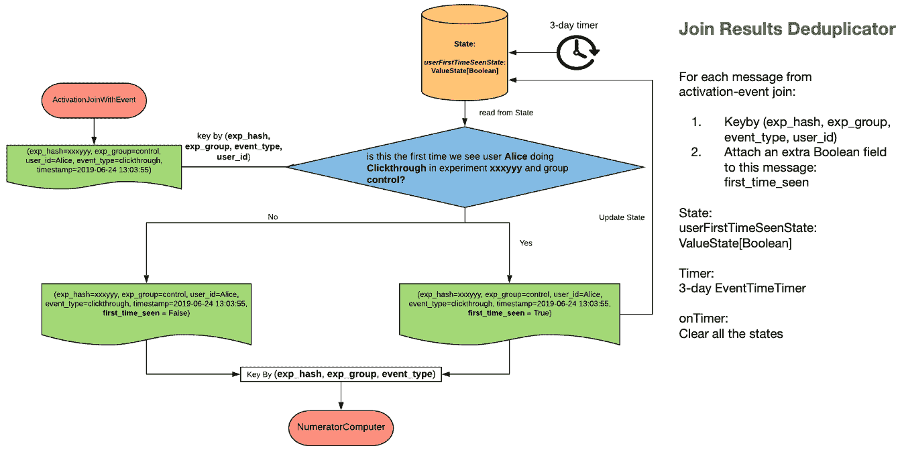

Fig 6 — Join Results Deduplicator

Join Results Deduplicator 是一个 Flink KeyedProcessFunction，由 experiment_hash、experiment_group、event_type、user_id 作为关键字。该运算符的主要目的是在向下游发送记录时插入“user_first_time_seen”标志，下游分子计算机使用该标志来计算倾向数字(唯一用户数)，而不使用设定的数据结构。

该操作符存储状态，直到最后一个斜坡时间+三天，之后状态被清除。

# 分子计算机

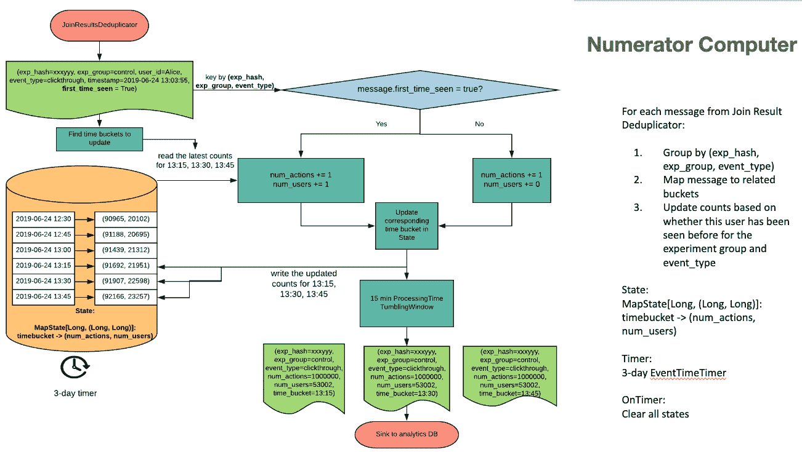

Fig7 — Numerator Computer

分子计算机是一个 KeyedProcessFunction，由 experiment_hash、experiment_group、event_type 作为键。它在过去两个小时内保持滚动的 15 分钟时段，每次有新记录进来时都会更新。

对于音量，每个动作都很重要，因此对于每个事件，动作计数都会增加。

对于倾向数字(唯一用户)—它取决于“第一次看到”标志(仅在为真时递增)。

铲斗滚动/旋转久而久之。每次有新事件发生时，存储桶数据都会向下游刷新到 15 分钟滚动窗口。

一个三天计时器(从斜坡时间→三天),在启动时清除所有状态，有效地重置/清除计数，在斜坡时间三天后归零。

# 垃圾邮件发送者和封顶

为了使我们的流管道容错，Flink 的增量检查点& RocksDB statebackend 用于保存应用程序检查点。我们面临的一个有趣的挑战是检查点故障。问题似乎是检查点过程需要非常长的时间，最终会超时。我们还注意到，通常当检查点发生故障时，也会有很高的背压。

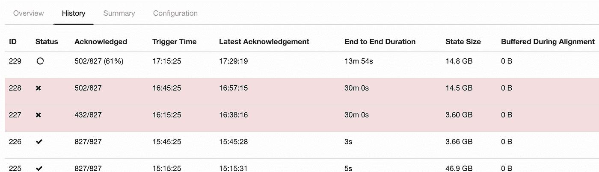

Fig 8 — checkpoint failure shown in Flink UI

在仔细检查检查点故障的内部后，我们发现超时是由一些子任务没有向检查点协调器发送确认而导致的，并且整个检查点进程被阻塞，如下所示。

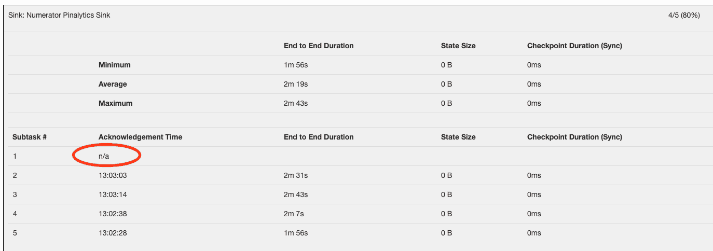

Fig 9- Subtask not sending acknowledgement

然后应用了几个调试步骤来找出失败的根本原因:

1.  检查作业管理器日志
2.  检查在检查点过程中卡住的子任务的任务管理器日志
3.  使用 Jstack 详细查看子任务

结果证明子任务运行正常，只是太忙于处理消息了。因此，这个特定的子任务具有高背压，阻碍了障碍物的流动。如果没有障碍接受者，检查点流程就无法向前推进。

在进一步检查所有子任务的 Flink 指标后，我们发现其中一个子任务产生的消息比它的同类多 100 倍。由于消息是由 user_id 在子任务之间划分的，这表明有些用户产生的消息比其他用户多得多，从而得出垃圾邮件的结论。这个结果也通过特别查询我们的 spam_adjusted 数据集得到了证实。

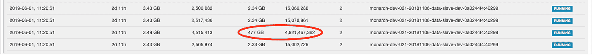

Fig 10 — number of messages for different subtasks

为了缓解这个问题，我们在 **Filter Events Job 中应用了一个封顶规则:**如果一个用户在一个小时内看到超过 X 条消息，我们只发送前 X 条消息。我们很高兴地看到，在我们应用了封顶规则之后，再也没有检查点故障了。

# 数据稳健性和验证

对于计算实验指标来说，数据的准确性是最重要的。为了确保我们的实时实验管道按预期运行，并始终提供准确的指标，我们启动了一个单独的日常工作流，该工作流执行与流作业相同的计算，但采用特别的方式。如果流式作业结果违反以下任何条件，开发人员将收到警告:

1.  在同一个聚合周期内(在我们的例子中是三天)，计数应该是非递减的
2.  如果在第一个聚合期后再次上升，计数应该从零开始再累积三天。
3.  流式结果和验证工作流结果之间的差异不应超过某个阈值(在我们的例子中为 2%)。

通过查询实验元数据，我们分别在三种情况下对实验进行验证:

1.  单斜升实验
2.  在初始聚集期内进行多次加速试验
3.  初始聚集期后的多次加速试验

该工作流程可以如下图所示。

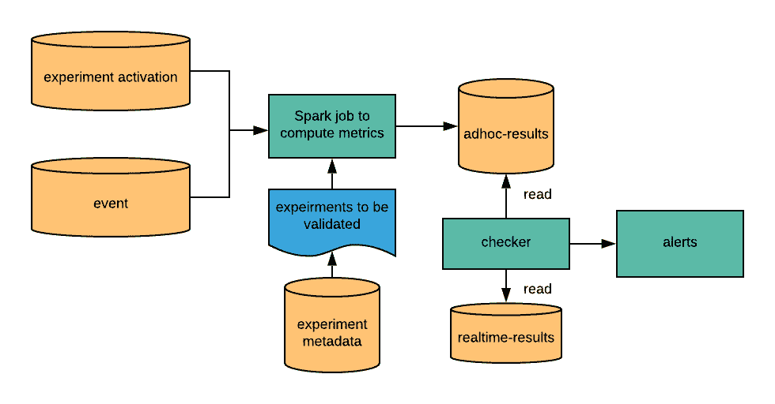

Fig 11 — Validation workflow

# 规模

在本节中，我们将展示一些基本统计数据，以显示实时实验管道的规模:

1.  输入话题量(一天的平均值):

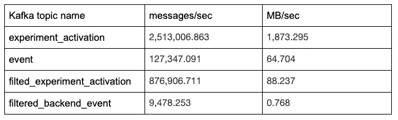

2.100 克检查站

3.200~300 个实验组

4.8 个主人，50 个工人，每个工人 ec2 c5d.9xlarge

5.计算是在并行数= 256 的情况下完成的

# 未来计划

1.  支持更多像 PWT (pinner 等待时间)这样的指标，这样如果一个实验导致 pinner 的延迟异常增加，就可以尽快停止。
2.  可能更新管道以使用 Flink 的协处理函数而不是间隔连接，从而使管道更加动态，并对事件和激活流之间的不同步问题更有弹性。
3.  分段:研究可以支持哪种分段，因为分段会导致状态的增加。
4.  通过电子邮件或 Slack 支持实时提醒。

# 感谢

实时实验分析是 Pinterest 生产的第一个基于 Flink 的应用。非常感谢我们的大数据平台团队(特别感谢史蒂文·拜罗斯-诺瓦克、朱成金和张昂)构建了 Flink 平台并将其作为服务提供。还要感谢分析平台团队(孙波)提供的惊人的可视化，日志平台团队提供的实时数据摄取，以及数据科学团队(Brian Karfunkel)提供的统计咨询！

> 我们正在建造世界上第一个视觉发现引擎。全世界有超过 2.5 亿人使用 Pinterest 来梦想、计划和准备他们在生活中想做的事情。[来加入我们吧！](https://careers.pinterest.com/careers)