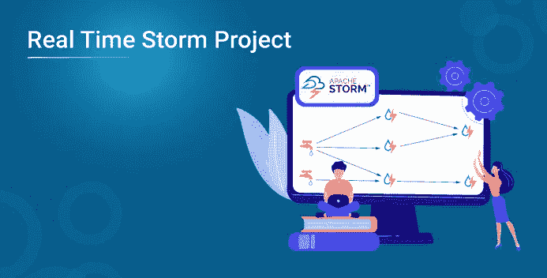
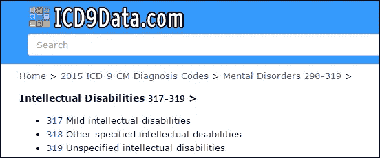
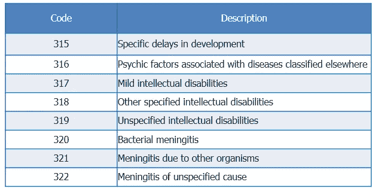
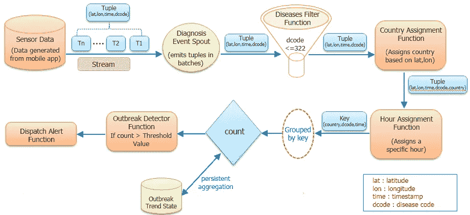
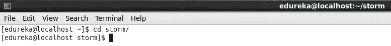
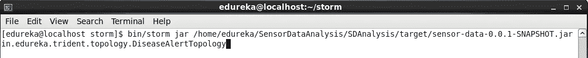
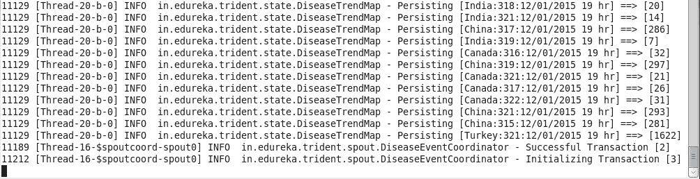
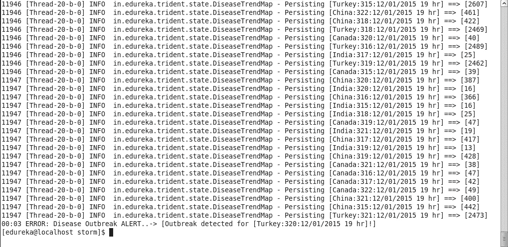

# 实时风暴项目

> 原文：<https://medium.com/edureka/real-time-storm-project-b7ab02e968d6?source=collection_archive---------8----------------------->

在本文中，我们将执行一个实时风暴项目。

ICD9Data.com 提供的疾病代码范围为 000-999。这些代码被唯一地分配给不同的疾病。它也可以作为移动应用程序使用。

让我们考虑一下，医生使用的任何移动应用程序都在生成传感器数据。该传感器数据包含设备 id、设备网络、用户、纬度、经度、时间、疾病代码等信息。对于我们的场景，我们将只考虑纬度、经度、时间和疾病代码。

使用风暴和三叉戟拓扑对这些数据进行处理，以检测特定时间疾病代码任何地理位置小于或等于 322 的疾病爆发。如果特定疾病的计数增加了阈值，在本例中为 2000，则系统将发送带有国家名称、疾病代码和时间的警报消息。为了简化此场景，我们将每个诊断事件映射到最近的国家。

在这种情况下，我们将使用 315 到 322 之间的疾病代码。疾病及其代码见下表。

下面是这个项目的流程，非常不言自明。

第 1 步:传感器数据从移动应用程序通过 spout 进行流式传输。

步骤 2: Spout 只发送纬度，经度，时间和疾病代码作为元组。

第三步:过滤掉小于等于 322 的疾病编码后转发。

第 4 步:根据纬度和经度，指定一个国家。

第五步:为每个元组分配一个小时。

第 6 步:**分组按**键完成，其中键为**国家、地区、时间。**每个元组处理完毕后计算计数。

第 7 步:爆发趋势状态确保任何处理一次的都不会被处理第二次。

第 8 步:我们将阈值保留为 2000，如果计数超过阈值，我们将它视为爆发，并发送包含爆发详细信息的警报消息。

下载风暴项目。

首先，启动风暴集群，然后使用下面的命令运行风暴项目。

命令: **cd 风暴/**

命令:**bin/storm jar/home/edu reka/SensorDataAnalysis/sda analysis/target/sensor-data-0 . 0 . 1-snapshot . jar in . edu reka . trident . topology . disease alert topology**

土耳其境内超过 2000 人的阈值为疾病代码 320，并发送了疾病爆发警报。

这个项目只是给你一个风暴三叉戟拓扑概念的实际视图。在这里，我们随机获取了所有输入。您可以根据您的数据将您的业务逻辑放入代码中并对其进行测试。

如果您想查看更多关于市场上最流行的技术的文章，比如人工智能、DevOps、伦理黑客，您可以参考 [Edureka 的官方网站。](https://www.edureka.co/blog/?utm_source=medium&utm_medium=content-link&utm_campaign=storm-real-time-project)

[Apache Storm 实时分析简介](https://www.edureka.co/blog/introduction-to-real-time-analytics-with-apache-storm/)

*原载于 2020 年 6 月 26 日*[*【https://www.edureka.co】*](https://www.edureka.co/blog/storm-real-time-project/)*。*