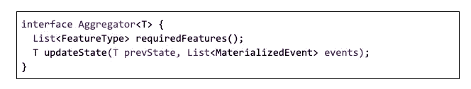

# 服务于特征工程的实时用户信号

> 原文：<https://medium.com/pinterest-engineering/real-time-user-signal-serving-for-feature-engineering-ead9a01e5b?source=collection_archive---------1----------------------->

Del Bao，Vikas Kumar:软件工程师，Ads ML Infra

每月有超过 3.2 亿的独立访问者来到 Pinterest，发现鼓舞人心的内容，这也给了广告商一个独特的机会，让他们的产品出现在具有商业意图的人们面前。

这种个性化目录的管理需要准确和实时地反映用户的短期兴趣。映射长期兴趣对于显示相关内容同样重要，因为短期兴趣可能会有干扰。

用户功能的一些典型使用场景:

*   基于最近和过去参与的 Pin 嵌入(我们将每个 Pin 映射到一个 N 维向量空间，称为 [PinSage 嵌入](/pinterest-engineering/pinsage-a-new-graph-convolutional-neural-network-for-web-scale-recommender-systems-88795a107f48))和各种会话窗口，使用用户嵌入信号检索广告。
*   提高广告与来自搜索查询的用户兴趣的相关性。通过使用 [FastText](https://github.com/facebookresearch/fastText) 算法在短/长时间段内从搜索查询中收集用户的几个重要兴趣类别，并将其应用于在其他表面(例如，home feed)上的排名，来产生信号。

为了帮助机器学习工程师捕捉用户倾向，我们开发了一种实时用户信号服务，作为消费用户参与数据以及计算和服务用户特征的平台。有了这个新平台，开发人员只需花费最少的精力，就可以利用 ML 算法构建、测试和试验新的用户信号，并为我们的服务系统提供个性化的现场和应用内用户信号。

自发布以来，该平台在整个公司广受欢迎，并为创作者参与、广告检索、检索中的购物和搜索排名提供了多个用例。该系统以最低的基础设施成本，在 Pinterest 规模上可靠地实时产生和提供用户信号。

在这里，我们将分享更多关于我们如何设计系统来实现这些目标。

# 在我们建造的幕后

# 用户信号平台的支柱

用户信号平台的五大支柱是:

1.  **时效性。事件反馈回路的实时性对于展示新鲜内容至关重要。以黑色星期五为例——想象一个品酒人买了一条牛仔裤，然后收到打折广告购买同一条牛仔裤的错误经历。**
2.  **灵活的用户环境。**用户环境描述了可用于表征用户情况的任何相关信息。Pinterest 内容是根据用户背景量身定制的。定制过程可以由两种类型的信息提供信息:显示意图的短期洞察力，以及包括人口统计、行为和长期偏好的长期洞察力。这就要求具有开发者 API 的平台具有丰富的会话语义。
3.  **伸缩性。** Pinterest 每秒从用户那里获得 120 万个事件。大规模的个性化是一个挑战，所以我们的系统需要把每一个 Pinneras 当作一个个体，而不是观众的一部分。这意味着计算资源是在用户级别上分配的，而不是在目标用户组上。
4.  **开发者速度。** Pinterest 是一家数据驱动的公司，我们依靠实验和 A/B 测试来做出关键决策。机器学习实践者依靠正确的抽象在平台上实现和验证他们的算法。
5.  **建造简单。**为了产生最终信号，系统有许多数据获取路径。这通常涉及异步代码和复杂的未来/承诺处理。我们希望选择正确的框架来构建核心基础逻辑，以使代码简单易读。

为了提高服务性能和加快开发速度，需要考虑几个设计因素。

# 通用物化器

物化器负责将外部数据与用户事件连接起来。我们致力于设计一个通用的物化容器来减轻开发人员的编码工作。另一个目标是降低数据获取成本，以便我们可以实现最小的事件处理延迟。这是在 Pinterest 规模上实现事件处理及时性的必要条件。

我们应用[关注点分离原则](https://en.wikipedia.org/wiki/Separation_of_concerns):将请求规范和获取执行分成两层。功能请求表示为数据源、请求关键字和功能关键字。数据管道由执行引擎驱动。添加一个新特性可以归结为通过实体化 API 简单地指定请求规范，这只需要几行代码。

**Materializer container separation of concerns**

## 有状态聚合

聚合是从用户事件会话中计算统计数据。每个信号具有 50k QPS，系统不能完全重新计算用户的所有事件，特别是在长期用户环境中，例如 90 天。因此，聚合器采用[增量计算模型](https://en.wikipedia.org/wiki/Incremental_computing)，在远程状态存储中具有中间状态。

与在请求时间重新计算每个事件相比，该模型有两个好处:

*   **事件存储**对存储的事件有资源限制(通常是七天)。通过增量计算，用户的历史事件被保存在聚合状态中。该平台能够提供能够捕捉长期用户倾向的信号。
*   **延迟**大幅改善，因为之前的计算被保留在状态中。

下图说明了计算范例。

**State 1 contains the aggregation results of the past X events. The next request comes, aggregator fetches the state 1 and Y later arrived events, and compute a state 2**

## 视图/聚合分离

视图是面向客户端的层，负责状态的轻量级转换。我们将视图和聚合器分开，以满足两个需求:**灵活的用户环境**和**可伸缩性**。

关注点分离原则再次敲我们的门:状态代表计算的重担。View 将状态转换成一个紧凑的特性，具有适合于客户端、ML 和服务系统的定制会话定义。此外，通过在多个视图之间共享状态，我们可以进一步节省重复的计算并扩展系统。

## Dagger 和 API 抽象

核心基础设施的开发也需要简单:我们构建的框架的核心逻辑严重依赖于数据依赖:物化的外部数据源、事件序列和远程聚合器状态等。这类框架的规范编程模型是基于[dependency _ inversion _ principle](https://en.wikipedia.org/wiki/Dependency_inversion_principle)的设计原则。[依赖注入](https://en.wikipedia.org/wiki/Dependency_injection)是将依赖(服务或数据)传递给使用它的对象的概念。我们采用 [Dagger2](https://github.com/google/dagger) ，一个轻量级异步 DI 框架，由 Google 和 Square 开源以满足这一需求。

另一方面，Dagger2 的学习曲线相对较高，因此作为一个开发人员平台，我们让我们的开发人员 API 与 Dagger 无关。具体来说，

## 聚合器和视图 API

**Aggregator API (updateState) defines a generic stateful computation**

**View API defines state dependencies and state derivation**

# 融合在一起:建筑

## 事件到用户信号的旅程

在这里，我们展示了用户事件如何不断地流经信号生产管道，并通过管道传输到 Pinterest ML & serving 系统。

这始于用户与 Pinterest 网站的互动，如点击一个大头针或创建搜索查询，然后返回到后端，并在用户许可的情况下被跟踪。原始约定事件是轻量级的，使得跟踪对于基础设施是可行的。下一步是用丰富的内容信息丰富它们(例如，大头针有各种类别来表示其感兴趣的主题)。利用丰富的事件，管道可以进一步将事件的时间序列压缩成用户的即时、短期和/或长期倾向的紧凑表示。这种转变是通过各种聚合和尖端的 ML 算法实现的。

这是一张显示所有组件如何组合在一起的图表。我们采用双组件架构:异步(离线)事件驱动处理和在线处理。

**Signal production and serving data flow**

## 异步事件驱动处理

信号处理之旅的第一步是读取原始事件，并将其与基于内容的外部特征相融合。这包括三个部分:

*   **Kafka** :从 Kafka 消费的日志消息包含精简的信息，例如 userid、pinid 和动作类型。
*   **:物化:**是一个从外部数据源获取用户事件并用内容特性(pin 特性、查询特性等)丰富它的过程。
*   **物化事件存储:**物化用户事件被写入时序数据存储。它充当离线处理和在线查询之间的中介。

# 服务时间处理

聚合在请求时在线发生

*   **聚合:**聚合可以选择性地从事件存储中获取预先计算的状态和用户事件的增量集，以计算用户特征。在这个阶段，我们设计了一组 API，并创建了一个层来将 ML 算法空间与计算引擎分离。

# 结果

## 接近实时

p99 of end-to-end latency is about 10 seconds between user engagement on Pinterest and when that event was ready for serving, with a total volume of 1.2 million per second.

## 面向可扩展性的服务器性能

With the stateful aggregation, we were able to reduce p99 of server latency to under 35ms compared to no state of 100ms.

## 开发速度快且易于构建

由于采用了 Dagger2 框架，我们在一个月内就引入了核心基础设施。三名工程师花了大约两周时间开发了五个信号，以加速我们一些最重要的广告检索和排名计划。

# 下一步是什么

接下来，我们将开发一个新的数据处理架构，将聚合转移到事件时间，并将整个 Pinterest 的用户信号统一到这个实时基础设施。

***鸣谢:*** *非常感谢谢泗阳为设计提供咨询，、、赵、徐、Nishant Roy 和整个 Ads ML Infra 团队，以及 George Yiu、Se Won Jang、赖清贤、Connell、、Han、Jessica Chan、Saurabh Joshi 和王思涵，他们帮助改善和扩展了基础设施。*

*我们还要特别感谢内容个性化团队的 Arun Prasad、和，以及 Ads 检索团队的 John Zheng、Pihui Wei、Ge、Peifeng Yin、和 Xiaofang Chen，感谢他们与我们合作开发了首批用户信号并加载到平台上。*

> *我们正在建造世界上第一个视觉发现引擎。全球超过 3.2 亿人使用 Pinterest 来梦想、计划和准备他们在生活中想做的事情。* [*来加入我们吧！*](https://careers.pinterest.com/careers)