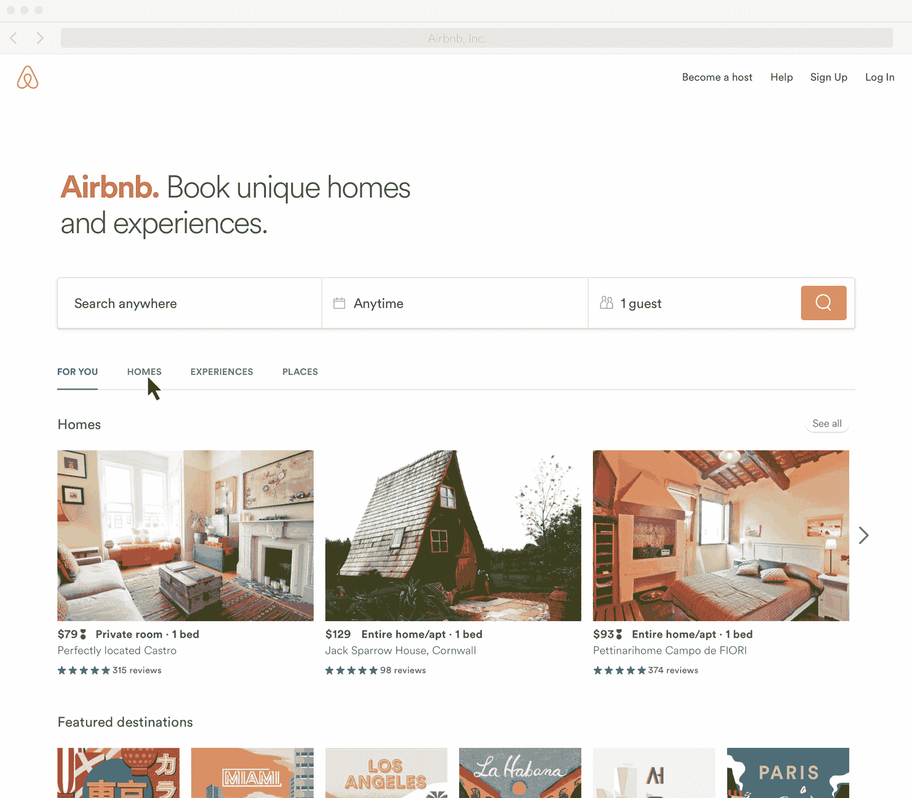
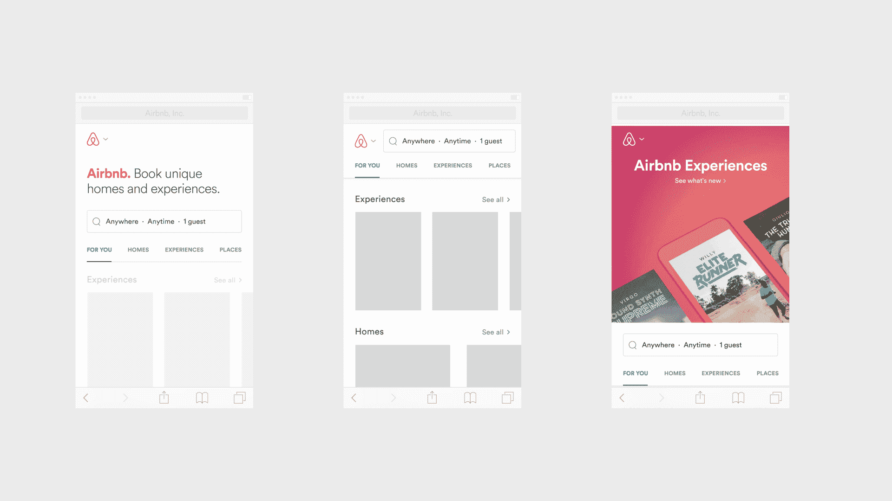
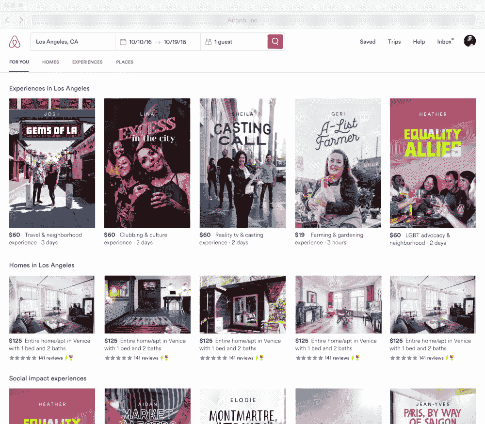
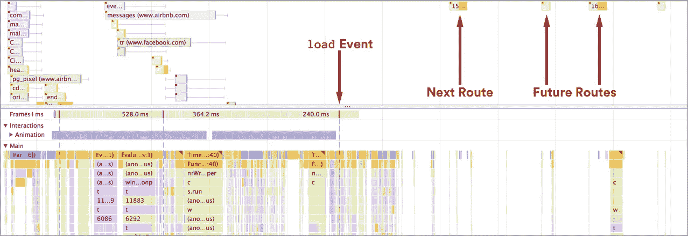
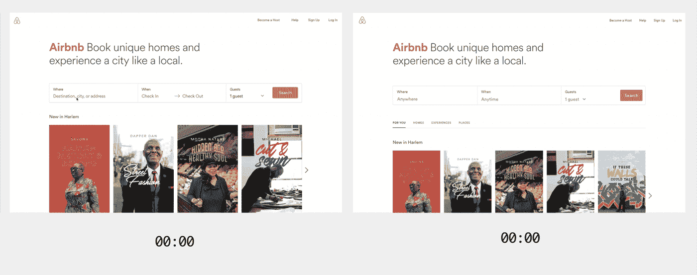
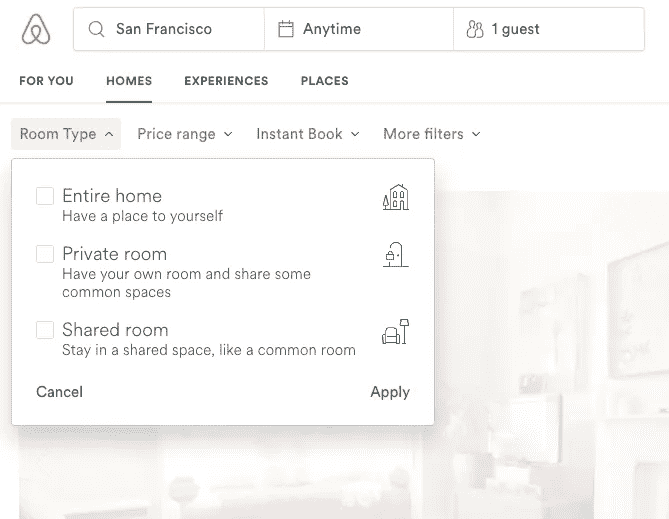

# 重新构建 Airbnb 的前端

> 原文：<https://medium.com/airbnb-engineering/rearchitecting-airbnbs-frontend-5e213efc24d2?source=collection_archive---------0----------------------->

概述:我们最近重新考虑了我们在 Airbnb 的代码库的 JavaScript 方面的架构。本文将研究(1)促成这些变化的产品驱动因素，(2)我们为摆脱传统 Rails 解决方案而采取的步骤，以及(3)新堆栈的一些关键支柱。*奖金:我们来谈谈下一步吧！*

Airbnb 每天的搜索量超过 7500 万次，这使得搜索页面成为我们流量最高的页面。近十年来，工程师们对 Rails 提供页面的方式进行了改进、增强和优化。

最近，我们进入了 Homes 以外的垂直市场，推出了 Experiences and Places 。作为将这些新产品引入网络的一部分，我们花时间重新思考了搜索体验本身。

Transitioning between routes for a broad search

与其从我们在 www.airbnb.com T4 的登陆页面导航到搜索结果页面，再到单个列表，再到预订流程，我们希望用户体验是灵活的，随着用户探索和缩小搜索范围，可以调整他们的体验。

Designs exploring search from three states: New User, Returning User, and Marketing Marquee

在标签间导航并与列表互动应该感觉奢华而轻松。事实上，今天没有什么能阻止我们在中小型屏幕上提供与本地应用程序相当的体验。

Future concept for navigating between tabs, considering async-loaded of content

为了获得这种类型的经验，我们需要打破传统的逐页方法，最终我们对前端代码进行了基本的重组。

[Leland Richardson](https://medium.com/u/41a8b1601c59?source=post_page-----5e213efc24d2--------------------------------) [最近在 React Conf 上谈到了在现有的高流量本机应用程序](https://www.youtube.com/watch?v=tWitQoPgs8w)的“棕地”中的 React Native。本文将研究我们是如何在类似的约束条件下，但在 web 上进行戏剧性的升级的。如果你发现自己处在一个相似的地方，希望你会发现它很有用！

# 挣脱铁轨

在为我们路线图上的所有有趣的[渐进式 Web 应用](https://developers.google.com/web/progressive-web-apps/)工作而大放异彩之前，我们需要与 Rails 分离(或者至少是我们在 Airbnb 使用 Rails 提供独立页面的方式)。

不幸的是，就在几个月前，我们的搜索页面包含了一些非常旧的代码…比如,*指环王*，危险时刻触摸。有趣的事实:我曾经用一个简单的 React 组件替换了一个由 Rails presenter 支持的小的[手柄](http://handlebarsjs.com/)模板，突然页面上完全独立的部分出现了问题——甚至在我们的 API 响应中也是如此！结果是，演示者改变了 backing Rails 模型，该模型多年来一直影响着所有下游数据，甚至在 UI 没有呈现的时候也是如此。

简而言之，我们在这个项目中就像印第安纳·琼斯把神像换成了一袋沙子，神庙立即开始坍塌，我们从一块巨石上逃跑。

## 步骤 1:对齐 API 数据

当 Rails 对页面进行服务器呈现时，您可以随心所欲地向服务器呈现的 React 组件发送数据。控制器、助手和演示者可以生成任何形状的数据，甚至当您迁移页面的各个部分以做出反应时，每个组件都可以使用它所需要的任何数据。

但是，一旦您努力在客户端呈现路由，您就需要能够以预先确定的形式动态地请求所需的数据。将来，我们可能会用类似于 [GraphQL](http://graphql.org/) 的东西来解决这个问题，但是让我们暂时把它放在一边，因为当这个重构发生的时候，它不是一个选项。相反，我们选择与 API 的“v2”保持一致，并且我们需要所有的组件来开始使用这种规范的数据形式。

如果您发现自己在类似的水域中有一个大型应用程序，您可能会像我们一样发现，规划现有服务器端数据管道的迁移是容易的部分。只需遍历 Rails 呈现 React 组件的任何地方，并确保数据输入是 API 形状。您可以进一步验证是否符合在客户端上用作 React 属性类型的 API V2 形状。

对我们来说，棘手的是与所有与客人预订流程互动的团队合作:我们的商务旅行、增长和度假租赁团队；我们针对中国和印度市场的团队、灾难恢复……这样的例子不胜枚举，我们需要对所有这些人进行再教育，即使在技术上可以将数据直接传递给正在渲染的组件(“是的，我知道这只是一个实验，但是……”)*所有数据*都需要通过 API。

## 第二步:非 API 数据:配置，实验，短语，L10n，I18n…

从我们认为的 API 数据中有一个单独的数据类别，它包括应用程序配置、用户特定的实验任务、国际化、本地化和类似的问题。多年来，Airbnb 已经建立了一些令人难以置信的工具来支持所有这些功能，但将它们交付给前端的机制有点欠成熟(或者在建立时可能已经完全成熟，在地面开始移动之前！).

我们使用 [Hypernova](https://www.npmjs.com/package/hypernova) 对 React 进行服务器渲染，但是在我们深入进行这种重构之前，React 组件中的实验交付是否会在服务器渲染期间爆炸，或者客户端上可用的字符串翻译是否会在服务器上可靠地可用，这还有点模糊。关键的是，如果服务器和客户端输出不匹配，页面不仅会刷新差异，还会在加载后重新呈现整个页面，这对性能非常不利。

更糟糕的是，我们在很久以前就编写了一些神奇的 Rails 函数，例如`add_bootstrap_data(key, value)`，表面上可以在 Rails 中的任何地方调用这些函数，以便通过`BootstrapData.get(key)`在客户端上全局提供数据(不过，同样，对于 Hypernova 来说不一定如此)。对于一个小团队来说，开始是一个有用的工具，但对于一个大的应用程序和团队来说，却成了不可追踪的魔法的来源。“数据清洗”犯罪变得越来越棘手，因为每个团队都拥有不同的页面或功能，因此每个团队都开发了不同的机制来加载配置，每个机制都适合他们独特的需求。

很明显，这已经被打破了，所以我们集中在引导非 API 数据的规范机制上，我们开始将所有应用/页面迁移到 Rails 和 React/Hypernova 之间的这个移交。

A canonical higher order component for bootstrapping non-API data

这个高阶元件有两个非常重要的作用:

1.  它以普通的旧 JavaScript 对象的形式接收引导数据的规范形式，并为服务器渲染和客户端渲染同样正确地初始化所有支持工具。
2.  它吞掉了除了`bootstrapData`之外的所有东西，这是另一个简单的对象，我们希望`<App>`加载到 Redux 中，供孩子们在需要时使用(代替`BootstrapData.get`)。

在一个简单的例子中，我们取消了`add_bootstrap_data`，并防止工程师将任意键传递给顶级 React 组件。shire 恢复了秩序，不久我们就可以在客户端动态导航到路线，并在没有 Rails 支持的情况下呈现复杂的内容(双关语)。

# 给前端充电

手头的服务器改造，我们现在把目光转向客户端。

## 懒惰加载的单页应用程序

朋友们，在初始化时使用可怕的加载微调器的怪物单页应用程序(SPA)的日子已经一去不复返了。当我们提出用 React Router 进行客户端路由的想法时，这种可怕的加载旋转器是许多人提出的异议。

Lazy loading of route bundles in the Chrome Timeline

但是如果你看上面，你会看到[代码分割](https://webpack.github.io/docs/code-splitting.html)和[延迟加载](https://webpack.js.org/guides/lazy-load-react/)包的影响。本质上，我们通过服务器呈现页面，并提供使其在浏览器中交互所需的最低限度的 JavaScript，然后当浏览器空闲时，我们开始主动下载其余的内容。

在铁路方面，我们有一个控制器用于通过 SPA 交付的所有路线。每个动作只负责(1)发出客户端在客户端导航上发出的任何 API 请求，然后(2)将数据和配置一起引导到 Hypernova。我们从每个动作数千行 Ruby 代码(在控制器、助手和演示者之间)减少到大约 20–30 行。耶切。

但是明显不同的不仅仅是代码…

Side-by-side comparison fetching Homes for Tokyo: Legacy page load vs client-side routing (4–5x difference)

…现在路线之间的转换非常流畅，步长变化也快了(大约 5 倍)，我们可以开始制作本文开头的动画了。

## 异步组件

在 React 之前，我们会一次呈现整个页面，这种做法一直延续到 React 早期。但是我们使用一个类似于 [this](/@thejameskyle/react-loadable-2674c59de178) 的 AsyncComponent 作为挂载后加载组件层次结构的一种方式。

这对于最初不可见的重元素特别有用，比如模态和面板。我们的明确目标是精确地提供最初呈现页面可见部分所需的 JavaScript，并使其具有交互性，而不是多一行。这也意味着，举例来说，如果团队想在一个不使用 D3 的页面上的模态中使用 D3，他们可以独立于页面的其余部分来衡量下载该库作为其模态代码的一部分的“成本”。

最重要的是，它非常简单，可以在任何需要的地方使用:

在这里，我们可以简单地将地图的同步版本替换为异步版本，这在小断点上特别有用，在小断点上，地图通过用户与按钮的交互来显示。由于这些用户大多使用手机，让他们在担心谷歌地图之前进行互动会大大加快页面加载时间。

另外，请注意`scheduleAsyncLoad()`实用程序，它在用户交互之前请求包。由于地图使用如此频繁，我们不需要等待用户交互来请求它。相反，我们可以在您到达住宅搜索路线时将其排队。如果用户在下载之前请求它，他们会看到一个合理的`<Loader />`，直到组件可用。没问题。

这种方法的最后一个好处是`HomesSearch_Map`成为浏览器可以缓存的命名包。当我们分解更大的基于路线的包时，应用程序缓慢变化的部分在更新中保持不变，进一步节省了 JavaScript 下载时间。

## 将易访问性融入我们的设计语言

毫无疑问，这需要一个专门的职位，但我们已经开始构建我们的内部组件库，将可访问性作为一个硬约束。在接下来的几个月里，我们将替换所有与屏幕阅读器兼容的访客流 UI。

An example of building accessibility into our product through our design language system

UI 足够丰富，以至于我们希望使用`aria-describedby`将复选框不仅与标题关联，还与副标题关联。要实现这一点，需要在 DOM 中有一个惟一的标识符，这意味着强制一个必需的 ID 作为任何调用父节点都需要提供的属性。这些是 UI 可以施加的硬约束类型，以确保如果在产品中使用了某个组件，那么该组件是以内置的可访问性交付的。

上面的代码还演示了我们的响应工具 HideAt 和 ShowAt，它们允许我们显著地改变用户在不同屏幕尺寸下的体验，而不必使用 CSS 隐藏和显示。这导致页面更加精简。

## 对国家进行外科手术和哲学思考

如果不涉及如何处理应用程序状态的争论，任何一篇前端文章都是不完整的。

我们对所有 API 数据和“全局”使用 Redux，比如认证状态和实验配置。我个人喜欢异步的 [redux-pack](https://github.com/lelandrichardson/redux-pack) 。您的里程可能会有所不同。

然而，考虑到页面的复杂性——尤其是在搜索方面——使用 Redux 进行表单元素之类的低级用户交互是行不通的。我们发现，无论我们如何优化，Redux 循环都会让输入感觉响应不足。

Our Room Type Filter (code featured above)

因此，我们对用户所做的一切都使用组件本地状态，直到它触发路由更改或网络交互，我们没有遇到任何问题。

同时，我喜欢 Redux 容器组件的感觉，我们发现即使有本地状态，我们也可以构建可以共享的高阶组件。我们的过滤器就是一个很好的例子。搜索底特律的[住宅，你会在页面上发现几个不同的面板，每个都独立运行，可以修改你的搜索。跨越各种断点，实际上有几十个组件需要知道当前应用的搜索过滤器以及如何更新它们，无论是在用户交互期间暂时还是一旦被用户正式接受。](https://www.airbnb.com/s/Detroit--MI--United-States/homes)

这里我们有一个巧妙的技巧。需要与过滤器交互的每个组件都可以用这个 HOC 封装，这样就完成了。它甚至带有道具类型。每个组件从 Redux 连接到 *responseFilters* (与当前显示的结果相关联的那些)，但是保持本地 stagedFilters 对象可用于修改。

通过这种方式处理状态，与价格滑块的交互对页面的其余部分没有影响，因此性能非常好。但是所有的过滤器面板都是用相同的函数签名实现的，所以开发很简单。

# 下一步是什么？

现在，让前端跟上现在的大部分工作已经完成，我们可以把注意力转向未来。

*   [AMP](https://www.ampproject.org/) 核心预订流程中所有页面的版本将导致从移动网络上的谷歌搜索到交互的亚秒(在某些情况下)*时间*，而实现这一点所需的许多变化将推动移动网络和桌面网络上 P50/P90/P95 冷加载时间的显著改善。
*   [PWA](https://developers.google.com/web/progressive-web-apps/) 功能将为回头客带来亚秒(在某些情况下)*的交互时间*，并将打开离线优先功能的大门，这对连接不稳定的用户非常重要。
*   对遗留技术/框架的最后一击将会把捆绑包的大小减半。不是华而不实的工作，而是最后把 jQuery、Alt、Bootstrap、下划线，以及所有外部 CSS 请求都扒出来(它们阻挡渲染，97%的规则都没用！)不仅会简化我们发布的代码，还会简化新员工在成长过程中需要学习的内容。
*   最后，约曼的工作是手动跟踪渲染瓶颈，异步加载初始渲染时不可见的代码，避免不必要的重新渲染，并降低重新渲染的成本。这些改进是笨拙的应用程序和运转良好的机器之间的区别。

下次我们追踪这些机会时请继续收听。由于如此多的胜利将产生直接的数量影响，我们将在后续的帖子中尝试捕捉一些具体的胜利。

*当然，如果你喜欢阅读这篇文章，并认为这是一个有趣的挑战，我们一直在寻找有才华、有好奇心的人加入***团队。或者，如果你只是想谈谈工作，随时在 twitter 上联系我*[*@ adamrneary*](https://twitter.com/AdamRNeary)*

*最后，巨大的道具给[萨利赫·阿卜杜勒·卡里姆](https://twitter.com/therealsalih)和[雨果·阿尔贝里](https://twitter.com/hugoahlberg)，他们是那些让我目不转睛的面部融化动画背后的经验设计师。许多工程师因在这项工作中发挥的作用而值得称赞，这份名单长得难以形容，但肯定包括尼克·索伦蒂诺、[乔·伦乔尼](https://medium.com/u/e52389684329?source=post_page-----5e213efc24d2--------------------------------)、[迈克尔·兰道](https://medium.com/u/5fe7db9fe60f?source=post_page-----5e213efc24d2--------------------------------)、张海晨、沃克·亨德森和尼科·莫斯乔普洛斯。*