# 合理怀疑:通过量化随机不确定性进入 MNIST 排行榜前 35 名

> 原文：<https://medium.com/capital-one-tech/reasonable-doubt-get-onto-the-top-35-mnist-leaderboard-by-quantifying-aleatoric-uncertainty-a8503f134497?source=collection_archive---------3----------------------->

## 作者:巴扬·布鲁斯、杰森·威滕巴赫和詹姆斯·蒙哥马利，第一资本

随着机器学习的应用在各行各业和社会中变得无处不在，围绕基础模型中的不确定性和错误的审查只会继续上升到最前沿。例如，许多机器学习研究人员认为，如果模型能够对自己的确定性进行推理，计算机视觉系统中最近发生的高调错误(例如自动驾驶汽车碰撞)本来可以得到缓解。

贝叶斯建模是一个被广泛接受和使用的量化不确定性的框架。神经网络模型作为一种灵活的黑盒建模框架也越来越受欢迎，它可以捕捉输入和输出之间的复杂关系。不幸的是，贝叶斯模型必须仔细地公式化，以便在计算上易于处理，这在历史上限制了神经网络的贝叶斯扩展的采用。然而，在上述例子的激励下，研究人员已经开始探索神经网络的贝叶斯处理在多大程度上可以保持计算易处理。

在 Capital One 的机器学习中心，我们一直在研究这些方法在金融服务中的应用。我们发现，使用贝叶斯模型不仅增强了我们量化风险的能力，还提高了模型的性能。为了证明这一点，我们使用[修改的国家标准与技术研究所(MNIST)数据集](http://yann.lecun.com/exdb/mnist/)制作了一个演示。MNIST 是一个标准的机器学习基准数据集，用于训练模型根据相应的数字对手写数字图像进行分类。我们表明，使用贝叶斯重新参数化，一个简单的两层卷积神经网络可以与该数据集上前 35 名公布结果中的模型一样准确。

## **定义不确定性**

当谈到预测建模时，实际上有多种不确定性来源会导致模型预测的整体不确定性。在这篇博文中，我们将重点关注数据本身固有的不确定性，或者在不确定性量化文献中被称为*随机不确定性*。

对于训练集中的数据，当具有非常相似的特征向量(x)的数据点具有值显著不同的目标(y)时，会出现任意的不确定性。无论你的模型在拟合平均趋势方面有多好，都无法回避这样一个事实:当存在随机不确定性时，它无法完美地拟合每个数据点。由于收集更多的数据永远不会帮助模型减少这种类型的不确定性，它也被称为*不可约不确定性*。更进一步，我们可以问这种不确定性的大小是否会因特征空间中的不同点而改变，例如观察到的 y 值的分布是否会随着我们观察不同的 x 值而改变。在它保持不变的简单情况下，我们称之为*同方差不确定性*。另一方面，如果它确实改变了，那么我们说它是*异方差*。图 1a 显示了产生具有异方差随机不确定性的数据(图 1b)的数据生成分布的示例。

例如，如果我们试图对手写数字的图像进行分类，我们可能会遇到两幅看起来非常相似的图像，但第一幅图像被标记为“1”，而第二幅图像被标记为“7”或者，在一个回归问题中，我们试图从一小组温度计记录、气压和降雨量测量值来预测温度，由于其他因素和测量噪声，这些测量值中的每一个可能仍然对应于一个温度范围。添加更多的观测数据不会减少这种不确定性，但是，正如我们将在下面看到的，建模可以带来更强大的预测。

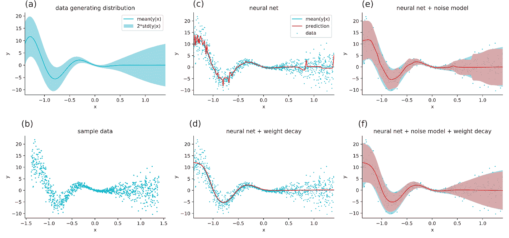

**Figure 1: (a)** A data generating distribution that will produce data with heteroscedastic uncertainty. Data is generated by first sampling an x-value from a uniform distribution and then drawing a y-value from p(y|x) which is a Gaussian where both the mean (solid line) and variance (shaded region represents two standard deviations) vary as a function of x. **(b)** Data generated from the process in (a). **©** Fitting a neural network to this data shows good overall prediction but moderate overfitting, especially in regions of high uncertainty. **(d)** Adding weight decay and tuning its strength prevents overfitting, but requires a search over decay strengths. **(e)** Fitting a neural network with an estimate of aleatoric uncertainty provides confidence estimates on predictions and prevents a large amount of the overfitting seen with the traditional neural network (red shaded region represents model prediction of two standard deviations). **(f)** Adding weight decay to the model and tuning its strength is still helpful to smooth out the uncertainty prediction.

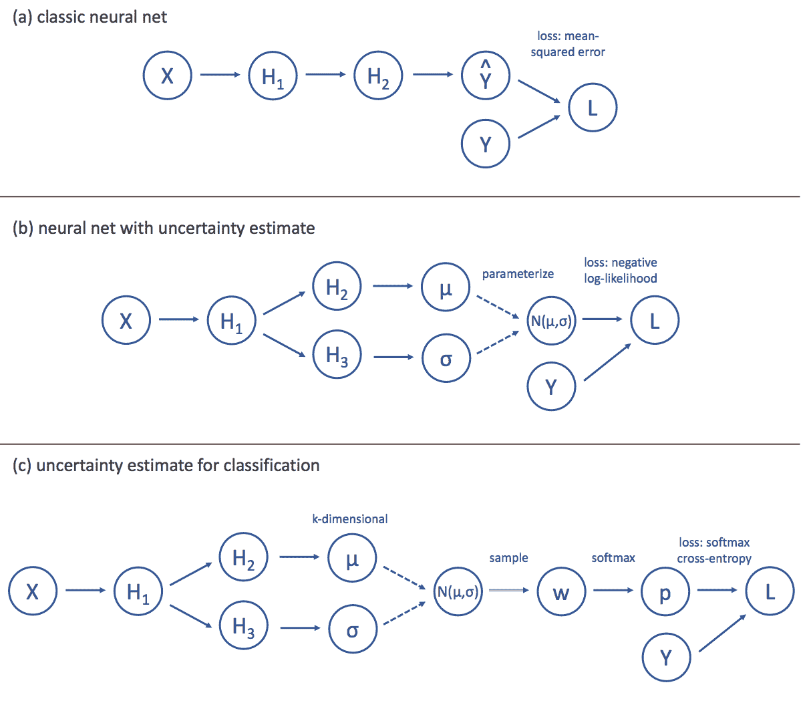

**Figure 2** : **(a)** A high-level depiction of the computational graph for a standard neural network. The input (X) is transformed through multiple hidden layers (Hk), and the final layer produces an estimate (Y) of the target (Y). The loss (L), is then computed as the mean-squared error between Y and Y. **(b)** To model aleatoric uncertainty, we split the neural network into two streams, the first of which produces an estimate of a mean () while the second produces an estimate of a standard deviation (). Assuming that these parameterize a Gaussian distribution (N(,)), we can then define the loss as the negative log likelihood of the target under this distribution. **©** For a classification problem with k classes, the standard approach is to have the network output k weights (w) that represent the evidence for each class. These weights are then passed through a softmax function to produce probabilities for each class (p) and the loss is the cross-entropy between the probability vector and the one-hot target. We can model aleatoric uncertainty in this setting by having our network produce the parameters for a k-dimensional Guassian distribution over the evidence weights (instead of the outputs). We then minimize the average cross-entropy loss over samples from this distribution.

## **对深度神经网络中的不确定性建模**

对随机不确定性建模归结为让模型预测输出的分布，而不是点估计。一种方法是让模型预测作为输入函数的分布参数。从这个角度来看，传统的神经网络(图 2a)实际上已经捕捉到了一种任意的不确定性。考虑大多数神经网络最小化的标准均方损失:

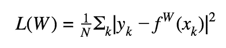

其中 W 为网络权重，fW()为网络定义的函数，(xk，yk)为第 k 个训练样本，N 为训练样本数。加法与独立于权重的因子相乘不会改变由损失定义的优化目标，因此该损失等于

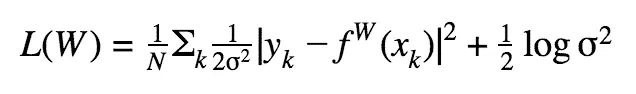

其中是任意常数。这很重要，因为这相当于具有平均 fW(xk)和标准偏差的高斯分布下数据的对数似然，即

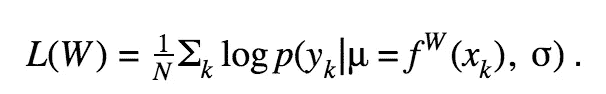

从这个角度来看，标准神经网络已经可以被解释为一个概率模型，其中每个输入都被映射到可能输出的分布。然而，固定标准差意味着它只处理相对不感兴趣的同方差情况，在这种情况下，随机不确定性保持不变；在许多实际应用中，假设不确定性不会随着输入而变化是不合理的。

为了处理异方差情况，我们可以修改神经网络的架构(图 2b ),以便在前馈链的某个点将各层分成两个“流”,产生两个输出:fW(xk)和 gW(xk)。然后，我们可以将一个解释为均值(xk)，另一个解释为标准差(xk)，这是我们一直在寻找的任意不确定性的量化。最后，我们像以前一样将损失函数定义为对数似然:

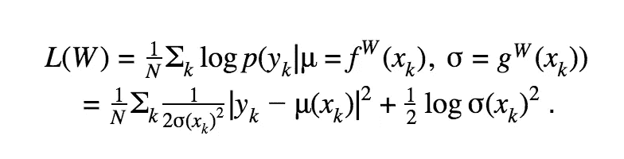

在上述等式的第一项中，我们看到具有高预测不确定性值的输入实际上具有较少的损失预测计数的准确性。这具有允许模型减弱不太可能的结果对模型训练的影响的良好特性。另一方面，第二个术语可以被解释为对过度使用这种策略以最小化损失的惩罚。这样，这种建模随机不确定性的直接概率方法自动调整我们的模型，防止过度拟合。这种正则化通常会导致性能的提高，这与您通常只能通过大量(且昂贵！)超参数调谐(图 1c-f)。

一般来说，这种技术也可以扩展到其他发行版。我们简单地将神经网络输出分成与分布中我们想要用来模拟随机不确定性的参数一样多的分量，然后使用最大似然作为目标函数。这种方法还可以扩展到分类，只需要多做一点工作(图 2c)。

在传统方法中，最终未缩放的激活(每个类一个)通过 softmax 函数进行缩放，因此它们的总和为 1。然后，损失被计算为正确类别的概率(也称为 softmax 交叉熵损失)。不幸的是，以这种方式训练的网络的 softmax 输出并不是我们想要的任意不确定性意义上的真实概率。此外，预测目标现在是对应于类的标签，并且没有简单的方法来参数化这种对象上的分布。一个解决方法是在未缩放的激活上模拟 k 维高斯分布(其中 k 是类的数量)。损失函数可以定义为标准的 softmax 交叉熵。

## **MNIST 例子**

最后，我们到了 MNIST 的例子。互联网上有大量使用 MNIST 数据集训练卷积神经网络的教程。它已经成为这样一个参考点，甚至 Tensorflow 都附带了 [MNIST 数据](https://www.tensorflow.org/tutorials/)。大多数初学者在使用 MNIST 时学习的模型是两层卷积神经网络，具有最大池和最大漏失。我们不会详细讨论过滤器和内核大小的细节(这在网上有广泛的报道)。可以说，标准模型将第二个最大池层的输出传递到一个密集层(沿途应用 dropout)。在传递到 softmax 分类交叉熵损失函数之前，有一个最终的密集层将网络压缩到类别数(10 位)。然后，我们用大约 7 行额外的代码调整网络来模拟任意的不确定性，如下所示。

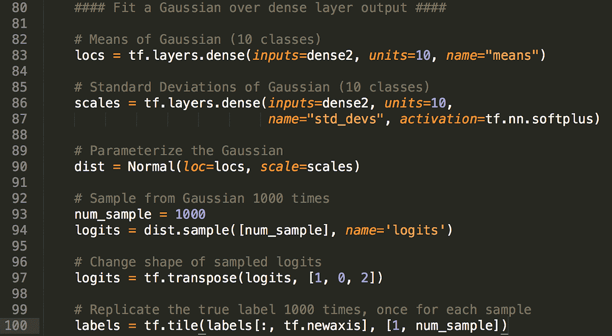

**Figure 3:** Sample code for modifying traditional MNIST convolutional neural network to predict aleatoric uncertainty.

这采用第二密集层的输出，并使用它来预测两件事:10 个正态分布(每个数字一个)的 loc(均值)和标度(标准差)。然后我们从这些分布中取样 1000 次；对于每个样本，计算 softmax 分类交叉熵(与之前相同，除了现在对于每个输入“x”，我们平铺真实标签 1000 次)。该模型的完整架构如图 4 所示。在过去，你必须明确地告诉 Tensorflow 在向后传递中跳过正态分布，但是最近将 [Edward](http://edwardlib.org/tutorials/bayesian-neural-network) 并入 Tensorflow 后，这已经成为了一个原生功能。

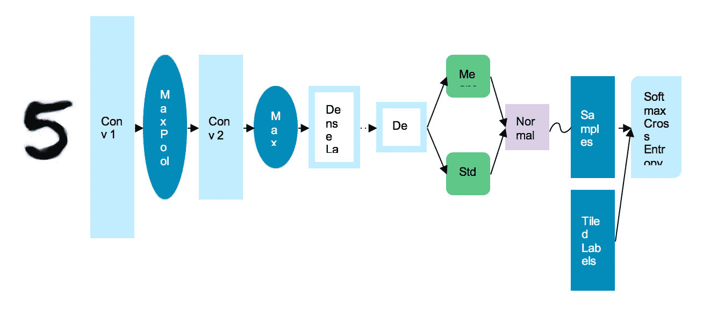

**Figure 4:** Network architecture of Bayesian reparameterized MNIST CNN

简单地使用这个模型并且没有超参数调整，我们能够实现 99.33%的准确度。我们重新参数化的原始 MNIST 模型实现了大约 97%的性能。这个结果使我们在根据这个数据训练的模型中排名前 35。前 35 名中的许多其他模型要么需要非常深入的神经网络来实现它们的结果，要么需要大量的手工调整和制作来获得它们的性能。这是一个有趣的副产品，它允许模型学习预测标签，而且更有趣的是看到所有可能标签的不确定性对模型的性能有如此深远的影响。

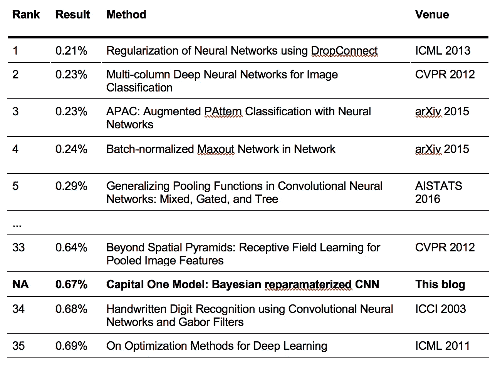

基准结果编译[此处](http://rodrigob.github.io/are_we_there_yet/build/classification_datasets_results.html)。

也许更有趣的是，一旦你学会了这个后验分布，你能做什么。正如您在示例中所看到的，训练完神经网络后，您可以传入新的观察值，并恢复每个类的预测平均值和标准偏差。这些是被 softmax 压缩之前的值。在第一种情况下(数字 8)，最右边的尖峰指示模型相当确信它是 8。然而，对于下一张图中的三个，您可以看到 3 处的分布均值和 8 处的分布均值之间的差距并不大。此外，当模型试图区分这两个类别时，这两个类别的标准差表示任意的不确定性。

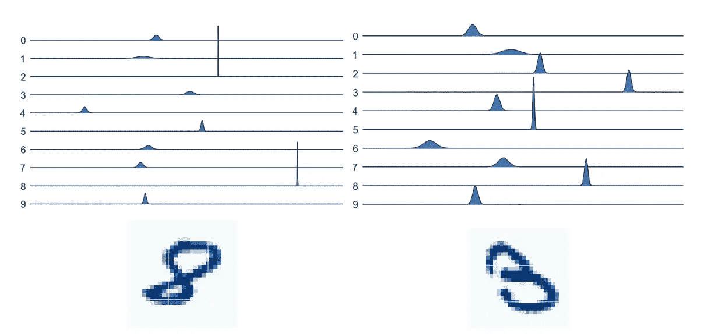

**Figure 5**: Distributions over softmax inputs for two example digits (eight and three). Each row contains the predicted gaussian distribution over that digit. Values further to the right indicate stronger evidence for that digit. Units are not included as only relative distances matter prior to the softmax transformation.

在下面的两个例子中，我们可以通过放大前三个最有可能的类别的模型预测分布来更清楚地看到这种类型的行为。在 9 的情况下，该模型预测 8，但是 8 的分布与 9 的分布重叠。该模型的预测具有高度的不确定性。这对于 6 来说更加极端。

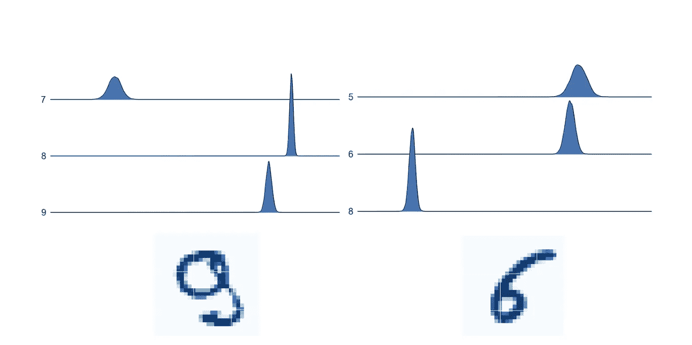

**Figure 6**: Distributions over softmax inputs for two example digits (nine and six). Only the relevant subset of softmax inputs are shown here to highlight overlap.

## **结论**

如你所见，这种方法允许我们将神经网络模型的能力和灵活性与概率方法的不确定性量化相结合。在业务环境中，尤其是在风险缓解和算法不确定性变得至关重要的情况下，这种结合不仅会影响基于模型做出业务决策的能力，还会提高底层模型的性能。在 Capital One，我们正在积极探索这些方法的应用，以解决具有挑战性的行业问题，我们期待分享更多的更新和见解！

## **专题阅读更多**

*   [辍学作为贝叶斯近似:见解和应用](https://8109f4a4-a-62cb3a1a-s-sites.googlegroups.com/site/deeplearning2015/33.pdf?attachauth=ANoY7cpYxfsbcEyaRYu0FcmR2JB6ijEFou24OEC7ifeSd6Wic46lzHFr2BjwhYJRy_s0XWbuCQxj-QCuo4COsVDhM3zG5ykkWUc0ZNMUKauKRWOz1lwbhizDs3Dl4WXZPcFZjAfRJc6ZeWTQqfruVijhw1atsz8E5yi5r4yB3NLddnySLdzwsepse2mgoEYzfk0F_7bAAstX494eC92qZLuSceNXHjgZjg%3D%3D&attredirects=0)
*   [作为贝叶斯近似的漏失:表示深度学习中的模型不确定性](http://proceedings.mlr.press/v48/gal16.pdf)
*   [具有伯努利近似变分推理的贝叶斯卷积神经网络](https://arxiv.org/pdf/1506.02158.pdf)
*   [关于现代深度学习和变分推理](http://www.approximateinference.org/accepted/GalGhahramani2015.pdf)
*   [针对计算机视觉的贝叶斯深度学习，我们需要哪些不确定性？](https://papers.nips.cc/paper/7141-what-uncertainties-do-we-need-in-bayesian-deep-learning-for-computer-vision.pdf)
*   [混凝土脱落](https://papers.nips.cc/paper/6949-concrete-dropout.pdf)
*   [Vprop:使用 RMSprop 的变分推断](http://bayesiandeeplearning.org/2017/papers/50.pdf)
*   [贝叶斯神经网络中损失校准的近似推理](https://arxiv.org/pdf/1805.03901.pdf)
*   [具有α发散度的贝叶斯神经网络中的丢失推断](http://proceedings.mlr.press/v70/li17a/li17a.pdf)
*   [递归神经网络中基于理论的辍学应用](https://arxiv.org/pdf/1512.05287.pdf)
*   [理解敌对实例检测的不确定性测量](https://arxiv.org/pdf/1803.08533.pdf)

*以上观点为作者个人观点。除非本帖中另有说明，否则 Capital One 不隶属于所提及的任何公司，也不被其认可。使用或展示的所有商标和其他知识产权都是其各自所有者的所有权。本文为 2018 首都一。*