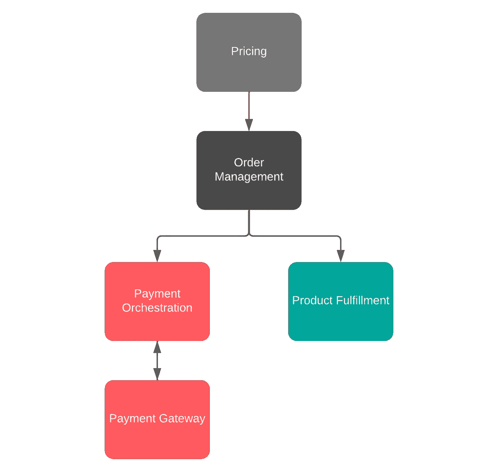

# 在 Airbnb 重建支付流程

> 原文：<https://medium.com/airbnb-engineering/rebuilding-payment-orchestration-at-airbnb-341d194a781b?source=collection_archive---------0----------------------->

## 我们如何在将 Airbnb 的支付协调系统从传统的单一应用程序迁移到面向服务的架构时保持可靠的资金流动

**由:** [布瑞恩罗斯](https://www.linkedin.com/in/bryon-ross/)，[封飞杨](https://www.linkedin.com/in/feifeng-yang-339b8b33/)，[索菲贝尔](https://www.linkedin.com/in/sophie-behr-6874b734/)，[特蕾莎约翰逊](https://www.linkedin.com/in/johnsont/)，[林信](https://www.linkedin.com/in/xin-lin-39527b58/)，[金运裘](https://www.linkedin.com/in/yunjincho/)

# 介绍

Airbnb 的支付协调系统负责确保主人、客人和 Airbnb 之间可靠的资金流动。简而言之，应使用客人选择的支付方式，在正确的时间向客人收取正确的费用；主持人应该在正确的时间以他们期望的支付方式获得正确的金额。由于历史原因，Airbnb 的账单数据、支付 API、支付流程和用户体验都与住宿预订的概念紧密相关。不幸的是，这意味着必须为其他产品(例如 Airbnb Experiences)重新构建住宿的支付相关功能，并且每个实现可能都有其特定于产品的特点。可以想象，这种方法既不可伸缩，也不容易维护。

几年来，Airbnb 一直在从我们的单片 Ruby on Rails 应用程序向面向服务的架构(SOA)迁移。在 Airbnb[tech](/airbnb-engineering/building-services-at-airbnb-part-1-c4c1d8fa811b)[blog](/airbnb-engineering/building-services-at-airbnb-part-2-142be1c5d506)[帖子](/airbnb-engineering/building-services-at-airbnb-part-3-ac6d4972fc2d)中已经广泛讨论了这种迁移。我们将忽略这些迁移中常见的一些技术讨论，而将重点放在迁移我们的支付系统所特有的一些方面。虽然 Airbnb 的许多团队选择在迁移到 SOA 时创建一对一的替代，但支付组织却决定将其作为一个机会，从根本上重新设计我们的服务，为未来的发展提供坚实的技术基础。这一决定的结果是，与更直接的一对一替换相比，迁移过程需要更长的时间才能完成。

# 为什么要重新设计？

Airbnb CEO Brian Chesky tells a story about the origin of payments at Airbnb

正如 Brian 在上面的视频中分享的那样，对平台上支付的支持在 Airbnb 的主人和客人之间建立信任方面发挥了关键作用。自从我们的第一个支付系统在十多年前创建以来，Airbnb 已经取得了显著的增长，随着这种增长，Airbnb 的支付范围和规模也在增长和变化。许多最初的支付模式与住宿预订紧密相关。在 Airbnb 的早期，这是有意义的，因为只有一种产品，当时负责支付的工程师在开发解决客人和主人需求的解决方案方面做得非常出色。虽然这些用于支付的原始模型已被证明非常通用和强大，但住宿和支付之间的这种紧密耦合导致了增加新产品(如体验)或功能(如解决中心)的复杂性。

在规划 SOA 迁移时，Airbnb 的支付团队做出了一个大胆的决定，从根本上重新设计支付系统。我们的目标是创建一个支付平台，让 Airbnb 的团队能够快速、轻松、安全地将新功能和产品与支付相结合。在一篇博客文章中列出所有的增强是不可行的，所以这篇文章将关注一些影响新支付编排系统的设计亮点:幂等性、平台化和数据不变性。

## 幂等编排

正如在[早期的博客文章](/airbnb-engineering/avoiding-double-payments-in-a-distributed-payments-system-2981f6b070bb)中所讨论的，等幂是维护分布式服务一致性的一种常用技术。新的支付编排系统是围绕 Orpheus(在那篇文章中描述的幂等框架)设计的。每一个主要的工作流都被划分成一个可重试的幂等步骤的有向无环图(DAG ),每个步骤都有定义良好的行为。这允许支付编排层维护与其他关键服务(如支付网关层和产品履行服务)的最终一致性。这种方法实现了五个 9(99.999%)的支付一致性。

幂等框架适用于服务之间的同步和异步通信。对于异步通信，支付服务主要使用基于 Kafka 的消息总线来相互发送“事件”。事件处理器使用幂等框架将 Kafka 的至少一次保证增强为恰好一次保证。在[这篇文章](/airbnb-engineering/measuring-transactional-integrity-in-airbnbs-distributed-payment-ecosystem-a670d6926d22)中描述的事务完整性分析工具通过确保事件和事务数据源之间的一致性提供了额外的信心。

## 与产品无关的平台

The payments SOA migration decoupled product fulfillment, payment orchestration, and pricing

我们的传统支付数据模型的一个显著缺点是，它们与单一产品(住宿预订)紧密相关。出于这个原因，我们新的支付协调服务被有意设计为避免支付系统与任何特定产品紧密耦合。相反，新的编排层是围绕通用的特定于支付的工作流(如验证、支付处理、财务报告)设计的，除了几个定义明确的集成点之外，特定于支付的逻辑和特定于产品的逻辑相互隔离。当与本博客文章中[描述的通用计费和定价 API 结合时，这种方法允许新产品快速、轻松地与现有通用支付流程集成，从而大幅减少工程工作量和交付时间。此外，随着新功能添加到支付系统中，这些功能可以很容易地被其他产品采用。](/airbnb-engineering/scaling-airbnbs-payment-platform-43ebfc99b324)

## 数据不变性

不可变数据更容易理解、审计和协调。所有新的支付服务都是围绕数据不变性的理念构建的。对于支付编排，数据不变性表现为两种主要形式:持久事件和版本控制。事件自然是只附加的。事件使用者负责确定新事件是否代表对现有事件的修改。当现有产品被改变时(例如，增加另一个住宿夜晚)，对支付协调计划的修改被建模为该产品的计划序列中的新版本。来自所有版本的组合信息提供了与该产品相关的预期和实际资金流动的完整历史。

# 分阶段迁移

Airbnb 的各个团队采取了不同的方法向面向服务的架构(SOA)迁移。许多团队选择在小块中迁移功能，用等效的 SOA 实现替换遗留实现。通常，使用这种方法，现有的系统将被分解成离散的、内聚的功能块。每个块可以独立于其他块进行迁移。每个块的行为将被很好地定义，并且结果可以在两个系统之间进行比较以确保一致的结果。

Airbnb 支付组织对各种支付系统的迁移采取了不同的方法。支付系统的迁移不是小的功能块，而是分为四个主要阶段:定价、支付、预订和数据迁移。定价阶段将每个特定产品的定价模型改造成一个通用模型，可用于所有 Airbnb 产品。支付和预订阶段从根本上重新设计了 Airbnb 的资金流动方式，以更轻松地支持新产品、功能和业务需求。与支付协调相关的大部分工作都包含在这些阶段中。数据迁移阶段将现有的预订从遗留系统迁移到 SOA，允许遗留系统停止运行和废弃。

在每个阶段中，迁移被分成更小的迁移，通常是按照特性或产品。例如，在预订阶段，住宿预订独立于体验预订进行迁移。当合理时，这些子阶段也被进一步分解。根据预订的特点，住宿预订的迁移细分为 30 多个里程碑。每个里程碑相对较小的范围允许工程师和数据科学家彻底测试和验证每组迁移。此外，每个里程碑相对独立的性质允许许多里程碑并行完成。

# 维护两种制度

新的支付协调系统引入了一个基于账单概念的全新设计的数据模型。与传统模型不同，新的数据模型不依赖于任何特定的产品，而是专注于足够强大、可扩展和通用，以便对现有和未来的 Airbnb 产品有用。从根本上重新设计支付数据模型的一个重要结果是，从一种数据模型转换到另一种数据模型变得非常重要。

一般来说，在初始迁移过程中，历史预订和支出不会从一个系统转移到另一个系统。相反，如果新的预订和支出被认为符合条件，它们将被路由到 SOA。否则，它们将继续被路由到遗留系统。在迁移过程的大部分时间里，现有预订将继续在原有的整体系统中进行。只有在迁移的末尾，活动预订才从遗留系统转移到 SOA。因此，工程团队需要在几乎整个迁移过程中维护两个并行的支付协调系统。

大多数支付数据的消费者实际上并不关心数据是存储在遗留系统还是 SOA 系统中；他们只是想要数据。为了给这些客户端服务提供简单而一致的体验，我们构建了一个新的转换层，以透明地从正确的底层源中检索数据，并将它们无缝地转换为可由所有客户端使用的统一数据模型。事实证明，翻译层非常有价值，因为它将从事迁移的团队的工作与客户团队的工作分离开来。

真空中什么都不会发生。在迁移过程中，出现了业务需求，必须向支付协调系统添加功能。对于每个特性，团队必须决定是只在一个系统中实施变更，还是在两个系统中都实施。在许多情况下，为了在两个系统之间保持一致的用户体验，这导致了两倍的工作量。在其他情况下，特性只是被推迟或重新设计以避免重复工作。

最后，必须特别注意确保两个系统都按照我们的客人和主人期望的方式运行。理想情况下，除了性能上的一些改进，客人和主人甚至不会注意到差异。我们创建了额外的工具和工作流程，以确保 Airbnb 的支持大使继续为我们的客人和主人提供一致的体验，无论使用哪种系统来协调支付。

从这次经历中学到的一个重要经验是，与所有利益相关者沟通以确保每个人在时间表、约束和优先事项上保持一致是多么重要。长时间维护两个并行系统会产生大量开销，并降低新特性的迭代速度。确保更广泛的组织在时间线上保持一致是至关重要的，这样产品团队就不会因为与部分迁移的系统相关的意外工作而不必要地变慢。将迁移分成几个阶段有助于减少团队受影响的时间。

# 对工艺的承诺

也许迁移过程中最重要的部分是确保新系统的构建考虑到 Airbnb 对工艺的承诺，并在推广前经过彻底验证。一个专门的质量保证工程师团队对数百个场景进行了全面的手动测试，以帮助确保在各种用例中与遗留系统保持一致。此外，在整个支付工程组织中创建了一套广泛的单元测试、浅层集成测试和端到端集成测试，以确保关键支付流程的正确行为。作为额外的保护措施，只要有可能，异步“匹配”作业就会比较新数据模型和旧数据模型，以验证两种代码路径产生的结果是否一致。

# 结论

支付系统很复杂。花时间仔细地重新设计系统可以提高可维护性、可扩展性、性能和弹性。然而，长期迁移过程也有值得注意的缺点。这个过程可能会导致服务客户端之间的不确定性，并消耗原本可以用于创建新功能或优化现有流程的资源。通过将迁移划分为更小的、定义明确的里程碑，并确保与利益相关者的定期沟通，可以减轻一些担忧。全面的测试和验证计划对于确保新服务能够无缝替代遗留系统至关重要。通过采用这种方法，我们能够推出新的支付协调系统，该系统速度更快、更易于维护，并且能够更轻松地支持新产品、功能和业务需求。

观看 [Make Money Moves tech talk](https://www.facebook.com/AirbnbTech/videos/airbnb-tech-talk-make-money-moves/349403395953262/) 的录音，了解支付服务向 SOA 迁移的更深入的讨论。

如果你对这类工作感兴趣，可以看看我们的相关职位:

[高级软件工程师，支付](https://careers.airbnb.com/positions/3393082/?gh_src=5a0351831us)(三藩市或西雅图)

[软件工程师，支付](https://careers.airbnb.com/positions/3393185/?gh_src=3eaf43fe1us)(旧金山或西雅图)

[工程支付合规经理](https://careers.airbnb.com/positions/2768475/)(印度班加罗尔)

[支付合规高级软件工程师](https://careers.airbnb.com/positions/2925359/)(印度班加罗尔)

[软件工程师，支付合规](https://careers.airbnb.com/positions/2773515/)(印度班加罗尔)

[软件工程师](https://careers.airbnb.com/positions/3197040/) —城市(印度班加罗尔)

# 感谢

这是一个漫长的旅程，如果没有 Airbnb 几个组织(包括支付、托管、客人体验、QA 和财务)的许多人的贡献，这是不可能的。在此，我要感谢为该项目提供帮助的众多人士，包括 Musaab At-Taras、Bao、Ryan Bi、Abhijit Borude、Ben Bowler、蔡一正、、郑昊然、Cynthia Adams、Pat Connors、David Cordoba、Chong Chung、、戴、、Rex Du、Ali Goksel、厄默·法鲁克·居尔、韩佳佳、郝静、Toland Hon、Jeremy Kane、Hide Kato、陈蕃·孔、维多利亚·Ku、Pasha Lahutski、Serena Li、Tina Li 毛怡霞、Elena Moskvichev、Eric Ning、Ika Ogeil、Christina Ou、Payut Pantawongdecha、Peng、Yaritza Perez、Qi、Zachary Sabin、Rajen Shah、Patrick Shay、、Derek Shimozawa、Erika、孙华艳、、Claire Thompson、Neo Tong、Alex Virrueta、、Bryan Wehner、Michel Weksler、Claudio Wilson、、吴、、、、赵昕、Serdar Yildirim、袁航、张、赵云飞、Jaclyn Zhong 和

所有产品名称、徽标和品牌都是其各自所有者的财产。本网站中使用的所有公司、产品和服务名称仅用于识别目的。使用这些名称、标志和品牌并不意味着认可。