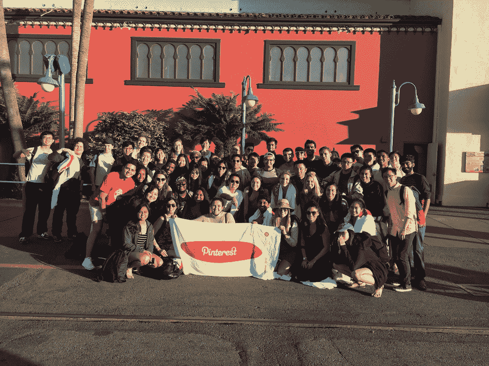

# 回顾:2017 年 Pinterest 工程实习生项目

> 原文：<https://medium.com/pinterest-engineering/recap-2017-pinterest-engineering-intern-projects-8487c8c7a04a?source=collection_archive---------2----------------------->

每年夏天，Pinterest 都会欢迎一批新的软件工程实习生来到我们的旧金山总部。每个实习生(或我们所说的 Pintern)都在从事一个直接影响我们产品的重要技术项目。Pinterns 每周在周五的问答会上在全公司面前演示他们的项目，由我们的联合创始人和 Pinterest 的其他领导主持。在本帖中，你将了解今年的一些班级，以及他们在实习期间的成果。

## **Caroline Lo |**17 年斯坦福大学博士

2015、2016、2017 年潘特恩夏季

我叫卡罗琳，是斯坦福大学计算机科学专业的博士生。我的研究侧重于理解人类行为和在线内容，这使得今年夏天在 Pinterest 的数据科学团队实习非常合适！我这个项目的目的是分析和更好地理解 Pinners 如何在手机上使用 Pinterest 的应用内浏览器。这一点很重要，因为每当点击一个 Pin 时，用户就会被带到应用内浏览器中的网站。这是一个开放式的项目，我们不确定我们会发现什么或学到什么。在浏览了数据集之后，我不仅能够探究一般的用户浏览模式，还能够探究浏览模式如何影响 Pinterest 上的其他行为。在这个过程中，我的项目走了一些有趣的弯路，但我最终专注于分析和建模网站质量对应用内浏览和用户参与的短期和长期影响。没有既定的解决方案或策略来量化这种影响，但是我尝试了各种度量标准和模型来寻找最佳策略。比如，并不一定清楚什么是“质量”网站，这给了我一个很好的借口去调查网站质量的多个指标，自己想出几个。

我真的很喜欢我的实习项目的灵活性和开放性，这使我能够发挥创造力。非常感谢 Pinterest、数据科学团队和 Brian Karfunkel 让我们度过了一个超级有趣的夏天！

## **迪帕·哈尔德|** 加州大学柏克莱分校，17 级学士

pintern 2016 和 2017 夏季系列

我作为 Pintern 的第一次经历是 2016 年夏天在购物团队工作。Pinterest 的文化和产品本身一样具有创造性和启发性，这让我大吃一惊。作为一个对艺术和计算机科学充满热情的人，我觉得我找到了一个真正重视这两者的地方。因此，回到一个新的团队“搜索产品和视觉发现”实习是一个简单的决定。我用更多的责任和一系列新的技术问题来挑战自己。尽管我是构建产品功能的新手，我还是欣然接受了为安卓系统重新设计[镜头](https://blog.pinterest.com/en/more-tools-and-new-look-lens)的机会，这是我今年夏天的第一个项目。

我们的相机搜索工具 Android lens 已经做好了焕然一新的准备，进行了几项更新，包括放大和缩小、轻触对焦和突出的相机胶卷访问。我为其新界面构建的一个较大的部分是底部的转盘，它允许 Pinners 发现镜头，以尝试或快速访问最近的照片。编写支持不同 Android 设备的各种相机硬件和 API 级别的代码是一项挑战，但这是一次很好的学习经历，促使我寻找创造性的解决方案。

虽然我在之前的实习中积累了一些 Android 开发和 Pinterest 代码库的经验，但我冒险走出了那个舒适区，在我以前从未接触过的平台上工作，比如可视化搜索 API 层甚至 iOS。学习曲线很陡，但深入研究这些系统让我更深入地了解了视觉搜索技术在 Pinterest 的结构，从它计算视觉特征的方式到这些特征如何转化为 Lens 中的结果。

今年夏天，通过尝试新事物，我学到了很多东西，并发现产品工程是我最喜欢的领域，在那里我可以与设计密切合作，同时还可以编写代码来构建切实的功能。我也成为了一名更自信的工程师，从对 Pinterest 的视觉搜索一无所知到向我们的用户展示我在 Lens launch 上的工作，这是非常值得的。

## **米拉·巴里加|** 马里兰大学，学士学位 20 年

参与 Pintern 2017 夏季活动

当我实习的第一天走进 Pinterest 时，我不知道接下来的八周会发生什么。我是 Pinterest Engage 的实习生，这是一个面向大学二年级新生的项目，向他们介绍科技公司的生活，并提供成长为工程师所需的支持。软件工程是一个模糊、神秘的概念，在我实习之前我对它知之甚少，因为它还没有在我的计算机科学课上涉及到。在这次实习中，我亲眼目睹了运营一家科技公司需要多少种不同的专业化，从前端到后端，到性能和安全——这份清单还在继续，并证明了跨职能工作的重要性。你不能只是一个有才华的工程师，你需要能够与其他团队合作，如设计和营销，以建立一个有凝聚力的产品。我了解了产品管理、质量保证、技术写作和其他需要一些技术知识，但也需要创造力、领导力和其他技能的职业道路。

我现在更有信心继续攻读计算机科学学位，因为我知道有一个技术职位非常适合我的独特才能。实习意味着探索、尝试新事物和思考这些问题的时间，这样你就可以在寻找全职工作时找到你喜欢的角色。现在，多亏了 Pinterest，我自己更接近回答这些问题了。

## **王森|** 卡耐基梅隆大学，MS '17

pintern 2017 年夏季

我和探索团队在推荐方面合作得非常愉快。整个夏天，我主要致力于两个机器学习项目:提高我们的“最佳大头针”模型的性能，以及构建更好的独立于用户的[可钉性](/@Pinterest_Engineering/pinnability-machine-learning-in-the-home-feed-64be2074bf60)模型。

最佳 Pin 项目的目标是为新用户提供最高质量的 Pin，帮助他们发现优秀的内容。通过将线性回归模型应用于现有数据，我构建了一个函数，该函数可以精确预测大头针的接合概率。这个新功能使每周节省的 pin 增加了 1 %,考虑到我们用户群的规模，这是一个巨大的收益。可定位性模型是 Pinterest 推荐系统的重要组成部分。通过使用 Pinnability score，我们可以对 Pins 进行排名，并为 Pinners 提供他们感兴趣的内容。此外，通过在与用户无关的数据上调整旧的 TensorFlow 模型，我们的新模型将 Pins 保存的统计数据增加了 1%。

在我的队友和顾问丹尼尔·刘的帮助下，我很自豪地取得了这些伟大的成果，并对每年为 Pinners 提供超过 3 万亿个想法的推荐引擎产生了积极的影响。

如果你对这些类型的挑战感兴趣，[加入我们](https://careers.pinterest.com/careers/interns-and-new-grads)！