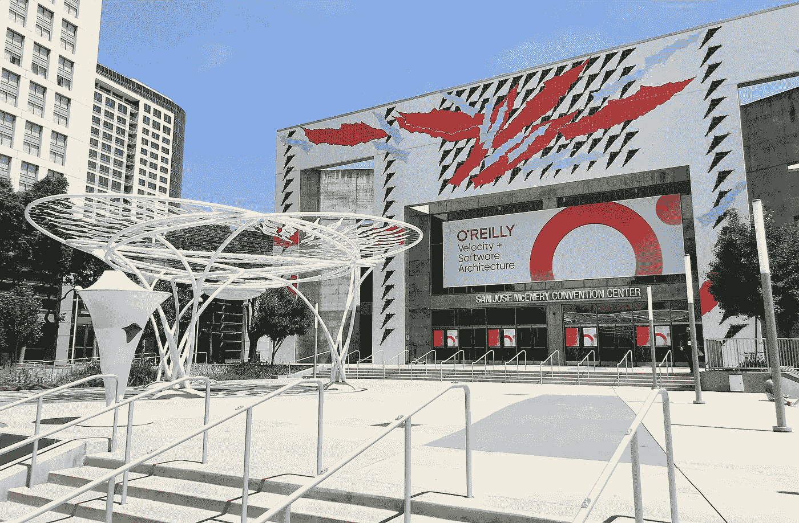
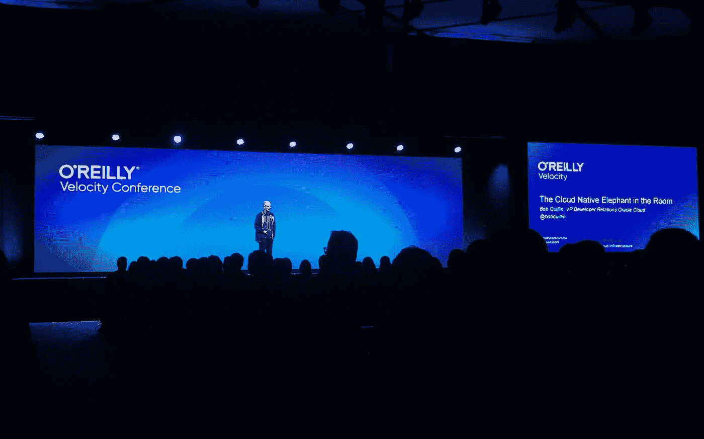
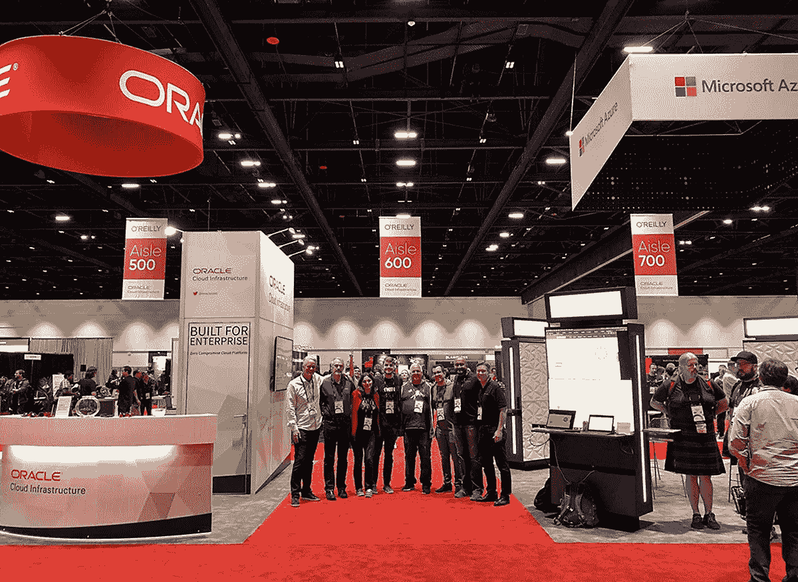

# 概述奥莱利速度会议

> 原文：<https://medium.com/oracledevs/recapping-the-oreilly-velocity-conference-a1d350b10911?source=collection_archive---------1----------------------->

The San Jose Convention Center

[O ' Reilly Velocity Conference](https://conferences.oreilly.com/velocity/vl-ca)致力于为组织提供所需的信息，使其能够在业务中采用云原生实践和技术。今年，Velocity 于 6 月 10 日至 13 日在加利福尼亚州圣何塞举行，阳光明媚，也许太阳光明媚了(室外温度计一度达到 103 华氏度)。大约 3000 名与会者冒着酷暑，深入了解不断变化的云环境。有无数有趣和引人入胜的演讲。我选择了几个最能引起我共鸣的例子。

一个有趣的主题是 Lachlan Evenson 和 Bridget Kromhout 的“[社区项目通知企业产品](https://conferences.oreilly.com/velocity/vl-ca/public/schedule/detail/79270)”这个演讲讨论了创建[看门人](https://github.com/open-policy-agent/gatekeeper)，一个 Kubernetes 的政策控制者。在开发过程中，微软的团队意识到他们正在开发的工具可以使更广泛的 Kubernetes 用户群受益，这使他们在开放的环境中开发它，而不是在封闭的专有大门后。看到像微软这样的企业软件巨头对开源的持续承诺是令人鼓舞的。

基于我过去在[可观察性](https://thenewstack.io/the-open-source-container-native-observability-toolkit/)和[站点可靠性工程](https://thenewstack.io/the-role-of-site-reliability-engineering-today-and-tomorrow/)方面的工作，我发现另外两个主题演讲特别有趣。Yaniv Aknin 的“[我渴望成为的 SRE](https://conferences.oreilly.com/velocity/vl-ca/public/schedule/detail/77930)”和 Liz Fong-Jones 的“[培养卓越生产](https://conferences.oreilly.com/velocity/vl-ca/public/schedule/detail/76330)”都探讨了成功的 SRE 组织的秘诀。Yaniv 的演讲侧重于通过风险的频率和对业务的影响来量化风险的重要性。服务级别目标从一开始就不是完美的，应该不断重复。他还回顾了某些可靠性测量的局限性:平均修复时间和平均无故障时间是基于故障含义的可替换定义，9 的方法(例如 99.99%可用性)带来了如何准确地将数据汇总到业务可信指标中的挑战。

Liz Fong-Jones 的演讲强调了使用错误预算来确定公司可接受的风险和不可靠性水平的重要性。虽然 100%的系统可靠性是理想的，但对系统的任何和所有更改，包括新功能，都会带来风险，避免风险会阻碍创新。每次谈话中分享的最佳实践和见解之间有很多一致性。双方都强调了 IT 内外多个业务部门的重要性，并就包括服务级别协议在内的方法和关键指标达成一致。

The keynote stage

我在活动期间参加的最有趣的一个讲座是利兹·赖斯的“[用 kube-hunter](https://conferences.oreilly.com/velocity/vl-ca/public/schedule/detail/74861) 黑 Kubernetes 的经验”这个演讲是围绕 k [ube-hunter](https://github.com/aquasecurity/kube-hunter) 展开的，它是 Kubernetes 的一个开源渗透测试工具。Kube-hunter 用于查找开放的端口，并针对这些端口发出 REST API 请求。Liz 提供了很好的例子来说明如何利用通过该工具发现的漏洞，包括通过盗用的服务帐户令牌。该讲座还提供了关于配置集群时要实施的最佳实践的重要提示，尤其是关于基于角色的访问控制(RBAC)的重要性。我欣赏的另一个方面是 kube-hunter 对 Kubernetes API 调用的回顾。我花了太多时间使用 Kubernetes 命令行实用程序`kubectl`，以至于我经常忘记通过 API 卷曲集群是多么强大。

除了演讲之外，我还花了大部分时间与人们谈论[甲骨文云](https://cloud.oracle.com/home)及其在云原生空间中的作用。虽然有些对话是从“我不知道甲骨文有云，你能告诉我吗？”这样的基本问题开始的其他人引发了关于如何将遗留工作负载迁移到云并更新它们以利用这种新模式的更深入的讨论。与我交谈过的许多与会者也对甲骨文和微软最近宣布的合作关系有疑问。我很幸运有机会在 Oracle 展台上发表关于开源工具的演讲，这些工具为 Kubernetes 环境提供了可观察性。

A new beginning

会议的一个亮点是网络安全管理软件产品团队看到了他们的 [PaperTrail](https://www.solarwinds.com/papertrail) 日志管理解决方案在甲骨文展台运行的 [Fn 项目](https://fnproject.io/)演示中使用。团队很高兴在另一个供应商的展位上看到他们的产品。我与演示的创建者 Sachin Pikle 讨论了他使用 PaperTrail 的选择，他提到 Fn 项目使用 Syslog，因为 PaperTrail 支持 Syslog，并且非常容易上手(只需点击几下鼠标)，所以它是演示的自然选择。

在今年的 Velocity 大会期间，与会者能够看到各种精彩的云原生讲座。Velocity 为云原生空间的成熟和解决现实世界运营挑战的重要性提供了更多证据，包括可观察性、安全性以及如何领导分布式团队。很明显，我们已经过了“为什么”这一关，转到了采用云原生方法的“如何”这一关。如果你想了解更多关于云原生技术的信息，请查看 cloudnative.oracle.com[并加入我们的邮件列表。](http://cloudnative.oracle.com)