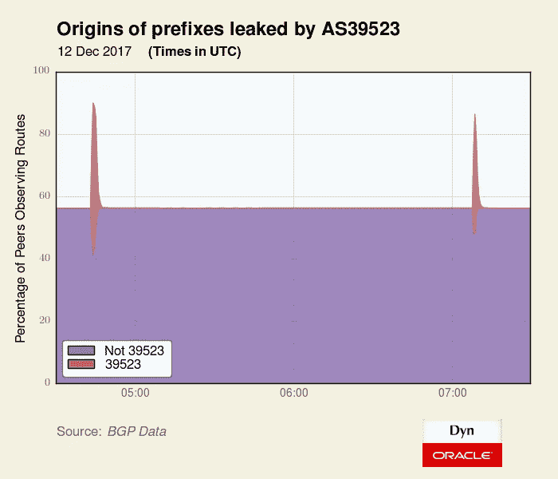
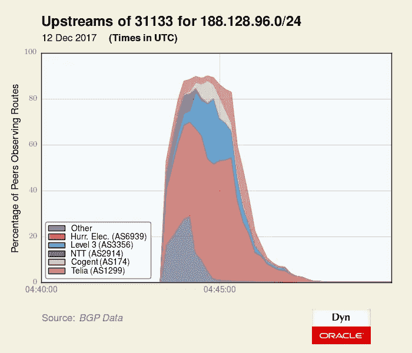
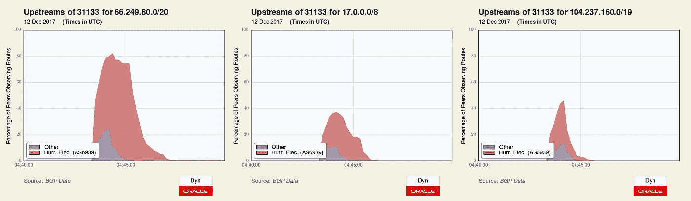

# 最近的俄罗斯路由泄露在很大程度上是可以避免的

> 原文：<https://medium.com/oracledevs/recent-russian-routing-leak-was-largely-preventable-fc0be168d867?source=collection_archive---------1----------------------->

上周，正如 BGPmon 最先报道的那样，包括谷歌、脸书和苹果在内的几家知名公司的 IP 地址空间被短暂公布于俄罗斯之外。

事件发生后，[NTT 的乔布斯 Snijders](https://twitter.com/JobSnijders) 在一篇名为[“如何应对 BGP 劫持”](/@jobsnijders/what-to-do-about-bgp-hijacks-44edc6a83e97)的帖子中写道。他指出，鉴于 BGP 固有的安全弱点，情况只会在“在没有适当保护的情况下运营互联网网络变得不可接受的那一刻”得到改善，因此客户将停止从没有适当路由过滤的提供商那里购买 transit。

由于 Job 已经在 NANOG 上介绍了 NTT 使用的各种过滤方法，我决定调查一下 NTT (AS2914)在这个特殊事件中表现如何。虽然 80 个错误路由中的一小部分最终被 AS2914 带到了更大的互联网，但 NTT 并没有促成任何主要互联网公司的泄密，如脸书、谷歌、苹果等。事实上，当一个人分析每一条泄露路线的传播时，一种模式开始出现。

**根据 AS39523** 确定泄漏路线

2017 年 12 月 12 日，AS39523 公布了两个不同的 3-4 分钟间隔的 80 个前缀(其中只有一个是他们的)。下面是三个小时内这些前缀来源的可视化，突出显示了由 AS39523 产生的部分。一些前缀已经在流通，但一些更具体或不太具体，通常不进行路由，这就是为什么当我们汇总所有前缀时，图表中的空白区域会出现峰值。

无论如何，AS39523 通过俄罗斯公交供应商 Megafon (AS31133)宣布了所有这些路线。在 Dyn 的 [IP Transit Intelligence](https://dyn.com/ip-transit-intelligence/) 中，我们跟踪了 Megafon 的七家国际公交提供商，即 Cogent、Level3、德国电信、意大利电信 Sparkle、NTT、飓风电气和 Telia。

被泄露的**俄罗斯**网络由*Megafon 的所有*中转提供商承载，比如来自 [Rostelecom](https://www.rostelecom.ru/en/) (俄罗斯国家电信)的这个前缀。

但是，当涉及到属于脸书、谷歌(和 YouTube)、微软、Twitch、苹果和 Riotgames 的前缀时，在 Megafon 的公交供应商中，只有飓风电气公司(Hurricane Electric)将这些路线带到了更大的互联网上。Megafon 的许多免结算同行也接受了这些错误的路线，但几乎没有全球影响。

在下面的三张图中，我们可以看到通过 Megafon 泄露的三个前缀(谷歌的 66.249.80.0/20，苹果的 17.0.0.0/8，YouTube 的 104.237.160.0/19)的传播概况。在将 Megafon 的各种同行归入“其他”类别后，Hurricane Electric 是泄漏期间出现在 AS31133 上游的唯一运输提供商。

昨天我联系了 Telia，他们向我证实，像 NTT 一样，是他们的路由过滤阻止了他们携带主要互联网公司泄露的前缀。考虑到 Megafon 的所有七个国际运输提供商，似乎只有 Hurricane Electric 未能实施路由过滤，这种过滤本来可以防止这种泄漏在更广泛的互联网上传播。

**结论**

如果我们能撇开[“俄国攻击！”](http://appleinsider.com/articles/17/12/14/intentional-event-redirects-cloud-traffic-from-apple-google-others-through-russia)围绕这个事件的说辞，有一些东西我们可以借鉴。例如，提供者在他们的 AS-SET 定义中需要更加节俭。正如 Qrator Labs 在关于此事件的[文章](https://radar.qrator.net/blog/born-to-hijack)中所引用的，一些提供商在他们的 AS-set 中添加了如此多的 ASN，以至于它们无法作为路由过滤的工具。

但是尽管存在这种限制，Megafon 的 7 个中转提供商中的 6 个仍然能够阻止与众多主要互联网公司相关的错误 BGP 公告。如果第七团也这样做了，我们可能根本不会讨论这个事件。

*原载于 2017 年 12 月 22 日 blogs.oracle.com***。**