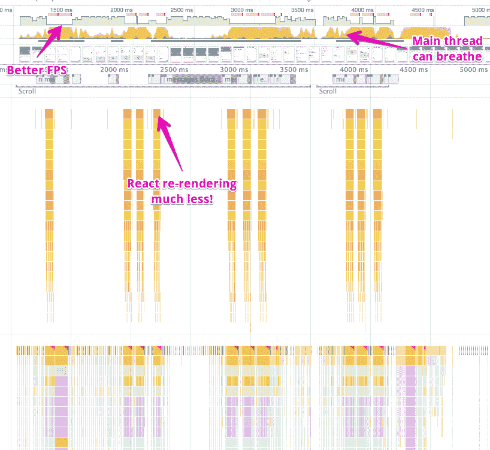

# Airbnb 列表页面上的 React 性能修复

> 原文：<https://medium.com/airbnb-engineering/recent-web-performance-fixes-on-airbnb-listing-pages-6cd8d93df6f4?source=collection_archive---------0----------------------->

## 可能会有很多唾手可得的果实🥝影响您可能没有密切跟踪的领域的性能…但仍然非常重要。


Airbnb has some incredible listings in Cuba…and also a corner of the office inspired by Habana Vieja

我们一直在努力工作，使用 [React 路由器](https://github.com/ReactTraining/react-router)和 [Hypernova](https://github.com/airbnb/hypernova) 将 airbnb.com 核心预订流程移植到一个单页面服务器渲染的应用程序中。今年年初，我们在登陆页面和搜索结果中推出了这一功能，并取得了良好的效果。我们的下一步是扩展单页应用程序，使其包含[列表详情页面](https://www.airbnb.com/rooms/8357)。


airbnb.com listing detail page: [https://www.airbnb.com/rooms/8357](https://www.airbnb.com/rooms/8357)

这是您在决定预订哪个列表时访问的页面。在整个搜索过程中，您可能会多次访问此页面以查看不同的列表。这是关于 airbnb.com 的访问量最大也是最重要的页面之一，所以我们抓住所有的细节是至关重要的！

作为迁移到我们的单页面应用程序的一部分，我想调查影响列表页面交互的任何遗留的性能问题(例如，滚动、点击、键入)。这符合我们的目标，即让页面快速启动并保持快速运行，通常会让人们对使用这个网站感觉更好。

**通过分析、修复和再次分析的过程，我们显著改善了这一关键页面的交互性能，使预订体验更加顺畅和令人满意。**在这篇文章中，你将了解我用来分析这个页面的技术，我用来优化它的工具，并在我的分析产生的火焰图中看到这种影响的规模。

# 方法学

这些配置文件是由以下人员通过 Chrome 的性能工具记录的:

1.  打开一个匿名窗口*(这样我的浏览器扩展就不会干扰我的分析)*
2.  在本地开发中访问页面时，我想在查询字符串*中使用`?react_perf`进行分析(以启用 React 的用户计时注释，并禁用一些只会减慢页面速度的东西，如*[*axe-core*](https://www.axe-core.org/)*)*
3.  点击录制按钮⚫️
4.  与页面互动*(例如滚动、点击、键入)*
5.  点按“录制”按钮🔴再一次解释结果


*通常，我主张在 Moto C Plus 或 CPU 节流设置为 6 倍减速的移动硬件上进行分析，以了解在较慢设备上的人会经历什么。然而，由于这些问题已经够糟糕了，所以即使没有节流，我的超高速笔记本电脑上的机会也是显而易见的。*

# 初始渲染

当我开始处理这个页面时，我注意到我的控制台中有一个警告:💀

```
webpack-internal:///36:36 Warning: React attempted to reuse markup in a container but the checksum was invalid. This generally means that you are using server rendering and the markup generated on the server was not what the client was expecting. React injected new markup to compensate which works but you have lost many of the benefits of server rendering. Instead, figure out why the markup being generated is different on the client or server:
 (client) ut-placeholder-label screen-reader-only"
 (server) ut-placeholder-label" data-reactid="628"
```

这就是可怕的服务器/客户机不匹配，当服务器呈现的内容与客户机在初始挂载时呈现的内容不同时就会发生这种情况。当使用服务器渲染时，这会迫使你的浏览器做一些它不应该做的事情，所以无论何时发生，React 都会给你这个方便的✋警告。

不幸的是，错误消息并不十分清楚这种情况发生在哪里或者原因是什么，但是我们确实有一些线索。🔎我注意到一些看起来像 CSS 类的文本，所以我在终端上输入:

```
~/airbnb ❯❯❯ ag ut-placeholder-label
app/assets/javascripts/components/o2/PlaceholderLabel.jsx
85:        'input-placeholder-label': true,app/assets/stylesheets/p1/search/_SearchForm.scss
77:    .input-placeholder-label {
321:.input-placeholder-label,spec/javascripts/components/o2/PlaceholderLabel_spec.jsx
25:    const placeholderContainer = wrapper.find('.input-placeholder-label');
```

这很快将我的搜索范围缩小到了一个叫做`o2/PlaceHolderLabel.jsx`的东西，它是显示在评论部分顶部的搜索组件。🔍


事实证明，我们使用了一些功能检测来确保占位符在较旧的浏览器(如 Internet Explorer)中可见，如果当前浏览器不支持占位符，则通过不同的方式呈现输入。功能检测是实现这一点的正确方法(与用户代理嗅探相反)，但是由于在服务器呈现时没有浏览器来进行功能检测，服务器将总是呈现比大多数浏览器所呈现的内容多一点的额外内容。

这不仅损害了性能，还导致额外的标签被可视化地呈现，然后每次都从页面上移除。詹基。我通过将该内容的呈现转移到 React 状态并在`componentDidMount`中设置它来解决这个问题，它在客户端呈现之前不会运行。🥂


我再次运行分析器，注意到`<SummaryContainer>`在安装后不久就更新了。


101.63 ms spent re-rendering Redux-connected SummaryContainer

当它更新时，这会重新渲染一个`<BreadcrumbList>`，两个`<ListingTitles>`，和一个`<SummaryIconRow>`。然而，这些都没有任何区别，所以我们可以通过在这三个组件上使用`React.PureComponent`来显著降低这个操作的成本。这和改变它一样简单:

```
export default class SummaryIconRow extends React.Component {
  ...
}
```

变成这样:

```
export default class SummaryIconRow extends React.PureComponent {
  ...
}
```

接下来，我们可以看到`<BookIt>`在初始页面加载时也经过了重新渲染。根据火焰🔥图表，大部分时间花在渲染`<GuestPickerTrigger>`和`<GuestCountFilter>`上。


103.15 ms spent re-rendering BookIt

有趣的是，这些组件甚至是不可见的👻除非客人输入被聚焦。


解决这个问题的方法是在不需要这些组件时不要渲染它们。这加快了初始渲染以及最终可能发生的任何重新渲染的速度。🐎如果我们走得更远一点，加入一些更纯的成分，我们可以让这个区域变得更快。


8.52 ms spent re-rendering BookIt

# 四处滚动

在做一些工作来使我们有时在列表页面上使用的平滑滚动动画现代化时，我注意到页面在滚动时感觉非常不自然。📜当动画没有达到平滑的 60 fps(每秒帧数)，[甚至可能没有达到 120 fps](https://dassur.ma/things/120fps/) 时，人们通常会感到不舒服和不满意。**滚动是一种特殊的动画，与你的手指运动直接相连，因此它对糟糕的表现甚至比其他动画更敏感。**

经过一点分析，我发现我们在滚动事件处理程序中做了很多不必要的 React 组件的重新渲染！这就是真正的坏人 jank 的样子:


Really bad scrolling performance on Airbnb listing pages before any fixes

通过将这些树中的三个组件转换成使用`React.PureComponent` : `<Amenity>`、`<BookItPriceHeader>`和`<StickyNavigationController>`，我能够解决这个问题的大部分。这大大降低了这些重新渲染的成本。虽然我们还没有达到 60 fps(每秒帧数)，但我们已经非常接近了:



Slightly improved scrolling performance of Airbnb listing pages after some fixes

然而，仍然有更多的机会来提高。变焦🚗稍微进入火焰图，我们可以看到我们仍然花了很多时间重新渲染`<StickyNavigationController>`。如果我们向下看组件堆栈，我们会注意到有四个看起来相似的块:


58.80 ms spent re-rendering StickyNavigationController

`<StickyNavigationController>`是列表页面中贴在视窗顶部的部分。当您在各部分之间滚动时，它会突出显示您当前所在的部分。火焰中的每一块🚒图表对应于我们在粘性导航中呈现的四个链接之一。而且，当我们在各部分之间滚动时，我们会突出显示一个不同的链接，所以其中一些需要重新呈现。这是它在浏览器中的样子。


现在，我注意到这里有四个链接，但是只有两个在部分之间转换时改变了外观。但是，在我们的火焰图中，我们看到所有四个链接每次都重新呈现。发生这种情况是因为我们的`<NavigationAnchors>`组件在 render 中创建了一个新函数，并每次都将其作为道具传递给`<NavigationAnchor>`，这降低了纯组件的优化。

```
const anchors = React.Children.map(children, (child, index) => {      
  return React.cloneElement(child, {
    selected: activeAnchorIndex === index,
    onPress(event) { onAnchorPress(index, event); },
  });
});
```

我们可以通过确保每次由`<NavigationAnchors>`呈现时`<NavigationAnchor>`总是接收相同的函数来解决这个问题:

```
const anchors = React.Children.map(children, (child, index) => {      
  return React.cloneElement(child, {
    selected: activeAnchorIndex === index,
    index,
    onPress: this.handlePress,
  });
});
```

然后在`<NavigationAnchor>`:

```
class NavigationAnchor extends React.Component {
  constructor(props) {
    super(props);
    this.handlePress = this.handlePress.bind(this);
  } handlePress(event) {
    this.props.onPress(this.props.index, event);
  } render() {
    ...
  }
}
```

在此更改之后，我们看到只有两个链接被重新呈现！那是一半🌗工作！而且，如果我们在这里使用了四个以上的链接，那么需要完成的工作量就不会再增加了。


32.85 ms spent re-rendering StickyNavigationController

[*斗南石*](https://medium.com/u/53a00712afc2?source=post_page-----6cd8d93df6f4--------------------------------)*at*[*Flexport*](https://medium.com/u/a4c150df1e8c?source=post_page-----6cd8d93df6f4--------------------------------)*一直致力于* [*反射绑定*](https://github.com/flexport/reflective-bind) *，它使用一个通天塔插件来为你执行这种类型的优化。现在还为时尚早，所以它可能还没有准备好投入生产，但我对这里的可能性感到非常兴奋。*

向下看性能记录中的主面板，我注意到我们有一个非常可疑的`_handleScroll`块，它在每个滚动事件中消耗 19 毫秒。因为如果我们想要达到 60 fps，我们只有 16 毫秒，这太多了。🌯


18.45 ms spent in `_handleScroll`

罪魁祸首似乎就在`onLeaveWithTracking`内部的某个地方。通过一些代码搜索，我追踪到了`<EngagementWrapper>`。仔细观察这些调用堆栈，我注意到大部分时间都花在 React 的`setState`中，但奇怪的是，我们在这里实际上没有看到任何重新渲染。嗯（表示踌躇等）...

再深入一点，我注意到我们正在使用反应状态🗺跟踪实例的一些信息。

```
this.state = { inViewport: false };
```

然而，**我们从来没有在渲染路径中使用这个状态，也从来不需要这些状态变化来导致重新渲染，所以我们最终支付了额外的成本**。💸将 React state 的所有这些用法转换成简单的实例变量确实有助于我们加快这些滚动动画的速度。

```
this.inViewport = false;
```


1.16ms spent in scroll event handler

我还注意到`<AboutThisListingContainer>`被重新渲染，这导致了一个昂贵的💰以及`<Amenities>`组件不必要的重新渲染。


32.24 ms spent in AboutThisListingContainer re-render

这最终部分是由我们用来帮助我们进行实验的高阶成分引起的。这个 HOC 是以这样一种方式编写的，它总是把一个新创建的对象作为道具传递给它所包装的组件——去优化它路径上的任何东西。

```
render() {
  ... const finalExperiments = {
    ...experiments,
    ...this.state.experiments,
  }; return (
    <WrappedComponent
      {...otherProps}
      experiments={finalExperiments}
    />
  );
}
```

我通过为这项工作引入[重新选择](https://github.com/reactjs/reselect)来解决这个问题，它会记住以前的结果，这样它在连续渲染之间将保持引用相等。

```
const getExperiments = createSelector(
  ({ experimentsFromProps }) => experimentsFromProps,
  ({ experimentsFromState }) => experimentsFromState,
  (experimentsFromProps, experimentsFromState) => ({
    ...experimentsFromProps,
    ...experimentsFromState,
  }),
);...render() {
  ... const finalExperiments = getExperiments({
    experimentsFromProps: experiments,
    experimentsFromState: this.state.experiments,
  }); return (
    <WrappedComponent
      {...otherProps}
      experiments={finalExperiments}
    />
  );
}
```

问题的第二部分是相似的。在这个代码路径中，我们使用了一个名为`getFilteredAmenities`的函数，它将一个数组作为其第一个参数，并返回该数组的一个过滤版本，类似于:

```
function getFilteredAmenities(amenities) {
  return amenities.filter(shouldDisplayAmenity);
}
```

虽然这看起来很简单，但每次运行时都会创建一个新的数组实例，即使它产生的结果是相同的，这将使任何接收该数组作为属性的纯组件不再优化。我通过引入重新选择来记忆过滤，也解决了这个问题。我没有这个的火焰图，因为整个重新渲染完全消失了！👻

这里可能还有更多机会(例如 [CSS 遏制](https://developer.mozilla.org/en-US/docs/Web/CSS/contain))，但是滚动性能已经看起来好得多了！


Improved scrolling performance on Airbnb listing pages after these fixes

# 点击东西

与页面互动多一点，当我点击评论上的“帮助”按钮时，我感觉到一些明显的滞后✈️。


我的直觉是，点击这个按钮会导致页面上的所有评论被重新呈现。看着火焰图，我并没有差太远:


42.38 ms re-rendering ReviewsContent

在去了几个地方的`React.PureComponent`后，我们让这些更新更有效率。


12.38 ms re-rendering ReviewsContent

# 打字的东西

回到我们的老朋友，服务器/客户端不匹配，我注意到在这个框中输入感觉真的没有反应。


在我的分析中，我发现每一次按键都会导致整个 review 部分标题和每个 review 被重新呈现！😱这不是那么乌鸦。🐦


61.32 ms re-rendering Redux-connected ReviewsContainer

为了解决这个问题，我提取了头部的一部分作为它自己的组件，这样我就可以把它变成一个`React.PureComponent`，然后在整个树中添加一些`React.PureComponent`。这使得每次按键只重新呈现需要重新呈现的组件:输入。


3.18 ms re-rendering ReviewsHeader

# 我们学到了什么？

*   我们希望页面快速启动并保持快速运行。
*   这意味着我们需要关注的不仅仅是交互时间，我们还需要分析页面上的交互，比如滚动、点击和输入。
*   `React.PureComponent`和重新选择是我们 React 应用优化工具包中非常有用的工具。
*   当实例变量等较轻的工具完全适合您的用例时，避免使用较重的工具，如 React state。
*   React 给了我们很大的能力，但是编写代码去优化你的应用程序是很容易的。
*   培养剖析的习惯，做出改变，然后再次剖析。

如果你喜欢读这篇文章，我们一直在寻找有才华、有好奇心的人加入到[](https://www.airbnb.com/careers/departments/engineering)**的团队中来。我们意识到 Airbnb 的性能仍有很大的提升空间，但如果你碰巧注意到一些可能需要我们关注的事情，或者只是想谈谈工作，请随时在 Twitter 上联系我**

*大呼小叫 [Thai Nguyen](https://medium.com/u/2d876a51e42?source=post_page-----6cd8d93df6f4--------------------------------) 帮助审查这些变化，并致力于将列表页面纳入核心预订流程单页应用程序。♨️被炒作了！非常感谢开发 Chrome DevTools 的团队——这些性能可视化是一流的！此外，巨大的道具网飞为*陌生人的事情 2* 。🙃*