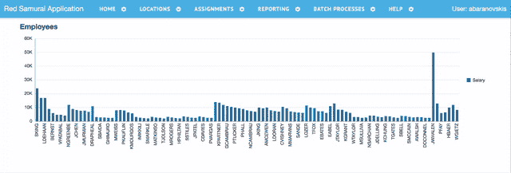
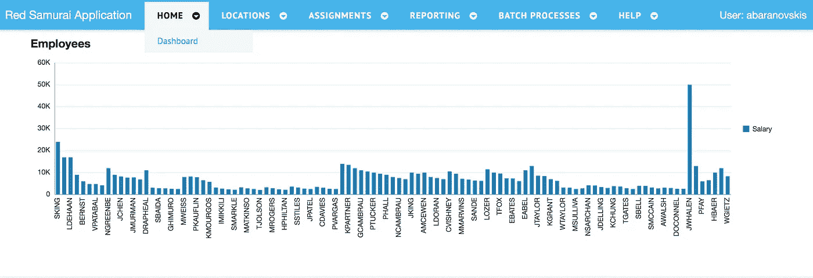
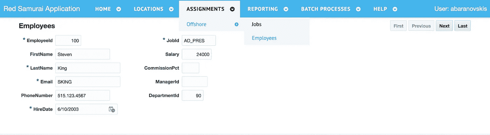
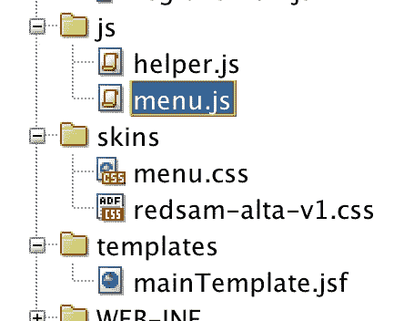
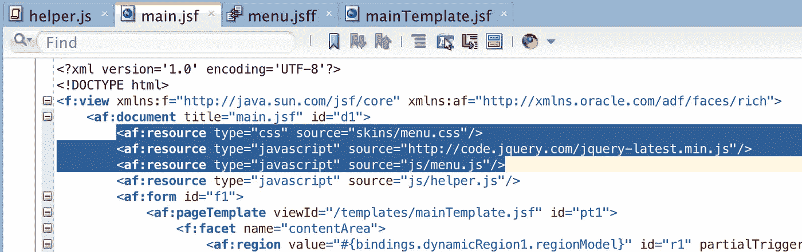
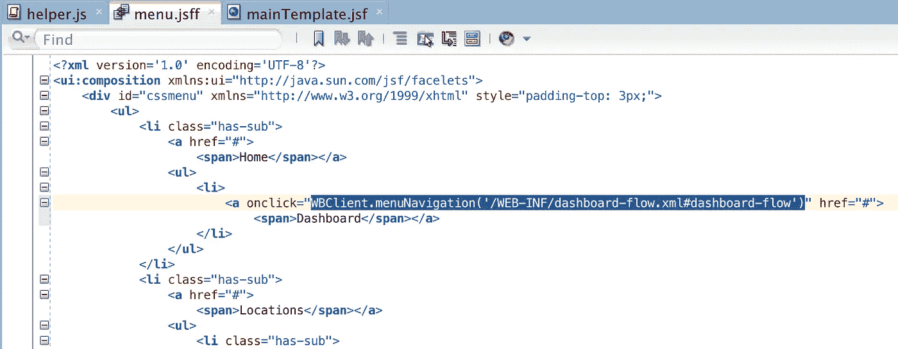
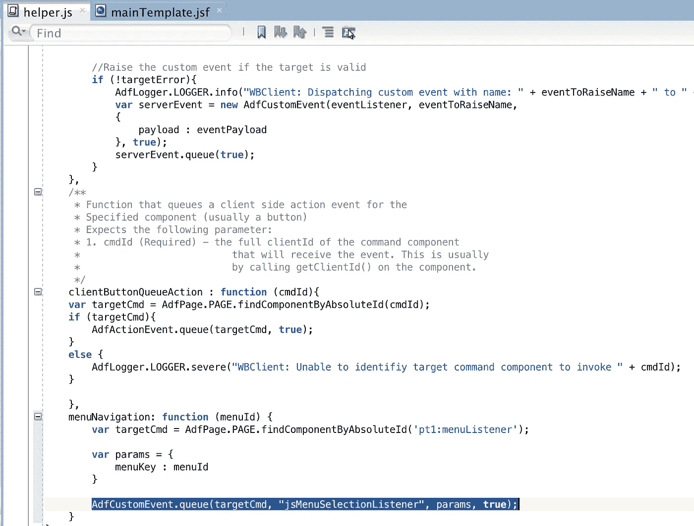
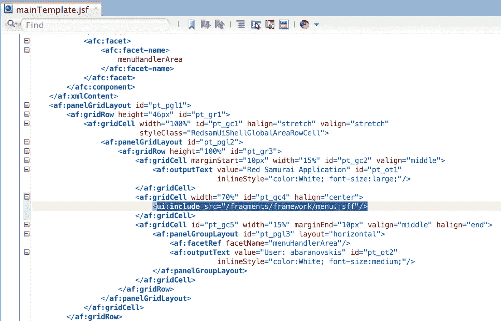

# 将 JQuery 菜单集成到 ADF Faces 的方法

> 原文：<https://medium.com/oracledevs/recipe-for-jquery-menu-integration-into-adf-faces-914ba0b6e715?source=collection_archive---------1----------------------->

也许你正在考虑给你的 ADF 应用添加一些新的元素？我建议使用 JQuery 菜单。这种菜单的优点——它是纯粹的客户端实现，允许用户快速浏览项目。除了快速导航，它看起来也很棒，可以很容易地定制。

在这篇文章中，我将描述如何将 JQuery 菜单集成到 ADF Faces 中，并提供示例 ADF 应用程序。我在这里使用 JQuery 菜单— [动画响应下拉菜单](http://cssmenumaker.com/menu/animated-responsive-drop-down-menu)。没有必要实现 JQuery 菜单组件，我们可以使用现有的实现之一。

我记录了一个简短的例子，你可以看到客户端菜单导航是多么方便。每个菜单项加载 ADF 区域:

集成到我的 ADF 示例中的 JQuery 菜单:

它可以显示多个级别的菜单项:

集成到 ADF Faces 非常简单，您需要将 JS 和 CSS 文件复制到 ADF 应用程序中:

在 ADF 主页中定义 JS 和 CSS 资源，确保也引用 JQuery:

菜单结构是使用 HTML 标记在 ADF 片段中定义的。一旦菜单项被选中，通过客户端/服务器监听器的组合调用 ADF(检查 *WBClient.menuNavigation* 方法)。在我以后的文章中，我将描述如何动态构建类似的菜单结构。如果您的应用程序是安全的，请确保为 TF 正确定义 ADF 安全权限，任何未受保护的 TF 都可以从菜单中加载:

客户端监听器方法 *menuNavigation* 用目标 TF 地址构造 params 并调用服务器监听器，服务器监听器反过来显示 ADF 动态区域:

带有 HTML 标记的菜单片段集成到 ADF 页面模板中:

下载示例应用程序— [ADFJQueryMenuApp.zip](https://docs.google.com/uc?export=download&id=1Uo37gDBVc7NSJcIowMBK2Q4YhFX9_5e8) 。

*原载于 2017 年 12 月 21 日*[*andrejusb.blogspot.com*](https://andrejusb.blogspot.lt/2017/12/recipe-for-jquery-menu-integration-into.html)*。*