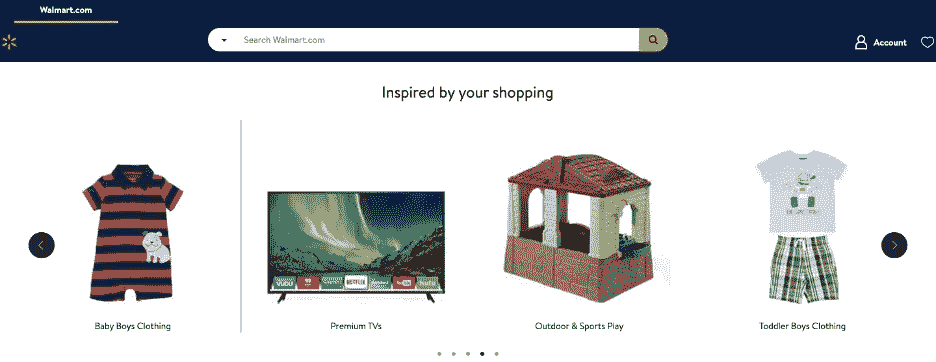
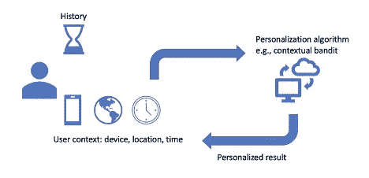
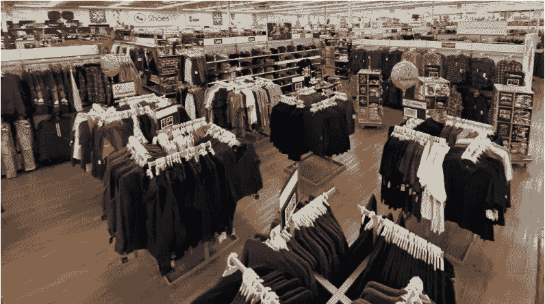
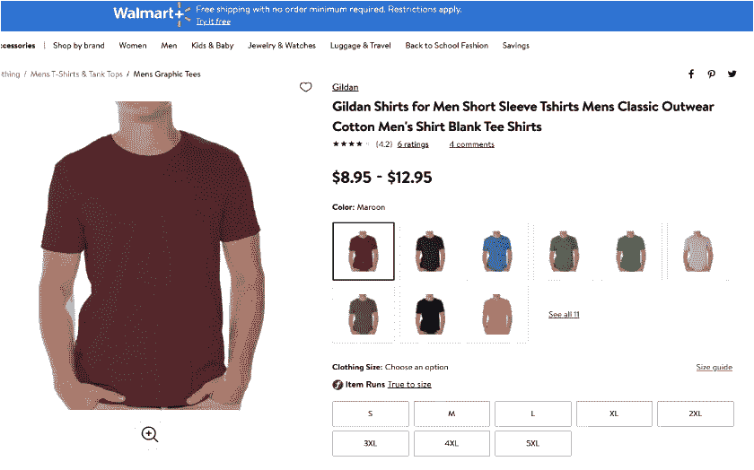
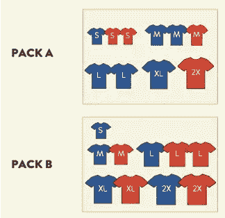
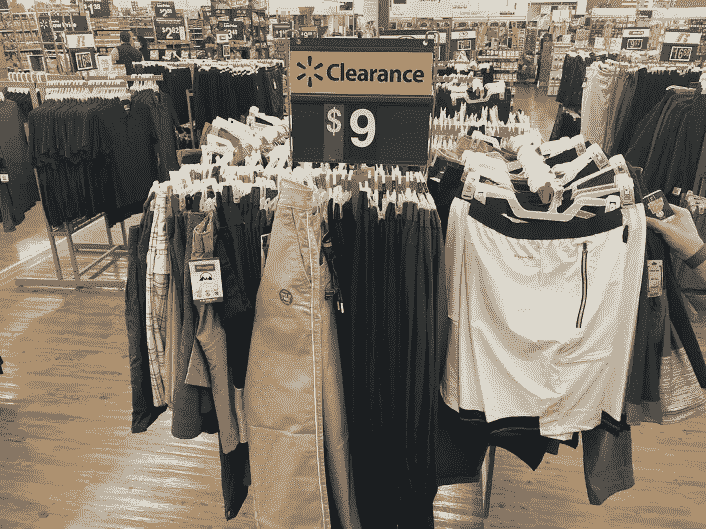

# 对物理世界的建议

> 原文：<https://medium.com/walmartglobaltech/recommendations-for-the-physical-world-337be870931?source=collection_archive---------1----------------------->

*One of Walmart’s personalized carousels*

近年来，个性化在线内容已经成为零售业和学术界的主要研究领域。推荐和个性化算法通常被许多领域的公司采用，例如电子商务(例如沃尔玛、Stitch Fix)、电影(例如网飞、Hulu)、音乐(例如 Spotify)、搜索(例如谷歌)和广告(例如谷歌、脸书)。因此，这些服务的每个消费者所体验的内容可能完全不同，这取决于他们的偏好。

# 在线个性化是如何工作的？

这些通常是用户在线个性化的主要步骤:

1.  用户访问网站
2.  该网站可以访问与用户帐户相关的用户历史活动(如果用户已通过身份验证)或通过浏览器 cookies
3.  使用这些历史数据以及会话中的详细信息(设备、国家、时间、语言等。)，网站提供了一种为用户定制的体验
4.  基于所呈现的项目(例如，产品、电影、歌曲、搜索结果)，用户可以采取行动(例如，点击、添加到购物车、购买、收听、观看)
5.  利用这种反馈，推荐算法可以不断改善用户体验

*Online recommendation flow diagram*

# **推荐给物质世界有什么不同？**

虽然以上述方式改善在线用户体验是沃尔玛服务顾客的方式之一，但沃尔玛顾客购物的主要渠道是通过我们的实体店。相对于网上购物，实体购物体验中的一个鲜明对比是，我们没有进入我们商店的顾客的具体历史数据。我们也不能在任何一天根据客户的偏好来调整实际库存。

此外，对于我们今天做出的规划决策，我们可能几周甚至几个月都不会得到客户的反馈。然而，我们可以通过仔细规划未来来满足客户的总体需求。在本文中，我们将讨论如何在这些物理限制和长期反馈循环的背景下规划和运营我们的商场产品组合。

# **定义问题和挑战**

沃尔玛在美国有超过 4000 家商店，90%的美国人居住在沃尔玛商店 10 英里范围内。鉴于人口统计数据(如年龄、收入)以及外部因素(如天气)的巨大差异，商场各区域的顾客偏好存在差异。顾客的偏好甚至会随着时间而改变。

为了满足消费者的需求，我们需要确保他们能够在正确的时间、正确的商店、以正确的价格买到正确的产品。为了实现这一目标，我们需要拥有适当的分类(商店中的一组商品)、最佳库存(最大限度地减少库存不足和库存过多)，同时考虑可用空间的物理限制、供应商的订单交付时间和其他供应链限制，以及在商店中摆放商品的正确劳动力。为了使这些挑战具体化，我们可以考虑沃尔玛服装垂直市场规划的具体案例。

# **服装案例研究**

服装垂直包括来自服装、珠宝、鞋子和配饰(手提包、太阳镜，甚至是后 covid 世界的面具)等类别的商品。商场内服装部分的规划包括但不限于回答以下问题:

*   **商品组合**:考虑到顾客需求的变化，每个商店里的商品组合应该是什么样的？反过来说，有哪些商店适合销售某一特定商品或品牌？
*   **库存**:在购买季节开始时，这些产品的初始库存应该是多少？
*   空间规划:我们应该给每一类物品分配多少空间，以及在这些物品中，物品本身应该分配多少空间？我们还必须考虑到服装可能会陈列在架子、货架、墙壁或纺车上。

*Different layouts for different item types*

*   **补货**:根据每个商店购买每件商品的速度，补货的最佳时间表(数量是时间的函数)应该是什么？
*   **尺寸和颜色**:一件服装可能有不同的尺寸和颜色。然而，并不是所有的尺寸和颜色都有相同的吸引力或需求。对于任何给定的物品，我们应该携带的尺寸和颜色的正确分布应该是什么？

*Same T-shirt available in various sizes and colors*

*   **包装**:要满足我们对每种产品的不同需求，需要将这些产品以不同的配置(尺寸和颜色的组合)从供应商运送到配送中心，以及从配送中心运送到各个商店。为了最大限度地减少配置数量以及每个商店的库存不足和库存过多，最佳的箱子配置应该是什么？

*Example of different pack configurations*

*   **线上线下对应**:为了提供全方位、全渠道的购物体验，我们需要确保我们的商店和线上系统保持同步。此外，电子商务购买模式可能是我们商店规划算法的重要信号。在线目录比商店目录大几个数量级，因为它不受物理空间的限制。因此，在线分类的计划流程可以完全独立。我们如何将商场目录中的商品映射到网上，反之亦然？
*   **清仓和打折**:服装是季节性商品。冬季的服装需求可能与夏季的需求大不相同。但是，由于我们需要提前进行大量的计划，我们可能无法准确预测每种产品的需求。如果商品没有卖完，最佳的清仓时间表应该是什么？

*A clearance section in one of the Walmart stores*

# **之前是怎么做的？**

沃尔玛于 1962 年在阿肯色州罗杰斯成立。在大数据和机器学习(ML)成为主流之前的时代，上述问题由商家、买家和规划者在没有算法和计算帮助的情况下人工回答。这一过程涉及数百种不同的基于电子表格的工具，这些工具可能非常繁琐。员工依靠他们在该领域的经验和专业知识促进沃尔玛的持续增长，最终成为我们今天的[财富排名第一的公司](https://fortune.com/company/walmart/fortune500/)。

近年来，我们一直努力在 ML ( [深度学习](/walmartglobaltech/product-matching-in-ecommerce-4f19b6aebaca)、[强化学习](https://www.informs.org/Resource-Center/Video-Library/Edelman-Competition-Videos/2020-Edelman-Competition-Videos/2020-Edelman-Finalist-Walmart))、[预测和优化](https://www.kdd.org/kdd2020/accepted-papers/view/price-investment-using-prescriptive-analytics-and-optimization-in-retail)中使用最先进的算法，以便在解决上述问题的同时持续并显著地提高我们的日常低价承诺。

# **规划过程中的算法**

虽然我们无法为每位顾客提供个性化的商店体验，但我们希望确保每位顾客在前往商店时都能找到他们想要的商品。尽管我们没有顾客的浏览或购物历史，但我们有每家商店的交易历史。此外，我们可以使用商店详细信息(例如，占地面积、离配送中心的距离)等特征，以及位置、天气、附近的竞争对手商店、人口数量等外部信号。通过利用这些大量的数据，我们已经开发并正在开发复杂的模型，包括:

*   分类、库存、补货、尺寸和颜色分布的深度学习模型
*   空间规划和包装的优化模型
*   清除的强化学习模型

在随后的文章中，我们可能会更详细地讨论其中的一些模型。通过在规划过程中的适当点插入这些模型，我们可以向我们的商家和买家提出建议，帮助和简化这个过程，同时仍然允许在必要时进行人工覆盖。这使我们能够在每个商店、部门和品类层面定制合适的商品组合，最终帮助顾客省钱并过上更好的生活。

# 前方有什么可能性？

我们已经在使用 ML 和优化模型为规划过程提供动力方面取得了实质性进展，但仍有巨大的改进潜力。随着在线推荐系统文献的增长，物理空间仍然相对未被探索和代表不足。这为我们提供了一个激动人心的机会，为研究做出贡献，并在这些领域取得重大进展。

我们的团队在不断壮大，我们一直在寻找有才华的数据科学家、ML 工程师、数据工程师、软件工程师和分析师。如果您喜欢处理大规模数据，构建影响数亿客户的 ML 和优化模型，[请联系](https://careers.walmart.com/)！