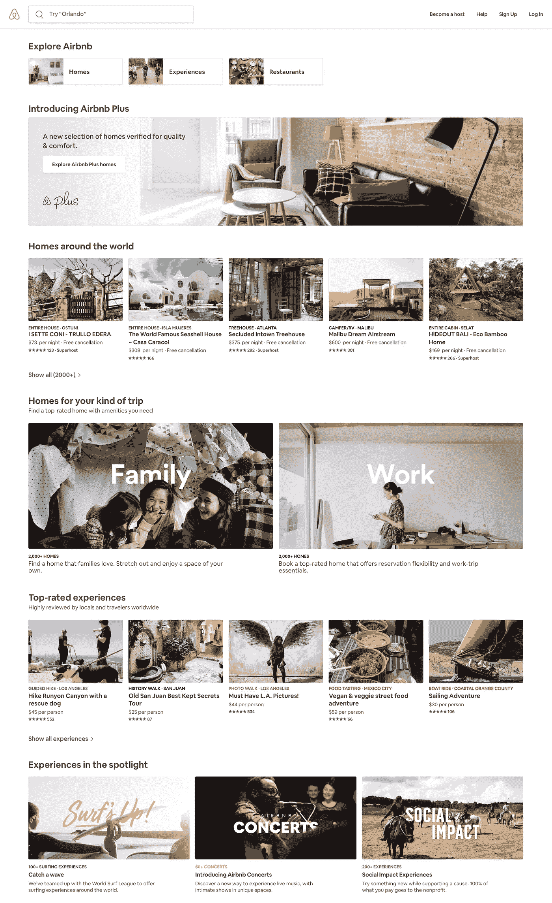

# 在 Airbnb 调和 GraphQL 和节俭

> 原文：<https://medium.com/airbnb-engineering/reconciling-graphql-and-thrift-at-airbnb-a97e8d290712?source=collection_archive---------0----------------------->

## 我们的前端工程师想要 GraphQL 的快速迭代和灵活性，而我们的后端工程师想要节俭的稳定性和特异性。这是一个关于我们如何让两个小组进行对话，并为每个人建立工作的故事。

The.WAV hosting [AFROHAUS Brunch](https://www.airbnb.com/experiences/107838) in Los Angeles a few months ago

> **后端工程师**:嗯。所以你是说这个“GraphQL”将允许任何 web 或本地工程师在任何后端服务中任意地、递归地查询基本上任何字段，无论他们想要什么，而不需要任何后端工程师参与？
> 
> **前端工程师**:嗯，对吧？太神奇了！
> 
> […沉默…]
> 
> **后端工程师**:卫兵，抓住这个人。

几年来，我们在 Airbnb 有一些热切支持 GraphQL 的人，但该项目从未真正通过大门，主要是因为人们认为“graph QL the Religion”——一种所有数据都是图形的世界观——与我们特定的面向服务的架构(SOA)策略不兼容，该策略使用 [Thrift](https://thrift.apache.org/docs/idl) 接口定义语言(IDL)定义服务到服务的通信，并通过专用的表示服务向客户提供数据。

我们最近为“API 层的图表”重新设计了一个案例接受 GraphQL 如何补充我们的表示服务而不是与之竞争，它发现了更多的吸引力。我想告诉你我们为什么以及如何以我们所做的方式设置事情，以防你处于类似的位置并权衡类似的权衡。

# 节俭和演示服务框架

我强烈推荐探索“在 Airbnb 构建服务”的第 1 部分和第 2 部分中的[，但是在高层次上，我们竭尽全力远离共享的后端资源，例如 Rails 中的单个通用`@listing`模型，其中一个团队的更改可能会破坏另一个团队的代码，通常来自公司的非常不同的区域。](/airbnb-engineering/building-services-at-airbnb-part-1-c4c1d8fa811b)

相反，当一个服务与另一个服务通信时，请求和响应格式已经使用 Thrift 提前定义好了。例如，为了支持整个产品的各种摄影需求，我们的内部图像处理服务公开了如下接口:

在 Airbnb 的规模上，有大量的功能变化和实验，导致从我们的 API 返回的数据不断变化。为了最大限度地减少后端服务中的变动，我们构建了面向外部的“表示服务”来支持特定于页面的业务逻辑，并查询这些后端数据服务。

最初的想法是，这些服务端点将直接映射到 REST 端点(例如，getReviewsByListingId 将通过/api/luxury/reviews/123 这样的端点来访问)。由于 Thrift 是语义版本化的，我们的 API 版本化将与 Thrift 的版本化挂钩。

## 探索 GraphQL“宗教”

演示服务的基本原理很清楚。同样的故障发生了多少次:一名工程师无意中添加了一个`bathroom_label`字段(一个匹配我们翻译服务的字符串，格式很好，如“2 浴室”)用于显示一个列表的全部细节。几个月后，另一名工程师将相同的字段添加到搜索结果中，突然我们有了一个 *n+1* 查询，搜索延迟下降了 100 毫秒。十年来，服务所有者和客户工程师都在呼吁更清晰的移交、更严格的性能和数据保真控制、强类型 API 契约，甚至服务间的 SLA。

Airbnb engineers defending data services from client engineers

有了这样的背景，你就能理解 GraphQL 的一群善意的拥护者所面临的阻力。如果所有的数据都是一个图形，任何客户工程师都可以创建一个查询，这个查询可以深入到核心数据服务中，不管有多必要，我们都会发现自己遇到了我们试图用表示服务框架解决的所有相同的问题。*对错*——graph QL 在 Airbnb 被视为一种竞争策略，而非补充策略。

令人遗憾的是，如果 GraphQL 成为法律，后端工程师可以观察到他们所拥有的服务的实质性性能退化，而不用修改他们自己项目中的一行代码。SLA、合同和可观察性将会飞出窗外，管理性能将会倒退好几步。“不成交。”

# 输入 graph QL“API 层”

大约六个月前，我们重新开始了讨论，因为 graph QL——特别是[Apollo](https://www.apollographql.com/)——的优势实在太引人注目，不容忽视。我们会得到:

*   强类型 API 架构
*   字段选择的灵活性，包括宏观层面(如果不需要，不要请求昂贵的操作)和微观层面(不要请求不再使用的特定字段)
*   跨平台(Web、iOS、Android)客户端开发，无需依赖后端工程师进行迭代
*   Apollo 生态系统提供的大量客户端优势，包括缓存、本地状态和网络状态合成、字段级分析等等

鉴于这一历史，我们提出了以下架构:

Airbnb’s new “API v3” architecture features GraphQL as an API layer and Apollo on Web, iOS, and Android

## Thrift/GraphQL 翻译器:一个简单的例子

我们没有构建一个单一的 GraphQL 服务器来集中解析器逻辑，而是选择在每个表示服务中嵌入翻译器，自动将节约结构和服务函数编译成 GraphQL 模式定义，并将它们连接在一起。

在这样一个世界中，上面的`LuxuryHomePresentationService` Thrift 示例免费编译成下面的 GraphQL 模式:

这使得查询看起来像这样:

这里的一个细微差别是我们避免了递归查询和链式查询。我们*不*希望客户必须在`listingId`之前查询列表，接收列表评论的 id 数组，然后用那个 id 数组查询评论。相反，评论是由`listingId`提交的，这样一切都可以并行获取。

最精彩的部分？GraphQL 查询的所有处理和模式本身都是 Thrift 接口的编译结果。作为服务工程师，只需包括翻译模块，工作就为您完成了。

## Thrift/GraphQL 翻译器:联合和接口

Airbnb 上大约一半的 API 端点的行为类似于上面的例子:简单地描述数据模型，这样客户就可以请求它需要的东西并相应地构造 UI。

但是我们产品中的许多页面都遵循一种模式，后端在将 UI 定义为页面上的一系列“部分”时扮演了一个更加主动的角色。

Search at Airbnb has a “sections” based API driven by backend services

*搜索*就是这样一个例子。客户端不再请求预定义的数据结构。相反，他们提交查询标准和各种改进，然后一群后端服务为用户构建高度定制的动态页面。UI 变得更加“愚蠢”，只是简单地呈现要求它呈现的内容。

在这个屏幕截图中，用户看到了一些可点击的改进(住宅、体验、餐馆)，然后是关于新的 [*加*](https://www.airbnb.com/plus) 住宅的信息，接着是以世界各地的住宅为特色的卡片网格，等等。

不过，搜索洛杉矶，你可能会看到一连串的餐馆，然后是你之前在该地区看过的房子。根据市场的不同，可能会出现一张地图。整个页面由 API 驱动，并且与用户高度相关。

幸运的是，GraphQL 通过[接口和联合](/the-graphqlhub/graphql-tour-interfaces-and-unions-7dd5be35de0d)为这个策略提供了一流的支持。简单地定义可能的部分类型，以及每个部分需要哪些字段。(你可能注意到了，Clay 在文章中举的例子是为了搜索！)

因为宇宙既慷慨又仁慈，[节俭也对联盟](http://nathanmarz.com/blog/thrift-graphs-strong-flexible-schemas-on-hadoop.html)略知一二。想象一下上图中的节约结构:

在客户端，我们可以支持如下所示的 GraphQL 查询:

当然，查询不会像这样出现在我们的代码中。我们将`LuxuryListingCarouselSection`片段与同名的 React 组件放在一起，查询本身组装在 CI 中。

最棒的是，应用程序的每个部署版本都打包了一个它知道如何呈现的部分列表，在每个部分中，都有它期望的字段。对于像 Search 这样“庞大而复杂”的系统，想象一下尝试对一个脆弱的、不断发展的 REST API 进行增量版本化的痛苦。对于前端和后端来说，它都是一头野兽。相反，我们将允许每个部署的应用程序指定它需要什么，然后期望后端服务相应地适应，大大加快两个团队。

## 网关服务和查询注册

在每个表示服务中嵌入 GraphQL 是一个巧妙的技巧。但是我们不希望客户端知道 *n* 个端点。更好的方法是将表示服务整合到一个轻量级的网关服务中。

该服务管理内务管理的一些要素:

*   [模式拼接](https://www.apollographql.com/docs/graphql-tools/schema-stitching.html)用于合并每个表示服务的下游模式。这很容易通过 Apollo Server 的[远程模式](https://www.apollographql.com/docs/graphql-tools/remote-schemas.html)特性来实现。网关只是在初始化时对每个服务的模式进行自省，然后将所有结果缝合在一起，轮询更改。
*   网关提供了一个简单的路由层，将每个查询传递给适当的表示服务进行解析。
*   该网关有望(wink)很快连接到 Apollo Engine，以支持分析、缓存和下一级功能，如在开发期间为编辑提供见解！

最后，我们正在构建一个定制的 Operations Registry，用于在 CI 中收集所有的查询，自动将那些在生产中可用的查询列入白名单。这意味着我们避免了针对生产环境执行任意查询的风险，并且该流程还用一个简洁的散列替换了请求中的详细查询对象。亚当·米斯杰维茨目前正和我们在阿波罗的朋友们一起努力，让这成为阿波罗服务器的第一功能。

# 前进的道路

这只是开始。本周，我们将推出几个低流量端点的产品，但我们很快将在我们的最高流量服务之一上推出 GraphQL 实验，以在风险较高的地方踢轮胎。如果一切按计划进行，我们可以在年底前在 GraphQL 上拥有所有的核心流。

就像所有的开端一样，我们对未来的走向有着超出想象的想法。具体来说，我强烈怀疑，如果网络请求数据和状态的处理从 Redux 转移到 Apollo，将很难证明加载 Redux 是正确的，所以你可以打赌，我们正在琢磨 [Peggy Rayzis](https://medium.com/u/c827782c6410?source=post_page-----a97e8d290712--------------------------------) 对[未来状态管理](https://dev-blog.apollodata.com/the-future-of-state-management-dd410864cae2)的看法。

关于 Apollo 客户端和 Apollo 引擎工具集，以及它们如何简化我们用来提高性能的代码，我们也有很多想法要做——从我们如何在设备上持久存储数据到我们是否想让 Apollo 引擎参与到缓存游戏中。再加上在服务人员方面的巨大投资，我们或许能够将重复访问关键页面的 TTI 降低 10 倍。

如果你有兴趣了解更多，我将在 5 月 31 日的阿波罗日发表演讲，请继续关注 7 月 10 日在 Airbnb 总部举行的技术讲座的细节！

*就个人而言，我对我们的前进方向感到无比兴奋，我很高兴在未来几个月和几年里与阿波罗公司的优秀员工一起探索这个领域。这些天来，我每天早上都从床上飞起来，以便有机会做这样的事情。*

为 GraphQL 构建案例——以及随后构建 GraphQL 工具集——是一项团队工作。我首先要感谢 [*保罗·康夫纳*](https://medium.com/u/d2d34b7e0736?source=post_page-----a97e8d290712--------------------------------) *作为从一开始就拥护这项技术的总理，他在 2018 年的大妥协中发挥了关键作用。***和尤佳提供了 SOA 端的所有支持，并为 GraphQL 模式编译器构建了翻译器库和 Thrift。亚当·米斯杰维茨不仅建立了网关服务，而且还设法干扰 DevOps，并随时解除对我们的封锁。**

*当然，如果你喜欢阅读这本书，并想以同样的方式度过你的日子，我们一直在寻找有才华、有好奇心的人加入到 [*团队*](https://www.airbnb.com/careers/departments/engineering) *中来。或者，如果你只是想谈谈工作，可以随时在 twitter 上联系我们。**