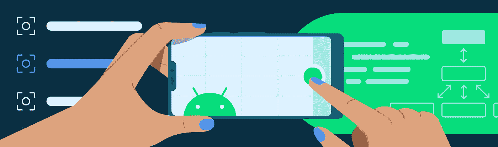
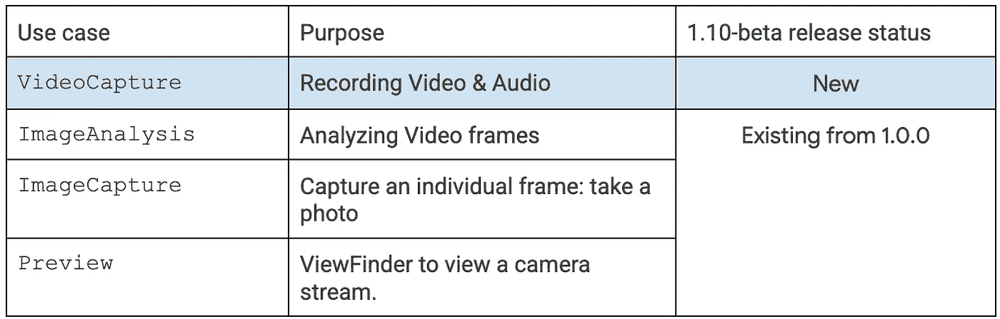
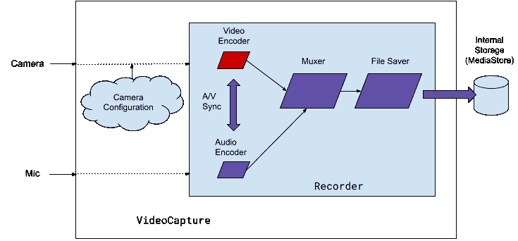
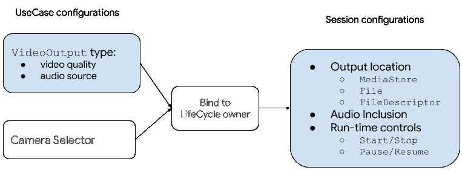
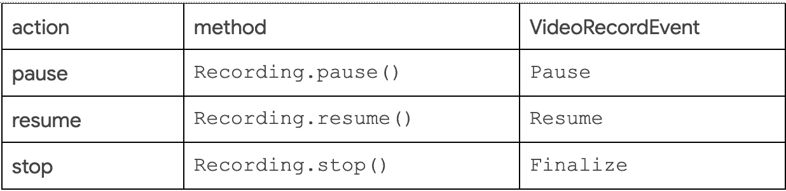

# 使用 CameraX VideoCapture API 录制视频

> 原文：<https://medium.com/androiddevelopers/recording-video-with-camerax-videocapture-api-a36cfd8a48c8?source=collection_archive---------1----------------------->

## 由软件工程师 Trevor McGuire 和 Android DevRel 工程师 Gerry Fan 发布

一张图片胜过千言万语，CameraX `[ImageCapture](https://developer.android.com/reference/androidx/camera/core/ImageCapture)` 已经让通过 Android 上的静态图像讲述你的故事变得更加容易。现在有了新的`VideoCapture API`，CameraX 可以帮助您创建数以千计的连续图片来讲述一个更好、更吸引人的故事！`[VideoCapture API](https://developer.android.com/reference/androidx/camera/video/VideoCapture)` 极大地简化了视频录制任务，以便您可以专注于尖端应用程序的其他重要部分！

在本帖中，我们将介绍新的`CameraX VideoCapture API`以及如何在您的应用中使用它。

# 设计为易于使用

`VideoCapture`是一款新的 CameraX `UseCase`，与其他三款预定义的`[UseCases](https://developer.android.com/training/camerax/preview)`一起满足您应用中不同的相机需求:

在架构层面，CameraX (1.1.0-beta01 及更高版本)中的 CameraX VideoCapture API 是这样工作的:

*   `VideoCapture`配置摄像机生成视频帧(启用视频稳定等。).
*   `Recorder`以适当的比特率对视频帧进行编码和压缩(如果启用了音频录制，还会与音频流同步)。
*   `Recorder`将视频和音频流合并成一个流。
*   `Recorder`将合并后的流写入磁盘上的文件。

这很可能类似于您已经熟悉的其他捕获系统，但请注意，它隐藏了使所有这些部分无缝协作所需的复杂逻辑。现在让我们看看如何启动`VideoCapture`会话。

在接口层面，应用在以下两个阶段配置一个`[VideoCapture UseCase](https://developer.android.com/reference/androidx/camera/video/VideoCapture)`:

*   首先，配置一个输出类型:`Recorder`是目前使用的类型，但是将来会有更多的类型。
*   其次，创建并配置一个`Recording`会话:可以从同一个`Recorder`创建多个记录，但是在任何时候都只能有一个处于活动状态(记录视频)。

这里是 API 配置步骤的高级视图。阴影部分是`VideoCapture API`的一部分:

# 使用视频捕获 API

与其他相机`UseCases`类似，按照以下通用步骤使用`VideoCapture`进行录制:

1.  添加 CameraX 依赖项。
2.  创建一个`VideoCapture UseCase`和一个`CameraSelector`。
3.  绑定到生命周期所有者。
4.  创建一个`Recording`会话(特定于`VideoCapture UseCase`)。
5.  启动和停止会话(特定于`VideoCapture UseCase`)。

下面的部分有详细信息。

# 添加 CameraX 依赖项

首先将 CameraX 库添加到您的依赖项中。`VideoCapture` 是用`camera-video`库实现的，但是您还需要其他 CameraX 库，所以我们建议简单地将它们全部添加进来，这样会更容易。从`1.1.0-beta01`版本开始，所有的 Camerax 组件都已经融合到统一的版本中:在`1.1.0-beta01`及以后的版本中，所有的组件都是同一个版本，包括`camera-video`。这使得管理依赖关系更加简单。

# 创建视频捕获用例

要创建一个`VideoCapture`实例，您的应用程序需要知道`VideoCapture UseCase`的`VideoOutput`的类型。在此版本中，`Recorder`执行文件录制，将录制的视频保存到本地存储器，在后面的步骤中进行描述。当构建`Recorder`对象时，您的应用程序可以使用默认设置或指定一个视频`Quality`，如下所述。

# 选择视频分辨率

视频分辨率在不同的硬件平台上有所不同。为了提供通用 API 并鼓励平台创新，CameraX 实现了这两个促进类:

*   `Quality`，用于指定目标分辨率，包括超高清(`UHD`)、全高清(`FHD`)、高清(`HD`)和标清(`SD`)。每个分辨率的确切尺寸取决于平台实现。
*   `QualitySelector`，用于从预定义的`Quality`分辨率中定义选择策略。

应用程序可以指定几个`Quality`选项中的一个，带或不带`FallbackStrategy`，以授权 CameraX 选择最佳的视频录制分辨率。例如，下面的代码用平台支持的最高分辨率创建了一个`QualitySelector`，如果最高分辨率不能用请求的`UseCase`组合或其他原因实现，让 CameraX 选择任何支持的分辨率。

类似地，应用程序也可以用一个有序的`Quality`选项列表指定一个`QualitySelector`，外加一个可选的`FallbackStrategy`。查看[参考文件](https://developer.android.com/reference/androidx/camera/video/QualitySelector#fromOrderedList(java.util.List%3Candroidx.camera.video.Quality%3E,%20androidx.camera.video.FallbackStrategy))了解使用细节。

应用程序还可以使用`QualitySelector`类，根据`Quality`和`Size`查询底层平台解析能力。例如，下面的代码可以提取支持的`VideoCapture Qualities`及其相应分辨率的列表:

请注意，当`UseCase`组合改变时，或者当需要额外的摄像机功能时，例如`Extensions`，返回的分辨率可能不被支持。出于这些原因，我们强烈建议在创建您的`QualitySelector`时设置一个后备策略。

# 创建一个记录器和一个视频捕获用例实例

有了`QualitySelector`，创建`Recorder`类型的`VideoCapture`很简单:

# 将用例绑定到生命周期摄像机

CameraX 提供了代表应用程序管理相机生命周期的接口`LifecycleCamera`。应用程序通过将一个`CameraSelector`和用例组合绑定到一个`LifecycleOwner`来创建一个`LifecycleCamera`，比如您的活动或片段:

上面的代码片段将一个`Preview`和`VideoCapture`的组合，默认的后置摄像头绑定到一个`[AndroidX Fragment](https://developer.android.com/jetpack/androidx/releases/fragment)`。当`LifecycleOwner`停止时，该摄像机将关闭，任何正在进行的记录也将自动停止。

您可以进一步配置从`ProcessCameraProvider.bindToLifecycle()`返回的`Camera`实例。例如，`Torch`可在录制前或录制过程中启用，而`Zoom`控件也可在录制过程中使用。详细说明参见[官方文件](https://developer.android.com/training/camerax/configuration#camera-output)。

注意这个步骤是所有 CameraX `UseCases`(如`Preview`、`ImageCapture`和`ImageAnalysis`)共有的。

在当前版本中，有效的`UseCase`组合有:

*   `VideoCapture` + `Preview` —支持所有摄像设备。
*   `VideoCapture` + `Preview` + `ImageCapture` —需要[限定](https://developer.android.com/reference/android/hardware/camera2/CameraMetadata#INFO_SUPPORTED_HARDWARE_LEVEL_LIMITED)及以上的摄像机 2 装置。
*   `VideoCapture` + `Preview` + `ImageAnalysis` —需要 Android N (API Level 24)及以上版本的 [LEVEL_3](https://developer.android.com/reference/android/hardware/camera2/CameraMetadata#INFO_SUPPORTED_HARDWARE_LEVEL_3) Camera2 设备。

你可以根据你的特殊要求建造一个`CameraSelector`;例如，下面的代码创建一个 LEVEL_3 摄像机设备`CameraSelector`(如果平台有一个的话):

要查看最新支持的组合，请查看文档。

# 创建录制会话

在`VideoCapture UseCase`绑定到`LifecycleCamera`之后，包含的`Recorder`就可以使用了，从`Recorder`开始，应用程序可以创建`Recording`实例来记录视频(和音频)。`Recording`有两个阶段，用于配置的`PendingRecording`阶段和用于运行时控制的**活动** `Recording`阶段:

你需要准备一把`Recording`，包括:

*   `OutputOptions`，可以是`Android MediaStore, File`，也可以是`FileDescriptor`
*   响应运行时记录事件的`VideoRecordEvent`监听器

并且可选地:

*   在本次录音中包含`Audio`(录音默认关闭)

在应用程序调用`start()`方法启动记录后，`PendingRecording`立即变成活动的`Recording`对象。`PendingRecording`类为配置`Recording`提供了一个流畅的 API，在大多数情况下不需要被应用程序存储。这个版本不支持并发记录，一个应用程序在任何时候都可以有一个活动的`Recording`。要录制多个剪辑，在当前捕获完成后创建一个新的`Recording`。

CameraX 视频捕获异步运行:应用程序请求(如开始捕获)将在后台执行器上发生；当这些请求确实由 CameraX 执行时，应用程序会在稍后通过捕获事件得到通知。从这个意义上说，应用程序在调用本文后面描述的`PendingRecording.start()`方法时，需要创建并传递一个`VideoRecordEvent`监听器。例如，下面的代码创建了一个简单的监听器来通知用户关于`Start`和`Finalize`事件的信息:

CameraX 实现了一组丰富的`[VideoRecordEvents](https://developer.android.com/reference/androidx/camera/video/VideoRecordEvent)`，包括`start()` 方法和其他我们将在下一节触及的方法。请务必查看 [API 文档](https://developer.android.com/reference/androidx/camera/video/VideoRecordEvent)以了解完整的事件和描述。作为一般准则，对于您使用的任何运行时控件，您都需要处理其对应的`VideoRecordEvent`。

需要注意的一点是，每个`VideoRecordEvent`都包含一个`RecordingStats`对象，指示音频和视频捕获统计信息，比如文件大小和当前录制的持续时间。您的应用程序可以使用此功能向用户显示录制进度。

一旦有了一个`VideoRecordEvent`监听器，创建一个`Recording`就很简单了。例如，下面的代码创建一个`Recording`来捕获 [Android](https://developer.android.com/reference/android/provider/MediaStore) `[MediaStore](https://developer.android.com/reference/android/provider/MediaStore)`中的一个媒体文件:

随着`Recording`的开始，现在让我们看看应用程序下一步可以做什么。

# 运行时控制录音

对于活动的`Recording`，应用程序可以采取以下动作:

所有对 CameraX `Recording`的运行时控制请求，包括`PendingRecording.start()`，都由`CameraX`异步执行:

1.  `CameraX`将请求排入队列，并立即将控制权返回给应用程序。
2.  `CameraX`当请求完成时，用相应的事件对象通知应用程序。

应用程序需要处理其`VideoRecordEvent`监听器中的事件，以便知道运行时控制请求的结果，并更新应用程序的其他部分，例如更新 UI 或回放捕获的视频。例如，下面的代码使用一个`Inten.ACTION_VIEW`来回放录制的视频:

这就是使用新的`CameraX VideoCapture` API 录制视频所需的全部内容！

# VideoCapture API 的下一步是什么？

与朋友和在社交媒体上分享视频比以往任何时候都更受欢迎，CameraX 希望帮助您支持这一增长趋势。我们正在考虑您所要求的新功能，例如缓冲区转换和在同一记录中使用多个摄像机源，并且我们将继续投资于 API，以在所有 Android 上为您提供简单一致的视频捕捉体验。

我们认为 CameraX 项目是我们的设备制造商 Android 和我们的相机应用程序开发者你们之间的合作。我们邀请您通过创建[拉动请求](https://github.com/androidx/androidx/tree/androidx-main/camera)，在 [CameraX 开发团队](https://groups.google.com/a/android.com/g/camerax-developers)中分享您的反馈和想法，或者在 [CameraX 问题跟踪器](https://issuetracker.google.com/issues/new?component=618491&template=1257717)中提交问题来加入这个项目。感谢您迄今为止提供的反馈！

要了解更多关于 CameraX 的信息，请访问[CameraX 文档](https://developer.android.com/training/camerax)、 [CameraX 代码实验室](https://developer.android.com/codelabs/camerax-getting-started#0)和 [github 示例](https://github.com/android/camera-samples)；为了跟上 CameraX 的最新发展，如果您还没有参加 CameraX 开发者论坛，请参加[。](https://groups.google.com/a/android.com/g/camerax-developers)