# 递归神经网络(RNN)教程-使用 Python 中的张量流分析序列数据

> 原文：<https://medium.com/edureka/recurrent-neural-networks-df945afd7441?source=collection_archive---------1----------------------->

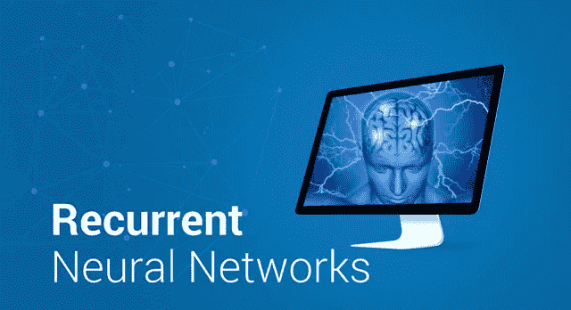

Recurrent Neural Networks — Edureka

在本文中，让我们讨论递归神经网络工作背后的概念。递归神经网络在图像和视频识别、音乐创作和机器翻译方面有着广泛的应用**。**

**我们将检验以下概念:**

*   **为什么不是前馈网络？**
*   **什么是递归神经网络？**
*   **如何训练递归神经网络？**
*   **消失和爆炸渐变**
*   **长短期记忆(LSTM)网络**
*   **LSTM 用例**

# **为什么不是前馈网络？**

**考虑一个**图像分类**用例，其中**训练**神经网络**对各种**动物的图像**进行分类。****

**所以，假设你**在一张**猫**或**狗的**图像**中给**喂食，**网络实际上提供了一张**输出**，上面分别有一张**对应标签**给猫或狗**的图像。****

请考虑下图:

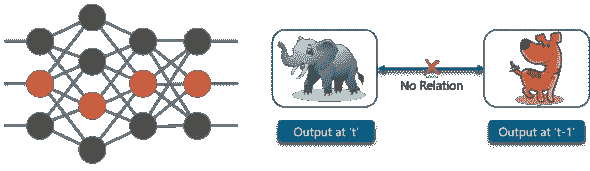

这里，作为**象**的**第一输出**将不会影响作为**狗的**先前输出**的**。**这意味着**‘t’**时刻的输出与**‘t-1’**时刻的输出**无关。****

考虑这个**场景**，其中您将要求**使用**先前获得的输出**中的**

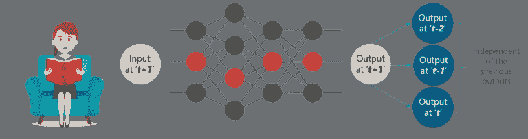

这个概念类似于**读**一本**书。**随着**进入每一页**，你需要**理解**前几页**的**才能让**完全理解**信息**在大多数**情况下。****

利用**前馈网络**，在时间**‘t+1’**的**新**输出与时间 t、t-1 或 t-2 的输出**没有关系。**

所以，当**预测**一个句子中的**单词**时，前馈网络**不能使用**，因为它与**之前的**组**单词没有**绝对关系。****

但是，有了**递归神经网络，**这个挑战可以被**克服。**

请考虑下图:

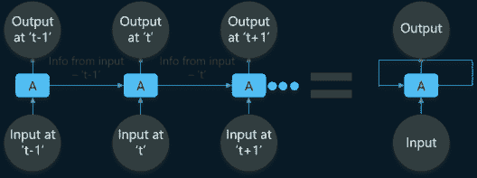

在上图中，我们在**‘t-1’**处有**某些输入**，这些输入**被**馈入网络。这些**输入**也将在时间‘t-1’导致**相应的输出**。

在**下一个时间戳，来自**前一个**输入‘t-1’的**信息沿着与在‘t’的**输入**一起被提供**，以最终**也在‘t’提供**输出**。****

**此过程**重复，**确保**最新输入**被**知晓**并且可以使用从先前**时间戳**获得的**信息**。**

**接下来，在这篇**递归神经网络**文章中，我们需要看看**什么是**递归神经网络(RNNs) **。****

# **什么是递归神经网络？**

**递归网络是一种**类型**的**人工神经网络**，设计用于**识别数据序列中的模式**，如**文本、**基因组、笔迹、口语词、数字时间**系列**传感器发出的数据、**股票市场**和**政府机构。****

**为了更清楚，考虑下面的**类比:****

**你定期去**健身房****并且**教练**已经给了你以下**时间表**供你锻炼:****

********

****注意，所有这些**练习**都是每周按顺序**重复**。**首先，让我们使用一个**前馈网络**来尝试和**预测**锻炼的类型。******

********

****输入为**日、月、**和**健康状态。**必须使用这些输入来**训练**神经网络，以便为我们提供****

****与**演习中的**预测**。******

**然而，考虑到输入，这将**不是非常精确**。为了**解决** **这个问题，**我们可以利用**递归神经网络**的概念，如下所示:**

**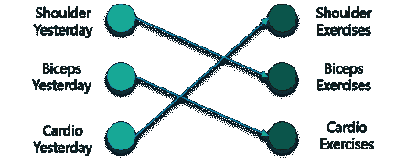**

**在这种情况下，将**输入**视为前一天在**完成的**锻炼**。****

**因此，如果你昨天做了肩部训练，你今天可以做二头肌训练，这也是第 22 周休息的 T21。**

**但是，如果您碰巧在健身房错过了****，那么来自**之前参加的时间戳**的数据可以被**视为**，如下所示:******

****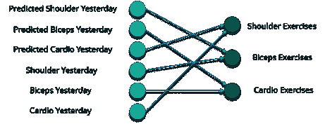****

****如果一个**模型**基于数据被训练，它可以**从**先前的练习中获得**，**模型的输出将**非常精确。******

**总而言之，让我们用**将**数据**转换成**向量。**嗯，**什么是矢量？******

****向量**是输入到**模型的**数字**如果**做了**练习**或**没有做，则**到**表示**。**

**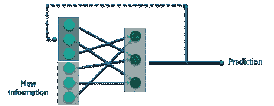**

**因此，如果您有一个**肩部练习，**对应的**节点**将是**‘1’**，**练习**的**休息**节点将被**映射到**‘0’。******

**让我们来看看**神经网络的**工作**背后的**数学**。**考虑以下图表:**

**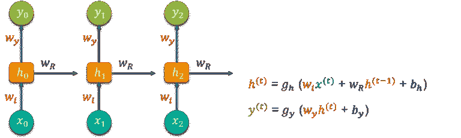**

**将**‘w’**视为**权重矩阵**，将**‘b’**视为**偏差:****

**在时间 **t=0 时，**输入为**【x0】**，任务是计算出什么是**【h0】。**将 **t=0** 代入**方程**，得到函数 **h(t)值。**接下来，当应用于**新公式时，使用**先前计算的值**找出**‘y0’**的值。****

**这个过程是**重复**到**模型中所有**时间戳**的**到**列车**的一个**模型。****

**那么，**递归神经网络**是如何训练的呢？******

# ****训练递归神经网络****

****递归神经网络使用反向传播算法进行训练，**但对于每个**时间戳，**应用**。**俗称**穿越时间的反向传播(BTT)。********

反向传播有一些问题，如:

*   **消失渐变**
*   **爆炸渐变**

让我们考虑一下每一个因素，以了解正在发生的事情

## 消失梯度

当使用**反向传播**时，**的目标**是**计算**误差**实际上是通过**找出**实际输出**和**模型输出**之间的**差值**并将其提高到 2 的幂。

请考虑下图:

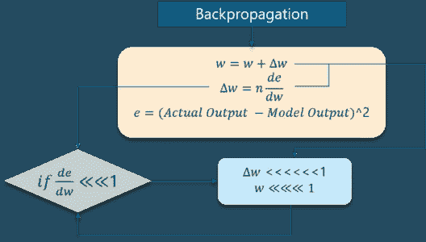

计算出**误差后，相对于**重量**中的**变化**计算出**中的**变化**。但是随着每个**学习**速率的增加，这个速率必须乘以**。**

**因此，**学习率**与变化**的**乘积**将**引导至**重量的**实际变化**值。****

**如图**所示，对于每个训练迭代，权重**的这种变化**被添加到旧的**组的** **权重**中。**这里的问题是当 **中的**变化** **乘以**时，**值**比**小很多。******

**假设你正在**预测**一个**句子**说，**“我要去** **法国”**而你想预测**“我要去法国，那里说的语言是 _ _ _ _ _”****

****大量的迭代**将导致新的权重**可以忽略不计**，这导致**权重没有**被更新**。****

## **爆炸梯度**

**爆炸梯度的工作与类似**但是**的重量在这里**剧烈变化**而不是**可以忽略的变化。**注意下图中**的微小变化**:******

****

**我们需要**克服这两个**，首先是**挑战**的**位**。考虑下面的图表:**

**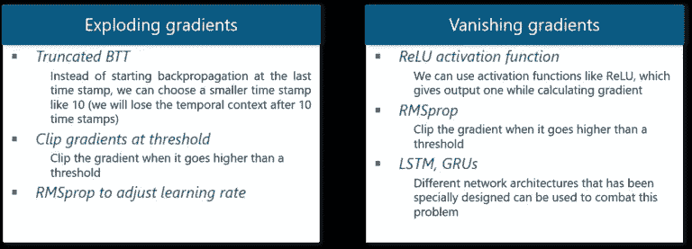**

**继续这篇关于递归神经网络的博客，我们将**进一步讨论 LSTM 网络。****

# **长短期记忆网络**

**长短期记忆网络通常被称为“LSTMs”。**

**它们是一种**特殊类型的**递归神经网络，能够**或**学习长期依赖关系。**

****什么是长期依赖？****

**很多时候，模型中只需要**最近的数据**来**执行操作。**但是从**数据**中可能会有一个**要求**，该数据是在过去**中**获得的**。****

**让我们看看下面的例子:**

**考虑一个**语言模型**试图根据前面的单词预测**下一个单词**。如果我们试图**预测**句子中的**最后一个词**说**“云在天上”**。**

**这里的上下文**非常简单**，最后一个单词始终以**天空**结束。在这种情况下，**过去信息**和**当前需求**之间的差距可以通过使用**递归神经网络**非常容易地**桥接**。******

所以，像**消失**和**爆炸梯度**不存在**的问题**，这使得 LSTM 网络可以轻松处理**长期依赖**。

LSTM 有一个**链状的**神经网络层。在标准的递归神经网络中，重复模块由一个**单一函数**组成，如下图所示:

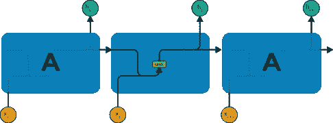

如上图所示，该层中有一个**双曲正切函数**。该功能是一个**挤压功能。**那么，**什么是挤压功能呢？**

它是一个**功能**，基本上用于-1 到+1 的**范围内，并根据**输入来**操纵**的**值**。****

现在，让我们考虑 LSTM 网络的**结构**:

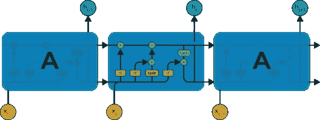

如图所示，对于 LSTM 网络，各层中的每个功能都有自己的结构。单元状态是图中的水平线，它的作用类似于传送带，在数据通道上线性传送某些数据。

让我们考虑一种循序渐进的方法来更好地理解 LSTM 网络。

## **第一步:**

**LSTM** 的第一步是**识别**那些**不需要**并将**从**单元状态中丢弃**的信息。**这个决定是由一个**s 形层**称为**忘浇口**层**做出的。**


上面的**高亮层**就是前面提到的**的**乙状结肠层**。**

通过考虑**新输入**和**先前时间戳**，最终**将**引向**输出**一个在 0 和 1 之间的数字**用于该**单元状态中的每个**数字**，从而**计算**完成**。******

作为典型的二进制， **1** 表示向 **kee** p 信元状态，而 **0** 表示向 **trash** it 信元状态。

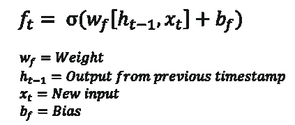

考虑**性别分类，**在使用**网络时，考虑**最新**和**正确的性别**真的很重要。**

## **第二步:**

下一步是**决定，**什么**新信息**我们要将**储存**在单元格状态。整个过程包括以下步骤:

*   一个称为“输入门层”的 **sigmoid 层**决定**哪些值**将被**更新。**
*   **双曲正切层**创建一个**新候选值**的**向量**，它可以被**添加到状态**。

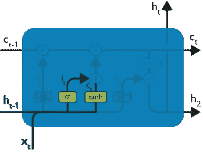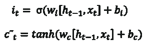

来自**先前时间戳**的输入和新输入通过 **sigmoid 函数**被**传递**，该函数给出值 **i(t)。**该值然后被**乘以 c(t)** ，然后被添加到**单元状态。**

在下一步中，这些**两个**被**组合**到**更新**到**状态。**

## **第三步:**

现在，我们将**更新**旧的**单元状态 ct1，**进入**新的**单元状态 **Ct。**

首先，我们**用 f(t)乘**旧的状态**(ct1)**，**忘记**我们**决定**早于**离开**的事情。

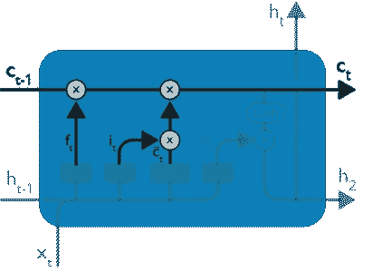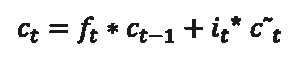

然后，我们**将 I _ t * c \\\\\\\\\\\\\\\\\\\\\\\\\\\\\\\\\\\\\\\\\\\\\\\\\\\\\\\\\\\\\\\\\\\\\\\\\\\\\\\\\\**

第二步，我们决定使用**数据**中的**数据**，该数据仅在**阶段需要。**

第三步，我们实际上**实现**它。

在之前讨论的**的语言案例示例中，**处的**旧性别**将被**丢弃**，而**新性别**将被**考虑。**

## **第四步:**

我们将运行一个 **sigmoid 层**，它决定了**单元状态**的哪些**部分**将被**输出。**

然后，我们通过 **tanh** 设置**单元状态**(将值推到 1 和 1 之间)

后来，我们**将**乘以**s 形门**的**输出**，这样我们只输出我们决定的**部分**。

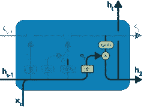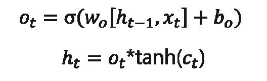

这一步中的**计算**非常简单**最终**导致**输出。******

然而，**输出**仅由**输出**组成，在**之前的**步骤中决定将**结转**，而不是所有的**输出**。

总结所有 4 个步骤:

在**第一个**步骤中，**我们找出了需要丢弃的东西。**

**第二个**步骤包括向网络添加新的输入。

**第三个**步骤是**合并先前获得的输入，以生成新的单元状态。**

最后，我们按照要求达到了**的输出。**

接下来，让我们考虑一个**有趣的用例。**

# 用例:长短期记忆网络

我们将**考虑到**的用例是**在一个示例短篇故事中预测**的**下一个单词**。

我们可以从**向**输入一个 **LSTM** 网络开始，该网络具有来自作为**输入**和 1 个标记符号的 3 个**符号**的文本的**正确序列**。

最终，神经网络将**学习**以**正确预测**下一个符号**！**

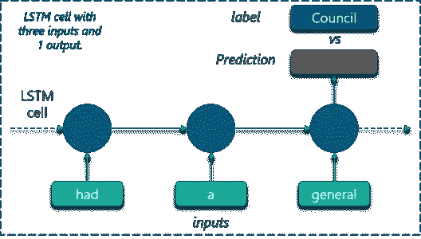

## **数据集:**

使用由 **112 个独特符号组成的**样本短篇故事**来训练 LSTM。逗号**和**句号**也被**认为**是**的唯一符号**。

很久以前，老鼠们开了一个全体会议，考虑采取什么措施来智取它们共同的敌人——猫。有些人这样说，有些人那样说，但最后一只年轻的老鼠站起来说，他有一个建议，他认为会满足的情况。你们都会同意，他说，我们的主要危险在于敌人向我们逼近的狡猾和奸诈的方式。现在，如果我们能收到一些她接近的信号，我们就能轻易地逃离她。因此，我斗胆提议买一个小铃铛，用丝带系在猫的脖子上。通过这种方法，我们应该总是知道她什么时候在附近，当她在附近的时候，我们可以很容易地退休。这个提议得到了普遍的掌声，直到一只老老鼠站起来说，这一切都很好，但是谁来给猫系上铃铛呢？老鼠们面面相觑，谁也不说话。然后老老鼠说提出不可能的补救办法很容易。”

## **培训:**

我们已经知道**lstm**只能**理解实数。**所以第一个**要求**是**根据**出现的**频率**将**唯一符号转换为**唯一整数**值。**

这样做将创建一个**定制的字典**，我们可以**稍后使用它来**映射**这些值。**

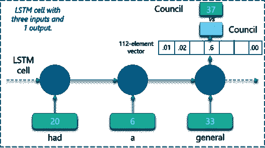

在上图中，**某些符号**被映射为**整数**，如图所示。

网络将创建一个 **112 元素向量**，该向量由这些唯一整数值中的每一个的**出现**的**概率**组成。

**实现:**

代码使用 Tensorflow 实现，如下所示:

```
import numpy as np
import tensorflow as tf
from tensorflow.contrib import rnn
import random
import collections
import time

start_time = time.time()

def elapsed(sec):
    if sec<60:
        return str(sec) + " sec"
    elif sec<(60*60): return str(sec/60) + " min" else: return str(sec/(60*60)) + " hr" # Target log path logs_path = '/tmp/tensorflow/rnn_words' writer = tf.summary.FileWriter(logs_path) 
# Text file containing words for training training_file = 'Story.txt' def read_data(fname): with open(fname) as f: content = f.readlines() content = [x.strip() for x in content] content = [content[i].split() for i in range(len(content))] content = np.array(content) content = np.reshape(content, [-1, ]) return content training_data = read_data(training_file) print("Loaded training data...") def build_dataset(words): count = collections.Counter(words).most_common() dictionary = dict() for word, _ in count: dictionary[word] = len(dictionary) reverse_dictionary = dict(zip(dictionary.values(), dictionary.keys())) return dictionary, reverse_dictionary dictionary, reverse_dictionary = build_dataset(training_data) vocab_size = len(dictionary) 
# Parameters learning_rate = 0.001 training_iters = 50000 display_step = 1000 n_input = 3 
# number of units in RNN cell n_hidden = 512 
# tf Graph input x = tf.placeholder("float", [None, n_input, 1]) y = tf.placeholder("float", [None, vocab_size]) 
# RNN output node weights and biases weights = { 'out': tf.Variable(tf.random_normal([n_hidden, vocab_size])) } biases = { 'out': tf.Variable(tf.random_normal([vocab_size])) } def RNN(x, weights, biases): 
# reshape to [1, n_input] x = tf.reshape(x, [-1, n_input])
# Generate a n_input-element sequence of inputs 
# (eg. [had] [a] [general] -> [20] [6] [33])
    x = tf.split(x,n_input,1)

    # 2-layer LSTM, each layer has n_hidden units.
    # Average Accuracy= 95.20% at 50k iter
    rnn_cell = rnn.MultiRNNCell([rnn.BasicLSTMCell(n_hidden),rnn.BasicLSTMCell(n_hidden)])

    # 1-layer LSTM with n_hidden units but with lower accuracy.
    # Average Accuracy= 90.60% 50k iter
    # Uncomment line below to test but comment out the 2-layer rnn.MultiRNNCell above
    # rnn_cell = rnn.BasicLSTMCell(n_hidden)

    # generate prediction
    outputs, states = rnn.static_rnn(rnn_cell, x, dtype=tf.float32)

    # there are n_input outputs but
    # we only want the last output
    return tf.matmul(outputs[-1], weights['out']) + biases['out']

pred = RNN(x, weights, biases)

# Loss and optimizer
cost = tf.reduce_mean(tf.nn.softmax_cross_entropy_with_logits(logits=pred, labels=y))
optimizer = tf.train.RMSPropOptimizer(learning_rate=learning_rate).minimize(cost)

# Model evaluation
correct_pred = tf.equal(tf.argmax(pred,1), tf.argmax(y,1))
accuracy = tf.reduce_mean(tf.cast(correct_pred, tf.float32))

# Initializing the variables
init = tf.global_variables_initializer()

# Launch the graph
with tf.Session() as session:
    session.run(init)
    step = 0
    offset = random.randint(0,n_input+1)
    end_offset = n_input + 1
    acc_total = 0
    loss_total = 0

    writer.add_graph(session.graph)

    while step < training_iters: # Generate a minibatch. Add some randomness on selection process. if offset > (len(training_data)-end_offset):
            offset = random.randint(0, n_input+1)

        symbols_in_keys = [ [dictionary[ str(training_data[i])]] for i in range(offset, offset+n_input) ]
        symbols_in_keys = np.reshape(np.array(symbols_in_keys), [-1, n_input, 1])

        symbols_out_onehot = np.zeros([vocab_size], dtype=float)
        symbols_out_onehot[dictionary[str(training_data[offset+n_input])]] = 1.0
        symbols_out_onehot = np.reshape(symbols_out_onehot,[1,-1])

        _, acc, loss, onehot_pred = session.run([optimizer, accuracy, cost, pred], \
                                                feed_dict={x: symbols_in_keys, y: symbols_out_onehot})
        loss_total += loss
        acc_total += acc
        if (step+1) % display_step == 0:
            print("Iter= " + str(step+1) + ", Average Loss= " + \
                  "{:.6f}".format(loss_total/display_step) + ", Average Accuracy= " + \
                  "{:.2f}%".format(100*acc_total/display_step))
            acc_total = 0
            loss_total = 0
            symbols_in = [training_data[i] for i in range(offset, offset + n_input)]
            symbols_out = training_data[offset + n_input]
            symbols_out_pred = reverse_dictionary[int(tf.argmax(onehot_pred, 1).eval())]
            print("%s - [%s] vs [%s]" % (symbols_in,symbols_out,symbols_out_pred))
        step += 1
        offset += (n_input+1)
    print("Optimization Finished!")
    print("Elapsed time: ", elapsed(time.time() - start_time))
    print("Run on command line.")
    print("\ttensorboard --logdir=%s" % (logs_path))
    print("Point your web browser to: [http://localhost:6006/](http://localhost:6006/)")
    while True:
        prompt = "%s words: " % n_input
        sentence = input(prompt)
        sentence = sentence.strip()
        words = sentence.split(' ')
        if len(words) != n_input:
            continue
        try:
            symbols_in_keys = [dictionary[str(words[i])] for i in range(len(words))]
            for i in range(32):
                keys = np.reshape(np.array(symbols_in_keys), [-1, n_input, 1])
                onehot_pred = session.run(pred, feed_dict={x: keys})
                onehot_pred_index = int(tf.argmax(onehot_pred, 1).eval())
                sentence = "%s %s" % (sentence,reverse_dictionary[onehot_pred_index])
                symbols_in_keys = symbols_in_keys[1:]
                symbols_in_keys.append(onehot_pred_index)
            print(sentence)
        except:
            print("Word not in dictionary")
```

*这就把我们带到了“递归神经网络”这篇文章的结尾。我希望这篇文章对你有所帮助，并增加了你的知识价值。*

如果你希望查看更多关于人工智能、DevOps、道德黑客等市场最热门技术的文章，那么你可以参考 [Edureka 的官方网站。](https://www.edureka.co/blog/?utm_source=medium&utm_medium=content-link&utm_campaign=recurrent-neural-networks)

请留意本系列中的其他文章，它们将解释深度学习的各个其他方面。

> 1. [TensorFlow 教程](/edureka/tensorflow-tutorial-ba142ae96bca)
> 
> 2. [PyTorch 教程](/edureka/pytorch-tutorial-9971d66f6893)
> 
> 3.[感知器学习算法](/edureka/perceptron-learning-algorithm-d30e8b99b156)
> 
> 4.[神经网络教程](/edureka/neural-network-tutorial-2a46b22394c9)
> 
> 5.[什么是反向传播？](/edureka/backpropagation-bd2cf8fdde81)
> 
> 6.[卷积神经网络](/edureka/convolutional-neural-network-3f2c5b9c4778)
> 
> 7.[胶囊神经网络](/edureka/capsule-networks-d7acd437c9e)
> 
> 8.[tensor flow 中的物体检测](/edureka/tensorflow-object-detection-tutorial-8d6942e73adc)
> 
> 9.[自动编码器教程](/edureka/autoencoders-tutorial-cfdcebdefe37)
> 
> 10.[受限玻尔兹曼机教程](/edureka/restricted-boltzmann-machine-tutorial-991ae688c154)
> 
> 11. [PyTorch vs TensorFlow](/edureka/pytorch-vs-tensorflow-252fc6675dd7)
> 
> 12.[用 Python 进行深度学习](/edureka/deep-learning-with-python-2adbf6e9437d)
> 
> 13.[人工智能教程](/edureka/artificial-intelligence-tutorial-4257c66f5bb1)
> 
> 14.[张量流图像分类](/edureka/tensorflow-image-classification-19b63b7bfd95)
> 
> 15.[人工智能应用](/edureka/artificial-intelligence-applications-7b93b91150e3)
> 
> 16.[如何成为一名人工智能工程师？](/edureka/become-artificial-intelligence-engineer-5ac2ede99907)
> 
> 17.[问学习](/edureka/q-learning-592524c3ecfc)
> 
> 18. [Apriori 算法](/edureka/apriori-algorithm-d7cc648d4f1e)
> 
> 19.[马尔可夫链与 Python](/edureka/introduction-to-markov-chains-c6cb4bcd5723)
> 
> 20.[人工智能算法](/edureka/artificial-intelligence-algorithms-fad283a0d8e2)
> 
> 21.[机器学习的最佳笔记本电脑](/edureka/best-laptop-for-machine-learning-a4a5f8ba5b)
> 
> 22.[12 大人工智能工具](/edureka/top-artificial-intelligence-tools-36418e47bf2a)
> 
> 23.[人工智能(AI)面试问题](/edureka/artificial-intelligence-interview-questions-872d85387b19)
> 
> 24. [Theano vs TensorFlow](/edureka/theano-vs-tensorflow-15f30216b3bc)
> 
> 25.[什么是神经网络？](/edureka/what-is-a-neural-network-56ae7338b92d)
> 
> 26.[模式识别](/edureka/pattern-recognition-5e2d30ab68b9)
> 
> 27.[人工智能中的阿尔法贝塔剪枝](/edureka/alpha-beta-pruning-in-ai-b47ee5500f9a)

*原载于 2018 年 11 月 28 日*[*www.edureka.co*](https://www.edureka.co/blog/recurrent-neural-networks/)*。*