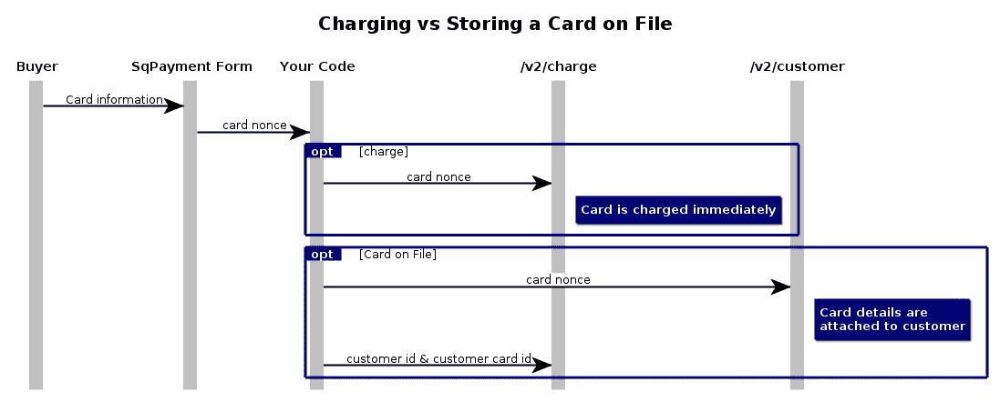
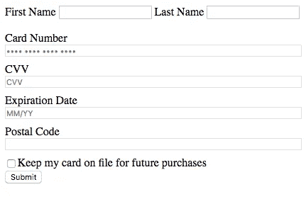

# PHP 和信用卡的重复收费

> 原文：<https://medium.com/square-corner-blog/recurring-charges-with-php-and-card-on-file-60f2bcb9aeac?source=collection_archive---------3----------------------->

> 注意，我们已经行动了！如果您想继续了解 Square 的最新技术内容，请访问我们在 https://developer.squareup.com/blog[的新家](https://developer.squareup.com/blog)

无论你有订阅服务，还是你想重复收费的固定客户，你都可以使用 Square 的电子商务 API 和 Card on File。

将客户的卡存档几乎等同于用 Square 的电子商务 API 向其收费。关键的区别在于，不是向`charge`端点提交卡随机数，而是将它附加到客户，然后提交该客户的附属卡进行收费。



High level diagram of storing a card on file vs charging directly.

现在让我们从代码的角度深入了解一下这是什么样子。首先，终端用户需要将他们的卡信息输入到 [SqPaymentForm](https://docs.connect.squareup.com/articles/adding-payment-form) 中。第一次存储用户的信用卡时，这是必需的；您不能将之前记录的信用卡号(或 PAN)发送给我们并将其附加到客户。在很大程度上，我们将从文档站点复制&粘贴示例表单，并添加了一个重要的内容。我们还必须**添加一个复选框，通知购买者他们的卡将被保存以备将来购买。如我们的文档中所述，在未获得买家许可的情况下链接卡可能会导致您的应用被禁用。**

接下来，我们将添加输入来指定我们希望将卡附加到的客户的信息。在生产情况下，您将收取定期付款或订阅费用，您可能希望您的客户登录到您的应用程序或网站，并使用他们登录状态的信息来识别他们是特定的客户。因为这是一个例子，所以我在填写表单时添加了名和姓，并创建一个新客户，以便每次都将卡附在文件上。



Always ask to keep a card on file!

修改后的卡表单启动并运行后，我们就可以开始编写处理支付的代码了。我们网页上的表单将生成一个 card nonce，然后将它和客户信息一起发布到一个不同的 php 脚本`process-card.php`。该页面将使用 [Square 的 PHP SDK](https://github.com/square/connect-php-sdk) 创建一个新客户，使用 card nonce 将卡附加到客户，用于将来的订阅计费，然后对卡收费。让我们开始吧:

## 创建客户

由于我们使用的是 PHP SDK，创建客户的大部分艰苦工作都隐藏在一些有用的函数中。我们需要做的就是将客户的详细信息(在我们的例子中是名和姓)传递给`createCustomer()`方法，瞧，我们已经创建了一个客户。

```
try {
 $result = $api_instance->createCustomer(
  array(
   'given_name'=> $first_name,
   'family_name'=> $last_name
   )
  );
 $customer = $result->getCustomer(); 
} catch (Exception $e) {
 echo 'Exception when calling CustomersApi->createCustomer: ', $e->getMessage(), PHP_EOL;
}
```

我们的客户就位后，下一步是将卡(由生成的 nonce 表示)添加到客户。同样，PHP SDK 将承担大部分繁重的工作:

```
try {
 $result = $api_instance->createCustomerCard(
  $customer_id,
  array(
   "card_nonce"=>$_POST['nonce'],
   "billing_address"=>array(
    'postalCode' => $postal_code
    )
   )
  );
 $customer_card = $result->getCard();
```

既然我们已经将卡附在客户身上，我们就可以使用该信息进行收费。这就像直接使用卡随机数进行收费一样，但是我们将为`charge`端点提供我们想要收费的`customer_id`和`customer_card_id`，而不是卡随机数:

```
$transaction_api = new SquareConnect\Api\TransactionsApi();try {
 $result = $transaction_api->charge(
  $location_id,
  array(
   'idempotency_key' => uniqid(),
   'amount_money' => array(
    'amount' => 200, 'currency' => 'USD'
    ),
   'customer_id' => $customer->getId(),
   'customer_card_id' => $customer_card->getId(),
   'note' => 'Subscription Billing'
   ));
 print_r($result);
} catch (Exception $e) {
 echo 'Exception when calling TransactionsApi->charge: ', $e->getMessage(), PHP_EOL;
}
```

哒哒！这就是在文件上对卡收费的全部内容。在月初，或者下一次您想要收取重复费用时，您只需要执行最后一步，并向客户收费(因为客户及其卡已经存在)。

如果你想了解更多关于 Square 定期支付的信息，请查看官方的[文档](https://docs.connect.squareup.com/articles/processing-recurring-payments-ruby)，以及相关端点的 [API 参考](https://docs.connect.squareup.com/api/connect/v2/)。一如既往，关注这篇博客和 twitter 上的 [@SquareDev](https://twitter.com/squaredev) ，了解最新的产品发布和更多的技巧&窍门。