# Redesign Shipper Homepage

> 原文：<https://medium.easyread.co/redesign-shipper-homepage-4f0ad938d8d6?source=collection_archive---------1----------------------->

## Bagaimana saya melakukan Redesign Shipper Homepage?

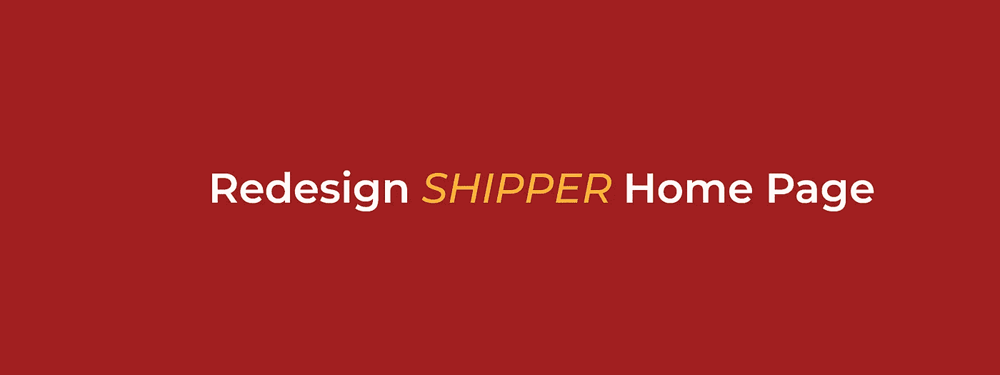

# Tahap 1: Research

Tahapan pertama yang saya lakukan ketika melakukan *redesign shipper homepage* adalah melakukan *research. Research* yang saya lakukan disini adalah melakukan *breakdown* pada komponen-komponen informasi yang ada pada halaman *home* [Shipper](https://shipper.id/) , kemudian mencari hal-hal yang saya rasa kurang tepat penggunaannya dan dapat diperbaiki.

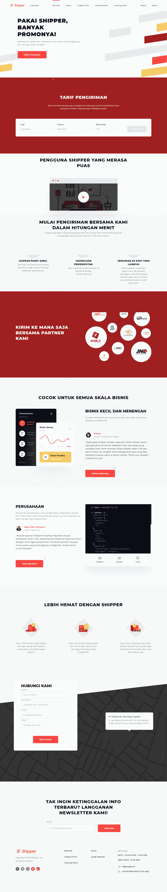

*Shipper Current Homepage*

Berdasarkan hasil *research* yang saya lakukan ini, saya menyimpulkan beberapa poin tersebut.

## a. Breakdown Komponen

Setelah memantau secara sekilas, berikut adalah beberapa komponen yang ada di *homepage* Shipper

***Header —*** Berisi logo serta menu-menu dari website

***Welcoming —*** Pada bagian ini, ditampilkan tagline-tagline dari Shipper itu sendiri. Tujuannya adalah untuk memberikan informasi agar pengguna paham mengenai garis besar dari bisnis.

***Tarif Pengiriman —*** Mengarahkan pengguna untuk melakukan pengecekan tarif pengiriman barang yang tersedia.

***Tentang Shipper —*** Menampilkan video penjelasan singkat tentang layanan Shipper

***Partner —*** Menampilakn semua *partner* kurir yang bekerja sama denga Shipper

***Bisnis —*** Menjelaskan tentang *customer* yang cocok untuk menggunakan layanan ini

***Keunggulan —*** Memaparkan keunggulan Shipper dalam segi biaya.

***Hubungi Kami —*** Form untuk mengirimkan email dan alamat kantor Shipper

***Newsletter —*** Form untuk pendaftaran *newsletter*

***Footer —*** Berisi informasi terkait jam operasional, alamat, *link* ke sosial media dan lainnya.

## b. Komentar

Melalui *breakdown* yang saya lakukan, saya menarik kesimpulan bahwa *design* dari *homepage* tersebut sudah sangat baik, dari sisi UI baik pemilihan warna dan *font* sudah sangat tepat dan dari sisi UX informasi yang disajikan juga singkat padat dan jelas.

Namun, menurut saya terdapat beberapa hal yang mungkin bisa diperbaiki dari *design homepage* ini. Seperti peletakan komponen yang lebih baik, penggunaan kalimat dan lain sebagainya.

Selain itu juga, fokus utama *redesign* ini tidak akan mengubah seluruh informasi yang tersedia namun akan memaksimalkannya.

# Tahap 2: (Re)design

Pada tahap ini, saya melakukan *redesign* komponen per komponen dari *homepage* yang ada. Hal ini akan membantu saya dalam prosesnya agar lebih rapi dan teratur.

## Redesign Part 1 — Header, Welcoming & Cek Tarif

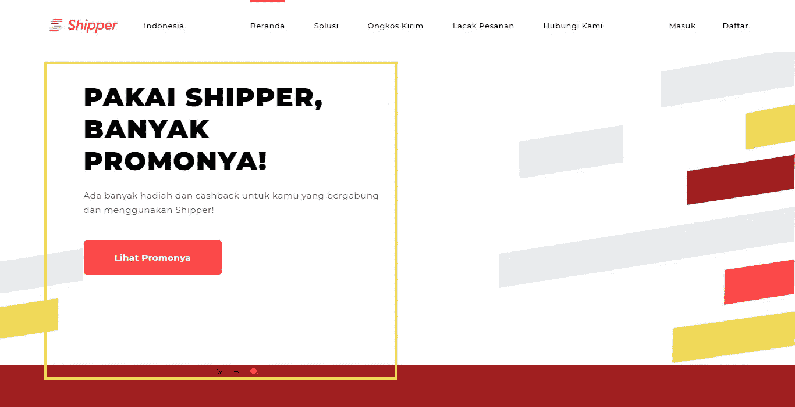

Header dan Welcoming

Pada bagian diatas, bisa dimanfaatkan untuk menampilkan *carousel* promo - promo dari Shipper dengan tujuan menambah ketertarikan calon *customer* untuk memakai Shipper *.* Sebenarnya untuk komponen *welcoming* tujuannya baik yaitu memberi info sekilas terkait apa itu Shipper, tujuannya untuk orang awam yang tidak mengetahui Shipper.

Berikut informasi yang diberikan pada bagian yang saya berikan persegi kuning.

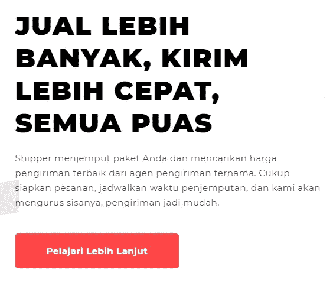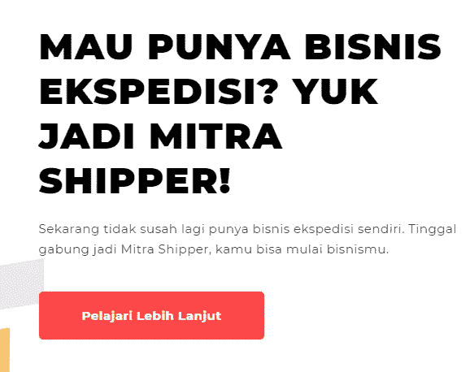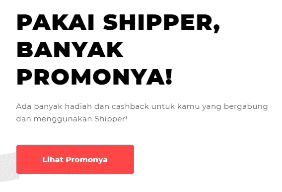

Info pada Komponen Welcoming

Saya ingin memastikan apakah informasi diatas perlu ditampilkan atau tidak, maka dari itu saya melakukan *web analytics* tentang kata kunci yang sering digunakan untuk menemukan Shipper di *Google.*

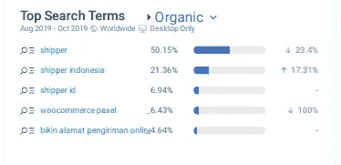

Organic Search

Dari data diatas, tiga kata kunci yang paling tinggi digunakan orang agar bisa mengakses Shipper adalah kata *shipper* itu sendiri. Dari sini saya bisa menyimpulkan bahwa orang-orang yang melakukan pencarian tersebut sudah paham atau sudah mengerti Shipper itu apa, maka penempatan info pengenalan Shipper di atas tidak menjadi hal utama untuk ditampilkan.

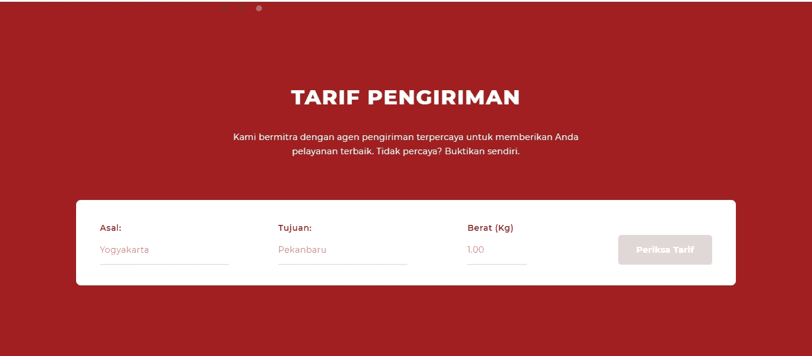

Cek Tarif

Pada komponen cek tarif di atas, pengguna harus melakukan *scroll* agar bisa melihat bagian tersebut. Alangkah baiknya saat pengguna mengakses Shipper *,* mereka langsung bisa fokus ke tarif pengioriman dan secara tidak langsung bisa menambah *insight* bahwa Shipper adalah jasa pengiriman barang.

Maka dari hasil diatas, saya membuat *redesign* seperti gambar dibawah ini.

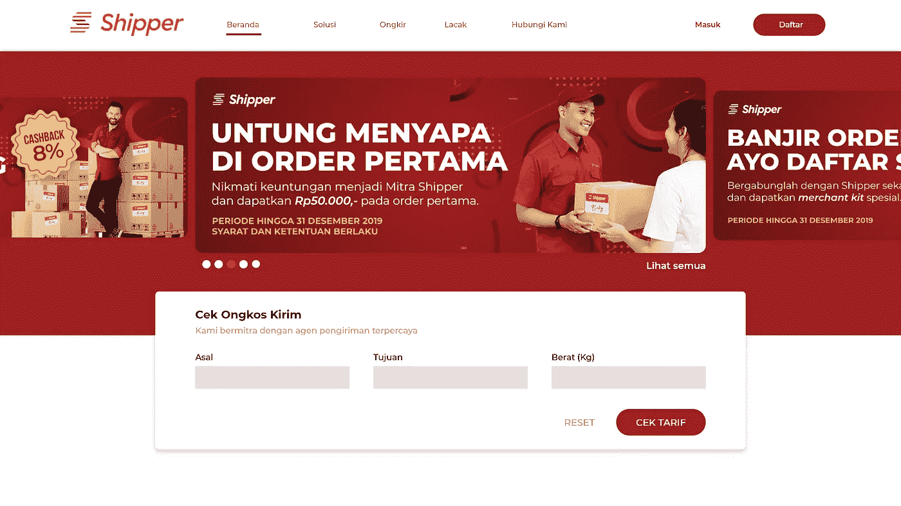

Redesign Part 1

## Redesign Part 2 — Tentang Shipper

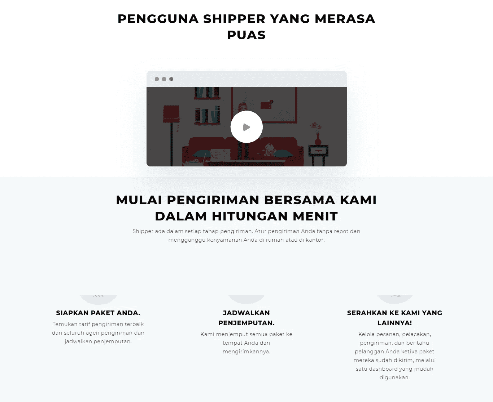

Tentang Shipper

Pada komponen diatas, terlihat judul yang besar **“Pengguna Shipper yang merasa puas”,** namun video yang ditampilkan adalah video yang menjelaskan layanan dari Shipper dan bukan testimoni *customer.* Untuk bagian yang menjelaskan proses saat menggunakan layanan Shipper menurut saya sudah tepat.

Jadi berikut hasil dari *redesign* nya

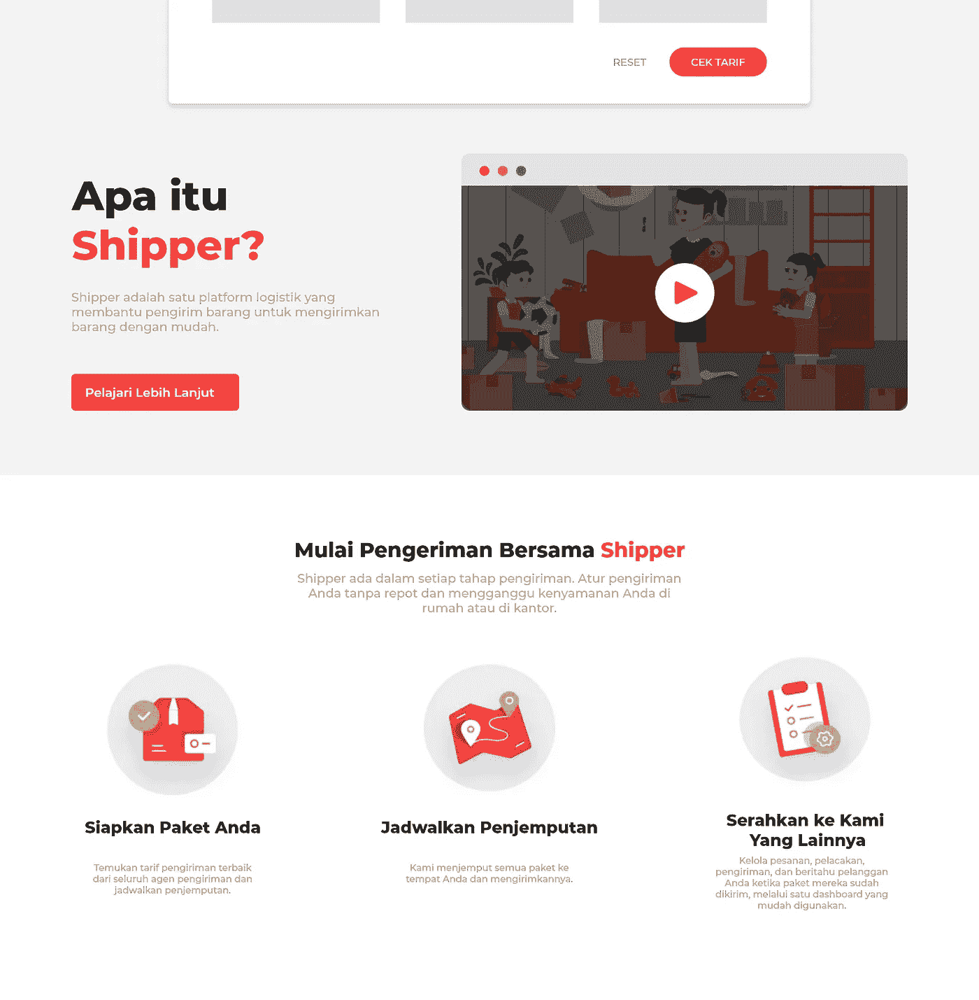

Redesign Part 2

## Redesign Part 3 — Partner & Bisnis

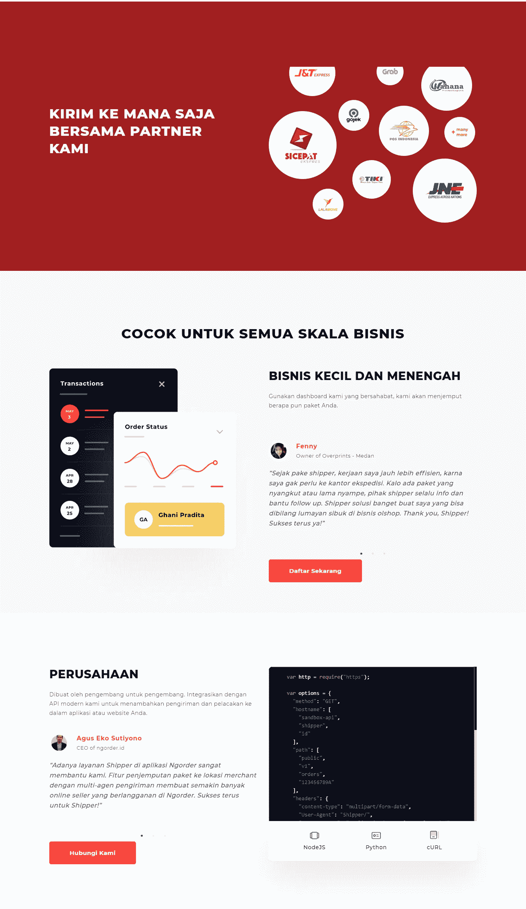

Partner dan Bisnis

Untuk bagian yang menampilkan partner dari Shipper dalam urusan logistik dan pengiriman menurut saya terlalu banyak memakan tempat untuk informasi yang tidak banyak. Maka dari itu lebih baik diberikan *space* yang sedikit saja.

Bagian skala bisnis juga demikian, terlalu memakan *space* sehingga saya harus sedikit repot untuk melakukan *scroll* untuk informasi tersebut.

Maka dari itu, berikut hasil *redesign* yang saya buat lebih minim *space* tapi tetap menyampaikan informasi dengan baik.

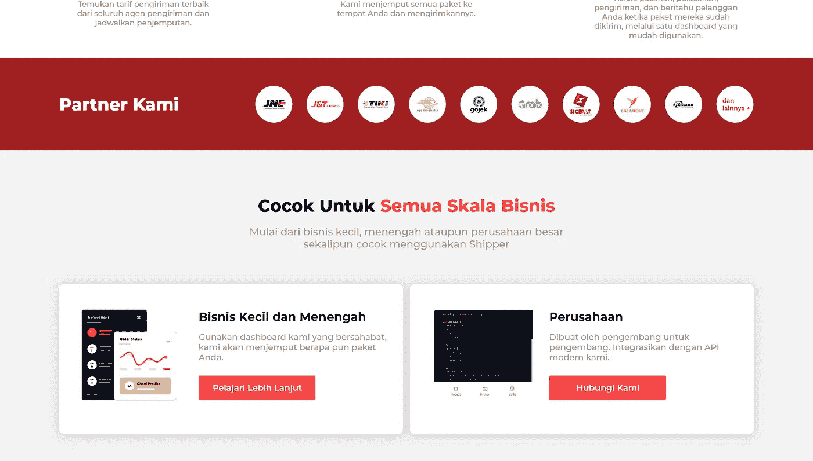

Redesign Part 3

## Redesign Part 4 — Keunggulan, Hubungi Kami & Newsletter

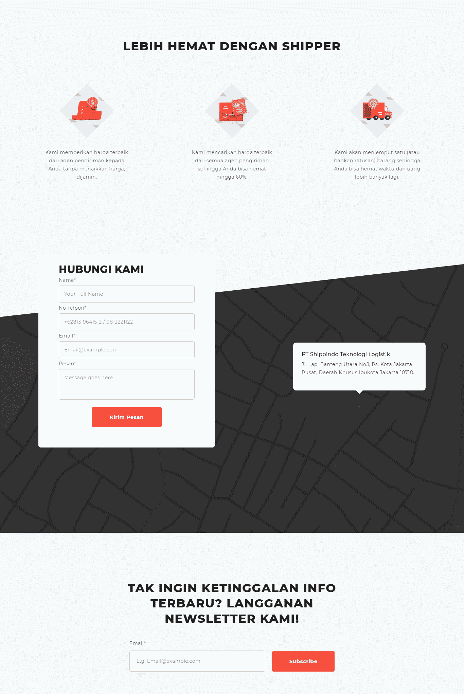

Keunggulan, Hubungi Kami, Newsletter

Pada bagian ini sudah sangat baik, tapi masih ada komponen yang menurut saya terlalu banyak memakan *space* seperti pada bagian hubungi kami dan juga ada yang tidak konsistenan dalam penggunaan bahasa di dalam *form* tersebut

Maka, berikut hasil *redesign* nya

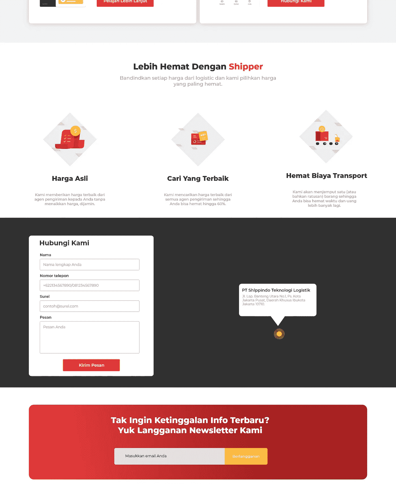

Redesign Part 4

## Redesign Part 5 — Footer

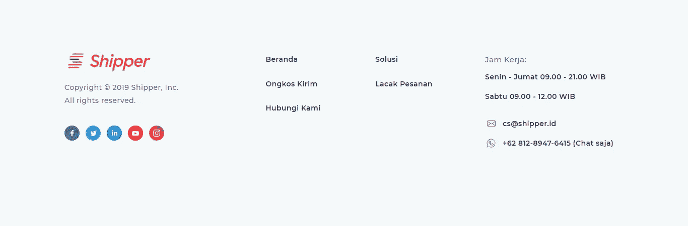

Footer

Pada bagian ini hanya sedikit yang saya ubah. Seperti penyesuaian *font* dan warna yang saya pakai serta komponen seperti *link to FAQ* atau lainnya.

Berikut hasil *redesign* nya

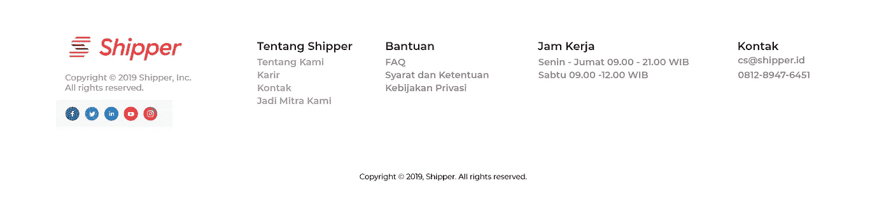

Redesign Part 5

# Tahap 3: Finalisasi

Akhirnya setelah dilakukan *redesign* terhadap semua komponen, maka saya melakukan *review* ulang *design* saya dan kebetulan tidak menemukan kekurangan terkait konten dan lainnya, nah inilah *full design* dari *homepage Shipper.*

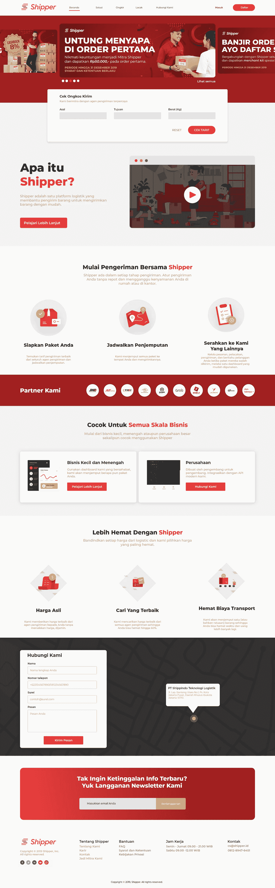

Shipper Redesign

# Penutup

Proses *redesign* sebenarnya tidak terlalu banyak mengubah dari sisi UI *,* tapi lumayan banyak untuk sisi UX nya. Yuk kita bandingkan dulu *design existing* dengan hasil saya heheh.

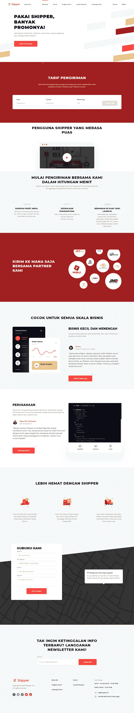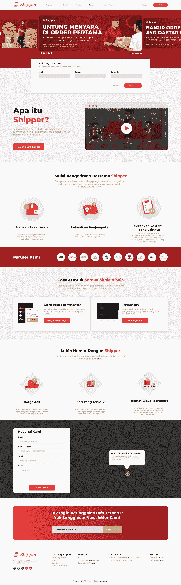

Current vs New

Yuk dikomen, kira kira suka gak dengan *design* saya yang baru? Atau malah lebih *prefer* ke *existing design* ?

Nah, begitu lah tahap proses saya melakukan *redesign,* yuk teman teman boleh berikan komentar, mungkin saya ada kurangnya, atau mungkin metode yang saya pake tidak tepat atau gimana. Mari bertumbuh bersama 😄

Lihat juga hasilnya di dribble saya :

 [## Redesign Shipper - Homepage

### Hi, I'm doing redesign for Shipper homepage. I wrote the process on my Medium. Please check…

dribbble.com](https://dribbble.com/shots/8342134-Redesign-Shipper-Homepage) 

Cek juga hasil design saya yang lain di Dribble
[https://dribbble.com/samuelchrstns](https://dribbble.com/samuelchrstns)

Jika butuh jasa UI/UX Design boleh mampir dulu ke studio design saya
[https://www.instagram.com/seredsgn/](https://www.instagram.com/seredsgn/)