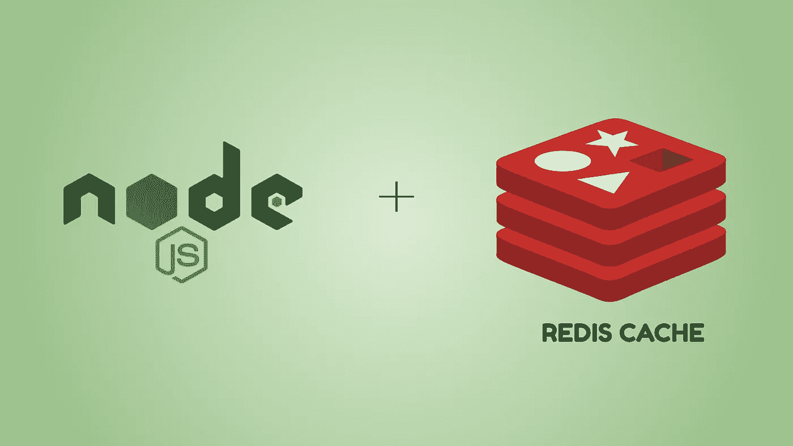
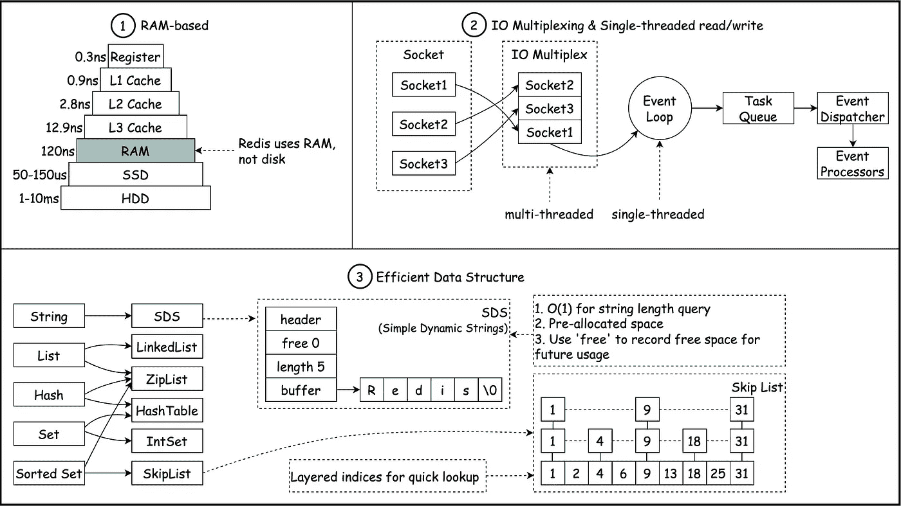
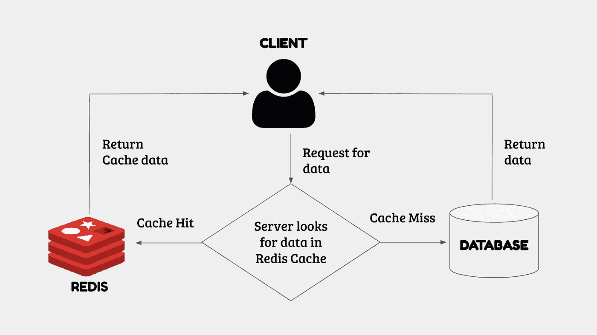
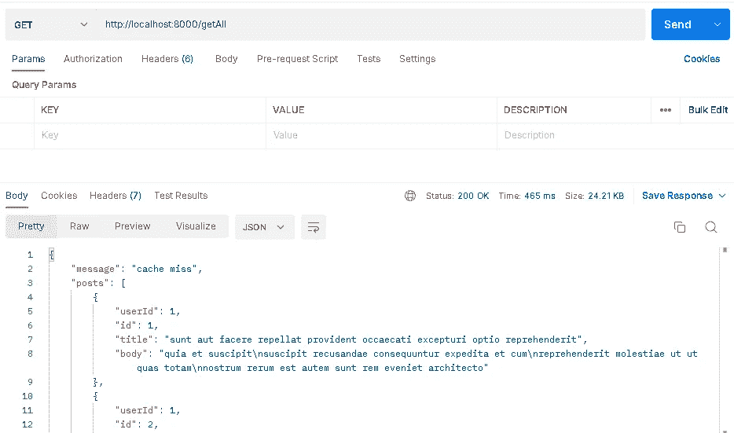
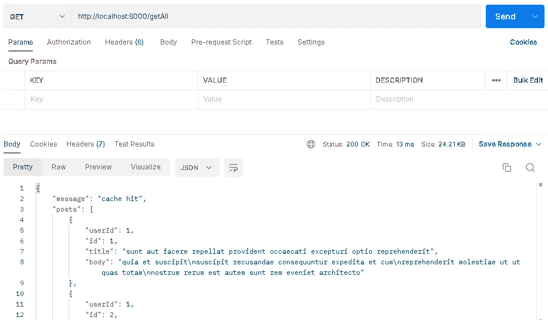
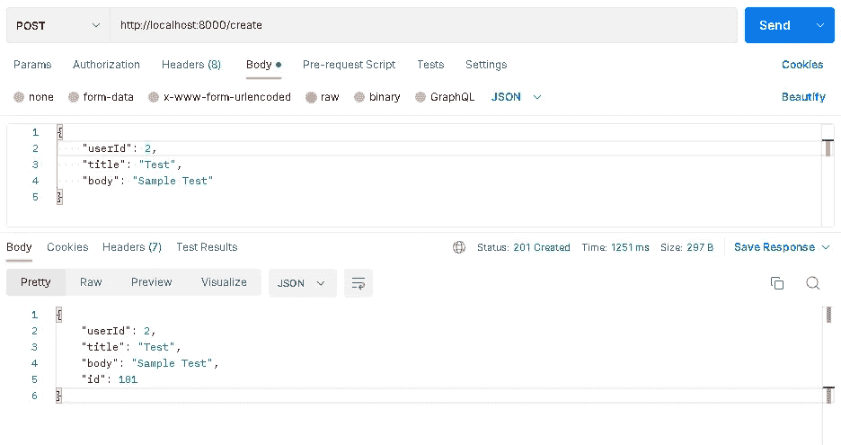

# 用 NodeJs 实现 Redis 缓存

> 原文：<https://medium.com/globant/redis-cache-implementation-with-nodejs-6925f29eb70e?source=collection_archive---------0----------------------->

## NODEJS 系列



在本文中，我们将研究 Redis 缓存，并探索是什么让它变得如此之快。此外，我们将展示如何使用 Redis。此外，我们将观察如何在 Windows 计算机上安装 Redis 并运行一些基本的 Redis 命令。我们还将讨论使用代码片段和测试结果，通过 NodeJs 以编程方式使用 Redis。

# Redis 是什么？

[Redis](https://redis.io/) ，代表**远程词典服务器**，是一个内存数据库。计算机的工作内存(RAM)是 Redis 运行的地方。因此，它的工作效率更高。Redis 是一个无模式数据库，存储带有键值对的 JSON 对象，很像 NoSQL 数据库。构建模式和初始化数据库不需要时间。因此，它可以更快地执行应用程序测试。快速测试可以提高开发效率。

另一方面，Redis 是不稳定的。考虑到如果你的系统突然出现故障，Redis 里面的东西都会丢失。但是，我们可以复制 Redis 来创建数据备份，确保即使 Redis 主实例停止运行，副本也将继续运行并包含数据。Redis 经常被用作缓存来提高应用程序的性能。Redis 可以存储我们经常访问的数据，或者需要大量的计算时间。将来，如果需要的话，我们可以快速访问这些数据。

# 是什么让 Redis 这么快？

*我们想知道 Redis 作为单线程怎么会这么快。*

Redis 是内存数据库这一事实是其速度的主要因素。纯内存读取提供了快速的读/写速度和快速的响应时间，前提是您存储的数据不能大于内存。

IO 多路复用的使用是第二个理由。Redis 主要使用单线程。然而，由于 IO 多路复用，操作系统允许单个线程同时等待多个打开的套接字连接。单线程设计可能不会使用当前硬件中的所有 CPU 核心。因此，对于某些工作负载来说，在一台服务器上运行许多 Redis 实例以利用更多 CPU 内核是一种标准做法。

采用高效的底层数据结构是第三个理由。由于 Redis 是内存数据库，它可以使用许多有效的底层数据结构，如 [LinkedList](https://en.wikipedia.org/wiki/Linked_list) 、 [SkipList](https://en.wikipedia.org/wiki/Skip_list) 、 [HashTable](https://en.wikipedia.org/wiki/Hash_table) 、 [ZipList](https://redis.com/ebook/part-2-core-concepts/01chapter-9-reducing-memory-use/9-1-short-structures/9-1-1-the-ziplist-representation/) 、 [SDS](http://blog.wjin.org/posts/redis-internal-data-structure-sds.html) 和 [IntSet](http://blog.wjin.org/posts/redis-internal-data-structure-intset.html) ，而不必担心如何高效地将它们保存到磁盘。



**Illustration showing IO Multiplexing, Single Threaded Execution & Redis Data Structure** (Credits: Alex Xu)

# Redis 缓存是如何工作的？

当客户机请求数据时，服务器首先在 Redis 缓存中搜索合适的键。如果这个键存在于 Redis 缓存中，那么就发生了**缓存命中**，用户将收到缓存的数据。如果 Redis 缓存中缺少这个键，这是一个**缓存缺失**，服务器将通过 REST APIs 从数据库或第三方资源中检索最新的信息。



Redis caching Illustration

# Windows 上的 Redis 安装

我们可以使用 Linux 的 Windows 子系统在 Windows 上安装 Redis 缓存。遵循以下步骤。

1.  在管理员模式下打开命令提示符
2.  运行`wsl — install`命令在 Windows 中安装 Windows Subsystem for Linux (WSL)。
3.  重新启动系统以查看更改。
4.  为您的 Linux 系统设置一个新的用户名和密码。
5.  启动 Linux 终端。
6.  使用命令安装 Redis】后跟`sudo apt-get install redis`
7.  使用`redis-server`命令启动 Redis 服务器。
8.  通过运行`redis-cli`命令打开 Redis CLI

默认情况下，Redis 服务器从 **127.0.0.1:6379** 开始，并将所有内容存储为**字符串**。

# Redis Keys 命令

Redis 提供了以下基本命令来对键执行各种操作。

*   `SET key value`，*设置键值对。*
*   `GET key`，*获取给定键的值。*
*   `DEL key`，*删除给定的键。*
*   `EXISTS key`、*检查一个键是否存在。*
*   找到所有匹配特定模式的键。
*   `flushall`，*删除 Redis 里面的一切。*
*   `SETEX key seconds value`、*设置给定秒数后过期的键值。*
*   `ttl key`，*返回一个密钥剩余的到期时间。*

下面的代码片段演示了这些命令的用法和输出。

```
chikku@DESKTOP-21GGVDA:~$ redis-cli
127.0.0.1:6379> set firstName Luke
OK
127.0.0.1:6379> set lastName Antony
OK
127.0.0.1:6379> set age 32
OK
127.0.0.1:6379> set email luke@gmail.com
OK
127.0.0.1:6379> get email
"luke@gmail.com"
127.0.0.1:6379> keys *
"age"
"lastName"
"email"
"firstName"
127.0.0.1:6379> exists email
(integer)1
127.0.0.1:6379> del email
(integer)1
127.0.0.1:6379> exists email
(integer)0
127.0.0.1:6379> keys *
"age"
"lastName"
"firstName"
127.0.0.1:6379> setex city 10 Bangalore
OK
127.0.0.1:6379> keys *
"age"
"lastName"
"firstName"
"city"
127.0.0.1:6379> ttl city
(integer)4
127.0.0.1:6379> ttl city
(integer)3
127.0.0.1:6379> ttl city
(integer)2
127.0.0.1:6379> ttl city
(integer)1
127.0.0.1:6379> ttl city
(integer)-2
127.0.0.1:6379> keys *
"age"
"lastName"
"firstName"
127.0.0.1:6379> flushall
OK
127.0.0.1:6379> keys *
(empty list or set)
```

# Redis 列表命令

Redis 列表是简单的字符串列表。在 Redis 列表中，我们可以在列表的头部或尾部添加元素。命令如下所示。

*   `lpush key value`，*将元素推到数组的最左端。*
*   `rpush key value`，*将元素推到数组的最右端。*
*   `lrange key startIndex stopIndex`、*显示开始和停止索引之间的元素列表*
*   `lpop key`，*弹出数组最左边的元素。*
*   `rpop key`，*弹出数组最右边的元素。*

下面的代码片段显示了 Redis list 命令的使用和输出。

```
chikku@DESKTOP-21GGVDA:~$ redis-cli
127.0.0.1:6379> lpush colors red
(integer)1
127.0.0.1:6379> lrange colors 0 1
"red"
127.0.0.1:6379> lpush colors blue
(integer)2
127.0.0.1:6379> lrange colors 0 2
"blue"
"red"
127.0.0.1:6379> rpush colors green
(integer)3
127.0.0.1:6379> lrange colors 0 3
"blue"
"red"
"green"
127.0.0.1:6379> lpop colors
"blue"
127.0.0.1:6379> lrange colors 0 2
"red"
"green"
127.0.0.1:6379> rpop colors
"green"
127.0.0.1:6379> lrange colors 0 2
"red"
127.0.0.1:6379>
```

# Redis Set 命令

与数组不同，集合中的每个元素都是唯一的。可以使用索引来检索数组中的元素，但这在集合中是不允许的，因为它需要键。与保持其插入顺序的数组相反，集合是没有顺序的。集合中的项目出现的顺序无法预测。Set 命令如下所示。

*   `sadd key member`，*向集合中添加成员。*
*   `smembers key`，*显示给定集合的成员。*
*   `srem key member`，*从集合中删除给定成员。*

Redis Set 命令的用法和结果如下所示。

```
chikku@DESKTOP-21GGVDA:~$ redis-cli
127.0.0.1:6379> sadd fruits Apple Orange Grapes Mango
(integer)4
127.0.0.1:6379> smembers fruits
"Mango"
"Grapes"
"Orange"
"Apple"
127.0.0.1:6379> srem fruits Grapes
(integer)1
127.0.0.1:6379> smembers fruits
"Mango"
"Orange"
"Apple"
127.0.0.1:6379>
```

# Redis 哈希命令

哈希允许您在单个键中存储键值对。下面列出了哈希命令。

*   `hset key field value`，*将一个键值对设置为一个 hash。*
*   `hget key field`，*获取一个哈希字段的值。*
*   `hgetall key`，*获取一个 hash 的所有键值对。*
*   `hdel key field`，*从哈希中删除给定字段。*
*   `hexists key field`，c *检查 hash 中是否存在该字段。*

下面列出了 Redis Hash 命令的用法和结果。

```
chikku@DESKTOP-21GGVDA:~$ redis-cli
127.0.0.1:6379> hset address city Bangalore
(integer)1
127.0.0.1:6379> hset address state Karnataka
(integer)1
127.0.0.1:6379> hset address country India
(integer)1
127.0.0.1:6379> hget address city
"Bangalore"
127.0.0.1:6379>hgetall address
"city"
"Bangalore"
"state"
"Karnataka"
"country"
"India"
127.0.0.1:6379>hexists address city
(integer)1
127.0.0.1:6379>hdel address city
(integer)1
127.0.0.1:6379>hexists address city
(integer)0
127.0.0.1:6379>hgetall address
"state"
"Karnataka"
"country"
"India"
127.0.0.1:6379>
```

# 使用 Nodejs 的 Redis 缓存

我们正在创建一个带有 GET 和 POST 端点的 Express 应用程序。我们使用外部的假 REST API(*jsonplaceholder.typicode.com/posts*)来获取帖子列表并创建新帖子。

按照以下步骤设置应用程序。

1.  用`npm init -y`命令创建 package.json。
2.  安装 Express 应用程序所需的所有依赖项，如下所示:

```
npm i express dotenv axios body-parser
```

2.使用`npm i ioredis`安装 Redis 依赖项

3.您的 package.json 文件应该包含以下内容。

```
{
  "name": "redis-setup",
  "version": "1.0.0",
  "description": "",
  "main": "index.js",
  "scripts": {
    "test": "echo \"Error: no test specified\" && exit 1",
    "start": "node index.js"
  },
  "keywords": [],
  "author": "",
  "license": "ISC",
  "dependencies": {
    "axios": "^1.1.3",
    "body-parser": "^1.20.1",
    "dotenv": "^16.0.3",
    "express": "^4.18.2",
    "ioredis": "^5.2.3"
  }
}
```

4.在*中增加 Redis `host`、`port`、`ttl`(生存时间)和`timeout`。env* 文件。*。env* 文件还包括一个可选的 REST API URL，用于 Redis 演示的目的。

下面的代码片段列出了*的内容。env* 文件。

```
REDIS_HOST = 127.0.0.1
REDIS_PORT = 6379
REDIS_TTL = 30
REDIS_TIMEOUT = 5000
BASE_URL = https://jsonplaceholder.typicode.com/posts
```

5.在下面给出的 *index.js* 文件中启动您的服务器。

```
require('dotenv').config();
const express = require('express');
const bodyParser = require('body-parser');
const app = express();

app.use(bodyParser.json());

app.listen(8000, () => {
    console.log('server started!');
});
```

6.创建一个包含以下内容的 *caching.js* 文件:

*   带有`host`、`port`和`commandTimeout`的 Redis 实例。如果命令没有在指定的毫秒内返回回复，将会抛出“命令超时”错误。
*   `set()`设置缓存键值对过期的方法。在设置之前，数据应该被字符串化，因为 Redis 值总是字符串。
*   `get()`检索键值对的方法。
*   `del()` 清除缓存键的方法。

下面添加了 *caching.js* 的代码片段供您参考。

```
const Redis = require("ioredis");
const { REDIS_HOST, REDIS_PORT, REDIS_TTL, REDIS_TIMEOUT } = process.env;

let redis;

// Create a Redis instance
(async () => {
    redis = new Redis({
        host: REDIS_HOST,
        port: REDIS_PORT,
        commandTimeout: REDIS_TIMEOUT
    });
    redis.on("error", (err) => {
        console.log(err);
    });
})();

// Get key data from Redis cache
async function getCache(key) {
    try {
        const cacheData = await redis.get(key);
        return cacheData;
    } catch (err) {
        return null;
    }
}

// Set Redis cache Key with a given expiry
function setCache(key, data, ttl = REDIS_TTL) {
    try {
        redis.set(key, JSON.stringify(data), "EX", ttl);
    } catch (err) {
        return null;
    }
}

// Remove given Redis cache key
function removeCache(key) {
    try {
        redis.del(key);
    } catch (err) {
        return null;
    }
}

module.exports = { getCache, setCache, removeCache };
```

## 带缓存的 GET 方法

我们正在创建一个 GET 端点`/getAll`来从外部 API 获取所有的帖子。我们需要选择一个唯一的缓存键来存储这些值。此外，通过调用`getCache(key)`方法，我们将确定缓存键是否已经被赋值。如果在缓存中找到关键字，用户将收到缓存的数据，这称为**缓存命中**。如果在缓存中没有找到关键字，则认为是**缓存未命中**，将从 REST API 中获取数据，并调用`setCache(key, data)`方法来设置值。参考下面的代码片段来创建 GET 端点。

```
require('dotenv').config();
const express = require('express');
const bodyParser = require('body-parser');
const axios = require('axios');
const { getCache, setCache } = require('./caching');
const app = express();

const { BASE_URL } = process.env;
const cacheKey = `getAll/posts`;

//Middleware
app.use(bodyParser.json());

//GET Posts
app.get('/getAll', async (req, res, next) => {
    try{
        const response = {};
        const cacheData = await getCache(cacheKey);
        if(cacheData) {
            response['message'] = 'cache hit';
            response['posts'] = JSON.parse(cacheData);
        }else {
            const result = await axios.get(BASE_URL);
            const { data } = result;
            response['message'] = 'cache miss';
            response['posts'] = data;
            setCache(cacheKey, data);
        }
        res.status(200).send(response);
    }catch(err) {
        res.status(400).send(err);
    }
})

app.listen(8000, () => {
    console.log('server started!');
});
```

## 缓存前 GET 方法的结果

为了测试我们的 GET 端点，我们使用了 Postman 工具。发送 GET 请求以获取结果。下图显示了缓存前获取帖子的结果。



GET Method Test Result before caching

一个新的关键字将被添加到 Redis 缓存中。我们可以通过检查如下的键来识别 Redis 上新添加的键。

```
127.0.0.1:6379> keys *
1)"getAll/posts"
127.0.0.1:6379
```

## 缓存后 GET 方法的结果

一旦在 Redis 中设置了缓存键，就再次发送 GET 请求以获取结果。数据将从 Redis 缓存中提取。下图显示了缓存后获取帖子的 Postman 结果。



GET Method Test Result after caching

您可以通过仔细观察 Postman 测试结果来检测性能差异。使用 Redis 缓存后，响应时间显著减少。

## 带缓存的 POST 方法

我们正在创建一个 post 端点`/create`来向外部 API 添加一个新的 POST。数据在`req.body`内部传递。添加新帖子时，应该清除已经为帖子结果设置的 Redis 键。`removeCache()`方法会做到这一点。通过这样做，可以防止数据不一致。参考下面的代码片段来创建 POST 端点。

```
require('dotenv').config();
const express = require('express');
const bodyParser = require('body-parser');
const axios = require('axios');
const { removeCache } = require('./caching');
const app = express();

const { BASE_URL } = process.env;
const cacheKey = `getAll/posts`;

//Middleware
app.use(bodyParser.json());

//Create new post
app.post('/create', async(req, res, next) => {
    try{
        const response = await axios.post(BASE_URL, req.body);
        if(response) {
            const { data: posts } = response;
            removeCache(cacheKey);
            res.status(201).send(posts);
        }
    }catch(err) {
        res.status(400).send(err);
    }
});

app.listen(8000, () => {
    console.log('server started!');
});
```

## POST 方法的结果

在 Postman 工具中发送 POST 请求。POST 请求的主体作为 JSON 发送。下图显示了创建 post API 的结果。



POST Method Test Result in Postman

创建新帖子时会删除 Redis 键。

# 摘要

到目前为止，NodeJs 的 Redis 缓存利用率一直是我们讨论的主题。使用 Redis 作为缓存，通过最大限度地减少访问速度较慢的底层存储层的需求，提高了数据检索性能。Redis 在单线程中工作，但它仍然是一个快速的内存数据库。