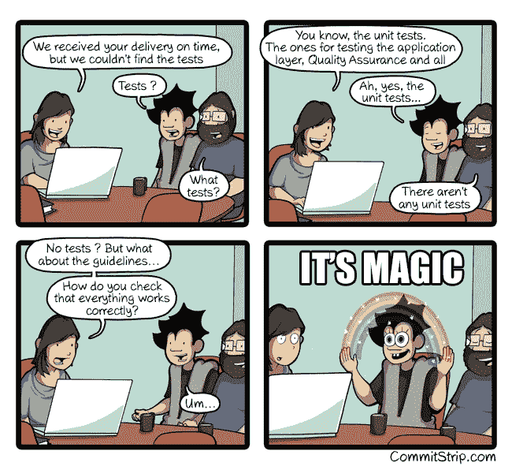

# 重构——代码的颂歌

> 原文：<https://medium.com/quick-code/refactoring-an-ode-to-code-6ca522f23462?source=collection_archive---------4----------------------->

## 什么是重构？你应该重做你的整个项目吗？你如何继续？


本文将给你一个软件开发中**重构**的**整体**解释。
我们将**探索**理论，然后**展示**一些现实生活中的例子。但是，正如我常说的，不首先阐明好处和挑战，任何解释都是不完整的。

我们开始吧，好吗？

# 这是什么？


重构指的是改进已经编写好的代码的独立技术和步骤。
简而言之，重构是增加一段代码可维护性的艺术**。**

> 构建软件设计有两种方式。一种方法是让它简单到明显没有不足。另一种方法是把它做得非常复杂，以至于没有明显的缺陷。
> - C.A.R .霍尔

但是不要误解我，重构你自己的代码库也不错。这并不会让你成为一个技能低下的开发人员。实际上，在你的职业生涯中，你总是在重构代码(你的或别人的)。
**技术债务是开发过程**的完整组成部分，Marc Friederich&Gilles Doge 在这篇文章中很好地阐述了这一点[。](https://antistatique.net/fr/nous/bloggons/2015/05/22/la-dette-technique)

> 在一个标准的 101 键键盘上，有 100 个键增加了技术债务，只有一个键减少了技术债务。约什·伍尔夫

在重构过程中，你可能会做很多改变，添加新的类，重命名，重组。但是请记住，**在你旅程的终点，你永远不会改变代码的可观察行为。**

第一，重构是**不是调试**。您的代码首先需要运行。当然，在重构过程中，你可能会发现错误。从你开始处理它们的那一刻起，你就停止了重构，开始了 bug 修复，这是另一种心态。

第二，重构与性能无关。前几天，我和一位年轻的开发人员交谈，他试图让我相信重构代码库显然会让速度更快。糟糕的代码会自动导致性能泄漏，这是一个非常普遍的误解。代码的性能不是重构过程的目标——甚至也不是你应该期望的结果。

最后，重构是**不添加特性**。当你重构一部分代码时，你不应该改变它的行为，否则你就不再重构了。

# 你应该这样做吗？

所以，你可能会问我“那我为什么要重构呢？”。

> 如果一个应用程序写了很长时间却没有被改动过，它可以像预期的那样工作，如果它和其他系统没有冲突，如果它将来不需要添加任何特性，那么它可能是世界上最丑陋的代码:它不需要重构。

答案很简单。结构良好的代码将使未来添加新特性和新功能变得更加容易。而且，它将使开始分析性能或全面改进应用程序变得更加容易。

通过提高代码质量，你也将提高整个团队的效率，当然会节省相当多的钱，并使你的开发人员乐于为代码库工作——或者至少我希望如此。

> 这叫做技术债务，因为这就像贷款一样。你今天可以完成比平时更多的事情，但是你最终会付出更高的代价。

如果你在花费时间进行重构上面临冗长的困难——因为好处不会立即显现——记住**你不是为你的终端用户进行重构，你是在为你未来的道路清除障碍**。

# 我们怎么做呢？

厌倦了阅读理论？好吧——我也是——让我们挖掘一些现实生活中的例子。

> 对于非开发人员来说，这部分可能更棘手。飞吧，你们这些傻瓜！


> 编写代码的时候，要把最终维护你的代码的人想象成一个知道你住哪儿的暴力精神病患者。
> ——马丁·戈尔丁

不存在任何人都可以遵循的一组规则或特定顺序，但有一组技术可以帮助您重构代码。在这里，我将列出一些我最喜欢的和简单的方法，尝试在每个项目中使用。

还有一件事，如果我能给你一个建议，并分享对一件事的看法，那就是这一句话:“**永远不要重构没有单元测试的产品代码**”。主要的原因可能很明显，但是让我再次大声说出来:没有单元测试，你将会以几乎不可能修复的功能崩溃而告终，因为你将不再能够弄清楚发生了什么。所以，如果你不得不重构某些东西，首先要确保它被测试覆盖。



## 条件保护条款(提前返回)

为了保持函数和方法的可读性，如果可以在方法开始时检查的简单条件适用，那么尽早返回是明智的。然后，当很难确定代码执行的正常流程时，尝试隔离检查。

```
function calc() {
  if ($this->isDead) {
    $result = $this->deadAmount();
  } else {
    if ($this->isSeparated) {
      $result = $this->separatedAmount();
    } else {
      if ($this->isRetired) {
        $result = $this->retiredAmount();
      } else {
        $result = $this->normalPayAmount();
      }
    }
  }
  return $result;
}
```

最好**早点返回，保持缩进和跟随代码所需的脑力低**。

将所有特殊检查和边缘情况隔离到单独的子句中，并将它们放在主要检查之前。理想情况下，你应该有一个简单的条件列表，一个接一个。

```
function calc() {
  if ($this->isDead) {
    return $this->deadAmount();
  }
  if ($this->isSeparated) {
    return $this->separatedAmount();
  }
  if ($this->isRetired) {
    return $this->retiredAmount();
  }
  return $this->normalPayAmount();
}
```

## 参数赋值

有时，您需要在自己的方法体中改变给定的参数值。如果此参数是通过引用传递的，那么在方法内部更改参数值后，此值将被传递给调用此方法的参数。通常，这种情况会意外发生，并导致不幸的后果。即使参数通常通过值传递(而不是通过引用传递)，这种编码习惯对于不习惯它的人来说可能很奇怪。

```
function discount(\DateTime $start_date, $bar) {
  if ($bar > 50) {
    $start_date->add('2 days');
  }// do some calculation based on the $start_date...
  return $foo;
}
```

使用局部变量而不是改变参数。

```
function discount(\DateTime $start_date, $bar) {
  $dt = clone $start_date;
  if ($bar > 50) {
    $dt->add('2 days');
  }// do some calculation based on the $dt...
  return $foo;
}
```

## 用对象替换数组

是存储单一类型的数据和集合的优秀工具。但是如果你使用一个像邮政信箱一样的数组，把用户名存储在第 1 个盒子里，把用户的地址存储在第 14 个盒子里，有一天你会对你这样做感到很不高兴。

您有一个包含各种类型数据的数组。

```
$row = [];
$row[0] = "Liverpool";
$row[1] = 15;
```

将数组替换为每个元素都有单独键的对象。

```
$row = new Performance;
$row->setName("Liverpool");
$row->setWins(15);
```

另外，使用`Object`而不是`Array`，你将能够应用属性断言，我建议每个人看一看`[ArrayAccess](https://www.php.net/manual/en/class.arrayaccess.php)` [实现](https://www.php.net/manual/en/class.arrayaccess.php)，它可以很好地取代类对象的`Array`。

## 用符号常数替换幻数

幻数或幻值出现在源代码中，但没有明显的意义。这种“反模式”使得理解程序和重构代码变得更加困难。

通常，简单的查找和替换对这些值不起作用，因为相同的数据可能在不同的地方用于不同的目的，这意味着您必须验证使用该值的每一行。

```
function potentialEnergy($mass, $height) {
  return $mass * $height * 9.81;
}
```

将该数字替换为一个常量，该常量具有一个解释该数字含义的可读名称。

```
/**
 * The gavitational phsyical constant.
 *
 * [@var](http://twitter.com/var) float
 */
CONST GRAVITATIONAL_CONSTANT = 9.81;function potentialEnergy($mass, $height) {
  return $mass * $height * GRAVITATIONAL_CONSTANT;
}
```

## 巩固条件表达式

当您的代码包含许多执行相同操作的交替操作符时，不清楚为什么操作符要分开。

合并的主要目的是为了更加清晰地将条件提取到不同的方法中。

```
function disabilityAmount() {
  if ($this->seniority < 2) {
    return 0;
  }
  if ($this->monthsDisabled > 12) {
    return 0;
  }
  if ($this->isPartTime) {
    return 0;
  }// compute the disability amount ...
```

将所有这些条件句合并成一个表达式。

```
function disabilityAmount() {
  if ($this->isNotEligableForDisability()) {
    return 0;
  }// compute the disability amount ...
```

## 使用语言能力

通常，开发人员会忘记他们所使用的编程语言的一些强大功能。
这些功能中有许多可以帮你节省很多精力。看看下面的例子，注意使用 type `hinting`方法可以很容易地获得相同的结果。

```
function discount($label, $interval) {
  if(!is_string($label) {
    throw new Exception(''Provided label is not a string.');
  }if(!is_int($interval) {
    throw new Exception(''Provided interval is not an integer.');
  }// do some magic computation ...
  return $foo;
}
```

可以被改变为具有相同功能的更简单的方法

```
function discount(string $label, int $interval) {
  // do some magic computation ...
  return $foo;
}
```

## 在线温度

必要时避免使用临时变量。例如，当你有一个临时变量，它被赋予一个简单表达式的结果，仅此而已。

```
$basePrice = $anOrder->basePrice();
return $basePrice > 1000;
```

用表达式本身替换对变量的引用。

```
return $anOrder->basePrice() > 1000;
```

## 还有什么？

我想以几个更好的编码技巧来结束我的演讲:

*   使用新的数组形式`[ ]`代替旧的`array()`
*   使用`===`运算符代替`==`，除非不检查`dataType`很重要
*   对返回布尔值的函数使用前缀`is/has`，例如:`isAdmin($user)`，`hasPermission($permission, $user)`
*   用公共方法组织类方法
*   始终将单一责任概念应用到您的班级中


# 来源

对于大多数好奇的人来说，这里有一些启发了本文创作的额外信息来源。

source making(2019 年 8 月 23 日)。重构
见上[https://sourcemaking.com/refactoring](https://sourcemaking.com/refactoring)

重构大师(2019 年 8 月 23 日)。重构大师
参见 https://refactoring.guru/refactoring[上的](https://refactoring.guru/refactoring)

穆罕默德·阿拉丁(2018 年 8 月 19 日)。重构你的 PHP 遗留代码(真实项目示例)
参见 https://medium.com/hackernoon/refactor-your-php...[上的](/hackernoon/refactor-your-php-legacy-code-real-projects-examples-da9edf03ff4b)

乔希·伍尔夫(2018 年 4 月 15 日)。没有好的编码，只有好的重构
见上[https://medium.com/@sitapati/there-is-no-good-...](/@sitapati/there-is-no-good-coding-only-good-refactoring-487f322b5987)

陈淑芬(2018 年 10 月 11 日)。代码重构——如何写出更好的代码
参见 https://medium.com/@fionnachan/code-ref...[上的](/@fionnachan/code-refactoring-how-to-write-better-code-d1aeab549597)

托马斯·德尼菲尔(2019 年 4 月 20 日)。
残酷的重构)参见上[https://medium.com/@tdeniffel/brutal-refactorin...](/@tdeniffel/brutal-refactoring-31b5cc4d4512)

塞缪尔·罗兹(2018 年 8 月 21 日)。重构的正确方式:地区性的，而不是全球性的
参见 https://medium.com/@sroze/refactoring-the...[上的](/@sroze/refactoring-the-right-way-regional-not-global-692643b1947e)

Omar El Gabry(2017 年 10 月 2 日)。重构——卫生习惯
参见 https://hackernoon.com/refactori...[上的](https://hackernoon.com/refactoring-the-hygienic-habit-b2ee0f5528ba)

肖恩·麦格拉思(2016 年 8 月 22 日)。《毁灭战士 3》源代码的异常美丽
见上[https://kotaku.com/the-except...](https://kotaku.com/the-exceptional-beauty-of-doom-3s-source-code-5975610)

*CommitStrip 的版权由*[*commit strip*](http://www.commitstrip.com/)*持有并授权给 commit strip。*