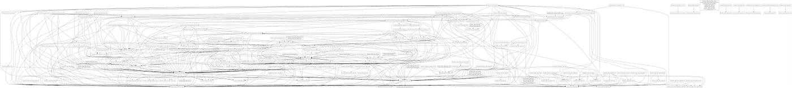
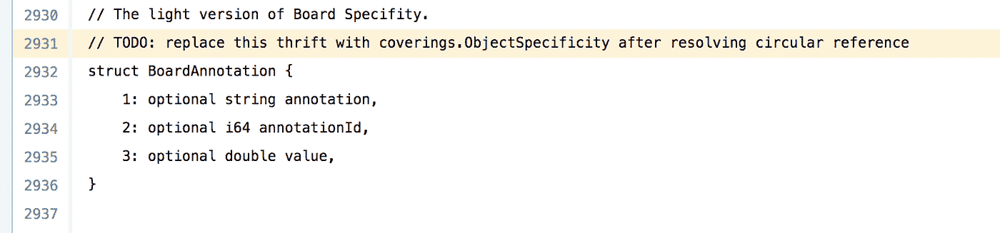
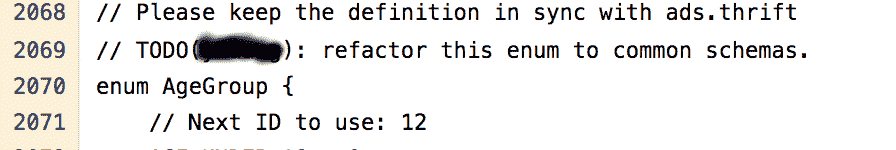
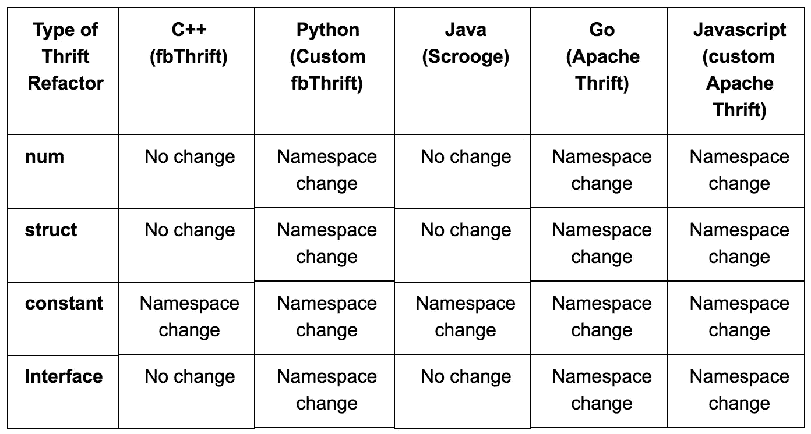
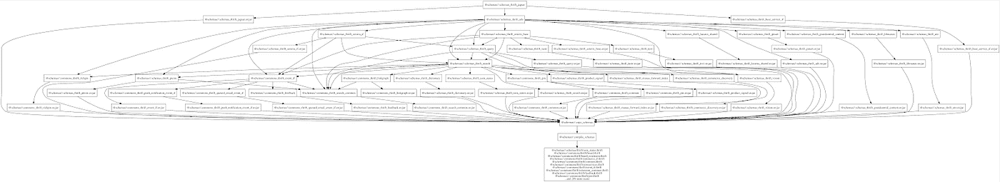
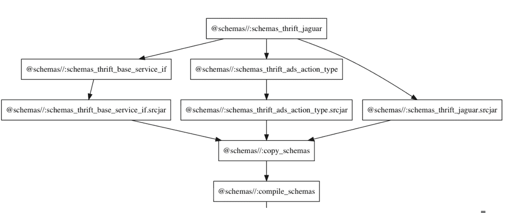
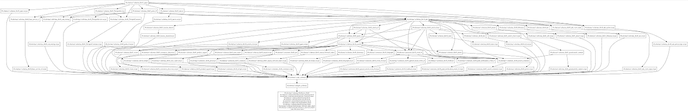
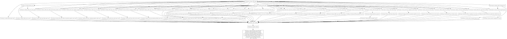

# 在 Pinterest 重构节俭模式

> 原文：<https://medium.com/pinterest-engineering/refactoring-thrift-schemas-at-pinterest-e899008ce22b?source=collection_archive---------1----------------------->

苏曼·卡鲁莫里| Pinterest 技术主管，基础设施

Pinterest 技术栈由数百个用各种语言编写的微服务组成，这些微服务使用 [Apache Thrift](https://thrift.apache.org/) 相互通信。节俭模式用于定义我们的服务接口、常数和堆栈所有级别的序列化数据，包括移动应用程序、前端服务、后端服务、大数据管道和机器学习模型。随着时间的推移，我们的 Thrift 存储库已经有机地发展到包含数千个 Thrift 模式，分布在数百个紧密耦合的 Thrift 文件中。总的来说，大约有 1，500 个文件，超过 100，000 行代码。文件的紧密耦合不仅在节俭文件之间，而且在使用它们的应用程序之间产生了错综复杂的依赖关系。这导致了缓慢且容易出错的开发周期，减缓了整个公司的开发速度。

为了解决这个问题，我们最近重构了节俭模式，在提高代码质量和开发速度的同时，极大地减少了代码构建时间。在这篇博文中，我们将分享我们的项目动机、我们解决问题的方法以及我们观察到的成功案例。

# 问题

Pinterest 的核心业务模式分布在 16 个大型(3k-10k LoC)紧密耦合的节俭文件中。因为它们在 repo 中包括其他文件，所以直接或间接地依赖这些文件中的任何一个，都会产生大约 450 个节俭依赖关系(超过所有节俭模式的 50%)，如图 1 中的依赖关系图所示。因为 Pinterest 的每个项目都直接或间接地依赖于核心业务结构，所以公司的每个项目都依赖于我们一半的节俭模式回购。这个复杂的依赖图导致了几个看似不相关的问题。

Figure 1: Our Thrift dependency graph. Only a few (75) files on the right are independent.

## **可扩展性**

为了在本地编译模式，我们需要更大的开发机器。即使在这些高端机器上，节俭编译器在处理节俭回购时也会耗尽内存，linters 也会超时。即使一切正常，构建也很慢，消耗大量资源并生成巨大的二进制文件。例如，即使应用程序代码只有 20 MB，我们生成的 C++节俭依赖项也会编译成 500 MB。这些二进制文件部署起来很慢，会消耗我们生产机器上的大量内存。

## **不必要的建造**

由于包含任何大型 Thrift 文件都依赖于超过一半的 Thrift 模式，因此 Thrift repo 中的任何更改都会触发我们所有代码的完整构建。我们的 Thrift repo 每天都要更改几次，这意味着我们每天都要多次构建我们的整个代码库(这显然是低效的)。此外，这降低了我们开发人员的速度，因为任何节俭的改变都会阻止他们将新的改变合并到我们的 monorepo 中，直到完整的构建完成。每个构建可能需要几个小时的事实强调了这个问题的严重性。

## **缓慢且容易出错的开发和测试**

构建和测试局部变化通常需要很长时间。花了两个多小时来验证、测试和消费主要回购的新节俭版本，因为复杂的依赖关系迫使在所有回购中完整运行所有单元和集成测试。由于我们将 Thrift 集成到了所有特定语言的 monorepos 中，Thrift 集成中的任何错误都会破坏整个 repo 的构建，阻止数百名开发人员提交他们的更改。我们安装了 [Bazel](https://bazel.build/) ，但是无法利用它的增量构建能力。

## **容易出错的版本**

变更会产生连锁反应，导致过多的构建和不必要的发布。这使得验证所有部署更加困难，并且更容易引入生产错误。庞大而复杂的模式文件服务于多种业务用途，因此在模式的一个部分中断构建会阻止不相关的更改被推向生产，需要跨团队协作来修复。

## **可重用性**

由于代码是紧密耦合的，开发人员经常求助于复制代码来避免循环依赖(图 2)或大型依赖(图 3)。

Figure 2: Copied thrift struct to avoid taking a circular dependency.

Figure 3: Copied code to avoid taking a large dependency.

# 解决办法

为了理解混乱依赖关系的原因，我们查看了 Thrift 代码，发现我们的 Thrift 依赖图是混乱的，因为我们有一个“瘦包含/胖依赖”问题:为了访问少量的功能，代码承担了大量的依赖关系。这是大型代码库中的一个常见问题，通常通过将包含的模式重构到一个新文件中，并依赖新文件而不是大型节约文件来解决。

然而，重构节俭模式是复杂的。这样做不正确会破坏向后兼容性。在某些情况下，重构可能需要大量的代码修改，这是大多数开发人员希望避免的。

为了解决这个问题，我们必须按照以下目标重构 Thrift 文件:

*   把窄而深的树改成宽而浅的树。
*   最小化对生产和开发人员工作流程的影响。

# 宽而浅的依赖树

纠结的节俭依赖导致我们的依赖树变得又窄又深。为了得到更宽的树，我们将大文件重构为小文件。为了得到一个更浅的树，我们最小化了 Thrift 文件中“include”声明的数量。更宽更浅的构建树解决了瘦包含/胖依赖问题，导致使用更少计算资源的更快的增量和并行构建(因为我们正在编译更小的文件)。通过允许目标只依赖于所需的模式，我们也减少了不必要的构建。更小的依赖性也将导致更小的二进制文件，从而产生更快的构建、发布和部署工作流。

为了将大文件分解成小文件，我们执行了以下重构步骤:

1.将枚举移动到他们自己的文件中。

2.常量有多种形式，如(a)单行常量定义，如字符串；(b)类型定义；(c)由原始类型组成的简单常量数据结构；(d)带有枚举的常量数据结构；以及(e)由多种类型组成的常数映射。我们以不同的方式处理每一种口味:

*   任何普遍适用或对于它们自己的文件来说太小的常量(如(a)、(b)或(c)中所描述的)都根据它们的业务逻辑被重新组织到不同的常量文件中，如 pinterest_constants、ads_constants 等。
*   由枚举(d)组成的常量数据结构在同一个文件中变成了枚举。
*   任何依赖于多个类型(e)的常量都被视为结构。

3.由于结构可以嵌套，因此它们的重构比简单地将每个结构放入自己的文件中要主观和复杂一些。以下准则有助于将文件及其依赖项的数量保持在最低水平:

*   逻辑上属于一起的所有结构都保存在同一个文件中，以帮助将嵌套的结构保存在一起。
*   我们更喜欢被多个 Thrift 文件通过 includes 使用的任何结构都在它自己的文件中。
*   如果一个结构需要一个来自不同 Thrift 文件的模式，我们倾向于在一个单独的文件中声明它。这样，只有需要这个结构的代码才会依赖包含的 Thrift 文件。

4.所有服务接口都放在它们自己的文件中，并带有任何相关的结构，如请求/响应结构。

# 最小化生产影响

当我们根据上面的指导方针开始重构代码时，我们意识到重构某些模式会破坏向后兼容性，或者需要对应用程序进行大的修改，因为我们严重依赖非标准的节约特性，比如跨节约文件重用名称空间，包括将特定语言的代码放入节约文件等。因此，我们增加了一个目标:在对生产影响最小的情况下执行重构。

为了最大限度地减少对生产的影响，我们的重构必须遵循以下约束:

A.保持向后兼容性，以便新代码可以与旧代码一起工作，反之亦然。

B.代码更改不应该有任何运行时开销。

C.允许增量代码部署，因为不可能在数千个服务之间同步代码部署。

D.尽量减少所需的代码更改，这样代码更容易审查、测试和部署。

E.避免数据迁移，因为这些序列化的核心数据结构可能包含在数 Pb 的数据中。

F.进行我们有高度信心的代码更改。

G.授权公司的其他开发人员重构代码。

因为我们希望零运行时开销，所以我们不能使用任何像模式转换这样的技术来保持向后兼容性。为了理解在满足约束 A-E 的同时重构对代码的影响，我们在代码库中重构了两个枚举。在这次重构中，我们发现节约代码生成器是破坏向后代码和数据兼容性的主要原因。生成的代码破坏了向后兼容性，因为不同语言中的代码生成器不同地使用了该语言声明的 Thrift 名称空间。由于不同语言使用的名称空间不同，代码的序列化结构也不同。例如，Python 和 Go 代码生成器使用名称空间作为生成代码的文件名，而对于 Java 和 C++来说，它将名称空间分别映射到 Java 包名和 C++名称空间。

在查看了我们的代码后，我们意识到我们可以有选择地重构代码库中的大部分节俭模式，而不会破坏向后兼容性，只需在 Python 和 Go 中更改名称空间即可。由于 Python 和 Go 没有在序列化的 Thrift struct 中使用包的名称空间，只要代码被编译，名称空间的改变就是向后兼容的。我们必须对代码进行的唯一更改是更改包的名称空间。因此，一些重构需要将重构后的代码添加到新的名称空间中。在这种情况下，需要更新导入路径，以便在代码中使用新的名称空间。

下面的表 1 显示了 Thrift refactor 的变化以及它如何影响每一种语言。为了最小化更改并避免破坏任何序列化的 Thrift 结构，我们在文件间保持 Java 和 C++的名称空间相同。对于剩余的语言，我们决定将新文件添加到新的名称空间中，并更新代码中的名称空间。对 Go/Python/JS 的更改并没有改变序列化数据，这意味着这些更改可以逐步展开。

Table 1: Changes needed for each language for each kind of Thrift refactoring to maintain code backward compatibility.

为了确保代码一旦部署就能工作，我们需要一个只需要编译时修改的解决方案。这些变化是一项巨大的工作——改变一个 enum 可能导致仅在我们的 Go 代码中就要改变 6000 个引用——单个团队无法独自承担这个项目，所以我们希望尽可能地自动化这个过程，以便公司的其他开发人员可以参与并帮助这个过程。为了满足这些约束，我们实现了跨代码仓库自动重命名的工具。这种工具使得代码更改变得机械化，这反过来又使得审查和部署变得更加容易。此外，公司中的其他开发人员可以使用该工具来执行他们自己的重构。

# 结果

基于这种分析，我们开发了一些工具来自动重构几种语言的节俭代码。我们的工具执行的每一次重构都触及了我们所有服务的代码，包括移动应用程序、后端和数据作业。我们执行了几次重构，重点是改进项目的构建时间。结果如下所示。

## 宽浅依赖树

重构之后，服务可以依赖于特定的 Thrift 结构，而不是依赖于整个文件。如图 4 和图 5 所示，根据特定的节约模式，减少了服务 j 的节约目标的数量。

Figure 4: The dependency tree for service J before the refactor shows dependency on 48 schema targets with a depth of 7 and width of 7.

Figure 5: The dependency tree for service J after refactoring shows 6 schema targets with a depth of 2 and width of 2.

重构之后，我们的服务的依赖树变得又宽又浅，而不是又深又窄，如图 6 和 7 所示。这种变化正以一种渐进的方式推广到生产中。

Figure 6: The dependency tree for service P before the refactor is deep and narrow, with a depth of 7 and width of 7.

Figure 7: The dependency tree for service P after refactoring is wide and shallow, with a depth of 3 and width of 25.

## 构建时间改进

自重构以来，一些服务的构建时间有所改善，因为构建树现在变得又浅又宽，并且一个服务可以依赖于单个结构，而不是包含数千个结构的大文件。我们已经看到几个项目的总体构建时间缩短了 15-35%。

## 不必要的构建减少了 600 倍

重构之后，我们更新了一些服务，使之只依赖于它们的节俭结构，而不是整个文件。在重构之前，我们在 repo 中为每个 Thrift 模式变更构建所有项目。现在我们只依赖于一个很少改变的 Thrift 结构，我们已经将目标的不必要构建数量减少了 600 倍。

## **二进制大小减少 22–35%**

这些变化还导致了更小的二进制文件大小，因为我们只包括所需的模式，而不是整个文件中的所有模式。经过一些重构后，我们看到二进制文件的大小减少了 22-35%。减小的二进制文件大小导致更快的应用程序启动时间、更小的内存驻留大小以及构建、存储和部署所生成的应用程序二进制文件所需的更少的基础设施。

# 摘要

我们启动了 Thrift refactor 项目，以解开我们窄而深的 Thrift 模式依赖图，因为它导致了各种各样的低效率，包括过大的二进制文件、不必要的构建、对更多计算资源的需求、开发速度变慢、测试困难以及无法进行增量构建。一旦我们意识到我们的依赖关系树因为“瘦包含/胖依赖”问题而变得混乱，我们就选择正确的抽象来重构我们的模式。项目的实现是具有挑战性的，因为我们必须保持向后兼容性，同时在 repo 中的所有项目中产生零运行时开销。重构节俭模式和依赖特定结构不仅支持增量构建，还将我们的构建时间缩短了 35 %,同时将不必要的构建减少了 600 倍。我们正逐步将我们的改变推广到生产中。

鸣谢:本项目参与人员为宋宝刚、、郑尼克。