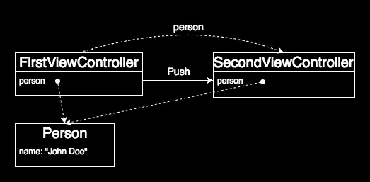

# Swift 中的参考和值类型

> 原文：<https://medium.com/capital-one-tech/reference-and-value-types-in-swift-de792db330b2?source=collection_archive---------0----------------------->


在这篇文章中，我们将探讨引用类型和值类型之间的区别。我们将介绍这两个概念，看看它们的优缺点，并研究如何在 Swift 中利用它们。

# *参考类型*

> **引用类型**:一种类型，一旦被初始化，当被赋给一个变量或常量时，或者当被传递给一个函数时，返回对同一个现有实例的引用。

引用类型的一个典型例子是对象。一旦实例化，当我们将它赋值或作为值传递时，我们实际上是在将引用赋值或传递给原始实例(即它在内存中的位置)。引用类型赋值据说具有浅层复制语义。

在 Swift 中，使用**类**关键字定义对象:

```
class PersonClass {
    var name: String init(name: String) {
        self.name = name
    }
}var person = PersonClass(name: "John Doe")
```

# *值类型*

> **值类型**:当赋值给变量或常量，或者传递给函数时，创建新实例(副本)的类型。

值类型的一个典型例子是基元类型。常见的原语类型，也是值类型，有: **Int** ， **Double** ， **String** ， **Array** ， **Dictionary** ， **Set** 。一旦实例化，当我们分配它或者把它作为一个值传递时，我们实际上得到的是原始实例的一个副本。

Swift 中最常见的值类型是**struct**，**enum**和**tuple**可以是值类型。值类型赋值据说具有深度复制语义。

# *复制语义*

我将通过一个实例来说明复制语义之间的区别。假设我们正在使用一个通用的树形数据结构:

```
class Node<T: Comparable> {
    let value: T
    var left: Node?
    var right: Node? convenience init(value: T) { […] } init(value: T, left: Node?, right: Node?){ […] }

    func add(value: T) { […] }
}
```

我们可以轻松地创建一个二叉树的实例，如下所示:

```
let binaryTree = Node(value: 8)
tree.add(2)
tree.add(13)
```


A binary tree instance

现在，让我们来看看复制语义的不同行为。

## **浅层复制(引用类型)**

复制引用类型时，Swift 编译器会复制实例的引用。但不是它的属性。因此，当创建引用类型对象的多个副本时，每个副本将共享由实例属性表示的相同数据。


Binary tree shallow copy

## **深度复制(值类型)**

复制值类型时，Swift 编译器会制作原始实例的全新副本。这意味着所有原始实例属性都被复制到新的实例属性中。这个过程对每个本身是值类型的属性重复进行。因此，当创建值类型对象的多个副本时，每个副本将是一个没有共享数据的新的单独实例。


Binary tree deep copy

# **引用类型实例的问题:隐式数据共享**

为了展示引用类型的典型问题，让我们定义一个**类**来表示 2D 空间中的一个点。

```
class PointClass {
    var x: Int = 0
    var y: Int = 0 init(x: Int, y: Int) {
        self.x = x
        self.y = y
    }
}
```

现在，如果我们实例化一个 **PointClass** 对象并将其分配给另一个对象，会发生什么呢？

```
var pointA = PointClass(x: 1, y: 3)
var pointB = pointA
```

因为 **PointClass** 是一个引用类型，所以最后一条语句实际上是将对 *pointA* 的引用赋值给 *pointB* 。我们可以用图形表示上述场景如下:


Reference type instances

在这种情况下， *pointB* 和 *pointA* 和**共享**同一个实例。因此，*点 A* 的任何变化都会反映在*点 B* 上，反之亦然。这在许多情况下可能没问题，但也是细微错误的常见来源。

让我们来看看一种非常简单的方法来解决隐式共享数据问题。假设我们实例化了一个视图控制器，并给它分配了一个对一个**人**对象(我们的*对象模型*)实例的引用。然后，作为对用户交互的响应，我们推送另一个视图控制器(在第一个视图控制器之上)，并为它分配相同的引用实例。我们可以将这一特定场景想象如下:



Assigning a reference type to more than one view controller

由于两个视图控制器被分配了相同的引用实例，如果我们在 *SecondViewController* 中修改它的任何属性，我们最终会修改最初分配给 *FirstViewController* 的原始(共享) **Person** 实例。因此，在 *SecondViewController* 内部对*对象模型*的任何修改都将传播到 *FirstViewController* 。

回到我们最初的例子，避免隐式数据共享问题的一种方法是显式创建实例的副本。我们可以手动创建一个副本并分配它，而不仅仅是分配*点 A* :

```
var pointB = pointA.copy()
```

现在，*点 B* 将有自己单独的引用，并且在*点 A* 和*点 B* 之间不再有共享数据。这种技术工作良好，但是有一些缺点:

*   不得不:
*   —从 NSObject 继承并实现 NSCopying
*   —实施新的*可复制*协议，用于在 Swift 中复制对象
*   为每个赋值显式调用 *copy()* 会引入一些开销
*   很容易忘记为每个赋值调用 *copy()*

# **值类型实例:没有隐式共享**

当分配值类型时，编译器将自动创建(并返回)实例的副本。让我们看看，如果不将我们的 2D 点定义为一个**类**(引用类型)，而是将其定义为一个**结构**(值类型)，会发生什么。

```
struct PointStruct {
    var x: Int = 0
    var y: Int = 0 init(x: Int, y: Int) {
        self.x = x
        self.y = y
    }
}
```

现在，我们可以创建一个 **PointStruct** 的实例，并将其分配给另一个实例。

```
var pointA = PointStruct(x: 1, y: 3)
var pointB = pointA
```

因为 **PointStruct** 是一个值类型，所以最后一条语句创建了一个 *pointA* 的副本，并将其分配给 *pointB* 。这使得赋值是安全的，因为两个实例是不同的。我们可以用图形表示这种情况如下:


Values type instances

我们可以看到 *pointB* 有自己单独的引用，在 *pointA* 和 *pointB* 之间不会有共享数据。这表明，通过使用值类型，我们可以很容易地确保我们的所有实例都是不同的，并且不共享任何数据。

从性能的角度来看，使用值类型不会增加很大的开销:

> **副本很便宜**
> 复制一个基本类型( **Int** ， **Double** ，…)需要恒定的时间
> 复制一个**结构**，**枚举**或**元组**值类型需要恒定的时间
> 
> **可扩展数据结构使用写时复制**
> 复制涉及固定数量的引用计数操作
> 这种技术被许多标准库类型使用:**字符串**、**数组**、**集合**、**字典**、…

除上述之外，值类型的另一个性能优势是它们是堆栈分配的，这比堆分配(用于引用类型)更有效。这使得访问速度更快，但缺点是必须放弃对继承的支持。

需要指出的是，只有当**结构**、**枚举**和**元组**的所有属性都是值类型时，它们才是*真值类型*。如果它们的任何属性是引用类型，我们仍然会遇到上一段中描述的隐式数据共享问题。

让我们来看看下面的**结构**:

```
struct PersonView {
    let person: PersonStruct
    let view: UIView
}
```

我们的预期目标是创建一个容器来跟踪一个人，并处理一个显示所有相关信息的视图。我们可能会自信地认为上面的代码是合理的；毕竟我们用**让**声明了所有属性，对吗？不幸的是，事实并非如此。因为*视图*属性是一个引用，因为 **UIView** 是一个引用类型，我们仍然能够改变它的属性！但是还有一个更微妙的漏洞来源。为了说明这一点，让我们创建一个**人员视图**的实例，并制作一个副本:

```
let personViewA =
    PersonView(person: PersonStruct(name: "John Doe"), 
               view: UIView())let personViewB = personViewA
```

现在，因为*视图*是一个引用类型，所以**人员视图**的两个实例共享同一个属性！这意味着，如果我们修改任何实例的*视图*属性，我们最终实际上修改了**共享**视图。下图应该更容易看出这一点，并帮助我们认识到，我们再次遇到了我们前面讨论过的隐式数据共享问题:


Value type containing a reference type

# **引用类型、值类型和不变性**

> **不变性**:实例创建后状态不可修改的属性。

不变性是一个非常重要的属性，它与[函数式编程](https://en.wikipedia.org/wiki/Functional_programming)范例密切相关。我们看到，通过使用值类型，我们能够创建无限期保留其状态的实例，根据定义，它们是不可变的。不可变对象有一些有趣的优点和缺点。

## 优点:

*   不可变对象不共享数据，因此在实例之间没有共享状态。这避免了由[副作用](https://en.wikipedia.org/wiki/Side_effect_%28computer_science%29)引起的意外变化的问题
*   前一点的直接结果是不可变对象本质上是线程安全的。这意味着我们不需要担心竞争条件和[线程同步](https://en.wikipedia.org/wiki/Synchronization_%28computer_science%29)
*   因为不可变对象保留了它们的状态，所以更容易对代码进行推理

## 缺点:

*   不变性并不总是有效地映射到机器模型。一个典型的例子是执行就地修改的算法(像[快速排序](https://www.objc.io/blog/2014/10/20/functional-snippet-3-functional-quicksort/))。在保持原有性能的同时，使用值类型实现这些功能并不容易。

在 Swift 中，我们可以使用两个不同的关键字来定义变量:

*   ***var*** :定义可变实例
*   ***让*** :定义不可变的实例

上述关键字有不同的行为，这取决于它们是用于引用还是值类型。

# **可变实例:变量**

## 参考类型

可以改变**引用**(*可变*):可以改变实例本身，也可以改变实例引用。

## 值类型

可以更改**实例**(*可变*):您可以更改实例的属性。

# **不可变实例:让**

## 参考类型

**引用**保持不变(*不可变*):您不能改变实例引用，但是您可以改变实例本身。

## 值类型

**实例**保持不变(*不可变*):你不能改变实例的属性，不管属性是用 *let* 还是 *var 声明的。*

# **应该选择哪种类型？**

一个很常见的问题是:*“我如何决定什么时候使用引用类型，什么时候使用值类型？”你可以在网上找到很多关于那件事的讨论。我最喜欢的一些例子是:*

*   我应该使用 Swift 结构还是类？
*   周五 Q&A 2015–07–17:何时使用 Swift 结构和类
*   [热烈欢迎结构和值类型](https://www.objc.io/issues/16-swift/swift-classes-vs-structs/)
*   回复:我应该使用 Swift 结构还是类？
*   [结构 vs 类](http://troz.net/2016/03/structs-vs-classes/)
*   [Swift 中的引用与值类型:第 1/2 部分](https://www.mikeash.com/pyblog/friday-qa-2015-07-17-when-to-use-swift-structs-and-classes.html)

作为一个基本规则，每次我们从**n object**子类化时，我们都被迫创建引用类型。这是与 Cocoa SDK 交互时的常见场景。Apple 提供了一些使用引用类型和值类型的通用规则。下面我总结了一下。

## 参考类型，当:

*   对象的子类必须是类类型
*   将*实例标识*与 **===** 进行比较是有意义的
*   你想要创建*共享的、可变的状态*

## 值类型，当:

*   将*实例数据*与 **==** 进行比较是有意义的(**等同于**协议)
*   您希望副本具有*独立状态*
*   数据将在跨多个线程的代码中使用(避免显式同步)

有趣的是，Swift 标准库非常青睐值类型:

*   原始类型( **Int** 、 **Double** 、 **String** 、…)是值类型
*   标准集合(**数组**、**字典**、**集合**、…)是值类型

通过查看 [Swift 标准库参考文献](https://developer.apple.com/library/ios/documentation/General/Reference/SwiftStandardLibraryReference/)，有可能收集到确切的数字来证实上述陈述。以下是类型的划分:

*   类别= 4
*   结构= 103
*   枚举= 9

除了上面举例说明的以外，选择实际上取决于您试图实现什么。根据经验，如果没有特定的约束迫使您选择引用类型，或者您不确定哪个选项最适合您的特定用例，您可以从使用值类型实现数据结构开始。如果需要的话，您应该能够在稍后用相对较少的努力将其转换为引用类型。

# **结论**

你可以在这里下载这篇文章[中的代码。](https://github.com/andrea-prearo/SwiftPlaygrounds/tree/master/ReferenceAndValueTypes)

在这篇文章中，我们研究了引用类型和值类型之间的区别。在研究了隐式数据共享的一个常见问题之后，我们看到了如何通过使用值类型而不是引用类型来避免这个问题。

我们还介绍了不变性的概念，并了解了它如何应用于 Swift 中的引用类型和值类型。最后，我们回顾了一些用例，在这些用例中，引用类型和值类型之间的选择非常简单。对于所有其他情况，实验是找出最佳选择的最佳方式。

## 有关系的

*   [在 UITableView 和 UICollectionView 中平滑滚动](/capital-one-developers/smooth-scrolling-in-uitableview-and-uicollectionview-a012045d77f)
*   [用 iOS 10 预取 API 提升平滑滚动](/capital-one-developers/boost-smooth-scrolling-with-ios-10-pre-fetching-api-818c25cd9c5d)
*   [Swift 中的通用数据源](/capital-one-developers/generic-data-sources-in-swift-c6fbb531520e)
*   [通用协议类型擦除的替代方案](/capital-one-developers/an-alternative-to-type-erasure-for-generic-protocols-a9a48e96618a)

如需了解更多关于 Capital One 的 API、开源、社区活动和开发人员文化的信息，请访问我们的一站式开发人员门户网站 DevExchange。[*https://developer.capitalone.com/*](https://developer.capitalone.com/)