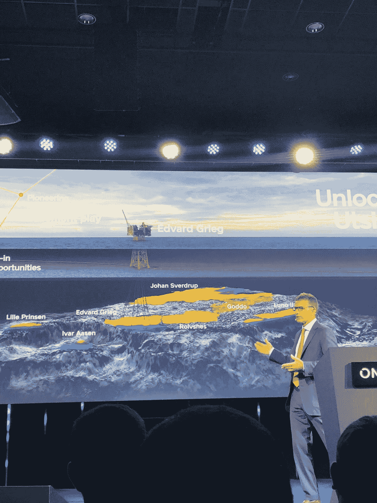
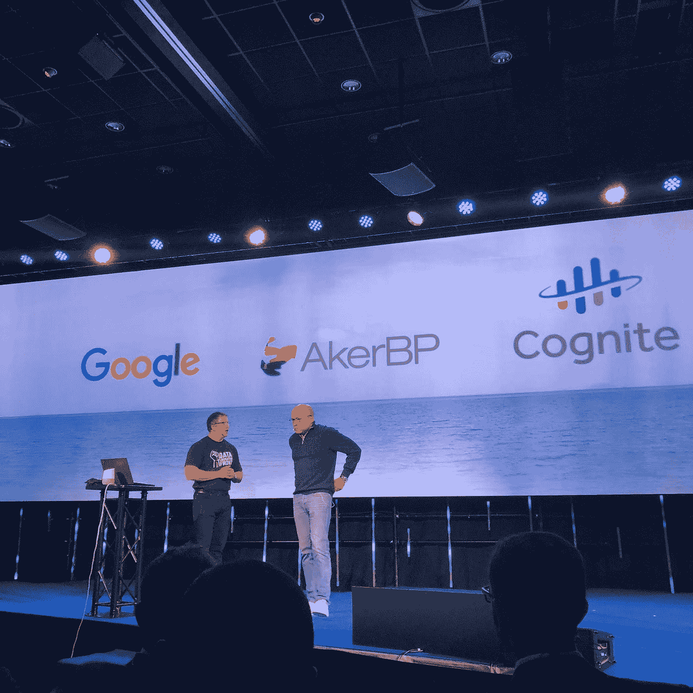

# 对 ONS 2018 创新的思考

> 原文：<https://medium.com/compendium/reflections-of-ons-2018-innovate-45df24d47b60?source=collection_archive---------1----------------------->

今年的挪威国家统计局取得了非常积极的进展，28 家 E&P 公司有明确的投资意向，几个大型新的挪威近海开发项目已经在进行中。这大大鼓舞了 1124 名参展商和 68 174 名参观者的精神，他们在过去几年里一直处于困境。去年石油价格的上涨导致了投资热情的增加，这就是这次会议的背景。

今年 ONS18 的主题是创新，由此两种趋势显而易见。国家统计局不再仅仅是一个油田开发的会议场所，它越来越多地涉及到能源，尤其是可再生能源。相当多的展台上都是风车和太阳能，以及在大会上谈论可再生能源领域承诺的强烈意愿。

创新主题的另一个主线是数字化——这是当今业内所有参与者都关心的问题。随着物联网技术的最新发展，我们可以看到一个范式的转变，云服务变得更加容易访问、随时可用并被人们接受。存储中不断增长的数 Pb 数据和弹性数据孤岛进一步影响了这一点，这些问题困扰了行业多年。就 it 而言，石油和天然气在许多方面都处于开发可扩展解决方案的前沿。我们现在生活的时代没有什么不同，但现在的势头是云服务，随着油价上涨和对有效解决方案投资的普遍推动，资金又回来了。

Lundin’s CEO Alex Schneiter at ONS 2018

特别是，在“创新 NCS”(挪威大陆架)会议上，大多数发言人都谈到了数字化。然而，演讲者之一，Lundin 的首席执行官 Alex Schneiter 也强调了人作为创新力量和公司成功因素的重要性。Schneiter 领导的公司以勘探通常被归类为 NCS 中普遍接受的勘探模式之外的区域而闻名。创新就是做人们普遍接受的观点之外的事情，并发展新的商业机会，Lundin 在 Utsira High field 的探索中很好地展示了这种能力。

Karl Johnny Harsvik , CEO Aker BP, and Google Cloud O&G VP Darryl Willis

在同一场会议上，我们看到了一个令人印象深刻的故事，展示了 AkerBP、Cognite 和 Google Cloud 之间的合作，Karl Johnny Hersvik 很好地展示了这一点。似乎很明显，创新不仅可以发生在公司内部，也可以发生在数据所有者、软件和云提供商之间的合作环境中。在一个平台中，流程、运营管理和员工之间的用户交互是向观众展示的解决方案中的关键要素。此外，大多数这些东西都是由语音和实时交互控制的。

Computas 有一个类似的故事，关于 Aker Solutions 目前为工程发展的协作和创新。在这个空间之后，还会有更多内容。

创新是我们热衷的一个宏大话题。请随时联系我们，一起创新—从小处着手，逐渐壮大。一起。