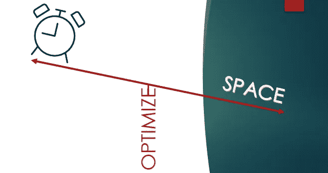
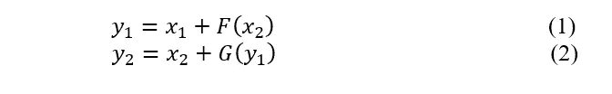
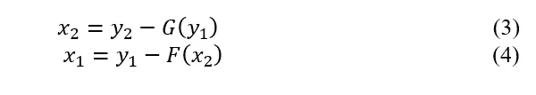
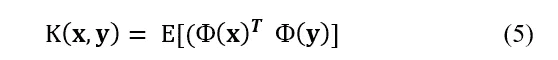
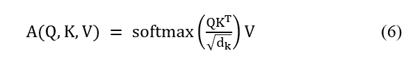
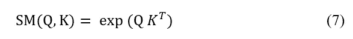

# 改革者和执行者:变形金刚时空优化综述(下)

> 原文：<https://medium.com/walmartglobaltech/reformers-and-performers-a-comprehensive-summary-of-space-and-time-optimizations-on-transformers-c00178e31843?source=collection_archive---------2----------------------->

在[之前的文章](/walmartglobaltech/sparse-transformers-and-longformers-a-comprehensive-summary-of-space-and-time-optimizations-on-4caa5c388693)中，我们讨论了两种模型使用的优化和启发式方法，即稀疏变换器和长成形器，以克服变换器模型使用的二次时间和空间。通过论文中提到的对这些模型的优化，作者不仅可以在更少的空间和时间内执行等同于变压器的操作，而且可以在某些密度估计任务中获得更好的性能。在本文中，我们将研究另外两个这样的模型，并讨论它们所利用的优化和技术，这些在以下文章中会提到:

1.改革者:高效的变压器
2。反思表演者的注意力

让我们从逐一讨论这些模型开始。为了更好的可读性，我将本文分为三个部分:本文的可行性和动机、降低复杂性的方法和降低复杂性的推导或解释，以及每个模型的性能总结。

# **改革者:高效的变压器**

**1。可行性和动机**:本文作者列举了变压器中可以优化的以下三个主要计算密集型领域:

*   **O(n)点乘或变压器自注意操作的时间和空间复杂度**，‘n’为序列的长度。
*   **由于变形金刚中的大量层而导致的高内存需求**:对于像变形金刚这样的深度学习模型，所有层的激活都需要在内存中进行反向传播。这使得这种模型的存储成本与层数成比例。
*   **前馈层的内存需求**:变压器中的前馈层比关注层具有更大的深度(层中节点或隐藏单元的数量)。这导致前馈层对于大的序列长度消耗大量存储器。

**2。降低复杂性的方法和解释:**让我们讨论一下本文中提到的解决上述变压器架构问题的技术。我将讨论本文中使用的三种技术，即位置敏感哈希(LSH)、可逆残差网络(RevNets)和分块。在讨论这些方法时，我将首先解释这些技术，然后提及论文是如何使用它们的。

## A.**区分位置哈希(LSH)**

**(i)技术**:位置敏感散列法是一种用于查找或分组相似数据点的技术。它被广泛用于降低 k-最近邻(kNN)等算法的复杂度。使用 LSH 寻找数据点“x”的最近邻居不需要将其与所有可用的“n”个数据点进行比较。相反，“x”只与几个数据点进行比较，这些数据点与“x”在同一个“桶”或“区域”中。这将查找单个数据点的最近邻居的复杂度从 O(n)降低到 O(与“x”在同一散列桶中的点的数量)。让我们更详细地了解一下 LSH。
在 LSH，我们使用‘k’个随机超平面(或哈希函数)划分所有数据点存在的 d 维空间。因此，空间被粗略地划分为数据点所在的 2ᵏ区域或桶。我们只希望相似的数据点落在相同的桶或区域中。为了实现这一点，我们不只是对空间进行一次分区，而是进行“r”次分区，r 是我们对空间进行分区并将点分配给 bucket 的次数。这减少了比较可能偶然落在同一桶中的两个不同点的机会。

**(ii)LSH**的复杂性:为了使用 LSH 找到点‘x’的最近邻居，我们将 d 维点‘x’与所有‘k’超平面进行比较，并决定该点所在的区域。这导致 O(dk)复杂度。然后，我们将“x”与该区域中的所有点进行比较。平均而言，任何地区的点数都将是 n/2ᵏ.因此，该步骤的复杂度将是 o(区域中的点数* 1 次比较的成本)= O((n/2ᵏ) * d)。因为，我们重复这个过程‘r’次，总的复杂度变成 O( rdk)+O(r*(n/2ᵏ) * d)。如果我们选择“k”等于 log(n)，那么为单个点寻找最近邻的复杂度变成 O(log(n))，这是对普通 kNN 的 O(n)复杂度的改进。

**(iii)重整器中的位置敏感散列**:转换器的二次复杂度来自于将每个查询与序列中的所有关键字进行比较，或者将每个单词与序列中的所有其他单词进行比较。改革者通过将每个查询与序列中的几个相似的关键字进行比较来克服这种二次复杂性。为了识别与任何特定查询相似的关键字，作者使用了 LSH。这将注意力操作的复杂度从 O(n)降低到 O(nlog(n))，其中‘n’是序列的长度。为了确保形成大小相等的桶，并且在变压器中实现 LSH 时优化操作，作者使用以下两个重要的启发法:

*   **共享-QK 注意**:密钥和查询对于 LSH 注意是相同的。这是通过使用相同的线性层来获得查询和关键向量，并使用单独的层来获得值向量来实现的。这是必需的，因为哈希桶中的查询只关注该桶中的键。对每个数据点使用相同的关键字和查询向量确保了相似的查询和关键字落在相同的桶中。
*   **分块**:作者通过使用 LSH 缩小了每个数据点关注的数据点数量。然而，落在相同桶中的点可能在序列中相距很远。这将导致识别序列中相似点的位置并随后执行注意操作的复杂性增加。为了克服这一挑战，作者提出了按存储桶编号对查询进行排序，并且在每个存储桶中，查询按顺序按它们的位置进行排序。排序后，作者建议将查询分成大小为“m”的块。属于哈希桶' b '且在块' c '中的查询' q '只能关注以下查询:
    -属于哈希桶' b '的同一块' c '中的查询。
    -属于哈希桶‘b’的先前块‘c-1’中的查询。

**(iv)由于 LSH** 降低了重整器的复杂度:一个查询只关注序列中有限的一组查询(或键)，将转换器的复杂度从 O(n)降低到 O(n*logn)，其中 n 是序列的长度。

## **B .可逆残差网络(RevNets)**

正如本文前面所讨论的，具有许多层的深度学习模型需要更多的内存，因为所有层的激活都需要存在于内存中以进行反向传播。我们在上一篇文章中讨论了一种称为梯度检查点的技术，它在一定程度上解决了这种复杂性。梯度检查点将具有“L”层的深度学习模型的内存需求从 O(L)减少到 O(√L)。改革者使用另一种称为 RevNets 的技术，这种技术使深度学习模型的复杂性独立于层数。下面我们来了解一下。

**(i)技术** : RevNets 以这样一种方式重新构建前向传播，即层“l”的激活可以被精确地重建，并且在反向传播期间仅使用层 l+1 的激活。因此，要在深层网络上执行反向传播，内存中需要的只是最后一层的激活。使用模型最后一层的激活，我们可以重建所有前面层的激活，代价是只需要一个额外的正向传递。这使得重整器的存储器或空间复杂度与模型中的层数无关。为了获得这种复杂度上的增益，RevNets 将输入“x”分成两组'x₁'和'x₂'.有几种方法可以划分输入，从这篇[论文](https://arxiv.org/pdf/1605.08803.pdf)中可以了解更多。RevNet 中的每个可逆模块使用以下等式获取输入(x₁,x₂)并产生输出(y₁,y₂):

RevNets 可以使用以下等式轻松重建激活:

注意，x₂在 x₁之前被重建，因为重建 x₁has 是 x₂.的附属国因此，使用 RevNets，所有层的激活不需要立即存在于存储器中，它们可以一次一层地被重建回来，以供反向传播使用。

**(ii)重整器中的 RevNet:**rev net 通过在单个 rev net 块中组合和放置注意力和前馈层而用于变压器中。层规范化也被移到 revnet 块内部。在等式 1 和 2 中，F 表示注意层，G 表示变压器中的前馈层。

**(iii)由于 rev net 而降低了重整器的复杂性**:在重整器中使用 rev net 使得重整器的存储器需求与层数无关，这是一个重要的优化。

## **分块**

**(i)技术:**变压器中的前馈层具有大量消耗大量存储器的隐藏单元。随着最先进的变压器使用非常大的数据集作为单个序列，前馈层中的计算变得更加昂贵。为了解决这个问题，重整器将序列中的位置分块，而不是一次对整个序列执行前馈操作，而是对位置分块执行。该模型还分块反向计算和反向传递。

**(ii)由于分块而降低了重整器的复杂性**:分块大大降低了存储器需求，因为存储器一次被一个块而不是整个序列占用。

**3。性能和总结:**重整器比变压器花费更少的训练时间，并且该论文报告了在密度估计和机器翻译任务中与变压器相当的性能。像共享查询键注意和用于重新计算激活的网络中的可逆性这样的技术不会在准确性或困惑性这样的度量上妥协。相反，它们帮助改革者在更短的时间和空间内实现与变压器同等的性能。尽管通过 LSH 由重整器做出的稀疏性假设可能不足以用于非常大的序列，并且重整器可能需要更多的启发来在非常长的序列长度上实现最先进的性能，然而，重整器对变换器提供了显著的优化。

# **反思表演者的注意力**

1.  **可行性和动机:**我们到目前为止讨论的模型通过假设关注矩阵的稀疏性或低秩性来近似由变形金刚计算的关注矩阵。尽管这些模型通过这些近似降低了变压器的复杂性，但是这些近似是有偏差的，因为它们依赖于先验知识和假设。执行者通过提出一种算法来克服这种限制，该算法可以生成具有非常低的方差的“无偏或接近无偏”的注意力矩阵估计，而无需对稀疏性做出任何假设。事实上，该论文陈述了基于稀疏性假设的其他模型并不近似由变压器实现的注意力，相反，它们提出了不同且更简单的注意力机制。让我们在下一节讨论表演者使用的算法。
2.  **降低复杂度的方法和解释:**执行者的目的不是通过做任何稀疏性的假设，而是通过分解注意力矩阵来近似注意力。然而，变压器中的注意力操作在查询和关键向量的点积上应用 softmax 非线性，这使得注意力矩阵的分解变得困难。这就是为什么大多数模型求助于稀疏性假设来近似注意力。在本文中，作者提出了一种新的方法，称为通过正交正随机特征(FAVOR+) 的**快速逼近，使用该方法，他们可以在线性时间内以无偏的方式逼近 softmax 核(并分解注意力矩阵)，并且具有非常低的方差。
    本文用大量的数学方程深入讨论了它们的近似公式和理论保证。然而。我将只涉及论文中提到的概念，而不深入研究数学。我将在两个小节中讨论 FAVOR+算法。在第一小节中，我将解释 **FA** VOR+算法的**快速注意**部分。在第二小节中，我将讨论 FAV **或+** 算法的**正** **正交随机**特征部分。**

## **A .注意力矩阵的快速逼近(FAVOR+)**

让我们理解内核技巧，作为理解近似技术的前提。

**核技巧:**很多模型使用核技巧来估计高维空间中两个向量 **x** 和 **y** 的点积。Kernel trick 估计某个高维空间中两个向量之间的点积，而无需将向量 **x** 和 **y** 显式映射到该高维空间中。相反，它使用一个称为核函数的函数，该函数近似于高维空间中的 **x** 和 **y** 的点积，即

因此，在向量 x 和 y 上使用适当的核函数，我们得到它们在高维空间中的点积的近似。

现在让我们继续理解注意力的快速近似。

**快速近似:**对于变压器，注意力 A 由下式给出

其中 Q、K 和 V 是维度 batch _ size * length _ sequence * dimension _ model(BS * N * d)的查询、键和值矩阵。如果我们忽略归一化项，注意力等式中的 softmax 项可以写成

FAVOR+不是使用核函数来近似其他维度空间(等式的右侧)中的向量映射，而是近似其他维度空间中的映射来估计核。FAVOR+提供了一个**广义可内核化注意力**框架**、**，因为它不仅可以近似最大关注度内核，还可以近似其他关注度内核。这也克服了在 transformers 中只使用 softmax 注意力内核的限制，并为使用 ReLu 等其他注意力内核进行实验开辟了道路，ReLu 可以使用 FAVOR+进行近似。

**由于 FAVOR+(快速逼近)而降低了重整器的复杂度** : FAVOR+将等式 7 中给出的 softmax-attention 核分解成维数为(BS*N*r)的矩阵 Q 和 K，其中‘r’是新空间中的模型维数或特征。在这种分解之后，我们可以如下重新构建 7 中的注意力等式:

这种重新表述允许 K’和 V 首先相乘，然后乘以 Q’，由于这种原因，计算从常规 softmax 中的 O(N . d)下降到执行者中的 O(N.r.d)。因此，执行者可以在线性时间复杂度中近似软最大注意力，而无需任何假设或先验。

## B.**正交随机正**特征中的FAV **或+**

FAVOR+使用可以将输入 x 映射到φ(x)的函数来近似核。这些函数采用数据点和一些能够表示空间φ中的数据点的随机特征，并使用这些特征将数据点映射到φ。**为了逼近变压器的 softmax-attention 内核，FAVOR+特别使用生成正随机和正交特征的函数**。以下几点总结了使用正随机和正交随机特征估算变压器的 softmax 内核的必要性:

*   **使用正随机特征** : Softmax 内核总是产生正的注意值。因此，使用生成正面特征的函数来分解内核变得很重要。此外，通常一个数据点关注序列中很少的其他点，导致关注矩阵中有几个条目为 0。选择产生负值或零值的函数会给注意力矩阵中的零点带来不稳定的近似。因此，必须使用产生正随机特征的函数来鲁棒地逼近 softmax 核。
*   **使用正交特征**:为了估计变压器的 softmax 核，本文使用了从正态各向同性分布中提取的并且彼此严格正交的特征。精确正交特征有助于减少近似核的方差。它们还有助于降低新空间φ中的维度，因为从各向同性分布中提取的正交特征可以表示较小维度的数据。
    本文提供了理论证明和结果，表明这些启发式算法有助于获得方差较小的注意核的无偏或近似无偏估计。

**3。性能和总结**:performer 模型的能力可以总结如下:

*   执行者完全兼容变压器架构，因为他们只是修改变压器的注意力矩阵计算部分，留下其他块和组件完全相同。由于这种能力，表演者可以利用预先训练的变压器重量来提高模型的性能。
*   表演者大大减少了变形金刚的时间和内存需求，从变形金刚的二次到表演者的近线性。
*   执行者减少的记忆和时间复杂性允许在更大的序列长度和批量上训练模型。这也允许在带宽较低的机器上训练表演者。这克服了对于具有非常大的序列长度的训练文档的非常昂贵的计算的要求。
*   在 Imagenet64 等常见数据集上，Performers 在较少的层数下获得了与 Reformers 和 Linformer 相当的性能。这是因为执行者在不做假设的情况下近似完整的注意力矩阵。此外，表演者比其他变形金刚的优化者，如改造者和变形者，训练起来更快。

表演者用较少的资源和复杂性进行训练的能力为在大型文本语料库上训练深度变换器模型开辟了道路，使它们更加强大和有效。由于线性复杂性，执行者可以在更长的序列长度上训练，执行者可以用于模拟复杂的任务，如蛋白质序列模拟。该论文提到了执行程序的其他好处，例如，由于计算要求较低，它们对环境更加友好；由于复杂性较低，它们加快了对变压器的研究；它们与变压器向后兼容，因为它们可以用于对预训练的变压器模型进行推断等。

# **结尾音符**

至此，我们结束了对变压器模型优化的讨论。正如在本系列开始时提到的，本系列的目的是了解在优化模型时可以利用的几种技术，并欣赏作者在讨论的论文中所做的努力和使用的启发式方法。还有其他关于变压器的优化，我没有在这个系列中讨论，但可以探索，如路由变压器，大鸟，Linformers 等。像这样的贡献和优化极大地促进了深度学习和 NLP 中高效和强大模型的开发。

## **参考文献**

1.基塔耶夫、尼基塔、祖卡斯·凯泽和安塞姆·列夫斯卡娅。"改革家:高效的变压器." *arXiv 预印本 arXiv:2001.04451* (2020)。
2。《重新思考表演者的注意力》arXiv 预印本 arXiv:2009.14794 (2020)。
3。[https://ai . Google blog . com/2020/01/reformer-efficient-transformer . html](https://ai.googleblog.com/2020/01/reformer-efficient-transformer.html)
4 .[https://ai . Google blog . com/2020/10/refreshing-attention-with-performers . html](https://ai.googleblog.com/2020/10/rethinking-attention-with-performers.html)

**链接到上一篇文章:**[https://medium . com/walmartglobaltech/sparse-transformers-and-longformers-a-comprehensive-summary-of-space-and-time-optimizations-on-4c aa5c 388693](/walmartglobaltech/sparse-transformers-and-longformers-a-comprehensive-summary-of-space-and-time-optimizations-on-4caa5c388693)