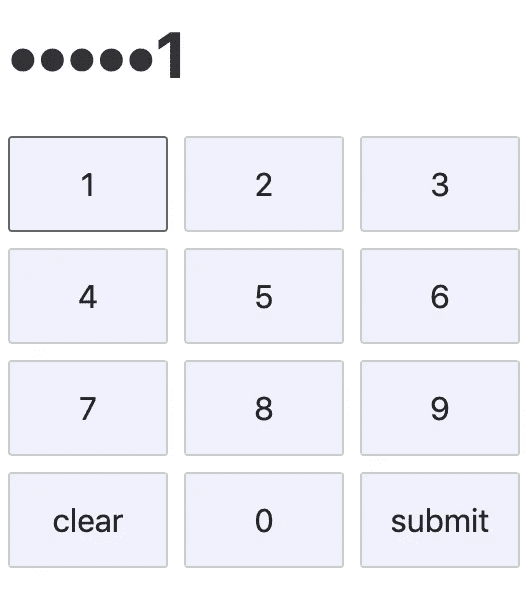

# JavaScript 中的 RegExp 循环

> 原文：<https://medium.com/quick-code/regexp-lookarounds-in-javascript-6d81ca15df25?source=collection_archive---------8----------------------->


Photo by [Nathan Anderson](https://unsplash.com/@nathananderson?utm_source=medium&utm_medium=referral) on [Unsplash](https://unsplash.com?utm_source=medium&utm_medium=referral)

在这篇文章中，我将通过简单的例子来解释 JS RegExp lookarounds 是什么。

让我们假设您需要进行 pin 码样式的文本输入。像这样的:



Simple pin-code style input

注意到除了最后一位，所有数字都是点吗？使用 RegExp lookaround(在这种情况下是负的 lookahead)，只用一行代码就很容易实现:

```
pin.replace(/\d(**?!$**)/g, ‘•’)
```

这里刚刚发生了什么？我们会弄清楚的，但首先让我们回顾一个更简单的例子。

我们有一个降价字符串:

```
- 1 potato for 2€
- 2 tomatoes for 3€
- 5 bananas for 4€
```

让我们编写一个代码，查找欧元符号之前的所有数字。使用回看可以这样做:

```
str.match(/\d+(**?=**€)/g)
```

它的意思是:

*   **\d+** 一个或多个数字
*   **(？**=€)其次是€

就是这样！根本不用动脑筋。

那(**？=** your_regexp)被称为**正向前瞻**。你可以这样理解，因为它以积极的态度展望未来。

结果你会得到一个数组:

```
[“2”, “3”, “4”]
```

请注意，它返回了前瞻之前的内容，在我们的例子中是 **\d+** 。€符号本身不包含在生成的数组中。

现在我想找出所有没有€符号的数字。那也很容易。

```
str.match(/\d+(**?!**€)/g)
```

这是一个消极的前瞻。主要区别是**！**符号代替 **=** 。

所以，这个将返回数量:

```
[“1”, “2”, “5”]
```

这正是我想要的数字。

现在我们可以回到我们的 pin 码示例:

```
pin.replace(/\d(**?!$**)/g, ‘•’)
```

*   **\d** 只是一个数字
*   **(？！$)** 后面没有行尾( **$** 在 regexps 中是一个特殊的字符，表示行尾)

总结一下，找出所有不在行尾的数字，用' \'代替。轻松点。

嗯，如果有一个前瞻，应该有一个后视。是的，有一个。

与€不同，$通常写在数字之前。

```
- 1 potato for $2
- 2 tomatoes for $3
- 5 bananas for $4
```

现在要查找值，我们需要一点不同的代码:

```
str.match(/(**?<=**\$)\d+/g)
```

这被称为**正面回顾**。然后转义 **$** 符号(因为我们不想把它当作行尾，所以我们用反斜杠对它进行转义)。

它查找所有以 **$** 符号开头的数字。

另一方面，还有一个(**？<！** your_regexp) **负面回顾**。

```
str.match(/(**?<!**\$)\d+/g
```

它查找前面没有$符号的所有数字。

总之，如果你需要找到后面有或后面没有的东西，用这些:

*   **正向前瞻:** ( **？=** your_regexp)
*   **消极前瞻:** ( **？！** your_regexp)

如果你需要查找某事之前或之前没有某事，使用这些:

*   **正面回望:** ( **？< =** your_regexp)
*   **负面回顾:** ( **？<！** your_regexp)

你可以使用 [regex101](https://regex101.com/) 来检查所有的例子。这是测试所有正则表达式的好地方。

另外，在 JS 中使用 lookbehinds 时要小心，因为在我写这篇文章的时候，它还有部分支持。检查 [*可以使用*](https://caniuse.com/#search=lookbehind) *进行确认。*