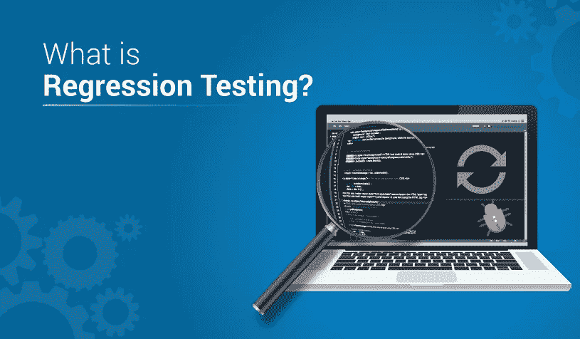
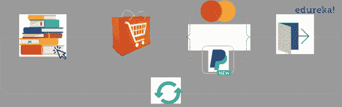
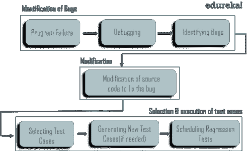

# 什么是回归测试的初学者指南

> 原文：<https://medium.com/edureka/regression-testing-b913b7064824?source=collection_archive---------1----------------------->

Regression Testing — Edureka

每当新软件发布时，测试新功能的需求是显而易见的。然而，重新运行应用程序以前通过的旧测试也同样重要。这样，我们可以确保新软件不会重新引入旧的缺陷或者在软件中产生新的缺陷。我们称这种类型的测试为*回归测试。在本文中，我们将详细探讨回归测试。*

让我们来看看本文涉及的主题:

*   什么是回归测试？
*   回归测试的好处？
*   何时应用回归测试？
*   回归测试有哪些类型？
*   回归测试是如何实现的？
*   回归测试技术
*   回归测试的挑战

# 什么是回归测试？

*“在修改后对先前测试过的程序进行测试，以确保没有在软件的未更改区域引入或发现缺陷，这种测试被称为回归测试。”*

回归测试是一种系统范围的测试，其主要目的是确保系统某一部分的微小变化不会破坏系统其他部分的现有功能。如果您认为回归是无意识的变化，那么这种类型的测试就是寻找那些变化的过程。简而言之，这是为了确保旧的错误不会回来困扰你。让我们看一个虚构的例子来说明这个概念。

当向购物网站添加新的支付类型时，重新运行旧的测试，以确保新代码没有产生新的缺陷或重新引入旧的缺陷。回归测试很重要，因为如果没有它，很有可能将预期的修正引入到系统中，产生比它们解决的问题更多的问题。

# 回归测试的好处

进行回归测试在许多方面给公司带来好处，例如:

*   它增加了检测由软件和应用程序更改引起的错误的机会
*   它有助于及早发现缺陷，从而降低解决问题的成本
*   帮助研究由于新的操作环境而可能发生的不必要的副作用
*   由于及早发现缺陷和错误，确保更好地执行软件
*   最重要的是，它验证了代码变更不会重新引入旧的缺陷

回归测试确保了软件的正确性，以便向市场发布产品的最佳版本。然而，在现实世界中，设计和维护一组近乎无限的回归测试是不可行的。所以你应该知道什么时候应用回归测试。

# 何时应用回归测试？

建议在发生以下事件时进行回归测试:

*   当添加新功能时
*   如有变更要求
*   当有缺陷修复时
*   当出现性能问题时
*   在环境变化的情况下
*   当有补丁修复时

本文的下一部分是关于不同类型的回归测试。

# 回归测试有哪些类型？

回归测试是通过几个测试阶段完成的。正是由于这个原因，有几种类型的回归测试。其中一些如下:

**单元测试:**在单元测试中，当一个单元的代码发生变化时，测试人员，通常是负责代码的开发人员，会重新运行所有之前通过的单元测试。在持续开发环境中，自动化单元测试内置于代码中，与其他类型的测试相比，这使得单元测试非常高效。

**渐进式测试:**当软件/应用规格发生变化以及新的[测试用例](https://www.edureka.co/blog/test-case-in-software-testing?utm_source=medium&utm_medium=content-link&utm_campaign=regression-testing)被设计出来时，这种类型的测试会很有效。

选择性测试:在选择性测试中，测试人员使用当前测试用例的子集来减少重新测试的成本和工作量。当且仅当一个测试单元所覆盖的任何程序实体发生变化时，它才必须重新运行。

**重新测试-所有测试:**这种类型的测试策略包括对特定应用程序的所有方面进行测试，以及重用所有测试用例，即使没有进行更改。这非常耗时，并且在对应用程序进行任何小的修改或更改时用处不大。

**完整测试:**当对现有代码进行了多次修改时，这种测试非常有用。执行这个测试对于识别意外的 bug 非常有价值。一旦测试完成，用户就可以使用最终的系统了。

知道哪种类型的测试适合你的要求是非常重要的。接下来，我们将讨论回归测试是如何实现的。

# 回归测试是如何实现的？

实现回归测试的过程就像应用于任何其他测试过程的过程一样。每次软件经历变化和新版本出现时，开发人员都要在测试过程中执行以下步骤:

*   首先，他执行单元级回归测试来验证他们已经修改的代码，以及他们已经编写的任何新的测试来覆盖新的或改变的功能
*   然后，合并和集成更改后的代码，以创建测试应用程序(AUT)的新版本
*   接下来，在执行任何附加测试之前，执行冒烟测试以确保构建良好
*   一旦构建被宣布为良好，就执行集成测试来验证应用程序单元之间以及与后端服务(如数据库)之间的交互
*   根据发布的代码的大小和范围，或者安排部分或者全部的回归
*   然后缺陷被报告给开发团队
*   如果需要，还会进行多轮回归测试

这就是回归测试如何被合并到一个典型的软件测试过程中。下图清楚地描述了回归测试是如何进行的。

每当对源代码进行一些更改时，程序执行就会因为明显的原因而失败。失败后，对源代码进行调试，以便识别程序中的 bug。进行适当的修改。然后，从已经存在的测试套件中选择适当的测试用例，该测试套件覆盖源代码的所有修改和受影响的部分。如果需要，可以添加新的测试用例。最后，使用选择的测试用例执行测试。现在你可能想知道选择哪个测试用例。

有效的回归测试可以通过选择以下测试用例来完成:

*   经常有缺陷的测试用例
*   复杂的测试案例
*   集成测试案例
*   覆盖产品核心功能的测试用例
*   经常使用的功能
*   经常失败的测试花瓶
*   边界值测试案例

回归测试过程结束后，让我们来看看各种技术。

# 回归测试技术

回归测试只是确认修改后的软件没有被无意地更改，通常使用以下技术的任意组合来执行:

**全部重新测试:**这种方法简单地从上到下重新测试整个软件套件。在许多情况下，这些测试中的大部分是由自动化工具执行的。某些时候自动化是不必要的。这种技术是昂贵的，因为与其他技术相比，它需要更多的时间和资源。

**测试选择:**不是选择所有的测试用例，这种方法允许团队选择一组测试来近似测试套件的全部测试。这种实践的主要优点是它需要更少的时间和精力来执行。通常由开发人员完成，他们通常对测试边缘案例和意外行为的细微差别有更好的洞察力。

**测试用例优先化:**这种技术的目标是通过在不太重要的测试用例之前考虑更多的潜在测试用例来优先化一组有限的测试用例。选择可能影响软件当前和未来版本的测试用例。

这是三大技术。有时，根据测试需求，这些技术被结合起来。

尽管回归测试很有用，但它也有缺点。您需要了解在实施时可能面临的挑战。

# 回归测试的挑战

1.  耗时:像重测这样的技术都需要大量的时间来测试整个测试用例套件
2.  **昂贵:**昂贵是因为您需要一次又一次地测试资源和人力，这是已经在早期开发、测试和部署的东西
3.  **复杂:**随着产品的扩展，测试人员经常被大量的测试用例所淹没，并且容易迷失测试用例的轨迹，忽略重要的测试用例

尽管有这些缺点，回归测试在软件测试过程中还是非常有用的。有了回归测试，公司可以防止项目超出预算，保持他们的团队在正轨上，最重要的是，防止意外的错误破坏他们的产品。至此，我们已经到了博客的结尾。希望您今天在这里学到的东西能够在您踏上软件测试之旅时对您有所帮助。

如果你想查看更多关于 Python、DevOps、Ethical Hacking 等市场最热门技术的文章，那么你可以参考 [Edureka 的官方网站。](http://www.edureka.co/blog/?utm_source=medium&utm_medium=content-link&utm_campaign=regression-testing)

请留意本系列中的其他文章，它们将解释软件测试的各个方面。

> 1.[移动应用测试](/edureka/mobile-application-testing-51140ebe4a87)
> 
> 2.[软件测试工具](/edureka/software-testing-tools-ebd9ebac6f29)
> 
> 3.[软件测试的类型](/edureka/types-of-software-testing-d7aa29090b5b)
> 
> 4.[应用教程](/edureka/appium-tutorial-28e604aebeb)
> 
> 5. [Appium 工作室教程](/edureka/appium-studio-tutorial-8a13ee9662d6)
> 
> 6. [JMeter 教程](/edureka/jmeter-tutorial-774856163ee9)
> 
> 7.[使用 JMeter 进行负载测试](/edureka/load-testing-using-jmeter-3da837c11a02)
> 
> 8.[自动化测试教程](/edureka/automation-testing-tutorial-157d269e60db)
> 
> 9.[什么是功能测试？](/edureka/what-is-functional-testing-complete-guide-to-automation-tools-183e42ad517a)
> 
> 10.[功能测试与非功能测试](/edureka/functional-testing-vs-non-functional-testing-a08bc732fbdd)
> 
> 11. [JMeter vs LoadRunner](/edureka/jmeter-vs-loadrunner-c1ab63acd935)
> 
> 12.[性能测试生命周期](/edureka/performance-testing-life-cycle-d4242d39a5aa)
> 
> 13. [JMeter 插件](/edureka/jmeter-plugins-1bceec7f6226)
> 
> 14.[如何在网站上使用 JMeter 进行压力测试？](/edureka/stress-testing-using-jmeter-e6b3c64299d0)

*原载于 2019 年 4 月 16 日*[*【https://www.edureka.co*](https://www.edureka.co/blog/regression-testing)*。*