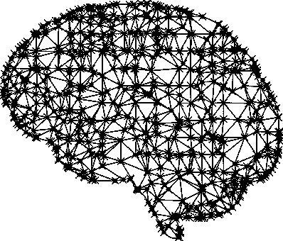
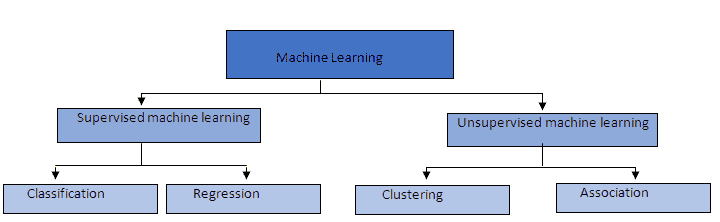

# 回归与分类机器学习:有什么区别？

> 原文：<https://medium.com/quick-code/regression-versus-classification-machine-learning-whats-the-difference-345c56dd15f7?source=collection_archive---------0----------------------->



回归机器学习算法和分类机器学习算法之间的差异有时会困扰大多数数据科学家，这使得他们在解决预测问题时采用错误的方法。

来自德国、拥有超过 5 年机器学习经验的 Andreybu 表示，“理解机器学习任务是回归问题还是分类问题，是选择正确算法的关键。”

先说两种技术的相似之处。

**监督机器学习**

回归和分类被归类在监督机器学习的同一伞下。两者都有利用已知数据集(称为训练数据集)进行预测的相同概念。

在监督学习中，采用一种算法来学习从输入变量(x)到输出变量(y)的映射函数；即 y = f(X)。

这种问题的目标是尽可能精确地逼近映射函数(f ),以便每当有新的输入数据(x)时，可以预测数据集的输出变量(y)。

这张图表显示了机器学习的不同分组:



不幸的是，回归和分类机器学习之间的相似之处到此为止。

它们之间的主要区别在于，回归中的输出变量是数字的(或连续的)，而分类中的输出变量是分类的(或离散的)。

**机器学习中的回归**

在机器学习中，回归算法试图估计从输入变量(x)到数字或连续输出变量(y)的映射函数(f)。

在这种情况下，y 是一个实数值，可以是整数，也可以是浮点值。所以回归预测问题通常是数量或者大小。

例如，当提供了一个关于房屋的数据集，并要求您预测其价格时，这是一个回归任务，因为价格将是一个连续的输出。

常见回归算法的示例包括线性回归、[支持向量回归(SVR)](https://en.wikipedia.org/wiki/Support_vector_machine) 和回归树。

有些算法(如逻辑回归)的名称中有“回归”这个名称，但它们不是回归算法。

以下是 Python 中线性回归问题的一个示例:

```
import numpy as npimport pandas as pd# importing the modelfrom sklearn.linear_model import LinearRegressionfrom sklearn.cross_validation import train_test_split# importing the module for calculating the performance metrics of the modelfrom sklearn import metricsdata_path = “http://www-bcf.usc.edu/~gareth/ISL/Advertising.csv" # loading the advertising datasetdata = pd.read_csv(data_path, index_col=0)array_items = [‘TV’, ‘radio’, ‘newspaper’] #creating an array list of the itemsX = data[array_items] #choosing a subset of the datasety = data.sales #sales# dividing X and y into training and testing unitsX_train, X_test, y_train, y_test = train_test_split(X, y, random_state=1)linearreg = LinearRegression() #applying the linear regression modellinearreg.fit(X_train, y_train) #fitting the model to the training datay_predict = linearreg.predict(X_test) #making predictions based on the testing unitprint(np.sqrt(metrics.mean_squared_error(y_test, y_predict))) #calculating the RMSE number#output gives the RMSE number as 1.4046514230328955
```

**机器学习中的分类**

另一方面，分类算法试图估计从输入变量(x)到离散或分类输出变量(y)的映射函数(f)。

在这种情况下，y 是映射函数预测的类别。如果提供单个或几个输入变量，分类模型将试图预测单个或几个结论的值。

例如，当提供了关于房屋的数据集时，分类算法可以尝试预测房屋的价格是“高于还是低于建议的零售价格”

在这里，房屋将被分类，无论其价格属于两个离散的类别:高于或低于上述价格。

常见分类算法的示例包括逻辑回归、朴素贝叶斯、决策树和 K 近邻。

下面是一个分类问题的例子，[区分了一个橙子和一个苹果:](http://blog.liveedu.tv/a-simple-machine-learning-algorithm-to-differentiate-between-an-apple-and-an-orange/)

```
from sklearn import tree# Gathering training data# features = [[155, “rough”], [180, “rough”], [135, “smooth”], [110, “smooth”]] # Input to classifierfeatures = [[155, 0], [180, 0], [135, 1], [110, 1]] # scikit-learn requires real-valued features# labels = [“orange”, “orange”, “apple”, “apple”] # output valueslabels = [1, 1, 0, 0]# Training classifierclassifier = tree.DecisionTreeClassifier() # using decision tree classifierclassifier = classifier.fit(features, labels) # Find patterns in data# Making predictionsprint (classifier.predict([[120, 1]]))# Output is 0 for apple
```

**收尾**

为您的机器学习问题选择正确的算法对于实现您需要的结果至关重要。

作为一名数据科学家，您需要知道如何区分回归预测模型和分类预测模型，以便您可以选择最适合您的特定用例的模型。

你有什么意见或问题吗？

请把它们贴在下面。