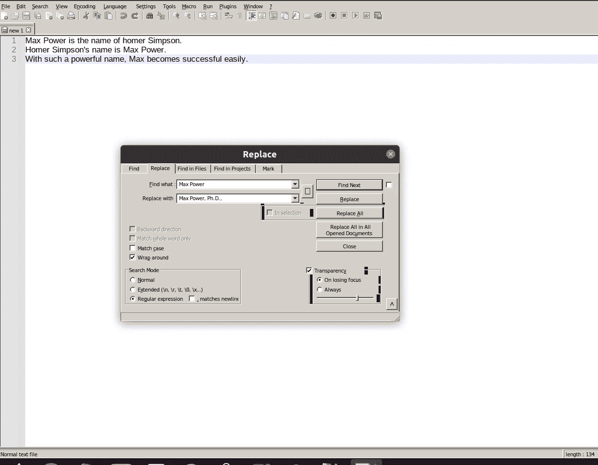
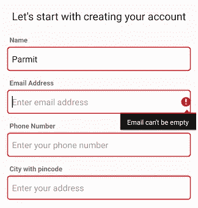
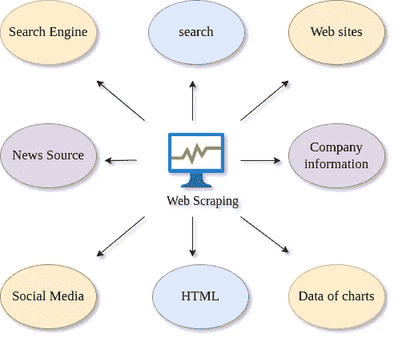

# 正则表达式-模式详细信息

> 原文：<https://medium.com/globant/regular-expression-s-pattern-details-dc68e797d59e?source=collection_archive---------0----------------------->

# **什么是正则表达式？**

R 正则表达式或有理表达式是一种搜索模式，您可以使用一些字符来帮助在您的字符串中找到相似的模式，并且您可以用自己的字符串替换匹配的模式。

# **正则表达式用在哪里？**

正则表达式用于搜索引擎、文字处理器和文本编辑器的搜索和替换对话框、文本处理实用程序(如 sed 和 AWK)以及词法分析。

# **举例:-**

## **1。在文本编辑器中搜索和替换:**

最简单的应用是在你的文本编辑器中搜索一个给定的文本。用名称`**'Max Power, Ph.D.,'**`替换所有出现的客户`**'Max Power'**`。

## **2。验证 Web 应用程序中的用户输入:**

如果你正在运行一个 web 应用程序，你需要处理用户输入。您的应用程序必须验证用户输入是正确的——否则您的后端应用程序或数据库肯定会崩溃。

Validation user field

## **3** 。**用于网页抓取(数据收集)的正则表达式:**

数据收集是数据科学家工作中非常常见的一部分，鉴于我们生活在互联网时代，在网上查找数据比以往任何时候都更容易。人们可以简单地浏览维基百科等网站。收集/生成数据。

Web Scraping

正则表达式对于**定义过滤器**特别有用。

# **如何制作图案？**

在使用任何库之前，我们必须了解图案制作技术和其中使用的所有字符。在这里，我将向你展示如何制作你自己的图案。

我们在下面的模式中使用了一些字符，我将逐一定义每个字符。

**人物:**

# 1.中继器*、+和{ }

这些符号充当重复符，告诉搜索引擎前面的字符将不止使用一次。

**1.1 星号*符号:**星号被称为重复符号，意味着前面的字符可以出现 0 次或更多次。(0 或任何次数)。

**示例:sho*t**
在**【o】**字符后使用一个 ***** 符号，这意味着您必须找到以**【sh】****【o】**字符为 **0 或多次**后以‘t’字符
结束的模式，上面的模式与下面的字符串匹配。

*sht ( 'o '出现 0 次)*

*射门(‘o’出现 2 次)*

… *..*

*shooooooot ('o '出现 7 次)*

*shooo……t (o '出现多次)*

**1.2 加号+符号**:加号也是一个重复符号，但含义是前面的字符可以出现 1 次或多次。(1 或任何次数)。

**示例** *: co+l*

*在‘o’字符后使用了+符号，这意味着你必须找到以‘c’开始的模式，在‘o’字符后是 1 或多次，以‘l’字符结束*

*以上模式与以下字符串匹配。*

*cl(‘o’出现 0 次)———错误*

*col( 'o '出现 1 次)*

*爽(‘o’出现 2 次)*

… *..*

*coooooool(‘o’出现 7 次)*

*cooo……l (o '出现多次)*

**1.3 花括号{min}或** { **min** ， **max** } **符号**:这个花括号告诉搜索引擎将前面的字符(或字符集)重复这个括号内的值的次数。

**例题**T42:

{3}表示至少 3 次

{2，5}表示至少 2 次，最多 5 次

***图案:ba{2，5}d***

*所以{2，5}放在‘a’字符之后。该模式告诉机器匹配以“b”字符开始、在“b”字符后有“a”字符(2 到 5 次)并以“d”字符结束的字符串。*

*所以上面的模式与下面的字符串*匹配

*bd(错当成‘a’出现至少 2 次)*

*不良(错误为“a”至少出现 2 次)*

*baad(‘a’出现 2 次)*

*baaad(‘a’出现 3 次)*

*baaaad(‘a’出现 4 次)*

*baaaad(‘a’出现 5 次)*

*baaaaaad(错为“a”最多出现 5 次)*

# 2.**通配符“.”:**

**这个符号。**(点)告诉机器这是为角色预留的座位，稍后将由角色填充。因为任何字符都可以占据它的位置，所以它被称为通配符。

Pattern **h.t** 告诉机器任何字符都可以代替点“.”性格。它与 **hit、hot、het、**等类似词语相匹配。

我们可以使用其他字符与这个字符一样重复如下。

**举例:*b . * d***

*上面的模式告诉我们，上面的模式将匹配以' b '字符开始的字符串，可能在' b '字符之后有任何字符 0 到多次，并以' d '字符结束。*

*所以上面的图案会与任何字符匹配。*

*bd ( as *有所以字符出现 0 次)*

*错误(' a '字符替换。')字符并出现 1 次)*

*床(' e '字符代替' .)字符及其出现次数 1)*

*baaad ('a '字符替换。')字符并出现 3 次)*

…… *..等等，beed，boood，biiiiiid，bid 等等。*

**举例:*b .+d***

*上面的模式告诉我们，上面的模式将匹配以“b”字符开始的字符串，可能在“b”字符之后有任何字符 1 到多次，并以“d”字符结束。*

*bd ( as * is there so 字符出现 0 次)———错误*

错误的(' a '字符替换。')人物和它出现 1 次)

*床(' e '字符代替' .)字符和它出现 1 次)*

' baaad ('a '字符替换。'字符并出现 3 次)

…… *..等等，beed，boood，biiiiiid，bid 等等。*

# **3。可选字符“？”:**

符号**“？”**告诉机器前面的字符可能出现也可能不出现在字符串中。喜欢图案**的商品？**告诉我们‘s’字符可能会也可能不会出现在字符串中。因此，字符串“**货物**”和“**货物**”与图案匹配。

在下面的例子中，让我们用字符“？”包含一些其他的字符为了更好的理解。

***图案:ba*ds？***

*上述模式将匹配以“b”字符开始，在“b”字符后有“a”字符 0 到多次，然后有“d”字符，并以可选的“d”字符结束的字符串，该字符可能存在也可能不存在。*

*以上模式匹配以下字符串。*

*BDS(‘a’出现 0 次，‘s’存在)*

*不良(‘a’出现 1 次且‘s’不存在)*

*baaads(‘a’出现 3 次，且‘s’存在)*

……………… *。诸如此类。*

# **4。插入符号(^ ):**

脱字符号(^)告诉机器检查该模式是否出现在单词的开头。

*像^a{2}b 模式意味着“a”字符出现两次，“b”出现在“a”字符之后，检查“aab”是否出现在单词的开头。*

现在，我们将使用下面的单词检查模式，看看它是否匹配。

aa ("aab "与字符串的开头不匹配。)

*aab ("aab "与字符串开头匹配)*

*aabaac ("aab "匹配字符串的开头)*

*北京汽车股份有限公司(“aab”不在字符串的开头”)*

# 5.美元符号“$”

美元" **$ "符号**告诉机器检查图案是否出现在单词的**末端**。

*Like $a{2}b 模式表示“a”字符出现两次,“b”出现在“a”字符之后，检查“aab”是否出现在单词末尾。*

现在，我们将尝试将模式与下面的单词进行匹配，以检查它是否匹配。

*aaa ("aab "与字符串结尾不匹配。)*

*aab ("aab "与字符串结尾匹配)*

*aacaab ("aab "与字符串结尾匹配)*

*北京汽车股份有限公司(“aab”出现在字符串的末尾)*

# 6。方括号[ ]

符号[ ]告诉机器检查是否有任何字符与[]中的字符匹配。

例如，模式[xyz]意味着只有字符的“x”、“y”和“z”与该模式匹配。

***图案:a【XYZ】****

*上面的模式将检查字符串是否以字符‘a’开始，而字符‘x’或‘y’或‘z’可能出现 0 到多次。*

让我们检查以下字符串的模式:

*a(字符在[x，y，z]中出现 0 次)*

*ay(‘a’字符在开始，而‘y’出现在[x，y，z])*

*ayyy ('a '字符出现在 start 中，而' yyy '出现在[xyz]中，并且' y '出现 3 次)*

我们也可以在[ ]中指定范围。

# **7。带连字符“-”的方括号[]**

指定一个范围，例如[0–9]，它将检查从 0 到 9 的所有值。

***【a-z】****表示将检查从“a”到“z”的字符。*

***【a-I】****表示将检查从“a”到“I”的字符。*

***【a-Z1–7】****表示将检查从“a”到“z”或 1 到 7 的字符*

***【a-z0–9】****表示将检查从“a”到“z”或 0 到 9 的字符*

# **8。带否定的方括号【^】**

它与[ ]符号相反。

它匹配除方括号中的字符之外的字符。例如，模式 **a[^abc]d** 意味着字符串应该以字符‘a’开头，后面跟一个字符，而不是以字符‘d’结尾的字符(‘a’、‘b’和‘c’)。

***图案:a[^abc]d***

如上所述，让我们看看哪些字符串匹配这个模式。

*Abd(错当成【^abc】中的‘b’字符，它明确表示除了‘a’、‘b’、‘c’以外的字符。)*

*avd(‘a’是起始字符，‘v’在【^abc】中不存在，而‘d’是结束字符)*

# **9。分组字符()**

这用于将正则表达式分组到一个组中，我们可以在该组中应用其他正则表达式。

***图案:喜欢(a[^abc])****

这里，我们在模式上应用了 **( )** ，这将把它分组到容器中。我们可以进一步对它进行更多操作。

例如， **a[^abc]** 模式意味着它应该以字符“a”开始，以除了“ **a”、“b”和“c”之外的任何字符结束。**

然后我们应用 **( )** 将其分组。

然后我们进一步在这个组上应用*告诉我们组**a[^abc】**可以重复 0 到多次。

因此，它可以与以下字符串匹配:

***(a[^abc 出现 0 次)***

***公元(a[^abc)出现 1 次)***

***ahay (a[^abc)出现 2 次，“ah”和“ay”)***

# **10。竖线(| )**

**匹配由竖线(|)字符分隔的任何一个元素。竖线充当 OR 条件。**

****示例:th(e|is|at)** 将匹配单词 the、this 和 that**

# ****11。字符分类****

**字符类允许您匹配某个字符集中的任何符号。字符类也称为字符集**

**比如，**

***/s:匹配任何空白字符，如空格和制表符
/S:匹配任何非空白字符
/d:匹配任何数字字符
/D:匹配任何非数字字符
/w:匹配任何单词字符(基本上是字母数字)
/W:匹配任何非单词字符
/b:匹配任何单词边界(包括空格、破折号、逗号、分号等)***

**例子**

****模式:a/d+****

**该模式将匹配以“**a”**字符开头的字符串，然后**数字**将出现**至少 1 次**最多**多次。****

**所以让我们检查字符串，**

***a2(因为 2 是数字，出现 1 次)***

***a44(因为 4 是数字，出现 2 次)***

***s11(错。字符串的开头缺少一个')***

***a121312(任意数字，出现 6 次)***

****模式:a/s+d****

**该模式将与以" **a"** 字符开始的字符串相匹配，然后**空格**将出现**至少 1 次**最多**多次。****

**所以让我们检查字符串**

***a d(作为空格出现的 a 和 d 字母)***

***ad(因为 a 和 d 字母中没有空格)— —错误***