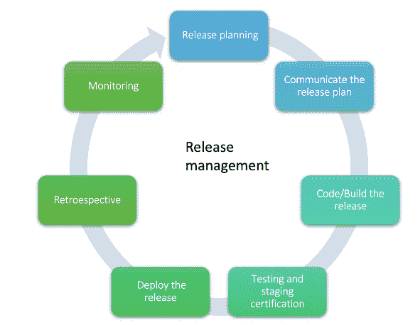

# 发布管理

> 原文：<https://medium.com/globant/release-management-75bd0ec4fb9b?source=collection_archive---------0----------------------->

发布管理为在我们客户的项目中持续和成功的软件交付提供了一个很好的机会。这是在系统开发生命周期(SDLC)的所有阶段中计划、安排和管理软件构建的过程

作为一个项目，通常，产品可能处于创建、测试和发布的时间框架可能是几天到几周的阶段。现在是朝着更快速的发布过程努力的时候了，该过程概述了满足最终用户对及时添加功能和解决问题的期望的目标

发布经理在发布管理过程中扮演主要角色，协调参与发布的每个人的工作，以实现目标。作为一个发布经理，主要的关注点是产品的持续交付，确保质量，与不同的利益相关者协调范围、需求、实现、测试，并在计划的日期内发布。

重要的是不要混淆发布经理和项目经理。两者是相关的，并且密切合作，但是项目经理关注的是资源管理、项目的执行、预算和期限，并且可能只交付发布的一个或多个组件。

**发布管理的好处**

拥有一个有效的发布管理过程为组织提供了一些好处，例如:

*   增加成功发布的数量
*   减少缺陷数量
*   愿景和目标与发布、积压和史诗的范围相一致。
*   持续集成、测试和交付
*   允许过程中的持续改进
*   提高生产效率，加强产品相关各方的沟通
*   以高质量更快地交付软件

这些好处反映在给予我们客户的价值中，他们将在预期的时间内高质量地收到他们需要的东西，到达持续集成的点，在那里变更被批准，并发布到生产中。

# 发布管理的基本步骤

通常，发布管理过程对于所有的组织来说是不一样的，因为有必要根据发布时间、发布类型、延迟的发布和发布过程的时间来识别当前发布过程的状态。一旦确定了这一点，就可以应用以下基本步骤:

**1。确定释放的类型**

根据产品的成熟度，可以有不同类型的版本，例如:

*   修补程序:这些是快速发布的版本，用于解决具有最高优先级的关键问题，并且会影响用户的生产。当需要这种类型的发布时，对于整个团队来说，这通常是优先于所有任务的。
*   次要版本:这些版本是对主要版本的更新，旨在快速包含对用户重要的优先 bug 和特性的修复。这些版本通常不会导致生产环境中断。
*   主要版本:这个版本是一个主要的软件升级，它可能是产品的完整版本的变化。此版本可能会导致生产环境停机。

了解发布的类型将使根据每个发布计划发布过程变得更加容易。

**2。定义分支流程和策略**

作为发布过程的一部分，DevOps 团队提供了一个行动计划和策略来实现适当的分支管理，该策略包括分支定义、语义版本化和由环境限定的分支范围，以便控制要安装的发布包。

如果在版本的回归测试或者用户验收测试中发现了任何问题，这一步对于确定如何在版本分支中引入修复也是很重要的。

**3。完成的定义**

拥有需求完成的标准可以减少发布中的问题数量，并且可以优化发布过程。

有必要与所有团队成员分享这个完成的定义，这样每个人都知道质量期望，并且他们知道完成一个需求需要什么，以及什么可能阻碍或影响发布，因为这个完成的定义是为团队在冲刺阶段包括的卡片而评审的。

**4。确定测试和准备的环境**

成功发布的一个关键点是质量。有必要确定 QA 团队要去的环境，以确保产品满足需求。建议让以下环境独立于开发环境:

*   QA 环境:在这个环境中，只有 QA 团队可以访问，发布版本在开始回归测试之前应该被冻结
*   阶段环境:这个环境应该类似于生产环境，以保证发布版本可以在那里正常工作，因此回归测试应该在这里运行。

有了前面 4 个步骤的定义，下面的步骤将影响每个版本:

**5。发布计划**

规划阶段是发布过程中最重要的步骤，其主要目标是确定所有所需活动的范围和时间表，以及参与其中的利益相关者。进行发布计划为团队提供了对范围和时间表的愿景和理解，以确保他们在正确的轨道上并为相同的目标而努力。

发布计划应该包含的基本内容是:

*   发布的主要目标
*   范围内外的要求
*   各阶段的时间表和交付日期
*   团队成员对发布的每个活动负责。
*   开发和质量保证认证环境

**6。与团队分享发布计划**

有了这个计划之后，你就有足够的信息来创建一个发布路线图，这个路线图对整个团队来说都是简单明了的。与整个团队分享发布计划是成功发布的关键，如果团队了解这一点，他们就会理解最后期限并为相同的目标而努力。除此之外，由于可能有多个团队在同一个发布上工作，共享计划可以减少导致他们的发布彼此冲突的机会。

**7。构建发布**

产品的发布可能由不同的团队组成，他们负责不同的功能。有了发布计划，每个团队都将拥有将成为范围一部分的需求，这样他们就可以开始设计、构建和测试发布的产品

构建一个包含不同阶段和团队的版本:

*   将开发产品的开发团队
*   负责测试和认证产品质量的 QE 团队。
*   Devops 团队，他们将确保环境以及将要交付的发布包经过 QA 团队的测试和认证
*   产品所有者:谁负责澄清团队对于发布范围内的需求的任何业务疑问，

**8。测试和分级认证**

这一阶段将向发布团队提供继续发布的批准，QE 团队验证产品是否按预期运行，没有问题，以及它是否满足发布的验收标准。另一个批准来自产品所有者和组织决定作为批准者的任何其他利益相关者。

在这里，QE 团队在复制生产中可能发生的场景中扮演着重要的角色。除了人工质量分析师，测试自动化团队支持这个过程，并优化这个阶段的时间，安全和性能团队可以强调重要的问题。拥有一个用于认证的准备环境可以降低生产中出现问题的风险。

**9。跟进和监控计划**

非常重要的一点是，发布经理要跟踪计划，评估计划中的活动是否完成，以及它们的进度是否符合计划。方法之一是通过一个清单，按时间顺序列出活动、负责角色、开始日期和结束日期。

**10。发布批准发布**

在部署到生产或 QA 或试运行环境(根据定义的环境)之前，获得发布过程中涉及的主要领导的批准是很重要的:作为建议，发布批准中涉及的角色包括 QA 领导、产品所有者、产品安全领导(如果有)、项目经理和发布团队考虑包括的任何其他角色。

10。通知、部署发布和监控

在通过认证测试和批准部署该版本之后，是时候迎来重要的一天了。考虑提前与主要涉众沟通发布的时间表，注意这一步也应该有一个计划来避免任何类型的错误或者有一个意外事件的应急计划。

请记住考虑以下几个方面:

*   发布计划的清单包括开发运维、质量保证和用户的任务，该清单应包括将在发布之前、期间和之后执行的所有步骤。发布前的部分活动应包括备份当前版本的生产、数据和任何配置文件。每种产品的清单可能不同。
*   发布范围的沟通(缺陷修复，新特性)，发布时间，持续时间和停机时间
*   如果由于任何意外的严重错误而需要回滚，此回滚是由 DevOps 团队定义的流程。
*   冒烟测试，以检查新版本没有引入任何问题，并且工作正常
*   发布期间可用的角色，以防有任何错误或疑问，应该与开发人员或产品所有者一起审查
*   用户验证功能的访问和工作流程

完成发布后，不要忘记将发布的最终结果传达给团队和受影响的利益相关者，继续监控这一点，为任何可能发生的事情做好准备。

**11。回顾**

最后，但同样重要的是，我们应该始终考虑持续的业务改进，这就是为什么建议在每个版本发布后回顾哪些进展顺利，以及我们可以在下一个版本中做得更好，并为此制定一个行动项目。

创建一个发布管理过程在开始时可能需要时间，但是回报将是节省资金，延迟，并且让客户和用户更满意产品更可靠和持续的交付