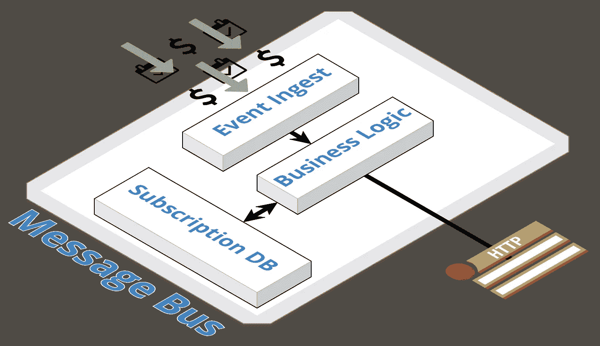
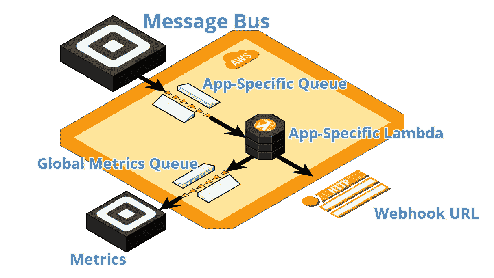

# 使用无服务器架构的可靠 Webhooks

> 原文：<https://medium.com/square-corner-blog/reliable-webhooks-using-serverless-architecture-e009a2096732?source=collection_archive---------0----------------------->

## 我们如何使用 SQS 和拉姆达让我们的网络钩子更可靠

> 注意，我们已经行动了！如果您想继续了解 Square 的最新技术内容，请访问我们的新家[https://developer.squareup.com/blog](https://developer.squareup.com/blog)

对于那些已经是 [Square 开发者](https://squareup.com/developers)的人来说，你可能已经听说了我们关于 webhooks 更加可靠的声明。如果你还没有:10 月，我们发布了更加健壮和可靠的 webhooks，以便更好地为开发者的应用程序提供事件服务。今天，我们将分享我们是如何做到这一点的。

在大多数情况下，webhook 事件将在相关事件发生后的 30 秒内到达，并且失败的交付将在最多 72 小时内重试。如果你对我们的 Webhooks API 如何工作感兴趣，一定要看看我们的[文档](https://docs.connect.squareup.com/webhooks)。

我们能够通过将我们的 webhooks 基础设施的一部分转移到[亚马逊 Web 服务(AWS)](https://aws.amazon.com/) 并利用他们的 SQS 和 Lambda 服务来改进我们的 webhooks。让我们简单了解一下我们的架构，以及我们是如何实现这一转变的。

在我们开始之前，这里有一个对理解这篇文章有用的术语列表:

*   Webhook(也称为 web 回调或推送 API)是由特定事件触发的 HTTP 调用或代码片段。对于典型的 API，您必须定期调用以检测数据的变化。Webhooks 用即时、实时的通知取代了常规的 API 调用。
*   **无服务器架构** —一种基于使用可配置的第三方后端服务而不是内部服务器的设计模式。一个很好的总结可以在[这里](https://martinfowler.com/articles/serverless.html)找到。
*   **亚马逊网络服务(AWS)** —亚马逊的云计算平台，基于每次使用提供无数的通用服务。
*   **Lambda** —运行代码以响应事件并自动管理代码所需的计算资源的 AWS 服务。
*   **SQS** —提供分布式消息队列的 AWS 服务。

## 我们的网钩简史

从高层次来看，我们的 webhooks 架构遵循[发布-订阅模式](https://en.wikipedia.org/wiki/Publish%E2%80%93subscribe_pattern):有一组生产者、一条消息总线和一组消费者。一个典型的 webhook 事件将由生产者推入发布提要，由消息总线通过查看 webhook 订阅数据进行处理，然后转发给适当的消费者提要。消费者馈送将继续向订阅的端点发出 POST 通知，并处理可能发生的任何错误。

通过这种模式，成千上万的用户每天可以获得数百万的网页链接。以前的系统是在 Square 内部实现的，超出了最初的设计处理能力。随着不为人知的错误浮出水面，代码复杂性持续增加，这一点变得越来越明显。毫不奇怪，构建一个定制的分布式消息传递系统并不容易。结果是订阅 webhooks 的开发人员不得不忍受不太理想的可靠性和有限的特性集。

考虑到这一点，我们重新开始，并确定了我们的目标:

*   加快我们向客户提供功能的速度。
*   降低系统复杂性和操作负担。
*   通过使用记录完善、常用且经过验证的基础设施来提高可靠性。
*   支持全面的监控和分析。

为了实现这些目标，该团队得出结论，生产者部分可以保持原样，因为它建立在 Square 其余部分使用的技术之上，但为 webhooks 定制的消费者部分将受益于重建。考虑到我们的目标，在云中重新实现它是最有意义的；开发速度会更快，最终产品会比另一个内部迭代更可靠。

# 向云迁移

在主要云服务上进行原型开发后，我们决定使用 AWS，因为它提供了最简单和最优雅的解决方案，这要归功于一个[新功能](https://docs.aws.amazon.com/lambda/latest/dg/with-sqs.html)，它允许我们配置 Lambdas 自动从 SQS 拉取。另一个好处是我们对 AWS 的熟悉，以及它对 Go 的支持，这是我们首选的编程语言之一。

架构图显示了我们的最终设计:对于每个应用程序，我们提供一个由 Lambdas 轮询的 SQS 队列，由一个共享的[死信队列](https://en.wikipedia.org/wiki/Dead_letter_queue)和度量队列支持。这为我们提供了管理每个应用程序的灵活性，例如动态更新和删除消息，以及通过设置并发 Lambda 执行的最大数量来限制吞吐量。死信队列(DLQ)是一个 [AWS 特性](https://docs.aws.amazon.com/AWSSimpleQueueService/latest/SQSDeveloperGuide/sqs-dead-letter-queues.html)，用于处理由于任何原因无法处理的消息，这些消息将被存放在这个单独的队列中进行诊断。共享指标队列保存信息性指标，如状态代码、时间戳和交付结果。

在这个新系统中，交通流量简单明了。一旦消息总线计算出事件和订户，它就将信息转发给 AWS，并在那里将其放入 SQS 队列中。运行我们的定制逻辑的 Lambda 自动从队列中取出，并试图将事件发送给指定的订阅者。如果发送成功，消息将被标记为完成，并从系统中删除。如果发送失败，消息将重新排队进入 SQS，并配置设置适当的重试回退时间。

这个系统的优点在于它的简单。缩放、速率限制、错误处理和基本监控都是通过使用 Amazon 提供的现有工具进行配置来完成的。对于额外的数据点，我们实现了额外的[自定义指标](https://docs.aws.amazon.com/AmazonCloudWatch/latest/monitoring/publishingMetrics.html)，这些指标在 Lambdas 中创建，并转发到指标队列，以定期进行监控、警报和分析。

# 部署 Lambdas

我们认为部署应该遵循我们现有工作流程设定的最佳实践。这意味着新代码首先被提交到一个阶段化环境中，并且构建通过自动化的(适当的话，手动的)验收测试被彻底验证为生产就绪。访问权限通过内部系统和 AWS 的 [IAM](https://aws.amazon.com/iam/) 角色来实施。

我们在 AWS SDK 的基础上构建了一套强大的工具来帮助本地开发、故障排除、推广和补救。例如，更新 Lambda 需要将代码上传到 [AWS S3](https://aws.amazon.com/s3/) ，调用 ListLambda API 获取所有的 Lambda，然后更新 Lambda API。

这些工具支持以下典型工作流:

*   独立测试新的 AWS 依赖项。
*   在本地创建新的特征变化。
*   在 AWS 中提供一个子系统，以手动验证端到端场景。
*   编写测试。
*   打开一个 PR，一旦批准，提交变更。
*   将更改部署到临时环境中。验收测试必须是绿色的，部署才能完成。
*   将更改部署到生产环境中。

# 监控和测试

监控是确保生产服务成功的核心要素之一。我们收集可量化的匿名数据，以确保我们的服务是最佳的和可操作的。

我们有以下监测手段:

*   **CloudWatch 日志**。CloudWatch 是一项提供主动监控的 AWS 服务。日志记录语句由系统和 Lambda 逻辑打印。出于调试目的，我们通常打印信息性和错误消息。
*   **信号 FX**仪表盘和警报。Square 使用总部位于 SaaS 的监测和分析平台 SignalFx。对于内部监控，它是全面的-所有对 AWS 的 API 调用都受到监控，AWS 中的所有流量都通过 SignalFx 与 CloudWatch 的直接集成或我们从指标队列中提取的数据进行监控。所有仪表板都有警报支持，一旦满足特定条件，就会触发警报。

单元测试是为单个功能或一小组功能编写的。它们位于遵循 [Go 测试惯例](https://www.golang-book.com/books/intro/12)的产品代码旁边。它们必须在代码被推入主模块之前通过。

集成和 CI 测试类似于单元测试，只是范围扩大了。他们测试多个系统或者端到端的系统，并且是进入阶段的构建的把关者。

这只是开始！有兴趣加入我们吗？点击查看我们的招聘职位[。](https://square.jobs)

要使用 Square 进行构建，请在[https://squareup.com/developer](https://squareup.com/developer)注册一个帐户，加入我们的 [Slack 社区](https://squ.re/slack)，和/或注册我们的[时事通讯](https://www.workwithsquare.com/developer-newsletter.html?channel=Online%20Social&sqmethod=Blog)。