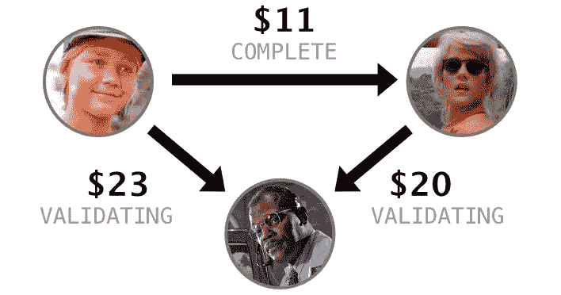
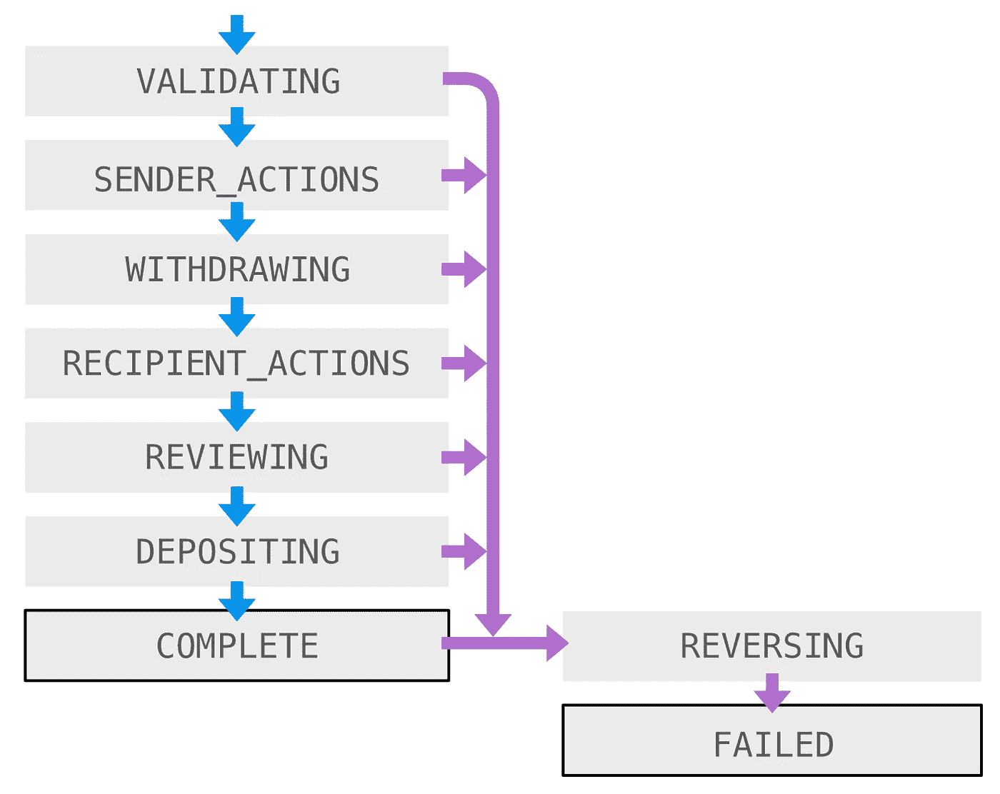
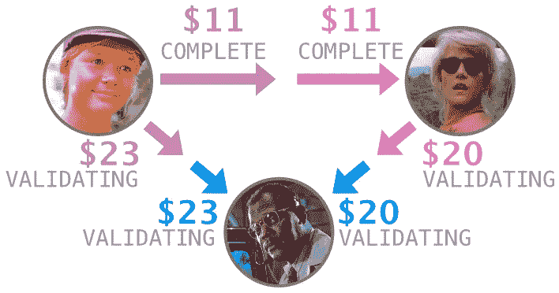
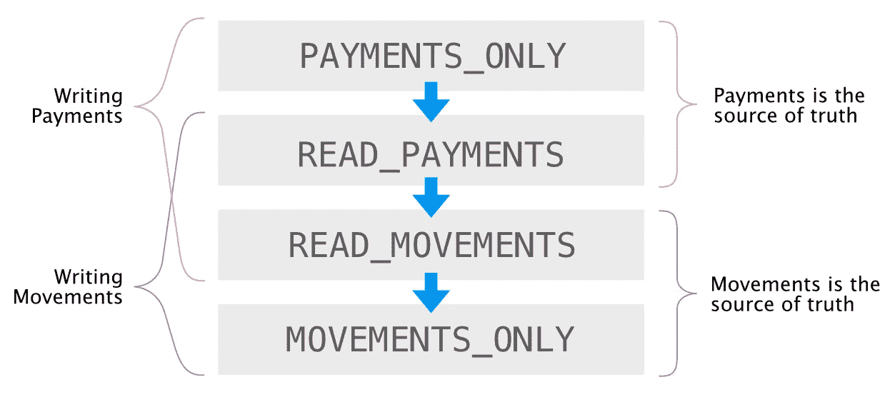
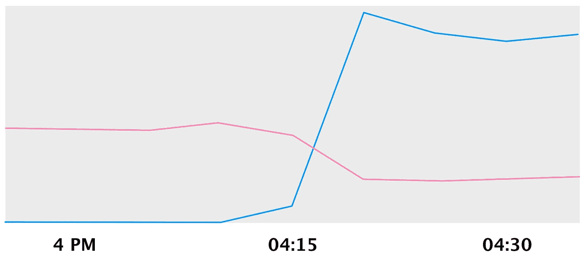
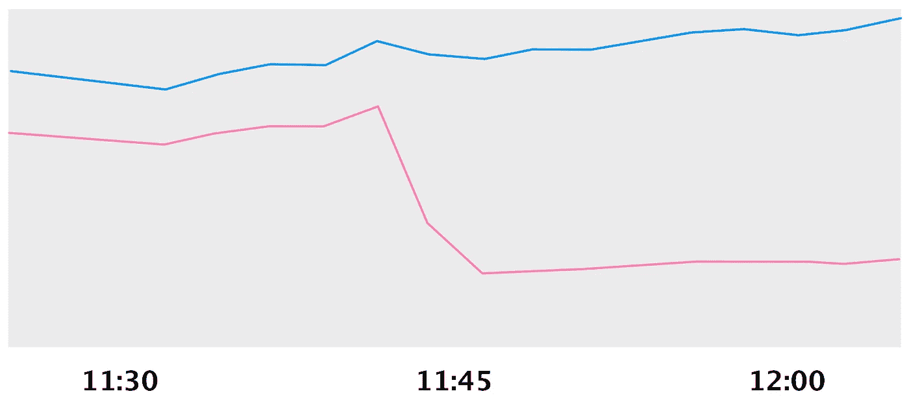
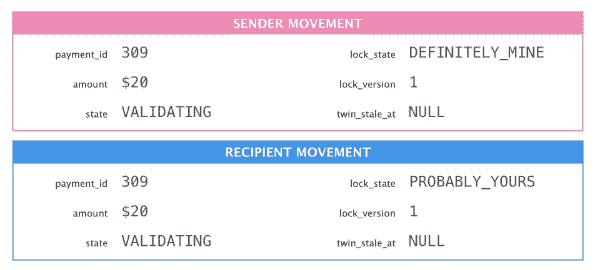
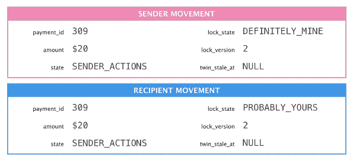

# 重塑现金应用支付

> 原文：<https://medium.com/square-corner-blog/remodeling-cash-app-payments-539e1f6c4276?source=collection_archive---------0----------------------->


> 注意，我们已经行动了！如果您想继续了解 Square 的最新技术内容，请访问我们的新家[https://developer.squareup.com/blog](https://developer.squareup.com/blog)

在对数据库进行分区之前，我们需要准备数据模型。下面是我们如何将一个简单的标准化数据模型转变成一个可以进行规模划分的模型。

## 归一化的数据很漂亮

Cash 应用程序最初是一项简单的汇款服务。我们的 MySQL 数据库跟踪客户、他们关联的借记卡以及他们之间的支付。

使用规范化的持久性模型非常好！这使得我们很容易迭代我们的服务。我们构建了许多潜在的功能，并推出了最好的功能。



3 customers + 3 payments

我们使用强大的状态机来管理支付生命周期。`state`列随着支付通过该状态机的进行而改变。



该模式可用于编程查询和即席查询。例如，如果一张卡挂失，我们可以找到从它发出的付款，即使它与多个客户相关联。

```
SELECT
  p.id,
  p.amount
FROM
  payments p,
  cards c
WHERE
  p.sender_card_id = c.id AND
  c.vault_token = 'b191a4884d216ea4';
```

该模式让我们能够在客户和他们的支付之间进行原子操作。如果艾莉链接了一张新的借记卡，我们可以在状态机中提前支付她的所有款项。

为现金数据库开发非常棒！但是我们预料到大规模运作会有困难。

# 分区数据是可伸缩的

为了跨多个 MySQL 节点扩展我们的系统，我们必须首先对它进行分区。但是怎么做呢？我们的数据模型是一个带有客户节点和支付边的图。我们的代码在客户和他们的支付之间运行原子交易。它还希望跨这些表进行 SQL 连接。

我们的想法是借用消息系统。他们通过复制每条信息来解决问题:一份给发送者，一份给接收者。我们也可以这样做，只要我们能找到一个共享支付状态的解决方案。



3 customers + 6 movements

现金应用程序中的每笔支付都会转移两次资金:从发送方提取到 Square，从 Square 存入到接收方。我们将付款的一半命名为“运动”,并开始了我们的大规模模式改造。

对于 payments 表中的每一行，我们在 movements 表中创建了两行:一行用于发送方，另一行用于接收方。有很多代码会受到这次迁移的影响！

Cash 应用程序在我们与 MySQL 的大部分交互中使用 Hibernate。我们在实体类中使用前缀`Db`，比如`DbCustomer`、`DbCard`和`DbPayment`。除了为我们的新表创建一个`DbMovement`,我们还需要一个抽象来连接两个模型。我把它叫做`DaPayment`，并用一些愚蠢的问题来娱乐我的队友，比如*“da 在哪里付款？”当他们问到名字的时候。*

调用`DaPayment.setState()`将更新`DbPayment`，两个`DbMovement`，或者所有的东西，这取决于我们的迁移阶段。迁移有四个阶段。



1.  付款表是我们唯一使用的表。
2.  `READ_PAYMENTS`:支付是真理的源泉；将所有写操作回显到动作中。
3.  `READ_MOVEMENTS`:运动是真理的源泉；对付款也回显所有写入。
4.  `MOVEMENTS_ONLY`:movements 表是我们唯一使用的表。

抽象出实体类是好的，但还不够。我们还需要对我们的查询和它们产生的预测进行抽象。访问支付的每一行代码都需要间接在支付或移动之间切换。由于我们的项目主要关注的是付款，这是很多行代码！

我们编写了回填工具来为没有支付的支付创建移动行(在阶段 2 运行)，并编写了另一个工具来删除过时的支付行(在阶段 4 运行)。

拥有一个全面的测试套件对于确保迁移安全至关重要。在迁移的早期，当一些测试在新世界中运行完成时，我们建立了信心。我们注释了这些测试`@WorksOnMovements`，并配置了我们的构建基础设施来运行这些测试两次，一次在阶段 1 下，另一次在阶段 4 下。我们通过找到未标注的测试并填充运动代码路径直到它们通过，从而取得了进展。后来，我们用一个`@DoesNotWorkOnMovements` denylist 替换了`@WorksOnMovements` allowlist，并开始倒计时到一个完全就绪的系统。一旦所有的测试都成功了，我们就准备好迁移了。

2017 年春天，我们完成了生产中的分阶段迁移。进入第 2 阶段压力很大，因为额外的写入增加了数据库的总负载。如果我们的数据库不能处理额外的负载怎么办？我们会被困住吗？我咬着我的指甲，推了过去。

以下是我们进入第三阶段时对峰值运动的质疑:



Movements (blue), Payments (pink) QPS

这是随着我们进入第 4 阶段，付款记录逐渐减少。



Movements (blue), Payments (pink) QPS

咻，成功了。那天晚上我睡得很香！

# 分布式系统是异步的

尽管我们已经用分区友好的移动表替换了抗分区的支付表，但我们仍然没有做好分割的准备。我们仍然需要保持共享的可变字段的同步，比如付款的状态。

我们建立了一个名为“Twinlock”的机制来保持运动对的一致性和同步性。在任何时候，一个运动持有锁，可以改变两个运动共享的可变字段。孪生数据异步更新，最终保持一致。实际上，“最终”不到一秒钟。

TwinLock 在两种机芯中都使用了 3 根立柱:

*   `lock_state`:不是`DEFINITELY_MINE`就是`PROBABLY_YOURS`。
*   `lock_version`:只有锁持有者增加此值。如果一个机芯的`lock_version`比它的孪生机芯低，那么它可能已经被锁定。
*   `twin_stale_at`:如果 twin 需要同步其字段，则非空。

MySQL 允许我们在单个事务中用 twinlock 列自动更新移动。但是由于分区将不同的移动放在不同的数据库中，我们不能在同一个事务中更新多个移动。

更改两个移动的编辑需要三个连续的事务:

*   更新一个动作，确保我们先锁定。除了数据更改，我们还增加了`lock_version`并将`twin_stale_at`设置为当前时间。这发生在第一笔交易中。
*   将变化同步到双机芯。这包括`lock_version`字段。
*   最后，在原机芯上清除`twin_stale_at`。



Change the sender movement, sync the change, and acknowledge sync success.

Twinlock 最有趣的特性是它是不对称的:你可以确定你持有锁，但你不能确定你没有！如果两个机芯的锁定状态都是`PROBABLY_YOURS`，那么*`lock_version`较低的那一个就是实际的锁定架。它应该同步，采用更高的锁定版本，并将其锁定状态更改为`DEFINITELY_MINE`。*

**

*The sender released the lock so the recipient must acquire it.*

*当锁持有者释放锁时，它将自己的状态更改为`PROBABLY_YOURS`并递增`lock_version`，因此有一个唯一的最低版本。这种设计允许我们在一个事务中释放锁，并在另一个事务中获取锁。*

*如果两个操作试图进行冲突编辑，我们会检测到竞争，并强制竞争的失败者回滚并重试。我们构建了数据库访问 API，以确保这些恢复始终是自动和安全的。他们依赖 Hibernate 神奇的`[@Version](https://docs.jboss.org/hibernate/orm/5.3/userguide/html_single/Hibernate_User_Guide.html#locking-optimistic)` [特性](https://docs.jboss.org/hibernate/orm/5.3/userguide/html_single/Hibernate_User_Guide.html#locking-optimistic)，该特性检测并发编辑，没有竞争或仪式。*

# *准备好了吗*

*movements 表已准备好进行分区，Twinlock 正在保持成对的移动一致和最新。我们已经准备好让 Vitess 将我们的数据库一分为二，然后是四、八、十六，甚至更多！*

*这篇文章是 Square[Vitess 系列](/square-corner-blog/sharding-cash-10280fa3ef3b)的一部分。*