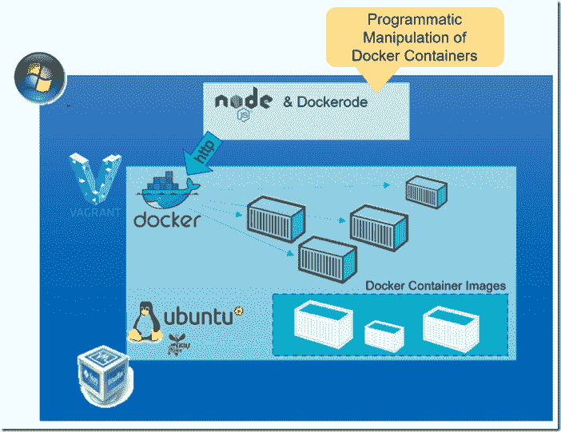
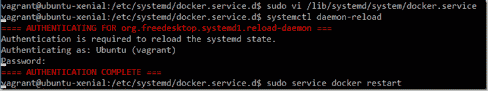
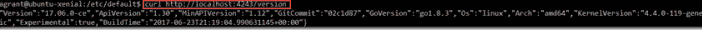
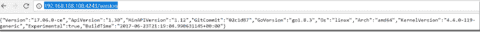
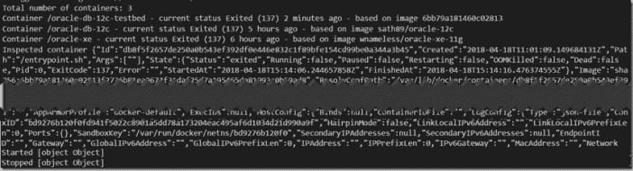
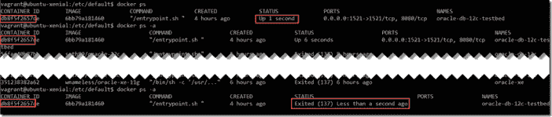

# 使用 Dockerode 从节点应用程序远程编程操作 Docker 容器

> 原文：<https://medium.com/oracledevs/remote-and-programmatic-manipulation-of-docker-containers-from-a-node-application-using-dockerode-903228bdff06?source=collection_archive---------1----------------------->



在以前的文章中，我已经讨论过在智能测试策略中使用 Docker 容器，方法是创建一个包含应用程序基线和所需测试设置(例如测试数据)的容器映像。对于每个测试，不需要做复杂的设置动作和复杂的拆卸步骤，只需要在开始时旋转一个容器，然后在结束时扔掉它。

我已经展示了如何通过命令行实现这一点——但这当然不是一个可行的过程。在本文中，我将简要介绍容器的编程操作。通过从远程客户端提供对 Docker 守护程序 API 的访问(步骤 1)和利用 npm 包 Dockerode(步骤 2 ),从一个简单的节点应用程序创建、启动和停止容器，以及构建、配置、检查、暂停容器和以其他方式进行操作变得非常简单。这为构建作业以编程方式运行测试开辟了道路，方法是启动容器，对该容器运行测试，并在测试后终止和移除该容器。协同工作的容器组合也可以轻松管理。

我说过，这篇文章只是一个非常轻量级的介绍。

# 向远程 HTTP 客户端公开 Docker 守护程序 API

对我来说最长的一步是暴露 Docker 守护进程 API。Docker 的后续版本对此使用了不同的配置，显然不同的 Linux 发行版也有不同的方法。很高兴找到这篇文章:[https://www . ivankrizsan . se/2016/05/18/enabling-docker-remote-api-on-Ubuntu-16-04](https://www.ivankrizsan.se/2016/05/18/enabling-docker-remote-api-on-ubuntu-16-04)描述了作为 Docker 主机的 Ubuntu 16.x 如何启用对 API 的访问。

编辑文件/lib/systemd/system/docker . service—将-H tcp://0.0.0.0:4243 添加到描述如何启动 Docker 守护程序的条目中，以便让它在端口 4243 监听传入的请求(注意:也可以使用其他端口)。

Reload (systemctl daemon-reload)应用更改后的文件配置

重新启动 docker 服务:服务 Docker 重新启动

我们在做生意。



简单检查一下端口 4243 上的 HTTP 请求是否确实被接收和处理了:在 Docker 主机上执行以下命令:

curl[http://localhost:4243/version](http://localhost:4243/version)



下一步是实际的远程访问。从一台可以成功 ping 通 Docker 主机的机器上运行的浏览器——在我的例子中，这是由 vagger 启动的虚拟机器 VM，其 IP 地址为 192.168.188.108，如 Vagrantfile 中所定义的那样——打开这个 URL:[http://192 . 168 . 188 . 108:4243/version](http://192.168.188.108:4243/version)。结果应该与此类似:



# 和多克罗德一起去吧

开始使用 npm 软件包 Dockerode 与任何其他 npm 软件包没有什么不同。因此，创建一个可以在远程 Docker 主机中列出、启动、检查和停止容器的简单节点应用程序的步骤非常简单:

使用 npm init 为新的节点应用程序创建框架

使用 npm 安装 docker ode --保存

检索 Dockerode 并在 package.json 中创建依赖项。

创建文件 index.js .定义 Docker 主机 IP 地址(在我的例子中是 192.168.188.108)和 Docker 守护进程端口(在我的例子中是 4243)并编写代码与 Docker 主机交互。这段代码将列出所有的容器。然后，它将检查、启动和停止一个特定的容器(标识符以 db8 开头)。这个容器恰好运行一个 Oracle 数据库——尽管这与本文无关。

```
var Docker = require('dockerode'); 
var dockerHostIP = "192.168.188.108" 
var dockerHostPort = 4243 
var docker = new Docker({ host: dockerHostIP, port: dockerHostPort }); 
docker.listContainers({ all: true }, function (err, containers) {
  console.log('Total number of containers: ' + containers.length);
  containers.forEach(function (container) { 
     console.log(`Container ${container.Names} - current status ${container.Status} - based on image ${container.Image}`) 
  }) 
}); 
async function startStop(containerId) { 
  var container = await docker.getContainer(containerId) 
  try { 
    var data = await container.inspect() 
    console.log("Inspected container " + JSON.stringify(data)) 
    var started = await container.start(); 
    console.log("Started "+started) 
    var stopped = await container.stop(); 
    console.log("Stopped "+stopped) 
  } catch (err) { console.log(err); 
    } 
} //startStop//invoke function 
startStop('db8')
```

在 Visual Studio 代码中运行此函数的输出如下所示:



而且动作可以在 Docker 主机上这样追踪(证明是真的…)



# 资源

Ivan Krizsan 关于在 Ubuntu 16.x 上配置 Docker 守护进程的文章——我的生活更安全:[https://www . ivankrizsan . se/2016/05/18/enabling-Docker-remote-API-on-Ubuntu-16-04](https://www.ivankrizsan.se/2016/05/18/enabling-docker-remote-api-on-ubuntu-16-04)

Dockerode 的 GitHub Repo 示例及更多:【https://github.com/apocas/dockerode 

在 DockerCon 2016 上的演示给了我使用 Dockerode 的灵感:[https://www.youtube.com/watch?v=1lCiWaLHwxo](https://www.youtube.com/watch?v=1lCiWaLHwxo)

关于配置守护进程的 Docker 文档—[https://docs . docker . com/install/Linux/Linux-post install/# configure-where-the-docker-Daemon-listen-for-connections](https://docs.docker.com/install/linux/linux-postinstall/#configure-where-the-docker-daemon-listens-for-connections)

[api](https://technology.amis.nl/tag/api/) [容器](https://technology.amis.nl/tag/container/) [守护进程](https://technology.amis.nl/tag/daemon/)[docker](https://technology.amis.nl/tag/docker/)[docker ode](https://technology.amis.nl/tag/dockerode/)[http](https://technology.amis.nl/tag/http/)[节点](https://technology.amis.nl/tag/node/) [程序化](https://technology.amis.nl/tag/programmatic/)

*原载于 2018 年 4 月 19 日*[*technology . amis . nl*](https://technology.amis.nl/2018/04/19/remote-and-programmatic-manipulation-of-docker-containers-from-a-node-application-using-dockerode/)*。*