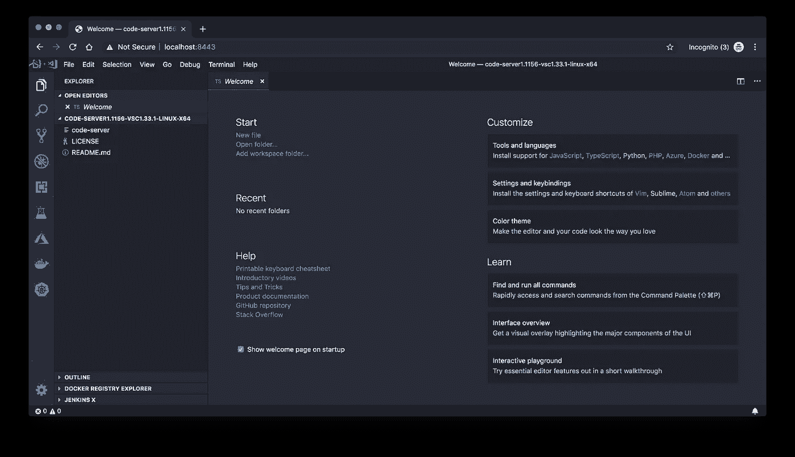
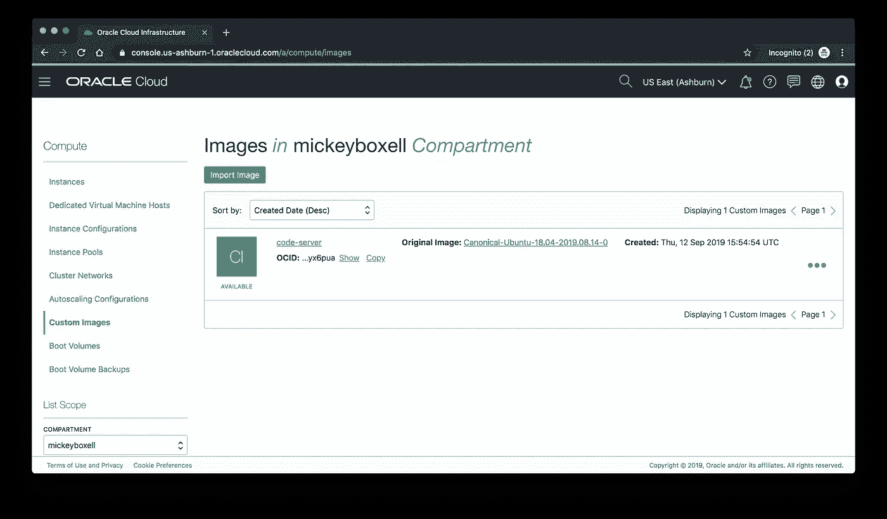
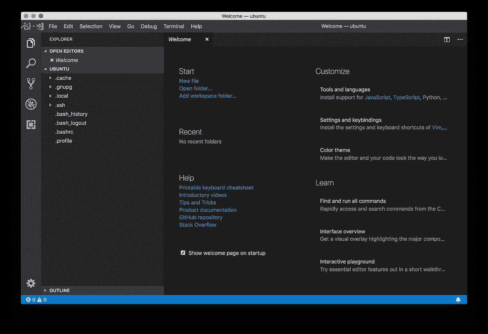
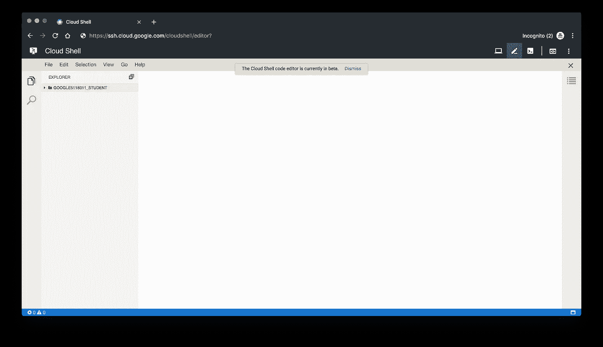

# 用代码服务器进行远程软件开发

> 原文：<https://medium.com/oracledevs/remote-software-development-with-code-server-1d742dacbc5?source=collection_archive---------0----------------------->


Remote development

# 为什么要在远程环境上开发？

通过可访问性、标准化和可伸缩性，在远程服务器上运行开发环境有利于您的软件工程过程。这些好处几乎不会改变您的开发体验。只需连接到远程服务器，签出代码，并在本地使用编辑器，通过浏览器窗口进行更改，而一切都集中进行。

## 易接近的

由于服务器可以远程访问，并且与您的本地工作站分离，因此您可以通过安全连接从任何地方连接到环境，而不是局限于一个物理系统。这也有助于提高系统的耐用性，因为将咖啡洒到云上比洒到笔记本电脑上要困难得多。你仍然可以安装你最喜欢的插件，按照你的喜好配置编辑器，就像它在你的本地机器上运行一样。

## 使标准化

远程服务器可以使用组织标准工具进行预配置或模板化。通过跳过配置本地环境所需的步骤，这为第一天的开始提供了一种更简单的方法。当开始一个新项目时，它也提供了一个干净的石板——一个可以为各种语言和开发配置创建的石板。这种方法的另一个好处是，公司的源代码永远不会存储在开发人员的本地机器上，而是存储在一个安全的服务器上，这对于合规性非常有用。

## 可攀登的

连接到云中的远程服务器提供了对可伸缩基础设施的访问。您可以在高性能硬件上运行云中的过程，并根据需要扩展硬件，而不是占用您的机器来运行编译或长时间的测试。我的一个同事提到了他过去在远程构建服务器上运行编译/测试作业的经历，这些作业花费了大约 13 个小时，这是你在本地机器上永远不会做的事情。

# `[code-server](https://github.com/cdr/code-server)`

一个用于远程开发的工具是由[编码器](https://coder.com/)开发的`code-server`。这是一个开源选项，使用户能够在通过浏览器访问的远程服务器上运行 Visual Studio 代码开发环境。`code-server`附带了许多有文档记录的安装选项，包括预构建的二进制文件、使用`sshcode`的简化设置、[数字海洋水滴](https://marketplace.digitalocean.com/apps/code-server?action=deploy)、Docker 图像等等。为了快速入门，我建议从 Docker 映像开始，或者安装二进制文件。`sshcode`选项提供了[额外的](https://github.com/cdr/code-server)同步功能，以保持本地 VS 代码环境中的设置和扩展与远程环境一致。

## 码头工人

使用 Docker 镜像就像安装并运行 Docker 一样简单:

```
$ docker run -it -p 127.0.0.1:8443:8443 -v "${PWD}:/home/coder/project" codercom/code-server --allow-http --no-auth
```

这将创建一个运行`code-server`的 Docker 容器，带有一个转发到 8443 的端口，并且没有启用密码保护。你可以在 [code-server GitHub repo](https://github.com/cdr/code-server) 中的 [/Dockerfile](https://github.com/cdr/code-server/blob/master/Dockerfile) 查看 Dockerfile。导航到 [http://localhost:8443](http://localhost:8443) 以访问 VS 代码环境。`code-server`使用自签名 SSL 证书，该证书可能会在您继续操作之前提示您的浏览器询问一些其他问题。

## 带`code-server`二进制的云虚拟机

首先连接到目标开发服务器并下载二进制文件。在这种情况下，我提供了一个运行在 Oracle 云基础设施上的 Ubuntu 18.04 虚拟机。您可以使用 SSH 将远程端口从服务器转发到本地客户端。为了节省时间，您甚至可以在安装`code-server`之前连接到 VM 并运行端口转发:

```
$ ssh [username]@[IP address] -L 8443:localhost:8443
```

将二进制文件添加到您的路径中，并以项目目录作为第一个参数启动二进制文件:

```
$ code-server [initial directory to open]
```

导航到 [http://localhost:8443](http://localhost:8443) 并输入终端中显示的密码。



这个过程相当简单，但是对于那些寻求额外帮助的人来说，Coder 为自托管的 `[code-server](https://github.com/cdr/code-server/blob/master/doc/self-hosted/index.md)`编写了一个[故障排除指南。](https://github.com/cdr/code-server/blob/master/doc/self-hosted/index.md)

一旦用`code-server`配置了虚拟机，我建议使用 Oracle Cloud 和其他云提供商提供的[映像创建工具创建一个自定义映像。这种方法生成的模板可以用作开发环境的标准起点。](https://docs.cloud.oracle.com/iaas/Content/Compute/Tasks/managingcustomimages.htm)



# 使用`sshcode`的云虚拟机

`sshcode`提供一个 CLI，通过 SSH 将`code-server`自动安装到远程服务器。它还通过`rsync`自动将您的本地 VS 代码设置和扩展同步到远程服务器。

要将`sshcode`安装到您的本地机器上，要么下载一个[预构建的二进制文件](https://github.com/cdr/sshcode/releases)要么使用`go`:

```
$ go get -u go.coder.com/sshcode$ sshcode
Usage: sshcode [FLAGS] HOST [DIR]
​
Start VS Code via code-server over SSH.
​
Environment variables:
     VSCODE_CONFIG_DIR use special VS Code settings dir.
     VSCODE_EXTENSIONS_DIR use special VS Code extensions dir.
​
More info: [https://github.com/cdr/sshcode](https://github.com/cdr/sshcode)
​
Arguments:
     HOST is passed into the ssh command. Valid formats are '<ip-address>' or 'gcp:<instance-name>'.
     DIR is optional.
​
sshcode flags:
      --b                           sync extensions back on termination
      --bind string                 local bind address for SSH tunnel, in [HOST][:PORT] syntax (default: 127.0.0.1)
      --no-reuse-connection         do not reuse SSH connection via control socket
      --skipsync                    skip syncing local settings and extensions to remote host
      --ssh-flags string            custom SSH flags
      --upload-code-server string   custom code-server binary to upload to the remote host
      --version                     print version information and exit
```

要运行`sshcode`,请传入您的远程服务器的用户名和地址，在本例中是运行在 Oracle Cloud 上的另一个 VM，并可选地指定远程服务器上要打开的项目目录。

```
$ sshcode [username]@[IP address] [initial directory to open]
```

去冲杯咖啡或者三杯。安装和同步需要几分钟时间。

安装完成后，将会打开一个浏览器窗口，运行 VS 代码。如果你安装了 Chrome，它将在无边框应用模式下打开，这使得它看起来几乎和你桌面上运行的 VS 代码一样。



每次连接时，`sshcode`将使用`rsync`将您的本地 VS 代码设置和扩展传输并同步到远程服务器。正如我上面提到的，第一次连接时，这个操作可能需要一些时间。在后续连接到同一台服务器时，速度会更快。传入`--skipsync`标志来跳过同步。默认情况下，当连接关闭时，远程服务器上的 VS 代码更改不会同步回您的本地环境。当连接结束时，传递`-b`标志以启用本地同步。如果你使用的是 VS 代码的替代版本，比如 VS Code Insiders，有[选项可以设置自定义目录](https://github.com/cdr/sshcode#custom-settings-directories)。

# 其他远程开发选项

[Google Cloud Shell 代码编辑器](https://cloud.google.com/shell/docs/features#code_editor)是基于浏览器的远程代码编辑器的另一个选项。这个工具目前处于测试阶段，运行的是 Eclipse 忒伊亚，这是一个用 TypeScript 实现的 IDE 框架。通过单击工具栏中的铅笔图标或在云 Shell 终端中键入`cloudshell edit`来启动代码编辑器。



类似地，微软 Azure 包括一个基于 [Monaco 编辑器](https://github.com/Microsoft/monaco-editor)的[文件编辑器](https://azure.microsoft.com/en-us/features/cloud-shell/)，它直接从 VS 代码源中生成，旨在在浏览器中工作。通过单击工具栏中的`{}`图标或在云外壳终端中键入`code .`来启动编辑器。这两个工具都允许你通过在编辑命令后传递一个文件路径来直接打开一个文件(例如`cloudshell edit ~/.bashrc`)。

Google Cloud 和 Microsoft Azure 云外壳代码编辑器使用户能够浏览文件目录以及查看和编辑文件，并且默认情况下每个云外壳实例都提供这些编辑器。

# 结论

远程开发环境，比如那些由`code-server`和谷歌云和微软 Azure 云外壳代码编辑器提供的环境，为用户提供了比本地开发环境更多的好处。它们可以从任何地方连接，在您的团队中实现标准化，并可扩展以满足您的性能需求。所有这些都可以通过对您现有的开发流程进行很少或没有改变来完成。