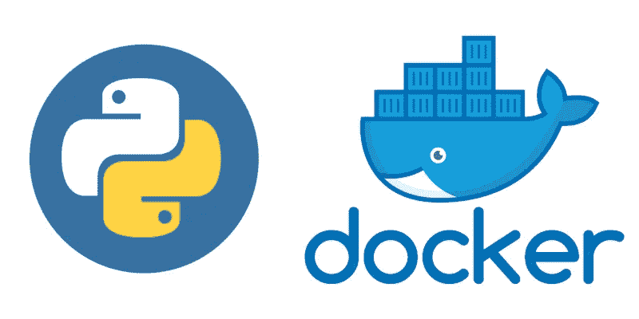

# 使用 Google Distroless Images 消除安全漏洞并降低 Docker 图像的权重

> 原文：<https://medium.com/globant/remove-security-vulnerabilities-and-decrease-the-weight-of-docker-images-using-google-distroless-ed2895d6f3b8?source=collection_archive---------0----------------------->



在我们作为开发人员的工作中，有许多应用程序和技术是我们每天都要接触的，Docker 就是其中之一。它用于启动我们通过容器和图像开发的应用程序，这项技术使开发人员和开发者能够更高效、更安全地工作。这也是维护统一环境的一种好方法，但是当我们使用这种技术时，我们面临着新的挑战，例如映像安全性和漏洞、大小以及其中安装的软件包。

当您使用 Docker 时，作为一名开发人员，您总是面临优化和保护图像的挑战，保持较小的尺寸并为生产和开发阶段创建良好的场景。

要做到这一点，您可以使用多阶段构建来保持较小的规模，创建多个阶段来编译、复制依赖项和安装您需要的所有软件包，并执行最后一个阶段，从最终映像中留下不需要的进程。

为了在不影响大小的情况下提高安全性，有两种基本的分发类型可用于安装应用程序:

**使用 Alpine 作为基本发行版**:

第一种选择是使用 Alpine 映像，Alpine 是基于 Musl 的 Linux 发行版，旨在提高资源效率和安全性。就大小而言，这个映像确实是一个很好的解决方案，并且与几乎所有的编程语言兼容。

Alpine 对于标准基础应用来说是一个非常好的解决方案，主要的缺点是，管理向后兼容性非常困难，并且不能以本地方式与一些高级库兼容。所以安装一些包或者把它们更新到其他版本会有点困难。

**使用 Debian Slim 作为基础发行版:**

通过这种方法，你可以使用带有 Apt 的 Debian 发行版，这种镜像有一个很大的优势，它可以兼容几乎所有的高级和普通使用的包，这也允许以一种非常简单的方式更新和维护包。

这种映像中的两个主要难点是大量不需要的预安装软件包，并且当您安装新的软件包时，所有的子依赖项都会占用大量空间，并在映像上造成潜在的安全漏洞。

另一种可能性是使用 Distroless 图像，这是我将要展示的改进 Docker 图像的技术。

**什么是 Distroless？**

Distroless 是由 [Google](https://github.com/GoogleContainerTools/distroless) 使用的一种图像创建技术，通过这种技术，他们给我们一个没有外壳、软件包安装程序和其他可能对我们的应用程序有害的软件包的图像，通过这种技术，图像大小大大减小，这种图像是基于 [Bazel](https://bazel.build/) 创建的，通过这种技术，我们可以减少我们的安全问题，让我们有更多的时间专注于我们的代码，现在这些是他们支持的语言:

*   Java 语言(一种计算机语言，尤用于创建网站)
*   Python 2 和 3
*   加油郎
*   节点 JS
*   。网
*   锈

这些图片是基于 Debian 10 Buster 的，所以不需要考虑那么多兼容性的问题。为了处理这些图像，我们还需要创建一个多阶段的文件来用我们的软件生成完整的过程。

**dis loses 示例:**

对于这个例子，我们将在 Python 3 上使用一个简单的 Flask 端点:

```
from flask import Flaskapp = Flask(__name__)@app.route(‘/’)def hello(): return “Hello World!!”if __name__ == ‘__main__’: app.run(host=’0.0.0.0')
```

在映像中安装的要求如下:

```
Flask==1.1.2requests==2.23.0
```

我们将创建三个图像来进行比较，这是一个阿尔卑斯山图像的文件:

```
FROM python:3.7-alpine3.11ADD requirements.txt /app/requirements.txtWORKDIR /appRUN pip install -r requirements.txtADD . /appENTRYPOINT [ “python”, “app.py” ]
```

在这里，我们创建了一个 Debian Slim 映像，与其他发行版相比，它是最接近我们测试的操作系统:

```
FROM python:3.7-slimADD requirements.txt /app/requirements.txtWORKDIR /appRUN pip install -r requirements.txtADD . /appENTRYPOINT [ “python”, “app.py” ]
```

这是我们的 Distroless 图像，在这里你可以看到多阶段创作的使用:

```
FROM python:3.7-slim AS buildADD . /appWORKDIR /appRUN pip install — upgrade pipRUN pip install -r ./requirements.txtFROM gcr.io/distroless/python3COPY — from=build /app /appCOPY — from=build /usr/local/lib/python3.7/site-packages/usr/local/lib/python3.5/site-packagesWORKDIR /appENV PYTHONPATH=/usr/local/lib/python3.5/site-packagesEXPOSE 5000CMD [“app.py”]
```

构建完成后，我们可以将图像的大小与当前应用程序进行比较:


At the bottom, we can see the final weight for distroless image

正如我们在这里看到的，图像大小比 Debian Slim 图像减少了 50%以上，甚至比我们用 Alpine 创建的图像还要小。在较大的项目中，您也可以看到创建层和使用层之间的差异。

**发行和安全:**

为了验证无发行版应用的安全性，我们使用 [Anchore](https://anchore.com/) 测试了引用的图像，该报告允许我们分析我们在 Docker Hub 上发布的图像的漏洞和安全问题。

运行扫描后，我们发现了以下结果:


Security Comparison between images — number of security alerts

如你所见，与 Slim image 的 63 个漏洞相比，Distroless image 只有两个漏洞，让你有更多时间专注于其他开发任务。