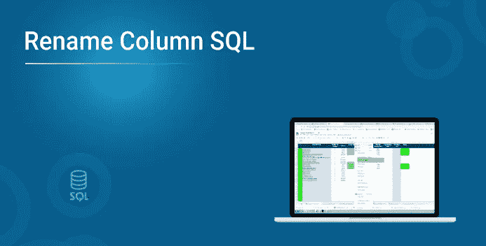
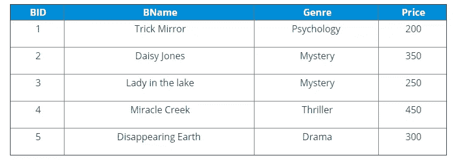
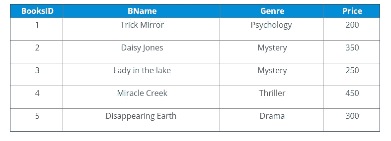

# 如何在 SQL 中重命名列名？

> 原文：<https://medium.com/edureka/rename-column-name-in-sql-41b4c9b794fd?source=collection_archive---------2----------------------->



可能经常会发生这样的情况，我们需要更改数据库中列的名称来满足他们的需要。在 SQL 或结构化查询语言的帮助下，数据库管理员在关系数据库中存储、更新、操作和检索数据。因此，在本文中，让我们了解如何在 SQL 中重命名列名。


本文将涵盖以下主题:

1.  什么是 SQL？
2.  SQL 中的重命名命令是什么？
3.  在 MySQL、MariaDB、Oracle 和 PostgreSQL 中重命名列名
4.  在 MS SQL Server 中重命名列名
5.  重命名表名 MySQL、MariaDB、Oracle

那么让我们开始吧，

# 什么是 SQL？

SQL 或通常被称为 **SEQUEL** 是一种用于管理和访问数据库的结构化查询语言。它以英语为基础，旨在方便检索、操作和访问数据。如果你想深入了解 SQL 的基础知识，你可以参考 SQL 基础知识的文章。在 SQL 中，有各种用于操作数据的语句/命令。在数据库中非常流行的一种操作是在 SQL 中重命名列名。

因此，让我们了解如何在 SQL 中使用 RENAME 命令。

# SQL 中的重命名命令是什么？

该命令用于将列名更改为新的列名。它还用于将表更改为新的表名。让我们了解一下如何在不同的数据库中使用这个命令。但是，在此之前，让我们考虑下表来理解所有的例子:



# 如何在 SQL 中重命名列名？

**在 MySQL、MariaDB、Oracle 和 PostgreSQL 中重命名列名**

要在 MySQL、MariaDB、Oracle 和 PostgreSQL 中重命名列名，可以遵循以下语法:

**语法**

```
ALTER TABLE TableName RENAME COLUMN OldColumnName TO NewColumnName;
```

**举例:**

编写一个查询，将列名“BID”重命名为“BooksID”。

```
ALTER TABLE Books; RENAME COLUMN BID TO BooksID;
```

在执行上述查询时，您将看到以下输出:



您也可以使用**更改关键字**来重命名列名，如下所示:

**语法**

```
ALTER TABLE TableName CHANGE COLUMN OldColumnName NewColumnName Data Type;
```

**示例:**

编写一个查询，将列名“BID”重命名为“BooksID”。

```
ALTER TABLE Books; CHANGE COLUMN BID BooksID INT;
```

在执行该查询时，您将看到与上述输出相同的输出。

# 在 MS SQL Server 中重命名列名

与其他数据库相比，MS SQL Server 中重命名列名的过程是不同的。在 MS SQL Server 中，你必须使用名为 **sp_rename 的存储过程。**

**语法**

```
sp_rename 'TableName.OldColumnName', 'New ColumnName', 'COLUMN';
```

**示例:**

编写一个查询，将列名“BID”重命名为“BooksID”。

```
sp_rename 'Books.BID', 'BooksID', 'COLUMN';
```

结果输出将与上述查询的输出相同。现在，您已经了解了如何在各种数据库中重命名列名，让我们看看如何重命名表名。

# 重命名表名 MySQL、MariaDB、Oracle

要重命名表名，可以在 SQL 中使用 rename 命令，方式如下:

**语法:**

```
ALTER TABLE OldTableName
RENAME TO NewTableName;
```

**举例:**

```
ALTER TABLE Books
RENAME TO ListOfBooks;
```

现在，如果您执行以下查询来查看表 ListOfBooks 中的详细信息，您将看到以下输出:

**查询:**

```
SELECT * FROM ListOfBooks;
```

至此，我们结束了对 SQL 和 NoSQL 的比较。我希望你们喜欢这篇文章，并理解所有的差异。如果你想查看更多关于人工智能、DevOps、道德黑客等市场最热门技术的文章，那么你可以参考 [Edureka 的官方网站。](https://www.edureka.co/blog/?utm_source=medium&utm_medium=content-link&utm_campaign=rename-column)

请留意本系列中的其他文章，它们将解释 SQL 的各个方面。

> *1。*[*SQL 之间的差异& NoSQL 数据库*](/edureka/sql-vs-nosql-db-5d9b69ace6ac)
> 
> *2。*[*SQL For Data Science*](/edureka/sql-for-data-science-a8fe10fe2ef9)
> 
> [*3。前 65 名 SQL 面试问题*](/edureka/sql-interview-questions-162f97f37ac2) *s*

*原载于 2019 年 9 月 19 日*[*https://www.edureka.co*](https://www.edureka.co/blog/rename-column/)*。*