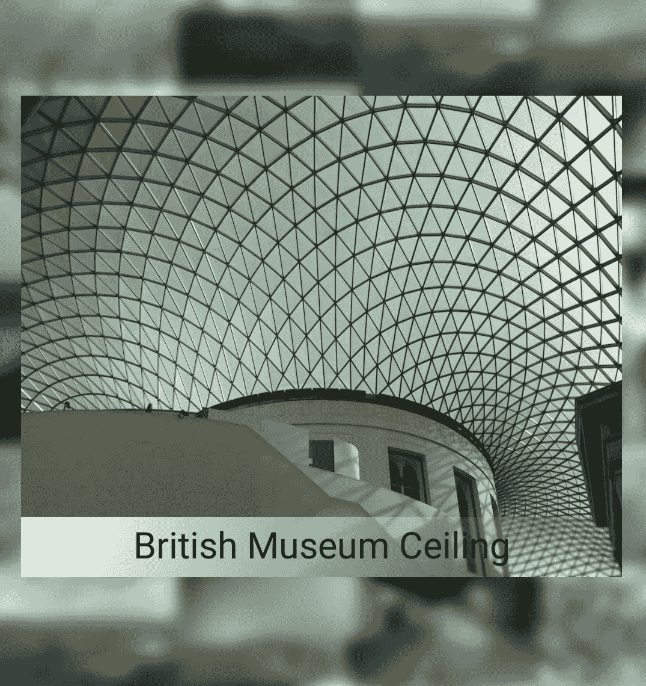
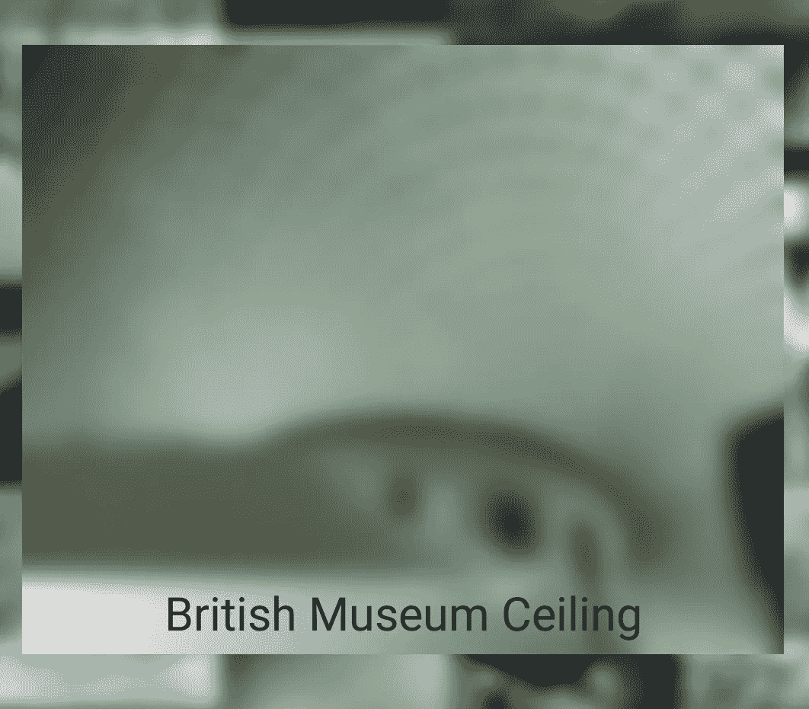
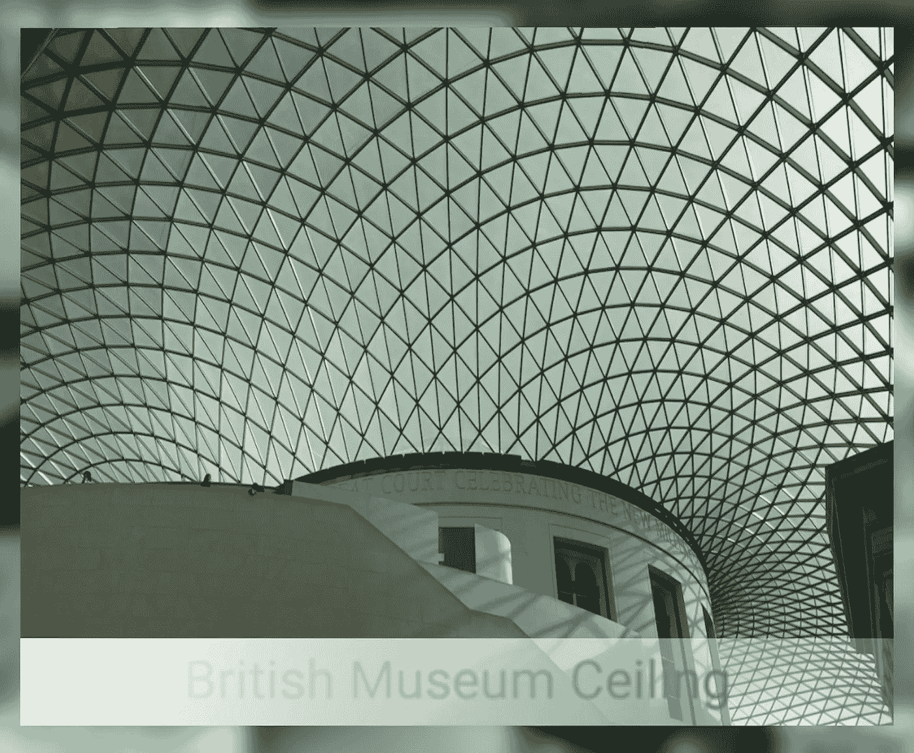
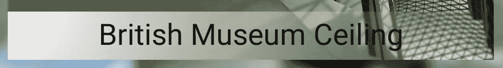
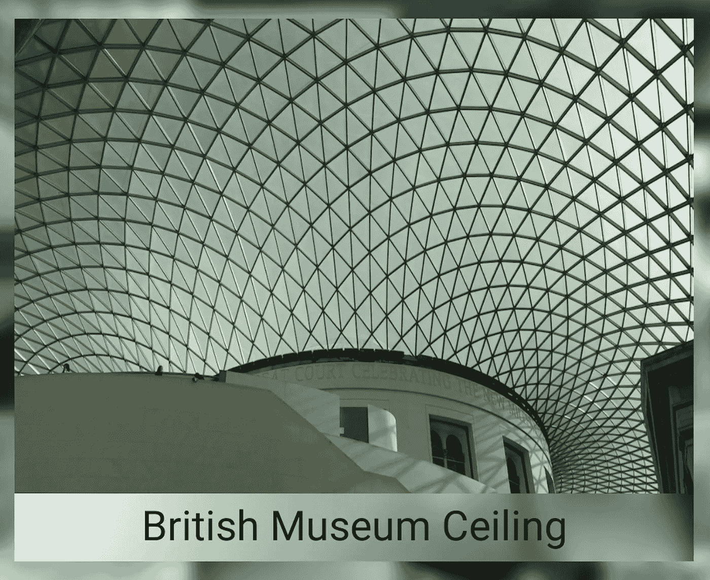

# 渲染节点获得更大、更好的模糊效果

> 原文：<https://medium.com/androiddevelopers/rendernode-for-bigger-better-blurs-ced9f108c7e2?source=collection_archive---------5----------------------->

## RenderEffects #3:使用 RenderNode 实现更快、更好的模糊效果

前两篇文章(更详细，用更多的话)涵盖了我在视频[中快速谈论的内容，该视频是我与 Sumir Kataria 为最近的](https://youtu.be/qlBxrvhk3tg) [Android 开发者峰会](https://www.youtube.com/playlist?list=PLWz5rJ2EKKc92MGTd1CgUtXZfhA74nUpb)活动制作的。这篇文章超出了这一内容，尽管我在最近伦敦 Droidcon 的一次会议结束时确实提到了它。因此，如果你想要这个(和以前的)内容的视频版本，在这里你去:

[](https://www.droidcon.com/2022/11/15/android-graphics-blurring-the-lines/) [## 安卓图形:模糊界限

### 本次会议将介绍 Android 上支持更丰富应用的最新图形 API 和功能。模糊…

www.droidcon.com](https://www.droidcon.com/2022/11/15/android-graphics-blurring-the-lines/) 

在[的上一篇文章](/androiddevelopers/agsl-made-in-the-shade-r-7d06d14fe02a)中，我展示了如何创建一个磨砂玻璃效果，它模糊并照亮了一个`ImageView`的一个子部分，使图片标题更具可读性。以下是放大的字幕图像出现在模糊的背景图像库中的结果:



The caption is drawn with a shader which both blurs and frosts that area

但是标题区域中使用的模糊虽然有效且可用，但既不像我们通过使用平台的内置`RenderEffect`模糊所能获得的那样好(因为它不是那么模糊)也不像我们通过使用平台的内置`RenderEffect`模糊所能获得的那样快(正如本系列的第一篇文章中所解释的，它已经被用于上面图片库的背景模糊)。如果能有一个更快、更模糊的版本当然更好，这样有助于突出文字所在的区域，就像我们在上面看到的单词“Ceiling”的末尾，黑色文字位于图片中其他深色硬边对象的顶部。

我没有使用“最佳”模糊方法的原因是…如何做到这一点并不直观，我正在优化清晰的代码和技术。但是现在这些都已经解决了(在上一篇文章中)，我还想展示如何使用内置的更好的模糊效果来实现同样的效果。

# 问题

模糊+冰霜效果不直接的原因归结于一个事实，我只想给放大的图片出现的`ImageView`部分加阴影。也就是说，我只想模糊/磨砂底部的标签区域，而不是整个视图。然而`RenderEffect`适用于*整个*视图；没有办法只将效果裁剪到视图的一部分。因此，当我对持有放大图片的`ImageView`应用`RenderEffect`模糊和磨砂玻璃着色器时，代码如下:

```
**val** blur = RenderEffect.createBlurEffect(
        30f, 30f, Shader.TileMode.*CLAMP*)
**val** shader = RenderEffect.createRuntimeShaderEffect(
        **FROSTED_GLASS_SHADER**, **"inputShader"**)
**val** chain = RenderEffect.createChainEffect(blur, shader)
setRenderEffect(chain)
```

我得到这样的结果:



Applying a RenderEffect blur to a view blurs the entire view, which is… not what I wanted

这种更明显的模糊对于更好地突出说明文字来说是很好的，但是对于其他的东西来说……就很糟糕了。用户可能希望看到图片细节，而超级模糊没有帮助。但是只有一部分视图变得模糊和模糊，这对我们当前的 API 来说是不明显的。

## 好吧，用一个单独的视图怎么样？

你可能有理由怀疑(就像我第一次开发这个应用时一样)为什么我不能简单地依靠视图层次来帮助解决问题。也就是说，我可以使用一个大小适合标题边界的单独视图，位于`ImageView`的底部，就像现有的保存标题的`TextView`一样，而不是在更大的`ImageView`对象中给标签区域加阴影。

事实上，我可以直接使用`TextView`本身。然后我可以模糊/冻结那个视图，而不是`ImageView.`嗯…是的。不。我的意思是，我肯定*可以*遮蔽`TextView`并得到类似的效果。差不多吧。但这也将效果应用于文本；着色器是在`View`将其所有内容渲染到视图中之后运行的——包括这里的文本——所以我最终得到了这样的结果:



The caption effect is now being done directly in the TextView. (But it’s not being done well).

如果您仔细观察标签区域，与我们对底层 ImageView 的一部分进行阴影处理所获得的效果相比，会有一些问题。提醒一下，下面是*应该是*的样子:



The caption effect as it should be (shader applied to underlying ImageView)

最明显的问题是标题文本。在上面的第一张图片中，字母被洗掉了。这来自于效果应用于整个*文本视图的问题，包括文本字符。这种给`TextView`加阴影的方法直接导致了模糊的、磨砂的文本，这并不是我们真正想要的。*

另一个问题稍微微妙一点，但是如果你观察标题区域右边的三角形网格窗口，你会发现它非常明显。在图像的正确版本中，该区域明显(如果只是轻微)模糊，而当我们在`TextView`上使用着色器时，它一点也不模糊。发生这种情况是因为着色器效果仅在应用它的视图的像素上运行，而不是在显示器上那些像素下出现的任何东西上运行。因此，虽然从你的视角来看*看起来*像是应该遮蔽那些图像像素，但那是因为它们在显示器上被渲染成一个在另一个之上。但是在渲染器级别，每个视图的内容是独立创建的，仅基于该视图，而不考虑绘制时它们将位于什么之上。

因此，当我们将着色器应用于透明背景`TextView`时，实际上唯一模糊的是文本。该视图中的透明像素只是…保持透明。这种效果的全部原因是为了让文本*更具可读性，所以这种方法显然是把事情引向了错误的方向。*

我上面提到的另一个想法，在底层的`ImageView`和最顶层的`TextView`之间插入一个新视图，也会因为类似的原因而失败。虽然这种技术可以避免在对`TextView`进行着色时出现模糊的文本伪影，但它仍然没有正确的图像数据来应用模糊(因为中间视图不包含图像数据)，因此不会出现可见的模糊。着色器将应用于占位符视图中的任何颜色(大概是透明像素，就像上面的`TextView`示例中的情况)。

对于中间视图，我们还可以做另外一件事，我们在其中绘制放大图像的裁剪副本，从而给着色器一些东西来正确地进行模糊和磨砂。这是可行的，原因和在 ImageView 中一样。我们不需要原始着色器的裁剪逻辑，因为我们正在对该视图中的所有像素进行着色。但是手动裁剪照片，然后将复制的副本重绘到另一个视图中，以获得这种效果，这似乎是一种黑客行为。

也许有更好的方法…

# 更好的方法…使用`RenderNode`

我真正想做的(也是我第一次写演示应用时尝试过但失败了的)是将效果链接在一起。也就是说，我想要一个使用系统模糊的`RenderEffect`，通过`RenderEffect.createBlurEffect()`，和我在底层图库容器中使用的一样。然后我想要第二个效果来应用一个磨砂玻璃着色器(没有应用我当前着色器中的框模糊)，用`RenderEffect.createRuntimeShaderEffect()`创建。然后我可以使用`RenderEffect.createChainedEffect()`合成这些效果，告诉系统一起应用这两种效果，一个接一个。

这个*几乎*起作用…但是没有办法指定标签的裁剪区域，所以它只是给整个放大的图像一个模糊/磨砂的外观。再说一次，那不是我想要的表情。

所以我不能使用连锁效应。但是我可以通过使用两个`RenderNode`对象手动应用效果来做类似的事情。

到目前为止，我们已经对整个`View`应用了我们的着色器。这是很强大的，但是有上面解释的限制，效果应用于整个视图。因此，如果我想要一个效果(如模糊)只应用选择性，或有条件的，这是不可能的。或者说，这是可能的，但只有在使用像我在当前模糊+霜冻着色器中使用的着色器逻辑时，它才会检查当前像素的位置，并适当地运行或跳过效果。但是这种逐像素的逻辑方法对于其他的`RenderEffect`是不可能的(模糊、链等)。

然而，相反，我可以将效果应用到`RenderNode`对象而不是`View`对象，并使用那些`RenderNode`对象有选择地绘制到视图中，从而达到对`View`的子集进行着色的目的。`RenderNode`和`View`有相同的`setEffect()` API，所以这种方法的设置非常相似。

但是等等——什么是`RenderNode`？

# RenderNode:视图如何绘制它们的内容

引用`RenderNode`上的参考文件:

> 默认情况下，RenderNodes 在内部用于所有视图，通常不会直接使用。

哦，不，等等——这不是我要粘贴的内容(我们肯定会直接使用它)。这里，这样更好:

> RenderNode 用于构建硬件加速渲染层次。

每个`View`对象在其内容出现在屏幕上之前的某个时间点，记录绘制其内容的操作和属性，以交付给低级渲染器(Skia)。它通过`RenderNode`实现这一点，从 API 级别 29 开始，它被公开为您可以直接使用的公共 API。也就是说，您可以在一个`RenderNode`中缓存命令，然后手动绘制该节点，通常是到一个`View`。

你通常可以通过将你的绘图命令记录到一个`RecordingCanvas`中来做到这一点，你可以通过`RenderNode.recordingCanvas()`得到这个命令。然后你可以像绘制一个典型的`Canvas`对象一样绘制到那个`Canvas`，只是现在你的绘制命令存储在`RenderNode`中。然后，您可以通过调用`Canvas.drawRenderNode()`将该节点(包含您存储的那些命令)呈现到一个`View`中。

现在，回到我们的模糊+着色器示例:想法是使用两个不同的`RenderNode`对象，一个渲染底层图像内容，一个保存模糊该内容的`RenderEffect`。每一个都将被分别绘制到`View`中，并且可以被定位到我们想要的位置来绘制效果，这将给我们带来我们想要的`RenderEffect`的裁剪/定位能力。

让我们看看这是如何工作的。

# 使用多个 RenderNodes 绘制

首先，我们创建并缓存两个`RenderNode`对象，每当视图本身被绘制时，它们将被重用(重绘):

```
**val contentNode** = RenderNode(**"image"**)
**val blurNode** = RenderNode(**"blur"**)
```

*(注:*`*“image”*`*`*“blur”*`*无意义或再次提及；它们被记录为用于调试目的，大概是在内部，因为在它们被传入之后，没有办法从对象中访问那些属性。)**

*接下来，我们需要在将出现这些内容的`ImageView`中覆盖`onDraw()`方法。覆盖`onDraw()`的目的是在我们绘制视图内容的时候注入`RenderNode`代码。通常在`onDraw()`中，我们可能首先调用超类的`onDraw()`方法来绘制`View`中的标准内容。但是在这种情况下，我们想要创建一个`RenderNode`来保存该内容，所以我们将在那里绘制它，然后使用它作为从到`View`的源:*

```
***override fun** onDraw(canvas: Canvas?) {

    **contentNode**.setPosition(0, 0, *width*, *height*)
**val** rnCanvas = **contentNode**.beginRecording()
    **super**.onDraw(rnCanvas)
    **contentNode**.endRecording()

    canvas?.drawRenderNode(**contentNode**)

    // ... rest of code below
}*
```

*上面有几件事需要注意:首先，我们创建了一个`RecordingCanvas`，然后要求超类(`ImageView`)在画布中进行绘制。然后我们通过调用`drawRenderNode()`将内容复制到视图画布中。这避免了多次调用超类`onDraw()`方法，这是一个很好的实践，以防该方法中有额外的开销，这可以通过使用`RenderNode`对象中命令的缓存版本来避免。*

*其次，请注意，如果我经常从那个节点重绘，出于速度和效率的目的，我可以在`RenderNode`上调用`setUseCompositingLayer()`。合成层将绘图缓存为位图(作为 GPU 中的纹理)，未来的绘图操作将是简单的位图(纹理)副本，速度非常快。代价是该纹理消耗了额外的内存。在这种情况下，我只画了两次`RenderNode`;一次是对视图本身(在上面的代码中)，第二次是对另一个模糊的视图`RenderNode`(在下面的代码中)。仅仅为了一个额外的绘制操作而缓存节点是不值得的。但是对于你自己的`RenderNode`对象来说，这是值得考虑的，这取决于你如何处理它们的内容。*

*最后，我们执行模糊。我们通过从主节点`RenderNode`绘制到模糊节点，并进行适当的转换来实现这一点。这个模糊的节点上设置了一个模糊`RenderEffect`，其位置和大小正好是我们想要模糊的标签区域。*

```
*// ... rest of code above **blurNode**.setRenderEffect(RenderEffect.createBlurEffect(30f, 30f,
        Shader.TileMode.*CLAMP*))
    **blurNode**.setPosition(0, 0, *width*, 100)
    **blurNode**.*translationY* = *height* - 100f

    **val** blurCanvas = **blurNode**.beginRecording()
    blurCanvas.translate(0f, -(*height* - 100f))
    blurCanvas.drawRenderNode(**contentNode**)
    **blurNode**.endRecording()

    canvas?.drawRenderNode(**blurNode**)
}*
```

*这段代码设置了模糊`RenderEffect`，在 x 和 y 方向的模糊半径为 30(比我早期的着色器方法中微不足道的 5x5 框模糊要好得多)。请注意，`setPosition`创建了一个比前面的`contentNode`小得多的尺寸，因为我们只需要这个更小的区域来放置标题。还要注意的是，`translationY`操作将渲染移动到整个视图的底部，这是模糊字幕所在的位置。*

*我们再次从这个节点获得一个`RecordingCanvas`。在我们绘制之前(使用`contentNode`，我们从标题位置反向翻译到图像的顶部；这确保了在较小的/翻译后的标题区域下，内容对于较大的图像是正确定位的。最后，一旦`blurNode`绘制完成，我们再调用一次`drawRenderNode()`，将结果渲染到视图的画布中(在来自`contentNode`的现有内容之上),我们就完成了。*

*这是最终结果。它非常接近我们最初的样子，但是你可以看到标签区域的模糊更加明显，这有助于标题文本的可读性。*

**

*Better blur in the label by combining a RenderEffect blur in addition to frosted-glass shader, with two RenderNodes.*

# *…就是这样！*

*这是当前系列的结尾(尽管我保留在未来写更多着色器和`RenderEffect`文章的选择。不承诺)。我们设法用系统模糊来获得一个模糊背后的效果，帮助从背景中弹出一个图像。然后，我们添加了 AGSL 着色器逻辑来增强图像标题的视觉效果。最后，我们使用了`RenderNode`来利用系统模糊来获得更好(更快！)效果，并简化 AGSL 着色器逻辑以简单地提供磨砂玻璃效果。*

*如果你想了解这方面的更多信息，有很多资源可供参考。以下是一些开始:*

*   *`[RenderEffect](https://developer.android.com/reference/android/graphics/RenderEffect)`:用于创建模糊、位图、链等效果的类。这些效果设置在`Views`或`RenderNodes`上，以改变这些对象的绘制方式。*
*   *`[RenderNode](https://developer.android.com/reference/android/graphics/RenderNode)`:保存用于绘制视图的底层操作的对象，但也可以直接用于记录和存储自定义绘制操作。*
*   *`[RuntimeShader](https://developer.android.com/reference/android/graphics/RuntimeShader)`:保存 AGSL 着色器代码的对象。*
*   *[AGSL](https://developer.android.com/develop/ui/views/graphics/agsl) :安卓图形着色语言。像 SkSL，但是针对安卓。它提供了一种创建非常定制的每像素绘制效果的机制。*
*   *[SkSL](https://skia.org/docs/user/sksl/):Skia 的着色语言。这就像 GLSL，但 Skia 渲染管道。*
*   *[GLSL](https://www.khronos.org/files/opengles_shading_language.pdf) 着色器:使用 OpenGL 时片段着色器的语言。*

*到处玩！创造整洁的效果！制作更好更直观的用户界面！享受图形带来的乐趣！这就是它存在的目的！*

**感谢*[*Nader Jawad*](https://twitter.com/nadewad)*对他理解和实现上述双重* `*RenderNode*` *手法的帮助。**