# 与卡夫卡幽会:简单入门指南

> 原文：<https://medium.com/walmartglobaltech/rendezvous-with-kafka-a-simple-guide-to-get-started-48db3b921cc?source=collection_archive---------1----------------------->

**卡夫卡是什么？**

在过去的十年里，人类能够想象到的每个领域的技术都在发展。从纳米技术到利用 GPU 的高速游戏，技术确实以前所未有的速度发展和变化。随着所有技术进步而增长的最常见属性是数据。企业创造的数字数据有了巨大的增长。企业期望从数据中获得的洞察力要大得多，无论是静态数据还是流数据。这给传统上依赖消息队列将数据从一个系统传输到另一个系统的公司带来了巨大的挑战。例如，来自销售点的数据可能会被财务部门、客户使用，还可以通过分析来获得客户洞察。如果我们必须处理队列，那么就需要多个队列，每个队列都包含完全相同的数据。随着订单数据、网站数据等其他数据点的出现，复杂性不断增加。因此，维护基础设施并确保系统的弹性以及数据的可靠性和一致性也面临着更大的挑战。帮助解决这种情况并简化建筑的工程解决方案被称为“卡夫卡”。

Kafka 是一个流发布-订阅平台，能够以分布式模式运行，每分钟处理数百万条消息。以下是它的主要功能:

*   发布和订阅记录流，类似于企业消息传递系统。
*   在预先配置的时间内以容错的持久方式存储记录流。
*   在记录流发生时或发生后对其进行处理。

**卡夫卡的起源**

> 最初创建于 2010 年的 LinkedIn
> 
> LinkedIn 安装的 Kafka 每天处理超过 1.4 *万亿*条信息
> 
> 在许多组织中使用(2000 年以上)
> 
> 例子 *: LinkedIn、沃尔玛、网飞、高盛等*

**为什么是卡夫卡？**

发布一次，订阅多个用例。

旨在支持批处理和实时流处理

在非常大的规模下表现极佳，并且可以水平扩展。

容错

在我们上面讨论的例子中，我们可以将销售点的销售数据流式传输到 Kafka 中的“销售”主题，并且可以有三个独立的消费者分别读取帐户、销售和客户洞察的数据。

所以你可以从这样的建筑中

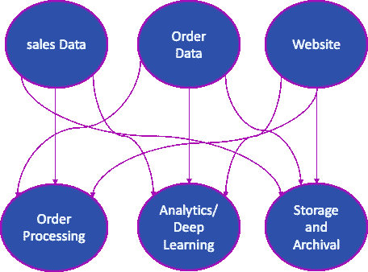

像这样的事情

**用例**

*   信息系统
*   网站活动跟踪
*   度量和日志聚合
*   流处理
*   活动采购
*   提交日志
*   解耦系统依赖等

卡夫卡简化生态系统

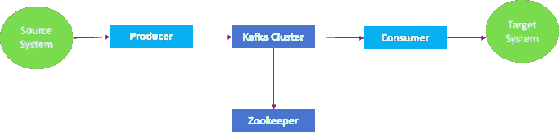

卡夫卡大生态系统

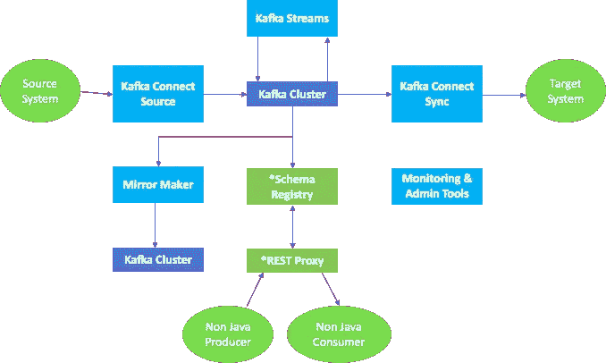

**主题和分区**

**主题**

**主题**是存储和发布消息的主题/提要名称。消息是可以以任何格式存储任何对象的字节数组。所有卡夫卡的信息都被组织成主题。如果一个人希望发送消息，他将把它发送到特定的主题，如果一个人希望阅读消息，他从特定的主题阅读它。向主题写入数据的应用程序称为生产者，从主题读取数据的应用程序称为消费者。以下是一些需要记住的要点:

*   主题由唯一的“名称”标识
*   发布到主题的记录流
*   主题中的数据存在于集群中，直到达到预配置的 TTL(生存时间)。
*   主题可以有零个、一个或多个订户(多订户)
*   一个代理中可以有多个主题

**分区**

Kafka 主题被分成许多分区，这些分区以不变的有序序列(先进先出)包含消息。一个分区中的每个消息都由它唯一的位置点分配和标识，这个位置点称为**偏移量。**一个主题也可以有多个分区日志。这允许多个消费者并行读取一个主题，从而有助于水平扩展。以下是一些需要记住的要点:

*   每个分区都是**有序的**
*   分区中的记录被分配一个顺序 id 号，称为**偏移量**

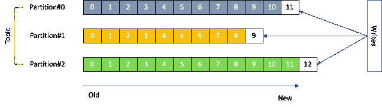

*   分区内的消息是不可变的
*   偏移在特定分区上下文中是有意义的
*   分区内的消息顺序是有保证的
*   数据保留可配置的保留期
*   除非指定了键，否则记录以循环方式分发
*   每个分区包含主题消息的子集
*   更多分区意味着更多并行
*   选择正确的分区数量很重要。这里有一些这样做的指南:[https://www . confluent . io/blog/how-to-choose-the-number-of-topics partitions-in-a-a-Kafka-cluster/](https://www.confluent.io/blog/how-to-choose-the-number-of-topicspartitions-in-a-kafka-cluster/)

经纪人

代理是一组运行 Kafka 的一个或多个服务器。主题存在于经纪人中。以下是一些需要记住的要点:

*   代理接收并存储生产者发送的消息
*   Kafka 集群通常会有多个代理
*   每个处理器每秒可以处理几十万或几百万条信息
*   每个代理都用其 id ( *broker.id* )来标识
*   在连接到一个或多个 broker broker(*bootsrap . servers)之后，*您将连接到集群中的所有服务器
*   为了实现高可用性和高吞吐量，建议一个集群中至少有 3 或 5 个代理
*   分区分布在 Kafka 集群中
*   每个分区都在可配置数量的服务器上复制，以实现容错
*   任何给定的分区都由单个代理处理
*   通常，一个代理处理多个分区
*   示例—包含 3 个和 2 个分区的两个主题

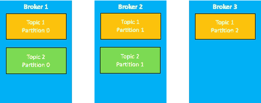

**复制因子**

为了促进弹性和减少任何数据丢失，Kafka 像许多其他分布式技术一样在多个服务器上维护数据的副本。复制因子是相同数据需要存在的副本数量。复制因子为 3 意味着有 3 个副本和 2 个 ISR(同步副本)。ISR 是除了主服务器上存在的副本之外的冗余副本的数量。以下是一些需要记住的要点:

*   Kafka 中的每个主题分区被复制 *n* 次，其中 *n* 是主题的复制因子
*   RF 应大于 1 且小于或等于经纪人数量
*   在 *n 个*副本中，一个副本被指定为*领导者*，而其他副本为*跟随者或 ISR(同步副本)*
*   只有 leader 处理分区的所有读写请求
*   示例:具有**复制因子 3** 和 **1 分区**的主题 1

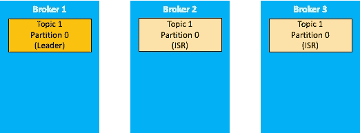

*   示例:主题 2 带有**复制因子 3** 和 **2 分区**

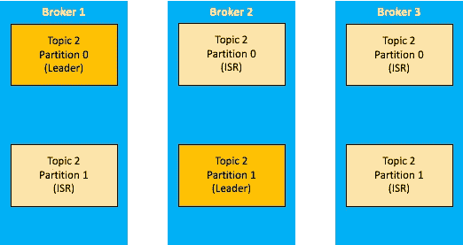

**卡夫卡制片人**

Kafka 生成器是一个向 Kafka 主题发送消息的应用程序。

以下是一些需要注意的关键 Kafka 制作人配置:

**核心配置**

> ***bootstrap . servers:****用于建立与 Kafka 集群的初始连接的主机/端口对列表。客户端将使用所有服务器，而不管此处为引导指定了哪些服务器—此列表仅影响用于发现全套服务器的初始主机。该列表应该采用`*host1:9092,host2:9092,...*`的形式。由于这些服务器仅用于初始连接以发现完整的集群成员(可能会动态变化)，因此该列表不需要包含完整的服务器集(但是，如果某个服务器出现故障，您可能需要多个服务器)。*
> 
> ***key.serializer** :实现`org.apache.kafka.common.serialization.Serializer`接口的 key 的序列化器类。*
> 
> ***value.serializer** :实现`org.apache.kafka.common.serialization.Serializer`接口的值的序列化程序类*
> 
> ****client.id :*** 发出请求时传递给服务器的 id 字符串。这样做的目的是，通过允许在服务器端请求日志中包含一个逻辑应用程序名称，能够跟踪请求的来源，而不仅仅是 IP/端口。*

***消息持久性** ( *请根据对数据丢失的敏感度和整体处理速度选择**

> ****ack = 0***(无确认，触发并忘记，可能的数据丢失)*
> 
> ****ack = 1***(默认，等待领导确认，有限数据丢失)*
> 
> ****ack = 2***(等待领导者和另一个副本的确认，有限的数据丢失。类似于各种其他分布式和复制平台中的仲裁)*
> 
> ****ack = all***(等待首领和所有副本，无数据丢失)*

***注** : *Ack 设置是为了在性能和数据丢失几率*之间进行权衡而设计的。值得注意的是，Ack 越大(acks = all)，处理速度越慢，因为客户端将等待所有副本和领导者发送确认。仅当不允许丢失任何一条消息，并且没有其他进程可以重新处理失败的消息时，才使用此选项。如果设置为零，那么生产者根本不会等待来自服务器的任何确认。该记录将被立即添加到套接字缓冲区，并被视为已发送。在这种情况下，不能保证服务器已经收到记录，并且`retries`配置不会生效(因为客户端通常不知道任何故障)。每个记录返回的偏移量将总是被设置为-1。对于带有 kafka 集群且 ISR 为 2 的 prod 应用程序，首选 Ack 为 2。非关键应用和丢失一条消息可能触发立即重新发送数据(聊天消息失败等)的应用，可以使用 acks = 0 来提高速度。*

***消息排序***

> *消息被写入代理的顺序与生产者客户端接收消息的顺序相同*
> 
> ****重试次数*** > 0 会导致重新排序(默认为 0)*
> 
> ****max . in-flight . requests . per . connection****= 1*启用重试:阻塞前客户端在单个连接上发送的未确认请求的最大数量。请注意，如果此设置设置为大于 1，并且发送失败，则存在由于重试(即，如果启用重试)而导致消息重新排序的风险。*

***配料和压缩***

> ****batch.size*** —(基于大小的批处理) :每当多个记录被发送到同一个分区时，生成器都会尝试将记录一起批处理到更少的请求中。这有助于提高客户端和服务器的性能。此配置以字节为单位控制默认批处理大小。默认大小为 16384*
> 
> *不会尝试批量处理大于此大小的记录。*
> 
> *发送到代理的请求将包含多个批处理，每个分区一个批处理，有数据可供发送。*
> 
> *小批量将使批处理不太常见，并可能降低吞吐量(零批量将完全禁用批处理)。一个非常大的批处理大小可能会浪费更多的内存，因为我们总是会分配一个指定的批处理大小的缓冲区来处理额外的记录。当接收压缩消息时，0.10.0 代理避免重新压缩消息，这通常会减少延迟并提高吞吐量。但是，在某些情况下，这可能会减少生成器上的批处理大小，从而导致吞吐量下降。如果发生这种情况，用户可以调整生成器的 linger.ms 和 batch.size 以获得更好的吞吐量。*
> 
> ****linger.ms*** —(基于时间的批处理) :生产者将请求传输之间到达的任何记录组合成一个批处理请求。通常情况下，这种情况只在记录到达速度快于发送速度的情况下才会发生。但是，在某些情况下，即使在中等负载下，客户端也可能希望减少请求的数量。此设置通过添加少量人为延迟来实现这一点，即，生产者不是立即发送记录，而是等待给定的延迟，以允许发送其他记录，以便可以一起批量发送。该设置给出了批处理延迟的上限:一旦我们获得了分区的`batch.size`条记录，不管该设置如何，它都将被立即发送，但是如果我们为该分区累积的字节数少于此数，我们将“逗留”指定的时间，等待更多的记录出现。该设置默认为 0(即无延迟)。例如，设置`linger.ms=5`可以减少发送的请求数量，但会给无负载发送的记录增加长达 5 毫秒的延迟。*
> 
> ****压缩。type*** —更大的批量意味着更高的压缩。指定给定主题的最终压缩类型。此配置接受标准压缩编解码器(“gzip”、“snappy”、“lz4”、“zstd”)。它还接受“未压缩”，这相当于没有压缩；以及“生产者”,这意味着保留由生产者设置的原始压缩编解码器。*

***排队限制***

> ****buffer . memory***—可供 Java 客户端收集 ***未发送*** 消息的总内存*
> 
> ****max . block . ms***—在引发异常之前阻止此持续时间内的额外发送*
> 
> ****request . time out . ms***—如果消息排队时间超过此持续时间，则将其从队列中移除并引发异常*

***卡夫卡消费者***

*从 kafka 主题中读取数据的应用程序称为 kafka 消费者。以下是一些需要记住的要点。*

*   *消费者从主题中读取数据*
*   *消费者在每个分区内按顺序读取数据*
*   *消费者跨分区并行读取数据*

*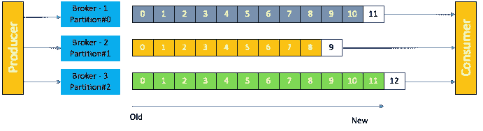*

*以下是一些需要注意的关键 Kafka 消费者配置:*

***内核配置***

> ****bootstrap . servers:***用于建立与 Kafka 集群的初始连接的主机/端口对列表。客户端将使用所有服务器，而不管此处为引导指定了哪些服务器—此列表仅影响用于发现全套服务器的初始主机。该列表应该采用`host1:9092,host2:9092,...`的形式。由于这些服务器仅用于初始连接以发现完整的集群成员(可能会动态变化)，因此该列表不需要包含完整的服务器集(但是，如果某个服务器出现故障，您可能需要多个服务器)。*
> 
> ***key.deserializer :** 实现`org.apache.kafka.common.serialization.Deserializer`接口的 key 的反序列化类。可以根据需要创建定制的反序列化器。*
> 
> ***value.deserializer :** 实现`org.apache.kafka.common.serialization.Deserializer`接口的值的反序列化器类。可以根据需要创建定制的反序列化器。*
> 
> ****client . id:****该值由 kafka 消费客户端指定，用于区分不同的客户端。这与 group.id* 不同*

***群组配置***

> ****group.id :*** 该属性为同一消费者组内的一组消费者定义了一个唯一的标识。具有相同组 Id 的新消费者将与现有的一组消费者共享消息。*
> 
> ****session . time out . ms:***使用 Kafka 的组管理工具时用于检测消费者故障的超时。消费者定期发送心跳，向代理表明其活跃度。如果在此会话超时到期之前，代理没有收到任何心跳，则代理将从组中删除此消费者，并启动重新平衡。请注意，该值必须在由`group.min.session.timeout.ms`和`group.max.session.timeout.ms`在代理配置中配置的允许范围内。*
> 
> ****max . poll . records:***单次调用 poll()返回的最大记录数。未指定时，默认值为 500。*
> 
> ****heart beat . interval . ms:***使用 Kafka 的组管理设施时，到组协调器的心跳的预期间隔时间。心跳用于确保工作会话保持活动状态，并在新成员加入或离开组时促进重新平衡。该值必须设置为低于`session.timeout.ms`，但通常应设置为不高于该值的 1/3。它可以调整得更低，以控制正常再平衡的预期时间。*

***抵销管理***

> ****enable . auto . commit:***如果设置为 true，则允许用户的抵销在后台定期提交。*
> 
> ****auto . commit . interval . ms:***如果`enable.auto.commit`设置为`true. default value is 5000`，用户补偿自动提交给 Kafka 的频率(毫秒)*
> 
> ****auto . offset . reset:****该设置有助于识别消费者开始读取数据的偏移量。以下是选项:**

*   *最早:自动将偏移重置为最早的偏移*
*   *最新:自动将偏移重置为最新的偏移*
*   *none:如果没有为使用者的组找到以前的偏移量，则向使用者引发异常*
*   *其他任何事情:向消费者抛出异常。*

***消费群体***

*一个**消费者群体**是一组合作消费来自某些主题的数据的消费者*

*   *一个组中的每个用户都被分配了一组要读取的分区。对于任何给定的分区，只有一个消费者会读取它。*
*   *如果您的消费者多于分区，一些消费者将会闲置*

*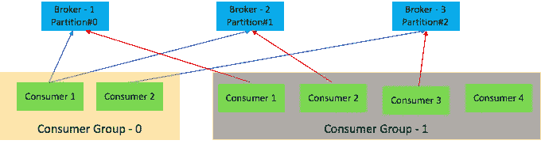*

*   *消费者使用内置在 Kafka 中的组协调协议*
*   *其中一个经纪人被选为 ***组协调人****
*   *协调器协调分区分配*
*   *该组中的每个成员都必须向协调器发送心跳，以便保持该组的成员身份*
*   *消费者必须提交与其读取的消息相对应的偏移量*
*   *在用户关机或崩溃的情况下，它的分区将被重新分配给另一个成员*

*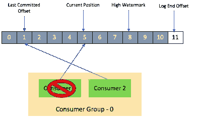*

***Kafka 日志存储(段和索引)***

*   *卡夫卡的储物单元是一个隔板*
*   *不能跨多个代理甚至多个磁盘分割一个分区*
*   *主题被分成几个部分*
*   *分区被分割成段*

*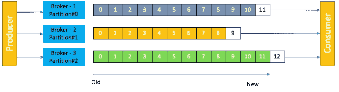**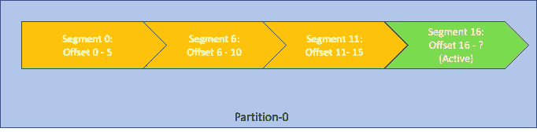*

*   *分区被分割成段*
*   *线段由其基准偏移命名*
*   *只有一个段是活动的*
*   *细分设置*

> ****log . segment . bytes***—单个日志文件的最大大小*
> 
> ****log . roll . hours***—Kafka 等待滚动新段文件的最长时间*

*   *分区是一个目录，每个段由索引文件、时间索引文件和日志文件组成*

*什么是动物园管理员？*

*   *ZooKeeper 是一个面向分布式应用的分布式开源协调服务*
*   *保存经纪人的名单*
*   *有助于分区的领导者选举*
*   *向 Kafka 发送更改通知，如*
*   *新话题*
*   *代理失败*
*   *话题删除*
*   *卡夫卡需要动物园管理员来工作*
*   *3 到 5 台服务器非常有效(奇数法定人数)*
*   *只有一个服务器是领导者，其余的是追随者*

*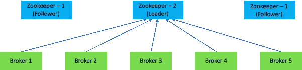*

***是时候动手了(在本地设置和运行 Kafka】***

*在我们运行本地测试之前，您需要启动 Zookeeper 和 Kafka。*

*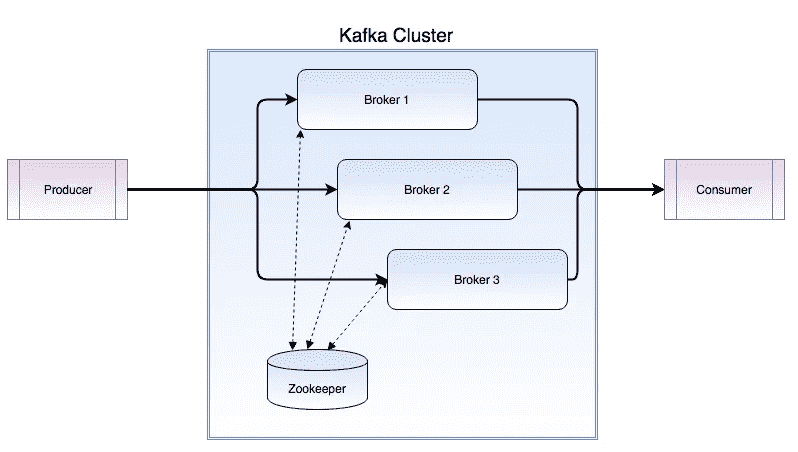*

*   *下载最新版本的 Confluent Kafka，按照 Confluent 网站的说明操作:[https://docs . Confluent . io/current/quick start/ce-quick start . html # ce-quick start](https://docs.confluent.io/current/quickstart/ce-quickstart.html#ce-quickstart)*
*   *启动动物园管理员:*

> *bin/zookeeper-server-start etc/Kafka/zookeeper . properties*

*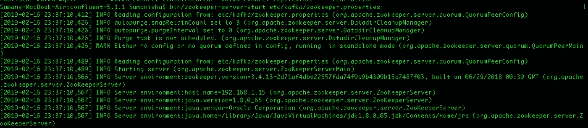*

*2019–02–16 23:37:10，683]信息使用 org . Apache . zookeeper . server . nioservercnxnfactory 作为服务器连接工厂(org . Apache . zookeeper . server . servercnxnfactory)*

*[2019–02–16 23:37:10，709]信息绑定到端口 0 . 0 . 0 . 0/0 . 0 . 0:2181(org . Apache . zookeeper . server . nioservercnxnfactory)*

*   *开始卡夫卡*

*bin/Kafka-server-start etc/Kafka/server . properties*

*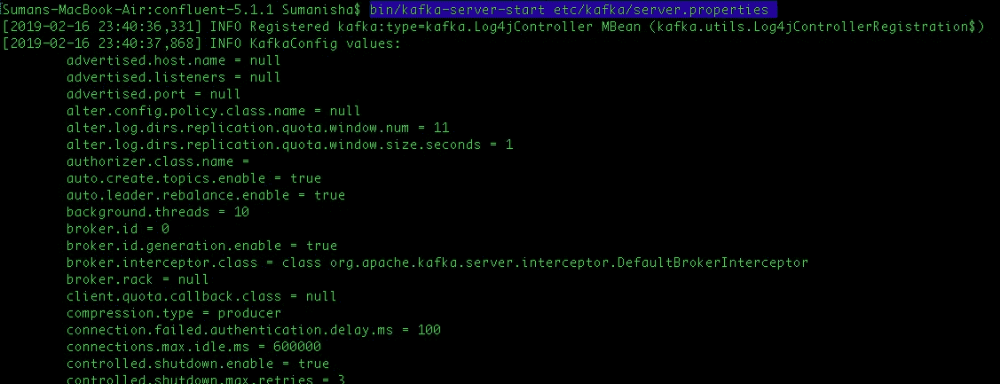*

> *[2019–02–16 23:40:44，452]信息集群 ID:CQ DE3 hyptq-o6 ugw 9 hk wvq(org . Apache . Kafka . clients . metadata)*
> 
> *[2019–02–16 23:40:44，557]INFO[Log partition = _ _ confluent . support . metrics-0，dir=/tmp/kafka-logs]使用消息格式版本 2 (kafka.log.Log)加载生产者状态直到偏移量 0*
> 
> *[2019–02–16 23:40:44，558]提取关联 Id 为 3 的元数据时出现 WARN[Producer clientId = Producer-1]错误:{ _ _ confluent . support . metrics = LEADER _ NOT _ AVAILABLE }(org . Apache . Kafka . clients . network client)*
> 
> *[2019–02–16 23:40:44，575]INFO[Log partition = _ _ confluent . support . metrics-0，dir=/tmp/kafka-logs]在 141 毫秒内完成了具有 1 个段、日志开始偏移量 0 和日志结束偏移量 0 的日志的加载(kafka.log.Log)*

*创建主题时记录消息*

> *[2019–02–16 23:40:44，580] INFO 为分区 _ _ confluent . support . metrics-0 in/tmp/Kafka-logs 创建的日志，带有属性{compression.type -> producer，message . format . version-> 2.1-IV2，file.delete.delay.ms -> 60000，max . message . bytes-> 100012，min.compaction.lag.ms -> 0，message . timestamp . type-> create time，message . down conversion . enable-> enable(kafka.log.LogManager)*
> 
> *[2019–02–16 23:40:44，584]INFO[Partition _ _ confluent . support . metrics-0 broker = 0]未找到 Partition _ _ confluent . support . metrics-0(Kafka . cluster . Partition)的检查点高水位线*
> 
> *[2019–02–16 23:40:44，597]为分区 __confluent.support.metrics-0 加载了信息副本，初始高水位线为 0 (kafka.cluster.Replica)*
> 
> *[2019–02–16 23:40:44，608]INFO[Partition _ _ confluent . support . metrics-0 broker = 0]_ _ confluent . support . metrics-0 从偏移量 0 开始在前导历元 0 处开始。以前的领导者纪元是:-1 (kafka.cluster.Partition)*
> 
> *[2019–02–16 23:40:44，679]提取关联 Id 为 4 的元数据时出现 WARN[Producer clientId = Producer-1]错误:{ _ _ confluent . support . metrics = LEADER _ NOT _ AVAILABLE }(org . Apache . Kafka . clients . network client)*
> 
> *[2019–02–16 23:40:44，993]INFO[Producer clientId = Producer-1]关闭带有 time out millis = 9223372036854775807 ms .(org . Apache . Kafka . clients . Producer . kafkaproducer)的 Kafka 生成器*
> 
> *[2019–02–16 23:40:45，003] INFO 成功向 Kafka topic _ _ confluent . support . metrics(io . confluent . support . metrics . submitter)提交指标*
> 
> *[2019–02–16 23:40:47，185] INFO 通过安全端点(io . Confluent . support . metrics . submitters . Confluent submitter)成功向 Confluent 提交指标*

*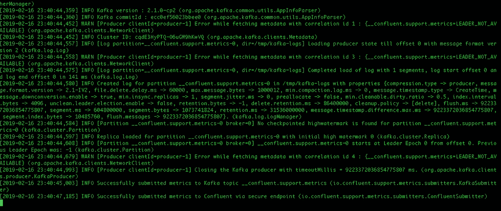*

*未创建主题时的日志文件夹*

*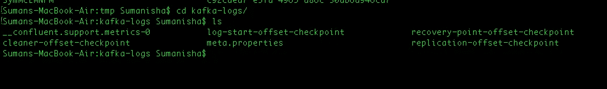*

*   ***创建话题***

*bin/Kafka-topics-create-zookeeper localhost:2181-复制-因子 1-分区 1-topic my-test*

**

*创建主题时的日志文件夹*

****

*必要的日志文件创建在以主题的分区号命名的文件夹中*

**

*消息存储在段日志文件中*

*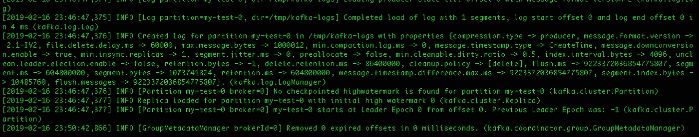*

***发送消息:***

*bin/Kafka-控制台-制作人-经纪人-列表 localhost:9092-主题 my-test*

*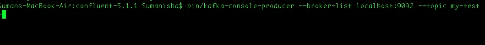*

***听读题目中的信息:***

*bin/Kafka-console-consumer-bootstrap-server localhost:9092-主题 my-test-从头开始*

*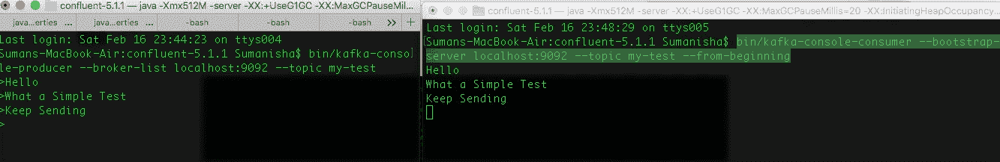*

*或者，主题创建和样本消息生成、发布和收听可以通过合流控制中心来完成。*

***结论***

*Kafka 是最权威、使用最广泛的消息传递系统，广泛应用于各行各业。我的这个努力是为了简化入门卡夫卡的过程。在未来几天，将努力发表简化的文章，以开始使用 Kafka Connect 和 Streams。*

***参考文献***

* [## 汇合平台快速启动(本地)-汇合平台

### 该快速入门向您展示了如何启动和运行 Confluent Platform 及其主要组件。这种快速启动…

docs .汇合. io](https://docs.confluent.io/current/quickstart/ce-quickstart.html#ce-quickstart)  [## Kafka - DZone 大数据入门

### 让我们展示一个简单的例子，从 Kafka 命令行使用生产者和消费者。从下载 Kafka 0 . 10 . 2 . x…

dzone.com](https://dzone.com/articles/getting-started-with-kafka-tutorial)  [## 阿帕奇卡夫卡

### Apache Kafka:分布式流媒体平台。

kafka.apache.org](https://kafka.apache.org/quickstart)  [## 如何在你的机器上安装和运行 Kafka🌪

### Apache Kafka 是一个分布式流媒体平台。它可以用于从分布式消息代理…

www.sohamkamani.com](https://www.sohamkamani.com/blog/2017/11/22/how-to-install-and-run-kafka/)*