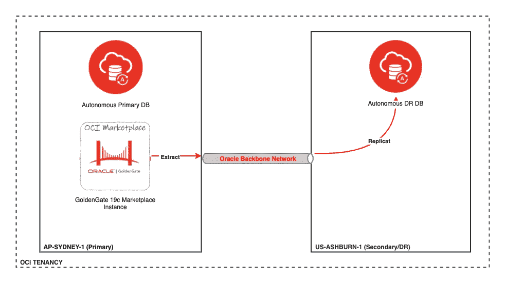

# 使用 OCI 市场 GoldenGate 19c 微服务在两个自治数据库之间跨区域复制数据

> 原文：<https://medium.com/oracledevs/replicate-data-between-2-oracle-autonomous-database-using-oci-marketplace-goldengate-19c-948882296c93?source=collection_archive---------2----------------------->

**Oracle 自治数据库**现在支持使用提取功能捕获源数据，并将其应用到另一个地区的自治数据库。以前使用 Goldengate，您只能将自治数据库复制为目标数据库，但使用最近发布的功能，您现在可以在源位置捕获事务，并将其复制到另一个自治数据库。所以自治数据库现在可以充当上游数据库。

这在您需要使用自治数据库和 Goldengate 构建地理上分散的应用程序的场景中非常有用。Goldengate 不仅仅是一个复制工具，它还可以帮助您构建云原生复杂数据分布拓扑。

**建筑**

**步骤**

**1。提供两个事务处理自治数据库，一个在悉尼，另一个在阿什本。您可以使用下面的 Github repo 快速配置该演示的基础架构。请注意，我们正在创建面向公众的服务，但理想情况下，自治数据库和 Goldengate Hub 应该在私有子网**

澳大利亚东部(悉尼)——资料来源:ProjectSYD
美国东部(阿什本)——目标:ProjectDR

**SYD 地形代号:**[https://github . com/shadabshaugat/OCI _ GG _ DEMO/tree/main/golden gate % 20 ADB % 20 DEMO/DemoGG。ATP1.SYD](https://github.com/shadabshaukat/OCI_GG_DEMO/tree/main/GoldenGate%20ADB%20Demo/DemoGG.ATP1.SYD)

**IAD Terraform 代码:**[https://github . com/shadabshaugat/OCI _ GG _ DEMO/tree/main/golden gate % 20 ADB % 20 DEMO/DemoGG。ATP2.IAD](https://github.com/shadabshaukat/OCI_GG_DEMO/tree/main/GoldenGate%20ADB%20Demo/DemoGG.ATP2.IAD)

**2。为 Oracle 调配 Goldengate 19c Marketplace 微服务版本，并选择部署作为源和目标 19c，不要选择部署 2 自主选项**

参见:[https://www.youtube.com/watch?v=dQbcrH8wVDs](https://www.youtube.com/watch?v=dQbcrH8wVDs)

**代码:**[https://github . com/shadabshaukat/OCI _ GG _ DEMO/tree/main/golden gate % 20 ADB % 20 DEMO/DEMO _ OracleGoldenGate _ micro services _ 19 . 1 . 0 . 0 . 2010 13 _ v 1.2](https://github.com/shadabshaukat/OCI_GG_DEMO/tree/main/GoldenGate%20ADB%20Demo/Demo_OracleGoldenGate_Microservices_19.1.0.0.201013_v1.2)

**3。登录金门计算虚拟机，获取凭证**

$ cat ~/ogg-credentials . JSON
{ " username ":" ogg admin "，" credential ":" D * * * * * * * * * * pI " }

使用上面显示的凭证登录 https:// <public-ip>。</public-ip>

您可以查看 golden gate deployments > service manager >
golden gate Config Home 参数/u02/deployments/service manager/etc/conf

**4。检查显示源和目标目录结构**的部署配置文件

$ cat/u02/deployments/service manager/etc/conf/deployment registry . dat

> " Source ":{
> " environment ":[
> {
> " name ":" TNS _ ADMIN "，
> " value ":"/u02/deployments/Source/etc "
> }
> ]
> }
> 
> "目标":{
> "环境":[
> {
> "名称":" TNS_ADMIN "，
> " value ":"/u02/deployments/Target/etc "
> }
> ]
> }

**5。将钱包从源和目标自治数据库复制到 TNS_ADMIN 位置目录，如上面的命令**所示

-rw-r—r—@ 1 shadab staff 20K 7 Jan 13:02 Wallet _ projects yd . zip
-rw-r—r—@ 1 shadab staff 20K 7 Jan 13:26 Wallet _ projectdr . zip

$ sftp-I " my demo _ vcn . priv " OPC @

sftp >将 Wallet_ProjectSYD.zip
上传 Wallet_ProjectSYD.zip 到/home/OPC/Wallet _ projects yd . zip
Wallet _ projects yd . zip 100% 20KB 1.2 MB/s 00:00

sftp >将 Wallet_ProjectDR.zip
上传 Wallet_ProjectDR.zip 到/home/OPC/Wallet _ project dr . zip
Wallet _ project dr . zip

6。解压缩源目录和目标目录中的两个 WALLET，并更改 sqlnet.ora 文件 WALLET_LOCATION 参数以指向各自的 TNS_ADMIN 目录

$ CP-p Wallet _ project syd . zip/u02/deployments/Source/etc
$ CP-p Wallet _ project dr . zip/u02/deployments/Target/etc

$ CD/u02/deployments/Source/etc
$ unzip Wallet _ projects yd . zip
存档:Wallet_ProjectSYD.zip
展开:README
展开:cwallet.sso
展开:tnsnames.ora
展开:truststore.jks
展开:ojdbc.properties
展开:sqlnet.ora
展开:ewallet.p12
展开:keystore.jks

$ CD/u02/deployments/Target/etc
$ unzip Wallet _ project dr . zip
存档:Wallet_ProjectDR.zip
展开:README
展开:cwallet.sso
展开:tnsnames.ora
展开:truststore.jks
展开:ojdbc.properties
展开:sqlnet.ora
展开:ewallet.p12
展开:keystore.jks

例如:Source
VI/u02/deployments/Source/etc/sqlnet . ora

WALLET _ LOCATION =(SOURCE =(METHOD = file)(METHOD _ DATA =(DIRECTORY = "/u02/deployments/SOURCE/etc "))
SSL _ SERVER _ DN _ MATCH = yes

VI/u02/deployments/Target/etc/sqlnet . ora

WALLET _ LOCATION =(SOURCE =(METHOD = file)(METHOD _ DATA =(DIRECTORY = "/u02/deployments/Target/etc "))
SSL _ SERVER _ DN _ MATCH = yes

**7。SYD ATP 中的来源设置**

**a .创建需要复制的模式和表**
$ CD/u02/deployments/Source/etc

$/u01/app/client/Oracle 19/bin/SQL/nolog

set cloud config/u02/deployments/Source/etc/Wallet _ projects yd . zip
show tns

连接 admin/* * * * * * @ project syd _ high

> 创建由 PassW0rd_#21 标识的用户 goldengateusr 默认表空间数据配额对数据无限制；
> 创建表 goldengateusr.accounts (id 号主键，名称 varchar 2(100))；
> 插入到 goldengateusr.accounts 值(1，' Shadab ')；
> 提交；
> select * from golden gateusr . accounts；

**b .解锁 ggadmin 用户并启用补充日志数据**

> 更改由 PassW0rd_#21 帐户解锁标识的用户 ggadmin
> 修改可插拔数据库添加补充日志数据；
> 从 dba_supplemental_logging 中选择 minimal
> 
> 从 v $数据库中选择 to _ char(current _ SCN)；
> 16767325762804

**c .创建提取参数文件**

$ mkdir/u02/trails/dirdat
$ VI/u02/deployments/Source/etc/conf/ogg/ext 1 . PRM

> 提取 ext 1
> USERID gg admin @ project syd _ high，密码 PassW0rd_#21
> EXTTRAIL。/dirdat/sy
> ddl 包含映射的
> 表 goldengateusr。*;

**d .将提取内容添加到 source**
$/u01/app/ogg/Oracle 19/bin/admin client

> 连接 [https://localhost/](https://localhost/) 部署源作为 oggadmin 密码 DFA9zOjlh0GY % GpI！
> 
> ALTER CREDENTIALSTORE 添加用户 ggadmin@projectsyd_high 密码 PassW0rd_#21 别名 projectsyd_high
> 
> DBLOGIN USERIDALIAS 项目 syd_high
> 
> 添加提取 ext1，集成 TRANLOG，SCN 16767325762804
> 注册提取 ext1 数据库
> 添加 EXTTRAIL。/dirdat/sy，提取 ext1
> 
> 开始提取 ext1
> 信息提取 ext1，细节

状态应该是“正在运行”

**e .在源表中插入行**

> /*在源表中插入另一行*/
> 插入到 goldengateusr.accounts 值中(2，“John Doe”)；
> 插入到 goldengateusr.accounts 值中(3，' Mary Jane ')；提交；

**f .对模式进行数据泵备份，直到 SCN 到内部目录‘DATA _ PUMP _ DIR’**

'导出 ORACLE _ HOME = '/u01/app/client/ORACLE 19 '
导出 TNS _ ADMIN = '/u02/deployments/Source/etc '

$/u01/app/client/Oracle 19/bin/ex PDP ADMIN/* * * * * * * @ projects yd _ high directory = DATA _ PUMP _ DIR dump file = export 01 . DMP log file = export . log schemas = golden gate usr FLASHBACK _ SCN = 16767325762804

**g .创建存储桶、用于访问的身份验证令牌以及将导出备份复制到客户存储桶的 DBMS_CLOUD 凭据**
在您的租赁中创建一个名为“datapump”的存储桶，并为您的 OCI 用户创建一个对该存储桶具有读/写权限的身份验证令牌

$/u01/app/client/Oracle 19/bin/sqlplus admin/* * * * * * @ project syd _ high

> 开始
> DBMS_CLOUD。CREATE _ CREDENTIAL(
> CREDENTIAL _ name =>' LOAD _ DATA '，
> username =>' oracleidentitycloudservice/shadab . Mohammad @[oracle.com](http://oracle.com)'，
> password =>' CR * * * * * * * * * * Pgsn)；'
> )；
> 结束；
> /
> 
> —BEGIN
> —DBMS _ cloud . drop _ credential(credential _ name =>' LOAD _ DATA ')；
> —结束；
> — /
> 
> 开始
> DBMS_CLOUD。PUT_OBJECT ('LOAD_DATA '，'[https://OBJECT storage . AP-Sydney-1 . Oracle cloud . com/n/OCI CPM/b/DATA PUMP/'，' DATA_PUMP_DIR '，' export 01 . DMP](https://objectstorage.ap-sydney-1.oraclecloud.com/n/ocicpm/b/datapump/)')；
> 结束；
> /
> 
> select object_name，bytes from DBMS _ cloud . list _ objects(' LOAD _ DATA '，'[https://object storage . AP-Sydney-1 . Oracle cloud . com/n/OCI CPM/b/DATA pump/](https://objectstorage.ap-sydney-1.oraclecloud.com/n/ocicpm/b/datapump/)')；

**8。IAD ATP 中的目标设置**

**a .在目标**CD/u02/deployments/Target/etc/上创建 DBMS_CLOUD 凭证

export ORACLE _ HOME = '/u01/app/client/ORACLE 19 '
export TNS _ ADMIN = '/u02/deployments/Target/etc/'

$/u01/app/client/Oracle 19/bin/sqlplus admin/* * * * * * * * @ project dr _ high

> BEGIN
> DBMS_CLOUD。' CREATE _ CREDENTIAL(
> CREDENTIAL _ name =>' LOAD _ DATA '，
> username =>' oracleidentitycloudservice/shadab . Mohammad @[oracle.com](http://oracle.com)'，
> password =>' CR * * * * * * * * gsn)；'
> )；
> 结束；
> /
> 
> select object_name，bytes from DBMS _ cloud . list _ objects(' LOAD _ DATA '，'[https://object storage . AP-Sydney-1 . Oracle cloud . com/n/OCI CPM/b/DATA pump/](https://objectstorage.ap-sydney-1.oraclecloud.com/n/ocicpm/b/datapump/)')；

**b .解锁目标上的 ggadmin 用户并启用补充日志数据**

> 更改由 PassW0rd_#21 帐户解锁标识的用户 ggadmin
> 修改可插拔数据库添加补充日志数据；
> 从 dba_supplemental_logging 中选择 minimal

**c .将数据泵备份从客户桶导入目标 ADB**

$/u01/app/client/Oracle 19/bin/impdp admin/* * * * * * * * * * @ project dr _ high credential = LOAD _ DATA schemas = golden gate usr directory = DATA _ PUMP _ DIR dump file =[https://object storage . AP-Sydney-1 . Oracle cloud . com/n/OCI CPM/b/DATA PUMP/o/export 01 . DMP](https://objectstorage.ap-sydney-1.oraclecloud.com/n/ocicpm/b/datapump/o/export01.dmp)log file = import . log

**d .创建 replicat 参数文件**

$ VI/u02/deployments/Target/etc/conf/ogg/repl 1 . PRM

replicat repl 1
USERID gg admin @ project dr _ high，密码 PassW0rd _ # 21
map golden gateusr。*，目标 goldengateusr。*;

**e .在目标 ADB 中创建副本**

$/u01/app/ogg/Oracle 19/bin/admin client

> 连接 [https://localhost 部署](https://localhost deployment)目标作为 oggadmin 密码 DFA9zOjlh0GY % GpI！
> ALTER CREDENTIALSTORE 添加用户 ggadmin@projectdr_high 密码 PassW0rd_#21 别名 project dr _ high
> dblog in USERIDALIAS project dr _ high
> 
> ADD check point table gg admin . chkpt
> ADD Replicat repl 1 ext trail。/dirdat/sy 检查点表 ggadmin.chkpt
> 
> 开始复制副本副本 1
> 信息复制副本 1，细节

状态应为“正在运行”

**9。现在复制已经开始，在源表中插入一些记录，您应该能够在目标数据库中看到它们。查看/u02/deployments/Target/var/log/gg serr . log 中与复制相关的任何错误**

**—来源—**
导出 ORACLE _ HOME = '/u01/app/client/ORACLE 19 '
导出 TNS _ ADMIN = '/u02/deployments/Source/etc/'

$/u01/app/client/Oracle 19/bin/sqlplus admin/* * * * * * * * @ project syd _ high

> select * from golden gateusr . accounts；
> 
> 插入到 goldengateusr.accounts 值中(4，“Foo Bar”)；
> 插入 goldengateusr.accounts 值(5，'虚拟值')；
> 提交；

**—目标—**
导出 ORACLE _ HOME = '/u01/app/client/ORACLE 19 '
导出 TNS _ ADMIN = '/u02/deployments/Target/etc/'

$/u01/app/client/Oracle 19/bin/sqlplus admin/* * * * * * * * @ project dr _ high

select * from golden gateusr . accounts；

我们现在应该能够看到目标 DR 数据库中的新记录。

**10。因为我们已经在提取中包含了 DDL，所以我们也可以在 Source 中创建一个表，它会自动地复制到目标中**

> — Source —
> 创建表 golden gateusr . carpender(身份证号主键，卡号 varchar 2(30))；
> 
> 插入 goldengateusr .持卡人值(1，' 1234–5677–9876–8765 ')；
> 提交；
> 
> —目标—
> desc 金卡持卡人；
> select * from goldengateusr .持卡人；

**参考资料:**
**————————**
【1】[https://blogs . Oracle . com/data integration/free-golden gate-software-on-OCI-market place](https://blogs.oracle.com/dataintegration/free-goldengate-software-on-oci-marketplace)
【2】[https://docs . Oracle . com/en/cloud/PAAs/autonomous-data-warehouse-cloud/tutorial-getting-started-autonomouse-db/index . html](https://docs.oracle.com/en/cloud/paas/autonomous-data-warehouse-cloud/tutorial-getting-started-autonomous-db/index.html)
【3】[https://https](https://docs.oracle.com/en/middleware/goldengate/core/19.1/oracle-db/configure-autonomous-database-capture-replication.html#GUID-6AF0D1AC-FA05-41E8-ADA2-2F6820C68D5C)