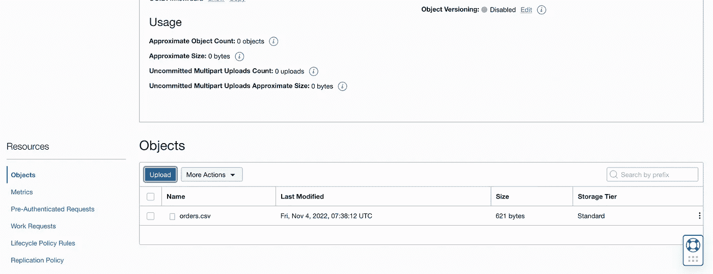
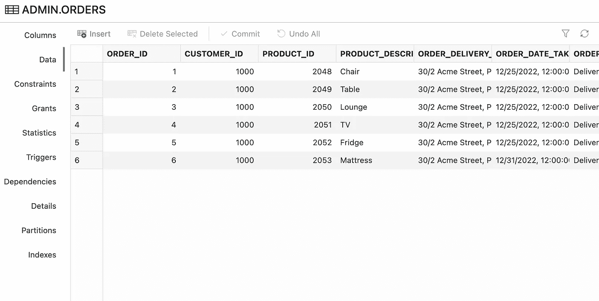
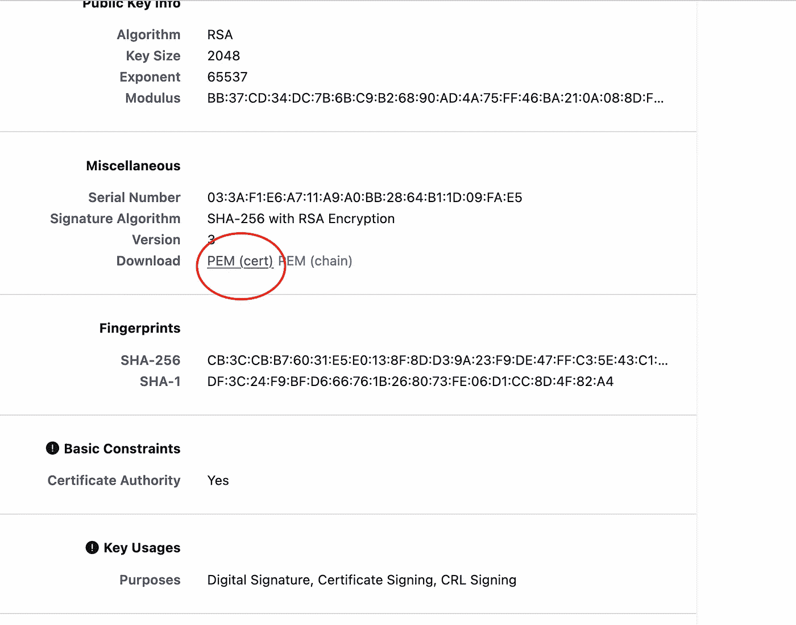

# 使用 Goldengate PostgreSQL 和 OCI Goldengate 将数据从 PostgreSQL 复制到 Oracle 自治数据库

> 原文：<https://medium.com/oracledevs/replicating-data-from-postgresql-to-oracle-autonomous-database-using-goldengate-postgresql-and-oci-8afb4ddf5e60?source=collection_archive---------0----------------------->

Oracle Goldengate 21c 微服务为从多个源数据库和目标数据库进行*实时*复制提供了一个全面的平台。

Goldengate 21c PostgreSQL 提供[远程捕获](https://blogs.oracle.com/dataintegration/post/oracle-goldengate-postgresql-capture-is-available-now)，适用于运行于内部部署、AWS、GCP 或 Azure 的 PostgreSQL。在本帖中，我们将结合使用 Goldengate PostgreSQL 和 OCI Goldengate for Oracle 来创建从 Postgres 到 Oracle 的复制。


credit : unsplash

我们可以使用以下组件构建此解决方案

*   *Source →运行在 Oracle Linux 7 VM 上的 PostgreSQL Server 13*
*   用于 PostgreSQL 的 Goldengate 21c OCI 市场
*   *甲骨文公司的 OCI 黄金门*
*   *目标→ Oracle 自治数据库 19c*

## 解决方案架构

*   第一步是使用 Postgres 和 DBMS_CLOUD 的 COPY 命令进行初始加载。要恢复到自治数据库的 COPY_DATA


Postgres to Oracle Initial Load

*   然后，我们将建立持续变更数据捕获(CDC)复制


PostgreSQL to Oracle CDC Replication

*   数据流


DataFlow

## 设置

1.  **在 OL7 虚拟机上安装和设置 Postgres 13**

```
sudo yum install -y [https://download.postgresql.org/pub/repos/yum/reporpms/EL-7-x86_64/pgdg-redhat-repo-latest.noarch.rpm](https://download.postgresql.org/pub/repos/yum/reporpms/EL-7-x86_64/pgdg-redhat-repo-latest.noarch.rpm)sudo yum install -y postgresql13-server
sudo yum install -y postgresql13-contribsudo /usr/pgsql-13/bin/postgresql-13-setup initdbsudo systemctl enable postgresql-13
sudo systemctl start postgresql-13sudo systemctl status postgresql-13sudo systemctl restart postgresql-13 
sudo systemctl status postgresql-13
```

**2。为提取配置 Postgres DB 主机，并为 Goldengate 捕获部署示例表' *orders* '**

```
sudo passwd postgressudo -iu postgrespsql -c “ALTER USER postgres WITH PASSWORD ‘YourPassword#_’;”sudo yum install treetree -L 1 /var/lib/pgsql/13/datapsql -U postgres -c ‘SHOW config_file’config_file
 — — — — — — — — — — — — — — — — — — — — 
 /var/lib/pgsql/13/data/postgresql.conf
(1 row)vim /var/lib/pgsql/13/data/pg_hba.conf**# If ident is available in file then replace ‘ident’ with ‘md5’ or ‘scram-sha-256’****# Change this line to allow all hosts 0.0.0.0/0** 
# IPv4 local connections:
host all all 0.0.0.0/0 md5$ vim /var/lib/pgsql/13/data/postgresql.conf**## Uncomment and set below parameters**
listen_addresses = *
wal_level = logical
max_replication_slots = 2
max_wal_senders = 1
track_commit_timestamp = on**# Restart Postgresql service with sudo OS user and whitelist ports ##**
$ sudo systemctl restart postgresql-13
$ sudo systemctl status postgresql-13**# Whitelist Postgres ports #**
sudo firewall-cmd --list-ports
sudo firewall-cmd --zone=public --permanent --add-port=5432/tcp
sudo firewall-cmd --reload
```

*将端口 5432 加入防火墙的白名单，或者，如果在另一个云上，将其添加到子网安全列表或安全组。*

**#与 postgres OS 用户**

```
sudo -iu postgrespsql -U postgres -h localhostCREATE TABLE orders (
 order_id bigint PRIMARY KEY,
 customer_id bigint,
 product_id bigint,
 product_description VARCHAR,
 order_delivery_address VARCHAR,
 order_date_taken date,
 order_misc_notes VARCHAR
);INSERT into orders values (1,1000,2048,’Chair’,’30/2 Acme Street, Pin : 9000, AZ-US’,’2022–12–25',’Deliver to Doorstep’);
INSERT into orders values (2,1000,2049,’Table’,’30/2 Acme Street, Pin : 9000, AZ-US’,’2022–12–25',’Deliver to Doorstep’);
INSERT into orders values (3,1000,2050,’Lounge’,’30/2 Acme Street, Pin : 9000, AZ-US’,’2022–12–25',’Deliver to Doorstep’);
INSERT into orders values (4,1000,2051,’TV’,’30/2 Acme Street, Pin : 9000, AZ-US’,’2022–12–25',’Deliver to Doorstep’);
INSERT into orders values (5,1000,2052,’Fridge’,’30/2 Acme Street, Pin : 9000, AZ-US’,’2022–12–25',’Deliver to Doorstep’);
INSERT into orders values (6,1000,2053,’Mattress’,’30/2 Acme Street, Pin : 9000, AZ-US’,’2022–12–31',’Deliver to Doorstep’);select * from orders ;
```


```
postgres=# \dn
 List of schemas
 Name | Owner
 — — — — + — — — — — 
 public | postgres
(1 row)
```

**3。为非 Oracle PostgreSQL 部署 Goldengate 21c 的 OCI 市场映像**

```
Link [1] : [https://cloudmarketplace.oracle.com/marketplace/en_US/adf.task-flow?tabName=O&adf.tfDoc=%2FWEB-INF%2Ftaskflow%2Fadhtf.xml&application_id=66489465&adf.tfId=adhtf](https://cloudmarketplace.oracle.com/marketplace/en_US/adf.task-flow?tabName=O&adf.tfDoc=%2FWEB-INF%2Ftaskflow%2Fadhtf.xml&application_id=66489465&adf.tfId=adhtf)Link [2] : [https://blogs.oracle.com/dataintegration/post/oracle-goldengate-postgresql-capture-is-available-now](https://blogs.oracle.com/dataintegration/post/oracle-goldengate-postgresql-capture-is-available-now)
```

**4。为 Oracle 部署 OCI golden gate**

```
Link : [https://docs.oracle.com/en/cloud/paas/goldengate-service/index.html](https://docs.oracle.com/en/cloud/paas/goldengate-service/index.html)
```

**5。供应 Oracle 自治数据库**

```
Link : [https://docs.oracle.com/en/cloud/paas/autonomous-database/adbsa/autonomous-provision.html](https://docs.oracle.com/en/cloud/paas/autonomous-database/adbsa/autonomous-provision.html)
```

6。部署 Oracle 模式并为 Goldengate 副本启用用户

```
CREATE TABLE admin.orders (
 order_id number,
 customer_id number,
 product_id number,
 product_description VARCHAR2(500),
 order_delivery_address VARCHAR2(500),
 order_date_taken date,
 order_misc_notes VARCHAR2(500),
 CONSTRAINT orders_pk PRIMARY KEY (order_id)
);alter user ggadmin identified by YourPassw0rd321#_ account unlock;
```

*注:如果没有在 Oracle 自治数据库上配置用于捕获的提取，则不需要启用补充日志数据。*

您可以使用 SQLines 将 PostgreSQL 代码转换为 Oracle > >[https://www.sqlines.com/online](https://www.sqlines.com/online)

**7。准备连接 Goldengate 21c 市场实例，以连接到 PostgreSQL 数据库主机**

*注意:在 golden gate PostgreSQL market place Linux 实例上安装这些软件包。*

```
sudo yum install -y [https://download.postgresql.org/pub/repos/yum/reporpms/EL-7-x86_64/pgdg-redhat-repo-latest.noarch.rpm](https://download.postgresql.org/pub/repos/yum/reporpms/EL-7-x86_64/pgdg-redhat-repo-latest.noarch.rpm)sudo yum install -y postgresql13-server
sudo /usr/pgsql-13/bin/postgresql-13-setup initdb
sudo systemctl enable postgresql-13
sudo systemctl start postgresql-13export OGG_HOME=/u01/app/ogg
export LD_LIBRARY_PATH=$OGG_HOME/lib:/usr/pgsql-13/libsudo yum install postgresql13-libs
sudo yum install postgresql13-contrib
```

**8。在 GG 市场实例上安装数据直接驱动程序**

*sudo vi /etc/odbc.ini*

```
[ODBC Data Sources]
PG_src=DataDirect 7.1 PostgreSQL Wire Protocol[ODBC]
IANAAppCodePage=4
InstallDir=/u01/app/ogg[PG_src]
Driver=/u01/app/ogg/lib/ggpsql25.so
Description=DataDirect 7.1 PostgreSQL Wire Protocol
Database=postgres
HostName=10.180.2.214
PortNumber=5432
```

**9。添加服务管理器环境变量并重新启动部署**


**10。将 PostgreSQL 凭据添加到 Goldengate PostgreSQL 市场实例**

注意 DSN 名称“PG_src”与 GG MP 实例上的/etc/odbc.ini 文件中使用的名称相同


**11。登录数据库，为 Postgres 表**添加 Trandata


**12。为 PostgreSQL 创建 CDC 提取**


编辑到


**13。使用 Postgres COPY 命令和 DBMS_CLOUD 对表进行初始加载。自主模式下的 COPY_DATA 程序**

a.在 PostgreSQL 上运行 COPY 命令，将表卸载到 CSV 文件

```
postgres=# COPY orders TO ‘/tmp/orders.csv’ DELIMITER ‘|’ CSV HEADER;
COPY 6
```

如果有多个表，可以使用这个简单的 shell 脚本备份所有的表

```
PGDATABASE=”postgres”
PGUSER=”postgres”psql -Atc “select schema_name from information_schema.schemata” |\
 while read SCHEMA; do
 if [[ “$SCHEMA” != “pg_catalog” && “$SCHEMA” != “information_schema” ]]; then
 psql -Atc “select tablename from pg_tables where schemaname=’$SCHEMA’” |\
 while read TBL; do
 psql -c “COPY $SCHEMA.$TBL TO STDOUT WITH CSV DELIMITER ‘;’ HEADER ENCODING ‘UTF-8’” > $SCHEMA.$TBL.csv
 done
 fi
 done
```

*$ cat /tmp/orders.csv*

```
order_id|customer_id|product_id|product_description|order_delivery_address|order_date_taken|order_misc_notes
1|1000|2048|Chair|30/2 Acme Street, Pin : 9000, AZ-US|2022–12–25|Deliver to Doorstep
2|1000|2049|Table|30/2 Acme Street, Pin : 9000, AZ-US|2022–12–25|Deliver to Doorstep
3|1000|2050|Lounge|30/2 Acme Street, Pin : 9000, AZ-US|2022–12–25|Deliver to Doorstep
4|1000|2051|TV|30/2 Acme Street, Pin : 9000, AZ-US|2022–12–25|Deliver to Doorstep
5|1000|2052|Fridge|30/2 Acme Street, Pin : 9000, AZ-US|2022–12–25|Deliver to Doorstep
6|1000|2053|Mattress|30/2 Acme Street, Pin : 9000, AZ-US|2022–12–31|Deliver to Doorstep
```

b.将文件 *orders.csv* 上传到 OCI 对象存储桶



c.在自治数据库上使用 *DBMS_CLOUD* 包从 OCI 存储桶加载数据

```
Link : [https://www.oracle.com/webfolder/technetwork/tutorials/obe/cloud/adwc/OBE_Loading%20Your%20Data/loading_your_data.html](https://www.oracle.com/webfolder/technetwork/tutorials/obe/cloud/adwc/OBE_Loading%20Your%20Data/loading_your_data.html) begin
 DBMS_CLOUD.create_credential (
 credential_name => ‘OBJ_STORE_CRED’,
 username => ‘<youruser>’,
 password => ‘<yourpassword>’
 ) ;
end;
/BEGIN
 DBMS_CLOUD.copy_data(
 table_name => ‘ORDERS’,
 credential_name => ‘OBJ_STORE_CRED’,
 file_uri_list => ‘https://objectstorage.ap-melbourne-1.oraclecloud.com/n/*****/b/postgresql-backups/o/orders.csv',
 format => json_object(‘ignoremissingcolumns’ value ‘true’, ‘removequotes’ value ‘true’, ‘dateformat’ value ‘YYYY-MM-DD’,’blankasnull’ value ‘true’,’delimiter’ value ‘|’, ‘skipheaders’ value ‘1’)
 );
END;
/
```



现在初始装载已经完成，Postgres 和 Oracle 中的两个表都有相同的数据。请注意，Goldengate 也可以执行初始加载，但是对于非常大的数据库，不建议使用 Goldengate 方法进行初始加载。这是因为它使用单线程来执行逐表加载操作。

现在让我们在 Postgres 中插入一些新记录。这些记录将被提取捕获，并写入 golden gate PostgreSQL market place 实例的跟踪文件。

```
INSERT into orders values (7,1000,2054,’Tablet’,’30/2 Acme Street, Pin : 9000, AZ-US’,’2022–12–31',’Deliver to Doorstep’);
INSERT into orders values (8,1000,2055,’Phone’,’30/2 Acme Street, Pin : 9000, AZ-US’,’2022–12–31',’Deliver to Doorstep’);
INSERT into orders values (9,1000,2056,’Bluetooth Speakers’,’30/2 Acme Street, Pin : 9000, AZ-US’,’2022–12–31',’Deliver to Doorstep’);
INSERT into orders values (10,1000,2057,’Printer’,’30/2 Acme Street, Pin : 9000, AZ-US’,’2022–12–31',’Deliver to Doorstep’);
```

当您检查 Extract statistics 时，您可以看到新记录以插入的形式出现。


**14。创建从 PostgreSQL Goldengate 市场到 OCI Goldengate 的分发服务**

A.从 OCI Goldengate 下载数字证书根证书



在 OCI Goldengate 中创建一个名为 distusr 的用户。


为它设置一个密码


在 Goldengate PostgreSQL 中创建具有相同名称' distusr '和密码的凭据。


**15。进口 OCI GG。Goldengate PostgreSQL 上的 pem 根证书**


**16。创建一个从 Goldengate PostgreSQL 到 OCI Goldengate 的分发路径，用于从' *pg* '到' *po* '** 远程发送跟踪文件


在 OCI 黄金门上，你可以在接收服务中看到它。


17。在 OCI Goldengate 上创建到自治数据库的连接，并分配到 OCI Goldengate Oracle 部署


登录到 ADW 并添加检查点表。


\


18。为 Oracle 在 OCI Goldengate 上添加一个副本


创建并运行副本，并从概述页面检查状态。


19。在 PostgreSQL 上添加一些新记录，并检查它们是否被复制到 Oracle Autonomous

```
INSERT into orders values (11,1000,2058,’Mouse’,’30/2 Acme Street, Pin : 9000, AZ-US’,’2022–12–31',’Deliver to Doorstep’);
INSERT into orders values (12,1000,2058,’Keyboard’,’30/2 Acme Street, Pin : 9000, AZ-US’,’2022–12–31',’Deliver to Doorstep’);
INSERT into orders values (13,1000,2059,’USB-C’,’30/2 Acme Street, Pin : 9000, AZ-US’,’2022–12–31',’Deliver to Doorstep’);
INSERT into orders values (14,1000,2060,’Monitor’,’30/2 Acme Street, Pin : 9000, AZ-US’,’2022–12–31',’Deliver to Doorstep’);
INSERT into orders values (15,1000,2061,’Trackpad’,’30/2 Acme Street, Pin : 9000, AZ-US’,’2022–12–31',’Deliver to Doorstep’);
INSERT into orders values (16,1000,2062,’External Hard Disk’,’30/2 Acme Street, Pin : 9000, AZ-US’,’2022–12–31',’Deliver to Doorstep’);
```

*   从 Oracle 检查。


如果设置没有错误，那么您将看到事务从 PostgreSQL 实时复制到 Oracle Autonomous。

# 结论

使用复制和 DBMS_CLOUD 等 DB 本机实用程序的组合，您可以将数据从 PostgreSQL 初始加载到 Oracle，然后使用 Goldengate for PostgreSQL 和 OCI Goldengate 的组合建立 CDC 复制。

# Oracle 开发人员和 Oracle OCI 自由层

加入我们在 Slack 上的[甲骨文开发者频道](https://bit.ly/odevrel_slack)来讨论这个和其他话题吧！

免费在 Oracle 云上构建、测试和部署您的应用！访问 [OCI 云免费层](https://www.oracle.com/cloud/free/)！