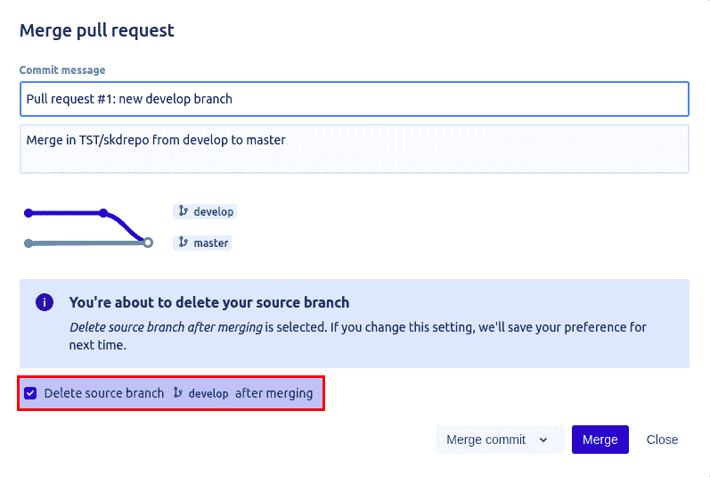

# 储存库清理(合并分支删除)

> 原文：<https://medium.com/globant/repository-cleanup-merged-branch-deletion-b41edf843117?source=collection_archive---------0----------------------->

# **总结-**

这个博客面向那些负责维护一个巨大的源代码仓库的目标用户，这个仓库中有成百上千个分支，并且避免以后作为服务器上的清理或空间问题的一部分的可管理性问题。

# **历史-**

我们使用 Bitbucket 来大规模存储所有的存储库。我们有几十个项目，每个项目有数百个存储库，每个存储库有数千个分支，有些是活跃的，大多数在几年前就合并了。通过查看每个存储库，它是如此之大，以至于我们必须浏览多个页面才能找到一些东西，这种痛苦促使我们找到一种解决方案来清理所有合并的分支，但仅超过 30 天，以避免不必要的问题。

# **本期-**

作为一名 DevOps 工程师，我多次观察到，大多数开发人员不断创建新的分支，并根据他们定义的分支模型将这些分支合并到目标分支。然而，他们往往会错过删除那些已经合并的分支，这些分支随后会堆积起来并消耗大量磁盘空间，导致存储库访问缓慢，浏览多个页面以找到特定的提交等。和可管理性问题。

# **解/s -**

对于这个问题，我们有三种不同的解决方案。我还添加了每个解决方案的**优点**和**缺点**。让我们看看下面这些-

**解决方案-1(使用复选框)**

大多数存储库提供程序中可用的一个解决方案是启用复选框，同时创建一个新的 pull 请求来删除合并的分支，或者在通过选择 provide 复选框从存储库控制台或命令行合并请求时处理它。

比如说-

**优点:**通过选择这个选项，可以避免以后的堆积问题。您的存储库看起来整洁干净，只有活动的分支。

**缺点:**每次审批请购单时，记住选中合并复选框会很痛苦。

**解决方案 2(使用删除选项)**

实现相同功能的另一个解决方案是从 dashboard 中删除所有合并的分支(它依赖于像 GitHub、git lab、Bitbucket 等存储库提供者)。)通过手动选择每个分支，如果您有大量分支分布在许多页面上，这对于删除是不可行的。

比如说-

**优点:**通过选择这个选项，一个人可以一次性删除所有合并的分支，但是他必须定期执行这个任务，这可能是手工的和耗时的。然而，它比解决方案 1 更好。

缺点:你必须记住一个执行清理任务的时间表，这个任务仍然是手动的。

**解决方案-3(脚本)**

我们开发的解决方案是创建一个可以定期删除合并分支的自动化。

以下是为处理删除所有超过 30 天的合并分支而开发的脚本-

**优点:**通过选择此选项，用户可以避免手动执行并记住清理任务的时间表。将脚本用作 Cron 作业，并定期运行它。

**缺点:**您可能需要在第一次运行脚本时配置系统并提供适当的空间。

# **免责声明-**

这个脚本只在 Bitbucket 项目及其存储库上测试。如果你有另一个像 GitHub，git lab 等这样的库管理器。，您仍然可以使用实际的分支删除逻辑。为此，请参考下面的第 4 点。

**注释-**

1.  如果您的存储库足够大，可能需要更多的时间(在我们的例子中，完成这个过程需要 5 个多小时)
2.  它消耗本地磁盘空间，因为它在本地克隆每个存储库，然后在稍后删除(确保本地有足够的空间来执行此活动。)
3.  分支删除被有意注释，以避免任何意外的删除调用(***# git push origin—delete $ branch***)。从该行移除 **#** 以启用它。
4.  如果你使用其他的库管理器，比如 GitHub，Git lab 等等。除了 Bitbucket，您仍然可以引用实际的删除代码，用粗体标记，作为脚本的一部分。(参考函数***delete _ branch _ if _ merge _ longer _ than _ 30 _ days()***)。您可以调整天数，根据您的要求排除其他分支。

# **结论**

最好实现一个自动化的解决方案或流程来确保分支在合并后被删除，而不是上面提到的选项 solution-1 & solution-2。