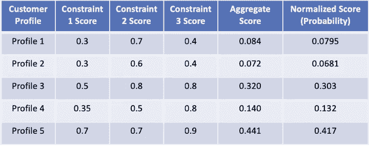

# 代表性抽样:一种从噪声数据分布中获得数据洞察力的统计方法

> 原文：<https://medium.com/walmartglobaltech/representative-sampling-a-statistical-method-to-derive-data-insights-from-noisy-data-distributions-b42e14817d09?source=collection_archive---------4----------------------->

[Image Source](https://www.redpointglobal.com/blog/what-is-an-omnichannel-customer-engagement-strategy/)

**简介**

从现有数据中提取客户洞察对于企业理解购买趋势、构建广告活动和个性化用户体验的能力至关重要。了解顾客过去的购买模式、动机、商店访问次数等。可以帮助回答更微妙的问题，如复杂的购买趋势、特定渠道的消费行为、未来的产品兴趣等。

过去，这样做的主要方式是精心设计并对大量客户进行调查。根据简单的统计数据(例如他们每月购物多少次)调查客户相对容易，但根据更复杂的指标提取数据，例如短期和长期变化率趋势、特定购买类别细分等。通过调查几乎不可能做到。

然而，随着跟踪客户行为的大数据和全方位指标的出现，有可能以更具技术性的方式解决这个问题。

理解客户洞察的第一步是为每个客户建立个人档案。为了构建这些个人档案，我们通过我们的[摄取和深度学习管道](https://www.conferencecast.tv/talk-31930-building-identity-graphs-over-heterogeneous-data#.talkPage-header)收集和运行所有客户数据。每个档案都包含了客户过去的交易、各种元数据以及他们与沃尔玛的所有互动。例如，假设一位客户使用两张不同的信用卡在沃尔玛商店购买了产品，该客户拥有一个在线帐户，通过该帐户他们进行了更多的交易。我们的深度学习管道将聚合该客户的店内和在线角色，并最终创建一个包含其所有购买、与沃尔玛的互动以及一系列其他用户元数据的整体档案。

**An example of a profile we create for a customer that used two different credit cards to purchase items in Walmart stores and also has an online Walmart account.**

理想情况下，我们能够直接从我们创建的这些客户档案中获得复杂的用户洞察。但是，客户数据往往相当杂乱；来自数十个第一方和第三方数据流的信息、来自客户方的不准确数据以及一系列其他现实问题使得处理这些数据变得非常困难。拥有单一、准确的客户视图是一个公开的问题，随着企业规模的扩大，这个问题变得越来越困难。在沃尔玛，每周[都有上亿的顾客来访](https://corporate.walmart.com/newsroom/business/20161003/the-grocery-list-why-140-million-americans-choose-walmart)，即使是一小部分嘈杂的顾客数据也会让提取准确的洞察力变得更加困难。

由于噪音和经常丢失的数据，我们为客户提供的一些个人资料可能会被合并或分割。例如，由于一些交易的性质，某些购买有时可能具有有限的关联元数据，这导致深度学习管道能够访问一些数据的稀疏特征集。这可能导致用户身份支离破碎，仅包含客户整体信息的一个子集。

当顾客使用信用卡完成店内交易时，就会出现这种情况。假设这个用户也有一个在线沃尔玛帐户，但是在他们的在线帐户上有一个不同的信用卡。如果我们的数据流在店内交易过程中无法获取丰富的元数据(因为默认情况下，我们不会从信用卡交易中获得太多信息)，数据的缺乏将很难确定客户在店内购买的商品与其在线沃尔玛账户之间的联系。我们会将顾客的店内购物和在线活动视为属于两个不同的人。当计算企业指标时，如用户与沃尔玛的平均互动次数，将同一客户视为两个不同的角色会对结果产生负面影响。我们经常加入新的数据流，并对我们的深度学习管道进行修改以减少碎片，但现实世界中客户数据的稀疏性使这一过程充满挑战。

**Fragmentation: The image on the left represents the true profile that should be constructed for a customer. But due to sparsity in customer data, sometimes it’s impossible for our pipeline to connect all the in-store, digital, and other interactions a customer makes with Walmart. This results in our pipeline creating multiple profiles for the same customer.**

执行分析以从这些分散的个人客户资料中提取客户见解将不可避免地扭曲结果，对业务决策产生负面影响。我们需要一种方法来从这个更大的、嘈杂的配置文件集中选择一个干净的子集，我们可以信任并使用它来获得复杂的见解。

**方法概述**

解决这个问题的最简单的方法是检查每个单独的概要文件，并手动地将纯概要文件与有噪声的或不完整的概要文件区分开来。以这种方式浏览每个概要文件是不可能的；不仅轮廓的规模是巨大的，而且甚至对于一个贴标签的人来说也很难决定一个轮廓是否是完全纯净的。如果不手动检查创建的每个其他配置文件，贴标机将永远不会知道信息是否从配置文件中丢失或碎片化，这是不可行的。

由于手动标记不是一个选项，我们需要另一种方法来验证配置文件的纯度。通过对干净数据流的调查、客户报告和数据分析，我们获得了更简单指标的详细信息，如每位客户的平均访问量、渠道细分(数字交易与实体交易)等。这些数字已经过多个内部业务团队和第三方数据源的频繁验证。例如，我们知道“每个客户的平均访问次数”统计数据严格遵循指数分布(并且我们知道它的平均值)。类似地，我们知道其他一些简单的、客户级别的统计数据的分布，并且具有很高的可信度。

评估单个档案的纯度是困难的，但是如果我们能够以某种方式利用这些统计数据作为基本事实，我们就可以验证客户档案的**子集**有多纯和可信。**具有紧密遵循上述全球分布(已经被各种来源彻底验证)的聚合统计的子集将可能是极其纯的。**在这里，全球分销是指对所有沃尔玛顾客进行计算和验证的统计。**然后，我们可以使用这个子集来生成更复杂的客户洞察。**

为了获得这个纯粹的子集，我们可以从整个集合中提取客户简档的子集，直到我们找到一个其统计数据与我们可以访问的真实全球分布相匹配的子集。最简单的方法是随机抽取任意大小的样本，直到我们得到一个与全局分布相匹配的样本。然而，考虑到轮廓的规模和杂质，以及我们希望子集的分布接近与全局分布相同的事实，随机采样是一种不可行的方法(从不纯的集合中获取大量随机样本只会导致不纯的样本，而不管采样多少次)。

相反，我们需要构建一个更有效的随机抽样程序，以确保我们的最终客户资料子集符合全球分布。我们可以将这些经过验证的全局分布称为“约束”，因为我们的子集需要满足这些统计约束。例如，看看“平均访问次数”约束。在全球范围内，让我们假设普通购物者每隔一周在店内购物(每年大约 25 次)，并且分布遵循如上所述的指数曲线。由于这些发现已经在全球范围内被各种来源所证实，我们希望我们的子集也能遵循同样的分布。如果我们的子集符合这些分布，我们可以放心地用它来推断其他消费者行为，预测未来趋势等。

这里要注意的一个关键方面是，我们选择的最终子集中的个人客户资料可能会有很大差异，只要子集的总分布与全局分布相匹配。例如，在我们的最后一个子集中，我们可以有一个在过去一年中只购物过一次的客户档案，和另一个购物过 200 次的客户档案。由于我们对单个客户资料没有任何限制(事实上，有这种差异是必要的，因为我们希望子集反映整个沃尔玛客户集的真实分布和行为)，我们需要选择一种方法，允许任何客户资料都包括在最终的子集中，同时保持总分布。

因为每个约束要求所选简档的子集满足某种分布(例如指数或正态，或者通常是任意简单的离散概率质量函数)，我们需要一种方法来计算出每个单独的客户简档与给定约束的匹配程度。为每个单独的配置文件的每个约束导出一个分数将告诉我们该配置文件与给定的约束有多接近。

然后，对于每个概要文件，我们可以聚集每个约束的“子分数”,以获得一个综合分数，该分数测量给定概要文件满足所有必要约束的程度。一旦我们有了这些分数，我们可以有选择地选择高分的概要文件作为我们的最终子集。然而，专门选择得分高的个人资料会导致偏见，因为在某些限制和沃尔玛顾客的真实分布之间可能存在隐藏的相关性。然而，通过使用这些分数进行[加权随机抽样](https://utopia.duth.gr/~pefraimi/research/data/2007EncOfAlg.pdf)，我们在很大程度上消除了这种偏差(下面将进一步讨论)。

**总结以上方法:**

1.  将全局约束公式化为离散或连续的概率分布。
2.  对于每个单独的客户资料，为每个约束条件生成一个子分数。
3.  合计子分数以获得每个档案的总分数。
4.  使用这些分数进行加权随机抽样，并提取任意大小的样本。
5.  评估样品以确保其符合给定的限制，并根据需要重复。

**我们将最终样本称为“代表性样本”——代表各种属性真实全球分布的一个较小的配置文件集，我们可以利用它来提取更复杂的客户洞察。**

**实现**

加权随机抽样方法的第一步是设计一种方法来为每个约束条件(为每个客户档案)生成子分数。为此，我们将每个约束公式化为某种类型的分布，然后我们可以用它来对客户档案进行评分。我们的大多数约束条件可以用两种方法中的一种来概括:离散概率质量函数或连续概率密度函数。解释这一点最简单的方法是通过一个例子来说明。

以前面提到的“平均每年商店访问次数”为例，我们知道该值遵循一个具有经验证平均值的指数分布(出于隐私目的，我们假设该平均值为每年 25 次访问)。然后，我们可以使用这些信息，根据每个客户档案的访问次数，对每个客户档案进行评分。

**Average Number of Annual Store Visits Constraint**

要对客户档案进行评分，请计算该档案在过去一年中访问商店的次数(使用交易和事件数据),并将该值代入此分布以获得概率得分。例如，在过去的一年中购物 5 次的客户档案将得到比购物 100 次的档案高得多的分数。(注:由于这是一个连续分布，任何一点的实际概率都是 0。因此，我们使用特定值的概率密度作为相对分数)。

“商店访问次数”约束有大量离散的存储桶，每个存储桶代表一个可能的访问次数。然而，其他约束条件可能会有很大不同。例如，要分析的另一个重要的全球约束是客户的总体渠道细分，即客户在线购物与实体店购物以及在线和面对面购物的比例。该约束只有三个桶，因此拟合连续概率分布是不合适的。相反，考虑到这里的分层容易，使用真实比率对每个客户档案进行评分更简单，也更有代表性。假设线上和实体的比例是 20%:40%:40%。然后，将根据每个客户档案所属的类别对其进行评分(如果是在线档案，则为 0.2 分，如果是店内档案，则为 0.4 分，如果是数字和实体店档案，则为 0.4 分)。

类似地，我们为每个客户档案的所有其他约束条件生成一个子分数。

**子分数归一化**

使用这种方法，我们可以根据元数据为所有客户档案生成概率子分数。然而，我们最初的全球客户档案中存在的杂质带来了额外的挑战。具体来说，考虑到客户数据的嘈杂和稀疏特性，不是为每个真正的消费者建立一个唯一的客户简档，有时会为单个购物者创建多个简档。从这些支离破碎的档案中进行评分和随机抽样会导致最终的代表性样本不符合我们的全球事实。

我们使用深度学习管道来防止档案碎片化，但尽管我们尽了最大努力，但由于缺乏客户数据，少数档案仍在碎片化。即使是这一小部分支离破碎的个人资料也会扭曲统计数据。例如，假设一位顾客在一年中使用三张不同的信用卡，并用每张信用卡在沃尔玛购物 10 次。有时由于缺乏数据，我们将该顾客视为三个不同的购物者，每个人都去沃尔玛购物 10 次，尽管实际上只有一个顾客购物 30 次。由于碎片化，平均商店旅行次数限制将进一步右偏(一些客户档案的商店旅行次数似乎更少)。

我们需要在采样过程中消除这些碎片相关杂质的影响。做到这一点的最佳方法是通过标准化全球客户配置文件集中每个存储桶的大小来抵消当前全球分布的影响。理解这一点最简单的方法是用一个简单的“袋子里的球”的例子。假设您有一个装有 100 个球的袋子，10 个红色球和 90 个蓝色球，您想使用加权随机抽样法选择总共 10 个球，其中 5 个是红色球，5 个是蓝色球。类似于“通道分解”百分比约束，这里的目标分解百分比将是 50%:50%，但是将权重 0.5 分配给所有红色和蓝色球将导致样本在预期中与原始袋子(1 个红色和 9 个蓝色)一样偏斜。为了消除初始偏斜，我们需要用红色和蓝色球的相对频率来划分子分数。因此，给所有红色球分配一个 0.5 / 0.1 = 5 的分数，蓝色球将得到 0.5 / 0.9 = 0.56 的分数。然后，通过使用这些分数进行加权随机抽样，最终样本(在预期中)应该包含 5 个红色球和 5 个蓝色球。

在“渠道细分”限制中，我们将在线、店内以及在线和店内的初始子分数(分别为 0.2、0.4 和 0.4)除以其在初始全球人群中的相应百分比。例如，如果全球客户资料集的 8%包含专门在线购物的客户，那么我们会给所有这些客户资料打 0.2 / 0.08 = 2.5 分。

类似地，在“商店访问次数”约束中，例如，对于访问商店 3 次的所有客户，我们得到值为 3 的指数分布的概率密度作为子分数。然后，我们将该子分数除以全局组中同样访问商店 3 次的客户简档的总数，以消除数据杂质对全局简档组的负面影响。本质上，我们给每个档案的最终子分数是**目标分数/全局频率**。

**分项评分汇总和加权随机抽样**

接下来，我们需要合计这些子分数，以获得每个概要文件的总分数。因为子分数封装了与各种约束条件相关的概率，所以我们可以以类似于通常聚合概率的方式来聚合它们。当处理独立变量时，联合概率可以通过将单个概率值相乘来计算。在生成代表性样本的第一次迭代中，我们将约束视为独立的(下面将进一步讨论)。**因此，为了得出客户档案的总得分，我们将档案的子得分相乘。**因此，如果一个配置文件的“访问次数”约束条件的子分数为 0.7，而“渠道中断”约束条件的子分数为 0.2，那么该配置文件的最终总分数将为 0.14。

下一步是使用这些分数进行加权随机抽样。为此，我们首先将所有客户档案的得分标准化，使它们的总和为 1。标准化分数代表在最终样本中选择每个客户档案的真实概率。使用这些概率，我们可以生成一个随机样本(没有替换，因为我们不希望同一个客户资料在最终样本中出现多次)。

下面是一个简单的汇总分数并将其转换成概率的例子:

然后，我们将使用这些标准化分数来选择随机样本。

执行加权随机抽样的另一种方法是只取前 N 个最高分的配置文件作为我们的最终代表集。然而，这种方法有几个缺点。首先，只取最高分的数据会给我们的最终结果带来不必要的偏差。例如，加利福尼亚州的客户可能比其他州更好地满足“商店访问次数”约束，因此具有更高的总得分。仅选择前 N 个评分配置文件将导致最终集合仅包含来自加利福尼亚的客户，这远不能代表全球客户集合的真实性质。接下来，每个约束可以被视为一组桶。例如,“渠道细分”约束有三个类别(店内购物者、在线购物者和既在网上购物又在店内购物的购物者)。根据客户档案所属的类别，客户档案会得到不同的子分数(坚持使用上面使用的样本编号，如果是在线档案，则档案的分数为 0.2，如果是店内档案，则为 0.4，如果是数字和实体店档案，则为 0.4)。如果我们选择得分最高的前 N 名，只有在线的客户不会进入我们的最终样本，因为他们得到的分数较低。因为我们希望满足每个约束的真实比率/分布，并且因为我们希望保持真实的全局数据分布，所以我们需要采用加权随机样本，而不是选择前 N 个评分配置文件。

最后一步是验证最终的随机样本符合总体统计的程度。对于具有较少桶的约束，例如通道细分，我们可以很容易地测量每个桶的比率差异。对于本质上更为连续的约束，如商店访问次数，我们可以使用各种方法计算全局分布和代表性样本分布之间的差异，以决定最终样本是否可接受。最简单的方法是分析分布的平均值，并验证它们是相同的。对于一个更精确的样本，我们需要分析整个分布形状的差异(如果粗略的相似性足够，可以通过视觉来分析；如果需要更精确的匹配，可以通过数学方法使用 KL 散度等度量)。

代表性样本的可行大小主要取决于两个因素:约束条件的数量和每个约束条件的可接受误差幅度。需要满足的约束越多，或者可接受的误差幅度越小，整个代表性样本就越小。另一方面，如果要求更宽松，就有可能产生更大的样本。

**结果**

对于我们的用例，我们有一组六个约束，但是有一个小的可接受的误差范围。使用这种方法，我们的团队能够生成几百万个客户资料的代表性样本，这些样本与全球基本事实相匹配，每个约束的误差率为 2%。有了我们的代表性样本，我们现在能够从这个更小的客户档案集中提取复杂的企业指标，并在全球层面上为所有沃尔玛客户推断这些结果。分析人口统计、交易行为、购买趋势等。在这个更小、更值得信赖的代表性样本上，我们可以准确地了解这些指标在全球层面上的表现，而由于现实世界数据的性质，这些指标的描述更加混乱。我们只是将代表性样本的指标扩大到全球人群。例如，如果代表性样本包含 1000 万个客户资料，我们可以将在此集合上计算的任何指标乘以一个放大系数，以获得全球级别的指标值。这个放大系数就是客户总数除以代表性样本的大小(在我们的例子中是 2.5 亿/1000 万= 25)。举一个假设的例子，如果我们知道样本中有 10 万个家庭在 2 月份购买了牛仔裤，在全球范围内，我们可以推测这个月总共有 250 万个家庭购买了牛仔裤。

**结论**

生成代表性样本可以更容易、更准确地计算复杂的企业指标，这些指标在处理真实数据时很难获得。通过这种方法，我们现在有了一种更好的方法来跟踪全球级别的趋势、行为和汇总统计数据！

我们尚未解决的一个挑战是我们假设约束是独立的。在大多数情况下，约束几乎肯定是相互依赖的。例如,“每个客户的平均商店访问次数”统计取决于客户档案是被分类为在线、店内还是两者都有。提出一个联合概率分布，包括连续和离散约束，每一个都遵循它们自己的独立分布(正态、指数等。)，具有挑战性。这就是为什么在我们的第一次迭代中，我们通过将每个约束视为独立的来生成一个样本，并且能够创建一个在很小的误差范围内满足我们的约束的样本。接下来，随着我们将更多的约束纳入采样过程，我们的目标是通过避免这种独立性假设，找到一种生成更准确分数的方法。

另一个需要注意的要点是，约束甚至不一定必须准确或包含基本事实。在我们的例子中，约束条件是经过仔细计算的基本事实统计数据，我们旨在满足这些统计数据，以创建尽可能接近事实的样本。(随着我们提高客户档案的纯度并减少碎片，我们将能够直接使用这些档案生成更准确的真实统计数据，而无需依赖业务团队的调查和客户报告。)但是，它们可以是您基于业务需求想要选择的任何期望的分布，这为代表性样本方法提供了可能的用例。

**致谢**

非常感谢[姆里杜尔·贾恩](https://www.linkedin.com/in/mridul-jain-088ba52)、[赛戈帕尔·托塔](https://www.linkedin.com/in/saigopalthota?trk=public_profile_browsemap)、[里朱尔·马古](https://www.linkedin.com/in/rijul-magu-ba143590)、[安特里克什·沙阿](https://in.linkedin.com/in/antriksh-shah-25154974)、[维延德拉·库拉达](https://www.linkedin.com/in/vijendra-kulhade-92140b37)、[帕里玛·贾恩](https://in.linkedin.com/in/parima-jain-251b7584)、[普加·马尼克塔拉](https://www.linkedin.com/in/puja-maniktala-3912a44)和[阿契尤塔·卡拉尔](https://in.linkedin.com/in/achyutha-kalal-03a56979)对算法设计和工程工作的帮助。

**参考文献**

1.《购物清单:为什么一亿四千万美国人选择沃尔玛》沃尔玛公司，2016 年 10 月 3 日。

2.《加权随机抽样》研究学术计算机技术研究所，2005 年。

3.在不同种类的数据上建立同一性图。*大会演员表*，2020 年 Spark + AI 峰会，2020 年 6 月 25 日。