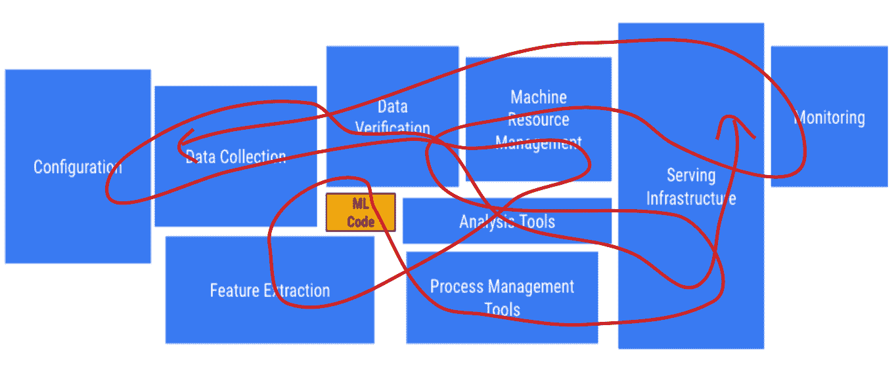
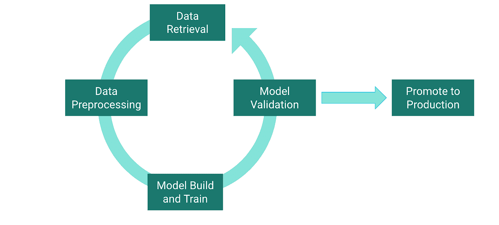
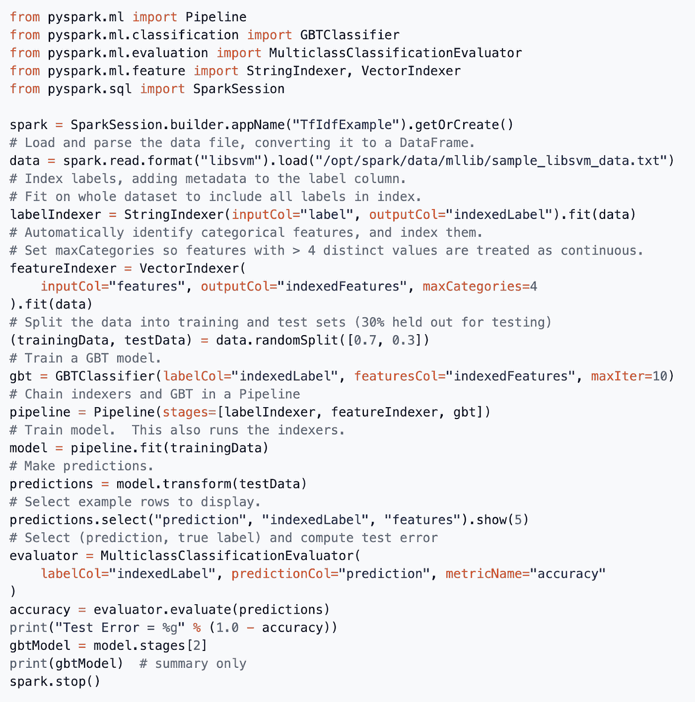
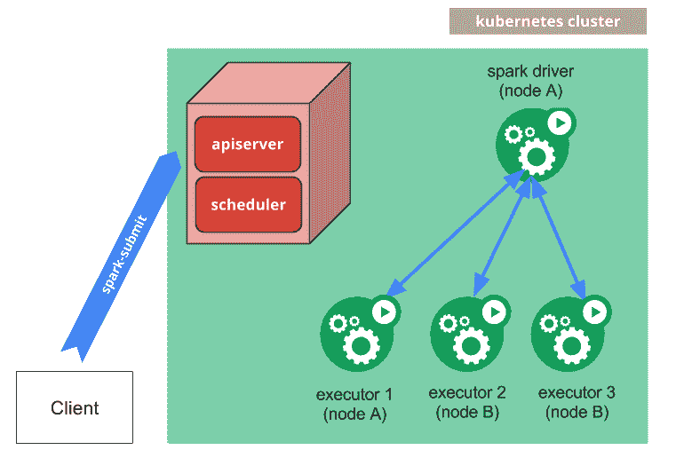
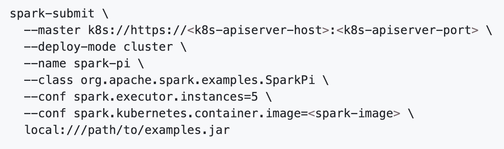
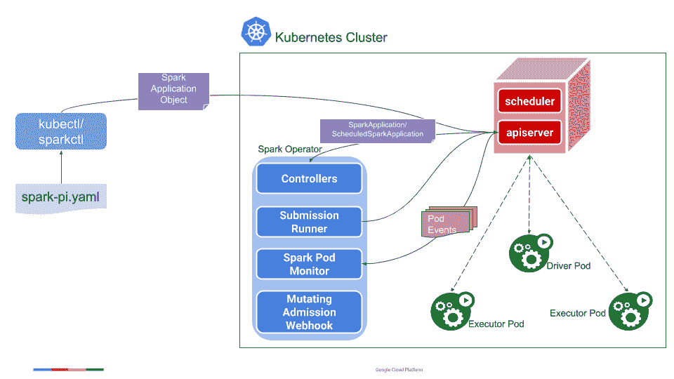
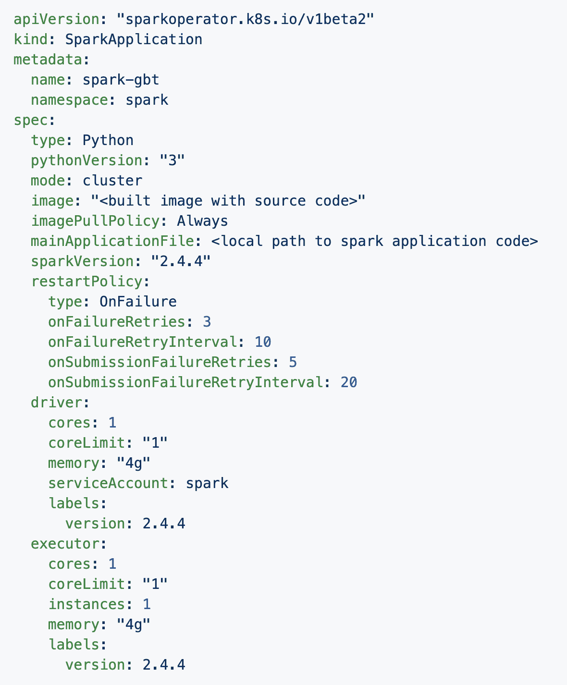
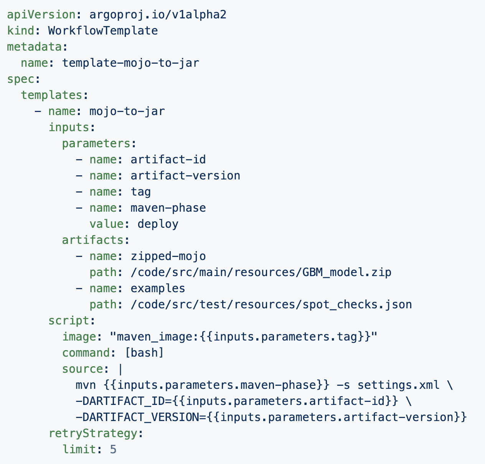
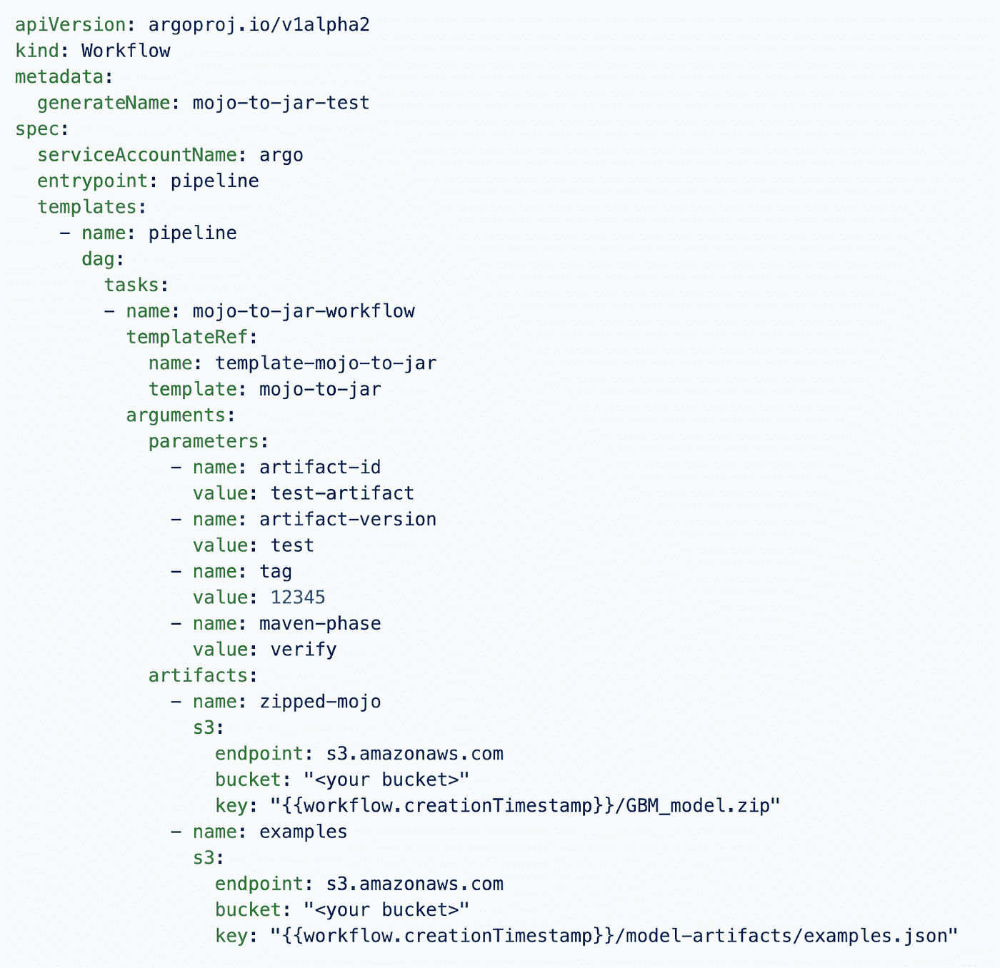
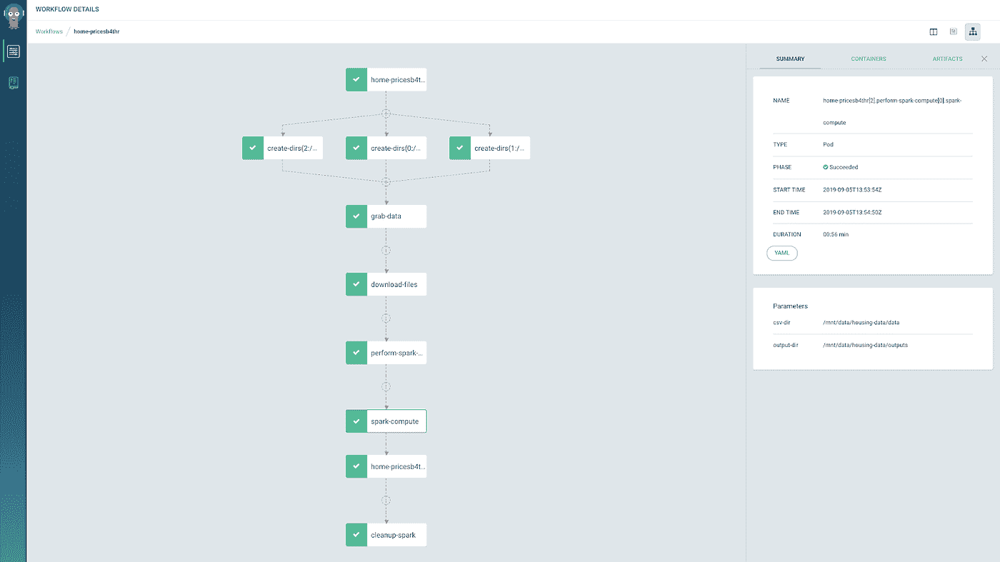

# Kubernetes 上可重复的分布式机器学习

> 原文：<https://medium.com/capital-one-tech/reproducible-distributed-machine-learning-on-kubernetes-capital-one-fb6e39a54f87?source=collection_archive---------4----------------------->

## 在 Kubernetes 上的分布式模型改装工作流程中收集的见解

***作者 Evan Curtin，数据科学首席助理，Card MLGlen Pine，数据科学高级经理，Card ML 以及尼克·格罗泽夫斯基，ML 和数据实现部首席数据工程师***

作为数据科学家和工程师，我们都希望有一种干净、可重复、分布式的方式来定期改装我们的机器学习模型。但有时我们会面临来自各个方向的障碍。也许您的整个数据生命周期感觉是串连在一起的，团队成员每个人只知道拼图的一部分，或者每个团队成员都有他们自己的定制工作流组件。也许你正在浪费计算能力，并撞上资源的极限。

如果以上任何一个听起来耳熟，我们可以联系起来。我们是遇到过这些问题的平台数据工程师、平台数据科学家和应用数据科学家。在这里，我们通过 Kubernetes 上的分布式模型改装工作流提供了一些在克服这些问题时收集的见解。我们的过程包括通过 Spark 的分布式计算引擎转换大量数据，用 H2O 进行模型训练，并将所有东西都连接到 Argo 工作流中。结果是一个管道将许多不同的步骤结合在一个统一的方法中，该方法可以扩展以满足需求，并且在不使用时可以缩减到零。

# 这种方法的好处

为了将我们将在下面概述的方法的好处放在上下文中，让我们从基于我们已经看到的一些常见企业机器学习设置的有问题的机器学习工作流开始。假设工作流程大致有五个步骤:

1.  ***抓取、连接、转换* —** 在此步骤中，从数据存储中抓取特征。通过令牌、用户、角色等授予访问权限，即其访问是非标准化的。一旦获取了数据，Spark 就会运行连接和转换。
2.  ***SSH 进入 EMR*** —部落知识规定了如何配置 EMR。
3.  ***培训*** —团队使用 H20、Spark 或其他框架，以极其手工的方式进行培训(例如，如上面的#2，通过 SSH-ing 到 EMR 中)。
4.  ***保存并分析* —** 模型被保存到 S3，在那里它们的血统仍然不清楚。
5.  ***移动到 prod*** —转换保存的对象，例如将其编译成 jar。

使用上述开发模式的团队可能会遇到各种各样的问题，例如:

## 不可复制的机器学习流水线

首先，ML 管道不是可复制的，而是需要多个独立的步骤，知识分布在团队中或隔离在单一故障点。大多数团队成员可能不完全理解管道。比较实验在最好的情况下是具有挑战性的，在最坏的情况下是不可能的。

## 计算资源不足/浪费

接下来，你可能会面临计算能力太强和太弱的问题。一个大节点可能仍然不足以训练和调整机器学习模型；或者，它可能比你需要的要多得多。(在大规模 EMR 集群上生成 matplotlib 图可能是一种浪费)。这种方法无法利用水平扩展和分布式计算的能力。

## 高度手动的流程

最后，这一过程因高度人工化而受到影响。团队小心翼翼地从一个步骤移动到下一个步骤，浪费了时间和精力。如果工作从一个团队成员转移到另一个团队成员，或者有一个新人加入，就需要付出巨大的努力。更糟糕的是，工作流程中的每一次运行都存在无数出错的机会。

我们真正要解决的是将建模生命周期中许多不同的步骤组合成可重复的管道。利用工作流引擎和分布式计算的能力，我们可以将建模生命周期中的每个特定阶段隔离到其自己的离散任务中，并在更高的级别上协调它们。

让我们深入了解允许我们在 Kubernetes 上构建可重复工作流的每个组件。

# 利用分布式计算

随着数据量的增长，单实例计算变得低效或完全不可能。诸如 [Spark](https://spark.apache.org/) 、 [Dask](https://dask.org/) 和 [Rapids](https://developer.nvidia.com/rapids) 等分布式计算工具可以用来规避成本高昂的垂直扩展的限制。虽然所有这些工具都可以在 Kubernetes 上运行(参见 [Dask Kubernetes](https://kubernetes.dask.org/en/latest/) 、 [Dask Helm](https://github.com/dask/helm-chart) 、 [RAPIDS K8s](https://devblogs.nvidia.com/making-data-science-teams-productive-kubernetes-rapids/) )，但我们重点关注 Spark，因为它广泛用于数据处理领域，我们可以部署到 Kubernetes，而无需开发人员重写任何源代码。

例如，使用下面的 PySpark 代码来训练一个梯度增强的树分类器:

Code sample taken from the Spark documentation at — [https://spark.apache.org/docs/latest/ml-classification-regression.html#gradient-boosted-tree-classifier](https://spark.apache.org/docs/latest/ml-classification-regression.html#gradient-boosted-tree-classifier)

使用 Spark 操作符可以轻松地将这段代码打包并部署到 Kubernetes，下一节将更详细地探讨这一点。

但是 Kubernetes 从 Spark 2.3 开始就可以作为官方后端调度程序使用，而且有直接在 Kubernetes 上运行 Spark 作业的[例子](https://spark.apache.org/docs/latest/running-on-kubernetes.html)。Spark Operator 扩展了这种本地支持，允许声明性的应用程序规范使*“运行 Spark 应用程序就像在 Kubernetes 上运行其他工作负载一样简单和习惯。”*

[Kubernetes 操作员模式](https://kubernetes.io/docs/concepts/extend-kubernetes/operator/) *“旨在捕捉管理一项或一组服务的操作员的关键目标。”*考虑到管理分布式计算引擎的开销，尽可能多地自动化维护至关重要，尤其是在为分析师和数据科学家设计模式时，他们可能不像代码或 Kubernetes 上的 Spark 集群管理那样熟悉基础设施。

# 火花算子体系结构

Image taken from the Spark documentation at — [https://spark.apache.org/docs/latest/running-on-kubernetes.html#how-it-works](https://spark.apache.org/docs/latest/running-on-kubernetes.html#how-it-works)

上图显示了本地 Kubernetes Spark 调度程序的架构。客户端通过使用 *spark-submit* 与 Kubernetes 的 API 服务器进行交互，传递 spark 作业运行的配置和代码。一个 Spark 驱动程序 Pod 由 API 服务器启动，它启动所需数量的执行器来运行完整的 Spark 作业。下面是一个 *spark-submit* 提交的例子:

*Image taken from Google Cloud Platform GitHub* [*https://github.com/GoogleCloudPlatform/spark-on-k8s-operator/blob/master/docs/architecture-diagram.png*](https://github.com/GoogleCloudPlatform/spark-on-k8s-operator/blob/master/docs/architecture-diagram.png)

Spark 操作符在这些基础上进行构建，添加了自定义资源定义(CRD)作为对原生 Kubernetes API 规范的扩展。用户可以指定一个 *SparkApplication* 或*ScheduledSparkApplication*清单，并像提交任何其他 Kubernetes 清单一样提交它，比如一个 Pod 或服务。Spark 操作控制器监听这些对象上的创建、更新和删除事件，并相应地采取行动。*提交运行器*代表用户处理对 Kubernetes API 服务器的 *spark-submit* 调用。*火花盒监视器*监视运行中的驱动器和执行器盒，并向控制器发送更新。最后，*变异准入 Webhook* 处理驱动程序和执行器容器的配置，例如挂载外部卷和任何其他 Spark Kubernetes 后端无法处理的配置。

如果我们回头看看上面的梯度增强树分类器代码，我们可以将其简单地容器化，并作为 *SparkApplication* 来执行，如下所示:

Spark 操作符本身处理诸如应用程序重启和故障处理以及资源清理之类的事情。

# 用 Argo 工作流编排工作流

虽然我们在 Kubernetes 上为大规模分布式计算作业提供了解决方案，这很好，但并不是每个任务都需要那么多的计算量。特别是当谈到整个建模生命周期时，为每项工作使用正确的工具是非常必要的。

*Argo 工作流*是*“一个开源的容器本地工作流引擎，用于在 Kubernetes 上编排并行作业。”* *Argo 工作流*用容器定义底层工作流中的每个节点。多步骤和相关任务可以组合在一起作为一个 DAG(有向无环图)。这个项目是作为一个定制资源定义实现的，使它成为 Kubernetes-native，并在其核心赋予它 Kubernetes 固有的水平可伸缩性。

与其他工作流管理解决方案相比，使用 *Argo 工作流*的最大优势之一是能够在每一步为任务使用正确的工具。在每个节点使用容器允许每个步骤都有自己独立于工作流其余部分的依赖关系。这样，我们就可以开始将整个建模生命周期中通常完全不同的技术组合成一个单一的、可重复的、可扩展的工作流。

## 利用 Argo 工作流的灵活性

难以将研究模型转化为生产就绪模型的原因之一是数据科学研究人员和生产运营团队之间使用的工具链的异构性。在我们的例子中，我们有一个用于向客户提供模型的生产 Java 代码库，但是所有的数据科学代码都是用 Python 编写的。为了弥合这一差距，我们使用了 H2O 库的功能，将一个用 Python 训练的模型导出为 Java 代码。对这一过程的任何修改都需要数据科学家在不熟悉的编程语言和环境中修改代码。Argo 工作流使我们能够将此步骤打包到单个组件中，并将此步骤的配置与工作流的所有其他部分隔离开来:

## 用于将 H2O MOJO 转换为 Java 库的 Argo 工作流模板

数据科学家只需要将一个经过训练的模型工件传递到 Argo 工作流步骤中，而不是下载 Maven 和 Java，并计算出要运行的所有东西的正确版本。作为包的测试套件的一部分，我们传入一堆示例预测，以验证模型在打包的代码中产生的结果与它在模型训练时产生的结果相同。我们已经有效地将配置和打包模型的手动过程转换成了一个功能。因为我们对所有事情都使用 Argo 工作流，所以我们可以在模型训练完成后运行此步骤，并且我们每次训练新模型时都会自动获得一个打包的模型库。这允许我们使用打包的函数来分析我们的模型，因此我们可以确信我们的分析不会因为一些翻译错误而失效。

由于这个功能已经被提取到一个 *Argo 工作流模板*中，我们可以轻松地在多个不同的 *Argo 工作流*中重用它。

# 在 Argo 工作流中利用 Kubernetes 缩放

使用 *Argo 工作流*的另一个巨大优势是其内置的从工作流本身管理 Kubernetes 资源的能力。使用该功能，我们可以将上面定义的 *SparkApplications* 包含在更大的 *Argo 工作流*的上下文中，在需要的地方提供分布式计算的好处。Argo 工作流程固有的并行性也允许我们在单个工作流程内或跨多个参数化工作流程同时运行多个试验。

# 但是等等，库伯弗洛怎么办？

很明显，我们不是唯一需要解决这个问题的人。那些更熟悉 Kubernetes 机器学习生态系统的人可能想知道这些工具与 Kubeflow 有何不同。幸运的是，它们一点也没有不同！"*kube flow 项目致力于使在 Kubernetes 上部署机器学习(ML)工作流变得简单、可移植和可扩展。我们的目标不是重新创建其他服务，而是提供一种简单的方法，将 ML 的最佳开源系统部署到不同的基础设施上*。

在 Kubeflow 管道的掩护下，Argo 被用来协调 Kubernetes 的资源。此外，一些训练组件实际上只是操作符，旨在以与 Spark 操作符相同的方式使用。其中一些是 [PyTorch](https://www.kubeflow.org/docs/components/training/pytorch/) 、 [TensorFlow](https://www.kubeflow.org/docs/components/training/tftraining/) 和 [MXNet](https://www.kubeflow.org/docs/components/training/mxnet/) 培训操作员。Kubeflow 非常好地将所有这些不同的工具结合到一个一致的平台中，供最终用户进行交互。

# 结论

具有容器化应用程序的云计算世界为模型创建和改装带来了各种新的数据生命周期挑战。然而，同样的模式创造了克服这些挑战的新模式。在这里，我们提供了我们的分布式计算和再现性的解决方案，涉及 Spark 算子和 Argo。虽然那些工具可能对你也有用，但我们的只是许多可能的解决方案之一。我们的目标不是提倡特定的工具，而是用一个例子来说明 Kubernetes 上分布式机器学习的通用方法。

# 资源

Argo 工作流:[https://argoproj.github.io/argo](https://argoproj.github.io/argo)
Spark 操作符:[https://github . com/Google cloud platform/Spark-on-k8s-Operator](https://github.com/GoogleCloudPlatform/spark-on-k8s-operator)
Kubernetes 操作符模式:[https://Kubernetes . io/docs/concepts/extend-Kubernetes/Operator/](https://kubernetes.io/docs/concepts/extend-kubernetes/operator/)
KubeFlow:[https://www.kubeflow.org/docs/](https://www.kubeflow.org/docs/)
KubeFlow 管道:[https://www . KubeFlow . org/docs/Pipelines/overview](https://www.kubeflow.org/docs/pipelines/overview/pipelines-overview/)

*原载于*[*https://www.capitalone.com*](https://www.capitalone.com/tech/machine-learning/reproducible-distributed-machine-learning-kubernetes/)*。*

*披露声明:2020 资本一。观点是作者个人的观点。除非本帖中另有说明，否则 Capital One 不隶属于所提及的任何公司，也不被这些公司认可。使用或展示的所有商标和其他知识产权是其各自所有者的财产。*