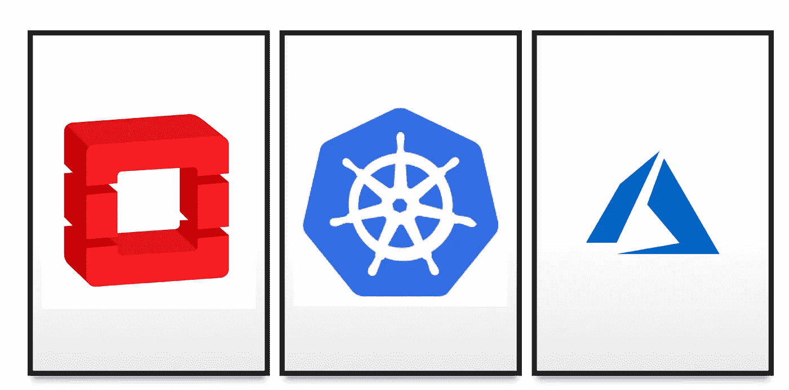
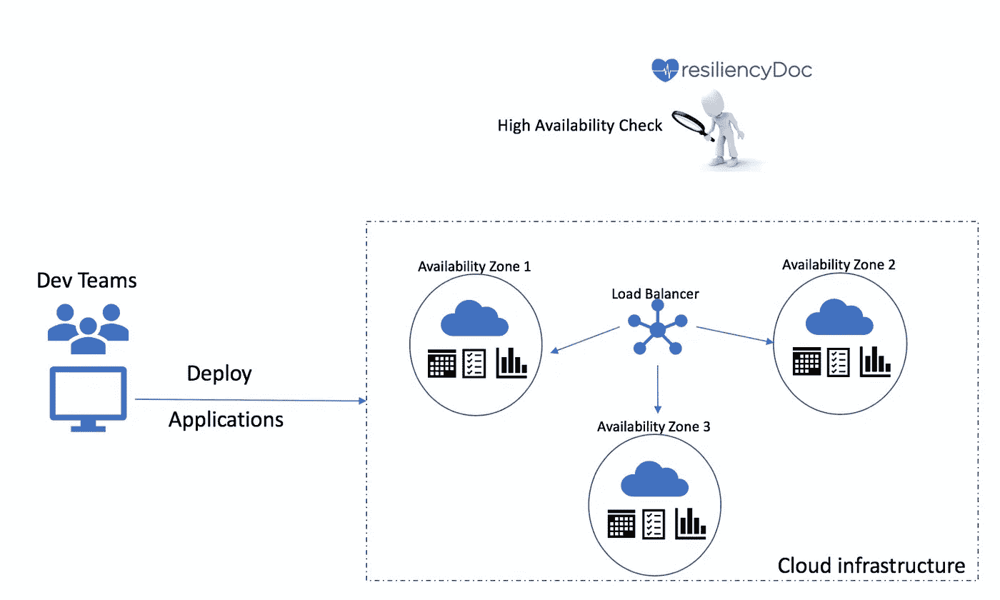
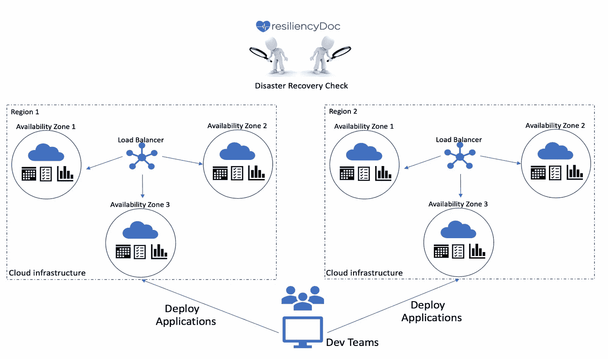

# 弹性医生—在混合云应用生态系统中实现弹性的工具

> 原文：<https://medium.com/walmartglobaltech/resiliency-doctor-a-tool-to-achieve-resiliency-in-hybrid-cloud-application-ecosystems-3d7fc9427fd7?source=collection_archive---------7----------------------->

*By*[*Vilas Veeraraghavan*](https://medium.com/u/d1d926194f9?source=post_page-----3d7fc9427fd7--------------------------------)*[*viji tha S Murthy*](https://medium.com/u/a5be34c587a7?source=post_page-----3d7fc9427fd7--------------------------------)*

*在之前的[帖子](/walmartlabs/charting-a-path-to-software-resiliency-38148d956f4a)中，我们详细介绍了我们实现弹性的历程以及在过渡期间学到的一些经验教训。但是，恢复能力不是一次性努力就能实现的。这必须是对系统的持续检查，以确保我们不会偏离我们的目标。从安排和执行游戏日到定义多级弹性，应用程序团队一直专注于测试对系统中各种故障和混乱的弹性。*

*在上一篇文章中，我们谈到了一个我们内部构建的工具，用于开始诊断和提供我们在混合云中部署的应用程序的状态——Resiliency Doctor(简称 DocRX)。这个工具为团队提供了检查他们的弹性目标的能力。它通过非侵入性的静态检查以及运行主动检查来验证目标是否按预期实现，从而帮助团队测量弹性。它还监视并通知用户他们的系统何时违反了需求，因此团队可以采取行动修复漏洞。*

*对于像沃尔玛这样的电子商务巨头来说，假期是一个关键的机会。我们通常会在节假日期间收到极高的流量，此时会有一波即将到来的客户请求高峰，管理如此高的网络流量对任何在线零售商来说都是一个挑战。服务于用户请求的应用程序必须具有弹性—需要智能的灾难恢复策略，并支持全天候的客户购买。未能满足这些期望可能会导致服务质量下降和巨大的收入损失。然而，在任何假日季节开始之前，工程团队都要进行检查，以了解应用程序对于各种故障是否足够“健康”。在任何人尝试进行大规模弹性测试之前，这些检查充当了鉴定人和把关人的角色。为了加强对应用程序执行“定期健康检查”的实践，我们设计了弹性医生。*

***统一上报***

*最初，DocRX 是围绕 [Oneops](http://oneops.com/) 设计的；沃尔玛实验室的开源云生命周期管理平台。开发它是为了节省我们的工程师手动验证应用程序部署的检查点的时间。它从一些基本的健康检查和推断开始，随着它越来越受欢迎，它的实用性被揭示出来。然后，我们决定使它与平台无关，并将其用作诊断检查来验证我们的应用程序的健康状况。随着越来越多的应用部署到 OneOps 和公共云中，我们有了支持混合云部署的使用案例。*

**

*DocRX 通过一个简单的单页仪表板为我们完成了所有繁重的工作，该仪表板显示了应用程序的统计数据，并提供了一份报告，描述了来自多个云平台的弹性状态，可以在这些平台上部署应用程序，并近乎实时地进行更新。DocRX 提供了一个统一的报告来审核我们用于混合云应用的部署策略。*

***灵活性和 docRX 的核心方面***

*我们开始使用 DocRX 来确定应用程序的弹性状态，作为性能和负载测试活动的预检查。我们最初实施的两项关键部署运行状况检查是 HADR 和 ECV 检查。*

***HA —高可用性** —在计划内和计划外停机期间检查应用程序的可用性。例如，在系统升级期间，应用程序必须能够从容应对停机，并为关键业务应用程序提供连续处理。因此，高可用性就是要避免单点故障，并确保应用程序能够继续处理请求。为了使我们的应用程序符合这种检查，它必须部署在多个不同的云区域上，以便在一个区域停机时继续处理请求。*

**

*灾难恢复—曾经有过这样的情况，整个数据中心可能会遭遇灾难性中断，就像微软去年[遇到的情况](https://www.geekwire.com/2018/microsoft-releases-details-last-weeks-big-azure-outage-servers-damaged-no-data-lost/)。但是，应用程序应该继续处理请求，对业务的影响最小或为零。在这种情况下，应用程序足迹必须跨多个数据中心存在，才能继续满足请求。*

**

***我们为什么需要 ECV 支票？***

*ECV 代表增强型内容验证检查。ecv 对于确定应用程序是否真正正常运行至关重要，而不仅仅是回答 pings。为了让[负载平衡器](https://blog.resellerclub.com/web-server-load-balancing-for-ecommerce-websites-a-basic-guide-to-traffic-management/)了解计算/服务可用，应该已经正确配置了 ECV 检查。*

*考虑一个场景，其中一个云区域的流量过载，负载平衡器决定过载同一个云区域，因为 ECV 检查不到位，它无法找到另一个云区域。在这种情况下，尽管基础设施支持高流量，但负载平衡部署没有得到有效处理。*

*如果 HADR 和 ECV 检查没有到位，那么“用户请求通过负载均衡器流入为请求提供服务的计算机”的整个管道就会被破坏。这些检查对于确保负载平衡器在灾难性中断期间将请求重定向到稳定的数据中心至关重要。未能满足这些最低要求可能会导致服务质量下降，并在高流量时期造成巨大的业务损失。*

***主动检查和 slack-bot***

*沃尔玛有许多团队，如中央运营、云审计和站点可靠性团队，他们利用 docRX 提供的诊断报告。它提供的对公共云和私有云配置数据的可见性就像一个一站式商店，而不是在服务停机期间到处搜索信息。当团队想要主动监控和确保应用程序性能时，它也很方便。*

*为了鼓励使用这一工具，slack-bot 被构建为更侧重于主动检查。可以安排主动检查，以便不时地“轮询”服务的状态信息。它将定期检查应用程序的状态；这意味着检查实例是否健康，指标是否流入，监控是否到位等等。事实证明，这对于新部署的应用程序以及从宕机中恢复的应用程序更有帮助，为它们提供了弹性状态的历史趋势。它不仅作为一个独立的工具有用，而且我们也开始在沃尔玛将它们与其他性能测试工具一起使用。在这种情况下，我们可以说——“当系统缺乏弹性时，不要运行性能测试，或者至少在这样做时暴露出内在的风险”。*

***关键外卖***

*我们构建 DocRx 是为了让沃尔玛的所有开发团队意识到在应用程序部署中可能成为潜在失败的弱点。作为先决条件的诊断检查使我们的游戏时间更长，并让我们有信心在一个非常复杂的系统中快速移动。如果这激起了你的兴趣，并且你有一些关于如何推进这一领域的艺术发展的想法，请随意发表评论。如果您有兴趣与我们合作，请访问[职业页面](https://careers.walmart.com/)。*